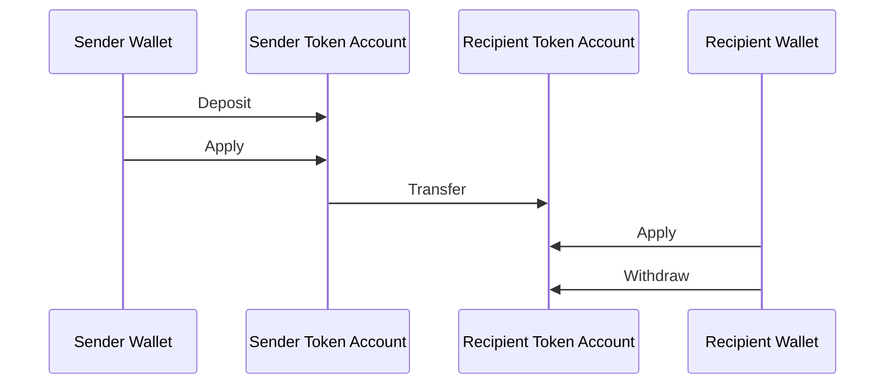
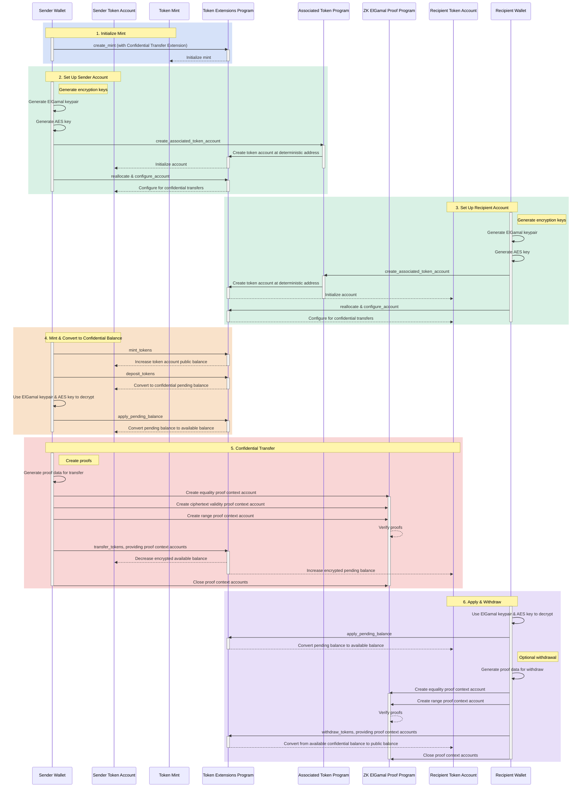

## Cosa sono i Trasferimenti Riservati?

I trasferimenti riservati ti consentono di trasferire token tra token account
senza rivelare l'importo del trasferimento. Ciò è utile per le transazioni che
preservano la privacy. Solo gli importi dei trasferimenti e i saldi dei token
sono privati. Gli indrizzi dei token account rimangono pubblici.

- [Panoramica del Protocollo](https://www.solana-program.com/docs/confidential-balances/overview) -
  Dettagli sul protocollo crittografico sottostante
- [Guida Rapida](https://www.solana-program.com/docs/confidential-balances#setup) -
  Configurazione e comandi CLI di base
- [Cookbook sui Saldi Riservati](https://github.com/solana-developers/Confidential-Balances-Sample) -
  Frammenti di codice su come utilizzare l'estensione Confidential Transfer

### Come funziona?

L'estensione Confidential Transfer aggiunge
[istruzioni](https://github.com/solana-program/token-2022/blob/efd0c957fefbd79882d77df5fb2dac88c001249c/program/src/extension/confidential_transfer/instruction.rs#L29)
al Token Extensions Program che ti consente di trasferire token tra account
senza rivelare l'importo del trasferimento.

Il flusso di base dei trasferimenti riservati di token è il seguente:

1. Crea un mint account con l'estensione confidential transfer.
2. Crea token account con l'estensione confidential transfer per il mittente e
   il destinatario.
3. Conia token sull'account del mittente.
4. **Deposita** il saldo pubblico del mittente nel **saldo in attesa
   riservato**.
5. **Applica** il saldo in attesa del mittente al **saldo disponibile
   riservato**.
6. **Trasferisci** in modo riservato i token dal token account del mittente al
   token account del destinatario.
7. **Applica** il saldo in attesa del destinatario al **saldo disponibile
   riservato**.
8. **Preleva** il saldo disponibile riservato del destinatario nel **saldo
   pubblico**.

Per ulteriori dettagli sui passaggi del flusso di trasferimento riservato,
consulta le pagine corrispondenti:

<Cards>
  <Card
    title="Crea Mint Account"
    href="/docs/tokens/extensions/confidential-transfer/create-mint"
  >
    Come creare un mint account con l'estensione Confidential Transfer
  </Card>
  <Card
    title="Crea Token Account"
    href="/docs/tokens/extensions/confidential-transfer/create-token-account"
  >
    Come configurare un token account con l'estensione Confidential Transfer
  </Card>
  <Card
    title="Deposita Token"
    href="/docs/tokens/extensions/confidential-transfer/deposit-tokens"
  >
    Come depositare token nel saldo in attesa riservato
  </Card>
  <Card
    title="Applica Saldo in Attesa"
    href="/docs/tokens/extensions/confidential-transfer/apply-pending-balance"
  >
    Come applicare il saldo in attesa al saldo disponibile riservato
  </Card>
  <Card
    title="Preleva Token"
    href="/docs/tokens/extensions/confidential-transfer/withdraw-tokens"
  >
    Come prelevare token dal saldo disponibile riservato
  </Card>
  <Card
    title="Trasferisci Token"
    href="/docs/tokens/extensions/confidential-transfer/transfer-tokens"
  >
    Come trasferire token in modo riservato tra token account
  </Card>
  <Card
    title="Guida all'Integrazione"
    href="/docs/tokens/extensions/confidential-transfer/integration-guide"
  >
    Come wallet, explorer e exchange possono supportare i token con
    trasferimento riservato
  </Card>
  <Card
    title="Guida per l'Emittente"
    href="/docs/tokens/extensions/confidential-transfer/issuer-guide"
  >
    Come emettere e gestire un token con trasferimento riservato (politica di
    approvazione, revisori, commissioni, conio e distruzione)
  </Card>
</Cards>

Il diagramma seguente mostra una sequenza dettagliata del flusso di base per i
trasferimenti di token riservati:

## Istruzioni per i Trasferimenti Riservati

L'elenco completo delle istruzioni dell'estensione Confidential Transfer
[instructions](https://github.com/solana-program/token-2022/blob/efd0c957fefbd79882d77df5fb2dac88c001249c/program/src/extension/confidential_transfer/instruction.rs#L29)
è il seguente:

| Istruzione                          | Descrizione                                                                                                                                                                     |
| ----------------------------------- | ------------------------------------------------------------------------------------------------------------------------------------------------------------------------------- |
| _rs`InitializeMint`_                | Configura il mint account per i trasferimenti riservati. Questa istruzione deve essere inclusa nella stessa transazione dell'istruzione _rs`TokenInstruction::InitializeMint`_. |
| _rs`UpdateMint`_                    | Aggiorna le impostazioni dei trasferimenti riservati per un mint.                                                                                                               |
| _rs`ConfigureAccount`_              | Configura un token account per i trasferimenti riservati.                                                                                                                       |
| _rs`ApproveAccount`_                | Approva un token account per i trasferimenti riservati se il mint richiede l'approvazione per i nuovi token account.                                                            |
| _rs`EmptyAccount`_                  | Svuota i saldi riservati in sospeso e disponibili per consentire la chiusura di un token account.                                                                               |
| _rs`Deposit`_                       | Converte il saldo pubblico dei token in saldo riservato in sospeso.                                                                                                             |
| _rs`Withdraw`_                      | Converte il saldo riservato disponibile nuovamente in saldo pubblico.                                                                                                           |
| _rs`Transfer`_                      | Trasferisce token tra token account in modo riservato.                                                                                                                          |
| _rs`ApplyPendingBalance`_           | Converte il saldo in sospeso in saldo disponibile dopo depositi o trasferimenti.                                                                                                |
| _rs`EnableConfidentialCredits`_     | Consente a un token account di ricevere trasferimenti di token riservati.                                                                                                       |
| _rs`DisableConfidentialCredits`_    | Blocca i trasferimenti riservati in entrata consentendo comunque i trasferimenti pubblici.                                                                                      |
| _rs`EnableNonConfidentialCredits`_  | Consente a un token account di ricevere trasferimenti di token pubblici.                                                                                                        |
| _rs`DisableNonConfidentialCredits`_ | Blocca i trasferimenti regolari per far sì che l'account riceva solo trasferimenti riservati.                                                                                   |
| _rs`TransferWithFee`_               | Trasferisce token tra token account in modo riservato con una commissione.                                                                                                      |
| _rs`ConfigureAccountWithRegistry`_  | Metodo alternativo per configurare i token account per i trasferimenti riservati utilizzando un account _rs`ElGamalRegistry`_ invece della prova _rs`VerifyPubkeyValidity`_.    |
