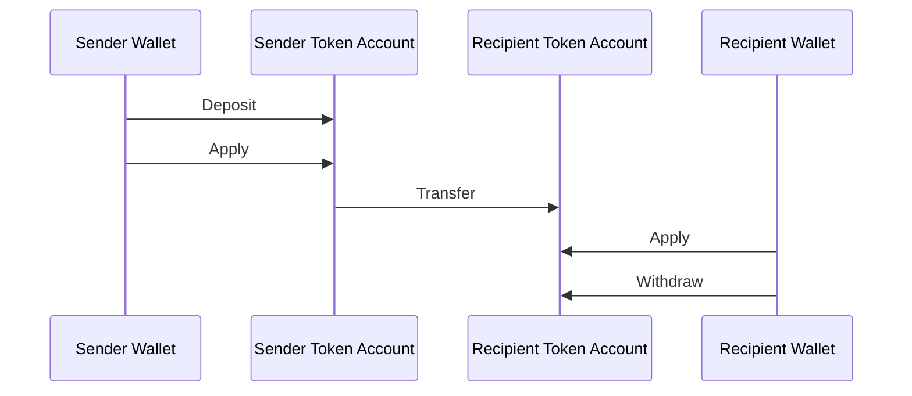
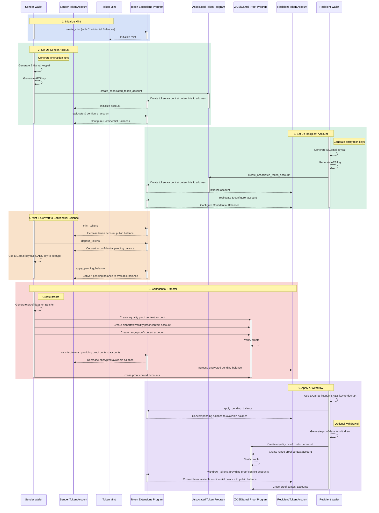

## Cosa sono i Saldi Riservati?

<Embed url="https://youtu.be/Bqs95tFcRIU" />

Saldi Riservati è un'estensione Token-2022 che consente di trasferire token
tra token account senza rivelare l'importo del trasferimento. Ciò è utile per
transazioni che preservano la privacy. Solo gli importi dei trasferimenti e i saldi dei token sono
privati. Gli indirizzi dei token account rimangono pubblici.

- [Panoramica del protocollo](https://www.solana-program.com/docs/confidential-balances/overview) -
  Dettagli sul protocollo crittografico sottostante
- [Guida rapida](https://www.solana-program.com/docs/confidential-balances#setup) -
  Configurazione e comandi CLI di base
- [Cookbook sui Saldi Riservati](https://github.com/solana-developers/Confidential-Balances-Sample) -
  Frammenti di codice che mostrano come utilizzare i Saldi Riservati

### Come funziona?

L'estensione Saldi Riservati aggiunge
[istruzioni](https://github.com/solana-program/token-2022/blob/efd0c957fefbd79882d77df5fb2dac88c001249c/program/src/extension/confidential_transfer/instruction.rs#L29)
al programma Token Extension che consente di trasferire token tra
account senza rivelare l'importo del trasferimento.

```mermaid title="Confidential Balances Basic Overview"
    sequenceDiagram

    participant A as Sender Wallet
    participant AA as Sender Token Account
    participant BB as Recipient Token Account
    participant B as Recipient Wallet

    A->>AA: Deposit
    A->>AA: Apply

    AA->>BB: Transfer
    B->>BB: Apply

    B->>BB: Withdraw

```

Il flusso di base dei trasferimenti riservati di token è il seguente:

1. Crea un mint account con i Saldi Riservati abilitati.
2. Crea token account con i Saldi Riservati abilitati per il mittente e
   il destinatario.
3. Conia token sul account del mittente.
4. **Deposita** il saldo pubblico del mittente nel **saldo in attesa
   riservato**.
5. **Applica** il saldo in attesa del mittente al **saldo disponibile
   riservato**.
6. **Trasferisci** in modo riservato i token dal token account del mittente al
   token account del destinatario.
7. **Applica** il saldo in attesa del destinatario al **saldo disponibile
   riservato**.
8. **Preleva** il saldo disponibile riservato del destinatario nel **saldo
   pubblico**.

### Chiavi dell'auditor

Un mint di Saldi Riservati può memorizzare una chiave pubblica ElGamal opzionale per un auditor globale. Quando ne viene configurata una, ogni trasferimento riservato include l'importo crittografato per il mittente, il destinatario e l'auditor. La prova di trasferimento verifica che tutti e tre i testi cifrati contengano lo stesso importo. Il pubblico non può comunque leggere l'importo, ma il titolare della chiave segreta dell'auditor può decrittografare gli importi dei trasferimenti per quel mint.

L'autorità dei Saldi Riservati imposta la chiave dell'auditor durante l'inizializzazione dell'estensione o la modifica in seguito con _rs`UpdateMint`_. L'autorità può ruotare o cancellare la chiave. Una rotazione si applica solo ai trasferimenti futuri, quindi è necessario conservare le chiavi segrete precedenti quando si richiede l'accesso storico all'audit. Le chiavi dell'auditor forniscono accesso in lettura; non autorizzano trasferimenti di token né rivelano il saldo riservato completo di un account.

Per esempi di configurazione e rotazione, consulta
[Configurare un auditor](/docs/tokens/extensions/confidential-transfer/issuer-guide#configure-an-auditor).
I wallet, gli explorer, le exchange e i fornitori di servizi di conformità dovrebbero anche consultare la
[guida all'integrazione dell'auditor](/docs/tokens/extensions/confidential-transfer/integration-guide#auditors-and-compliance).

Per ulteriori dettagli sui passaggi del flusso di trasferimento riservato,
consulta le pagine corrispondenti:

<Cards>
  <Card
    title="Crea Mint Account"
    href="/docs/tokens/extensions/confidential-transfer/create-mint"
  >
    Come creare un mint account con i Saldi Riservati abilitati
  </Card>
  <Card
    title="Crea Token Account"
    href="/docs/tokens/extensions/confidential-transfer/create-token-account"
  >
    Come configurare un token account con i Saldi Riservati abilitati
  </Card>
  <Card
    title="Deposita Token"
    href="/docs/tokens/extensions/confidential-transfer/deposit-tokens"
  >
    Come depositare token nel saldo in attesa riservato
  </Card>
  <Card
    title="Applica Saldo in Attesa"
    href="/docs/tokens/extensions/confidential-transfer/apply-pending-balance"
  >
    Come applicare il saldo in attesa al saldo disponibile riservato
  </Card>
  <Card
    title="Preleva Token"
    href="/docs/tokens/extensions/confidential-transfer/withdraw-tokens"
  >
    Come prelevare token dal saldo disponibile riservato
  </Card>
  <Card
    title="Trasferisci Token"
    href="/docs/tokens/extensions/confidential-transfer/transfer-tokens"
  >
    Come trasferire in modo riservato token tra token account
  </Card>
  <Card
    title="Guida all'integrazione"
    href="/docs/tokens/extensions/confidential-transfer/integration-guide"
  >
    Come wallet, explorer ed exchange possono supportare i token con Saldi Riservati
  </Card>
  <Card
    title="Guida per l'emittente"
    href="/docs/tokens/extensions/confidential-transfer/issuer-guide"
  >
    Come emettere e gestire un token con Saldi Riservati (policy di approvazione,
    auditor, commissioni, mint e burn)
  </Card>
</Cards>

Il diagramma seguente mostra una sequenza dettagliata del flusso di base per i
trasferimenti di token riservati:

```mermaid title="Confidential Balances Detailed Overview"
sequenceDiagram
    participant Sender as Sender Wallet
    participant SenderAccount as Sender Token Account
    participant Mint as Token Mint
    participant Token22 as Token Extensions Program
    participant ATAProgram as Associated Token Program
    participant ElGamal as ZK ElGamal Proof Program
    participant RecipientAccount as Recipient Token Account
    participant Recipient as Recipient Wallet

    rect rgba(120, 160, 235, 0.3)
    Note over Sender,Mint: 1. Initialize Mint

    activate Sender
    Sender->>Token22: create_mint (with Confidential Balances)
    activate Token22
    Token22-->>Mint: Initialize mint
    deactivate Token22
    deactivate Sender
    end

    rect rgba(130, 210, 170, 0.3)
    Note over Sender,SenderAccount: 2. Set Up Sender Account

    activate Sender
    Note right of Sender: Generate encryption keys
    Sender->>Sender: Generate ElGamal keypair
    Sender->>Sender: Generate AES key

    Sender->>ATAProgram: create_associated_token_account
    activate ATAProgram
    ATAProgram->>Token22: Create token account at deterministic address
    activate Token22
    Token22-->>SenderAccount: Initialize account
    deactivate Token22
    deactivate ATAProgram

    Sender->>Token22: reallocate & configure_account
    activate Token22
    Token22-->>SenderAccount: Configure Confidential Balances
    deactivate Token22
    deactivate Sender
    end

    rect rgba(130, 210, 170, 0.3)
    Note over Recipient,RecipientAccount: 3. Set Up Recipient Account

    activate Recipient
    Note right of Recipient: Generate encryption keys
    Recipient->>Recipient: Generate ElGamal keypair
    Recipient->>Recipient: Generate AES key

    Recipient->>ATAProgram: create_associated_token_account
    activate ATAProgram
    ATAProgram->>Token22: Create token account at deterministic address
    activate Token22
    Token22-->>RecipientAccount: Initialize account
    deactivate Token22
    deactivate ATAProgram

    Recipient->>Token22: reallocate & configure_account
    activate Token22
    Token22-->>RecipientAccount: Configure Confidential Balances
    deactivate Token22
    deactivate Recipient
    end

    rect rgba(235, 160, 80, 0.3)
    Note over Sender,SenderAccount: 4. Mint & Convert to Confidential Balance

    activate Sender
    Sender->>Token22: mint_tokens
    activate Token22
    Token22-->>SenderAccount: Increase token account public balance
    deactivate Token22

    Sender->>Token22: deposit_tokens
    activate Token22
    Token22-->>SenderAccount: Convert to confidential pending balance
    deactivate Token22

    Sender->>Sender: Use ElGamal keypair & AES key to decrypt
    Sender->>Token22: apply_pending_balance
    activate Token22
    Token22-->>SenderAccount: Convert pending balance to available balance
    deactivate Token22
    deactivate Sender
    end

    rect rgba(235, 120, 120, 0.3)
    Note over Sender,RecipientAccount: 5. Confidential Transfer

    activate Sender
    Note right of Sender: Create proofs
    Sender->>Sender: Generate proof data for transfer

    Sender->>ElGamal: Create equality proof context account
    activate ElGamal
    Sender->>ElGamal: Create ciphertext validity proof context account
    Sender->>ElGamal: Create range proof context account
    ElGamal-->>ElGamal: Verify proofs

    Sender->>Token22: transfer_tokens, providing proof context accounts
    activate Token22
    Token22-->>SenderAccount: Decrease encrypted available balance
    Token22-->>RecipientAccount: Increase encrypted pending balance
    deactivate Token22

    Sender->>ElGamal: Close proof context accounts
    deactivate ElGamal
    deactivate Sender
    end

    rect rgba(180, 150, 235, 0.3)
    Note over Recipient,RecipientAccount: 6. Apply & Withdraw

    activate Recipient
    Recipient->>Recipient: Use ElGamal keypair & AES key to decrypt
    Recipient->>Token22: apply_pending_balance
    activate Token22
    Token22-->>RecipientAccount: Convert pending balance to available balance
    deactivate Token22

    Note right of Recipient: Optional withdrawal
    Recipient->>Recipient: Generate proof data for withdraw

    Recipient->>ElGamal: Create equality proof context account
    activate ElGamal
    Recipient->>ElGamal: Create range proof context account
    ElGamal-->>ElGamal: Verify proofs

    Recipient->>Token22: withdraw_tokens, providing proof context accounts
    activate Token22
    Token22-->>RecipientAccount: Convert from available confidential balance to public balance
    deactivate Token22

    Recipient->>ElGamal: Close proof context accounts
    deactivate ElGamal
    deactivate Recipient
    end
```

## Istruzioni per i Saldi Riservati

L'elenco completo delle
[istruzioni](https://github.com/solana-program/token-2022/blob/efd0c957fefbd79882d77df5fb2dac88c001249c/program/src/extension/confidential_transfer/instruction.rs#L29)
dell'estensione Saldi Riservati è il seguente:

| Instruction                         | Description                                                                                                                                                       |
| ----------------------------------- | ----------------------------------------------------------------------------------------------------------------------------------------------------------------- |
| _rs`InitializeMint`_                | Abilita i Saldi Riservati su un mint account. Questa istruzione deve essere inclusa nella stessa transazione dell'istruzione _rs`TokenInstruction::InitializeMint`_. |
| _rs`UpdateMint`_                    | Aggiorna la policy di approvazione degli account del mint e la chiave pubblica ElGamal opzionale dell'auditor globale.                                                                        |
| _rs`ConfigureAccount`_              | Abilita i Saldi Riservati su un token account.                                                                                                                 |
| _rs`ApproveAccount`_                | Approva un token account per i Saldi Riservati se il mint richiede l'approvazione per i nuovi token account.                                                          |
| _rs`EmptyAccount`_                  | Svuota i saldi riservati in sospeso e disponibili per consentire la chiusura di un token account.                                                                         |
| _rs`Deposit`_                       | Converte il saldo pubblico di token in saldo riservato in sospeso.                                                                                                  |
| _rs`Withdraw`_                      | Converte il saldo riservato disponibile nuovamente in saldo pubblico.                                                                                                   |
| _rs`Transfer`_                      | Trasferisce token tra token account in modo riservato.                                                                                                           |
| _rs`ApplyPendingBalance`_           | Converte il saldo in sospeso in saldo disponibile dopo depositi o trasferimenti.                                                                                      |
| _rs`EnableConfidentialCredits`_     | Consente a un token account di ricevere trasferimenti di token riservati.                                                                                                   |
| _rs`DisableConfidentialCredits`_    | Blocca i trasferimenti riservati in entrata consentendo comunque i trasferimenti pubblici.                                                                                     |
| _rs`EnableNonConfidentialCredits`_  | Consente a un token account di ricevere trasferimenti di token pubblici.                                                                                                         |
| _rs`DisableNonConfidentialCredits`_ | Blocca i trasferimenti regolari affinché l'account riceva solo trasferimenti riservati.                                                                                     |
| _rs`TransferWithFee`_               | Trasferisce token tra token account in modo riservato con una commissione.                                                                                                |
| _rs`ConfigureAccountWithRegistry`_  | Metodo alternativo per configurare i token account per i Saldi Riservati utilizzando un account _rs`ElGamalRegistry`_ invece della prova _rs`VerifyPubkeyValidity`_.         |
