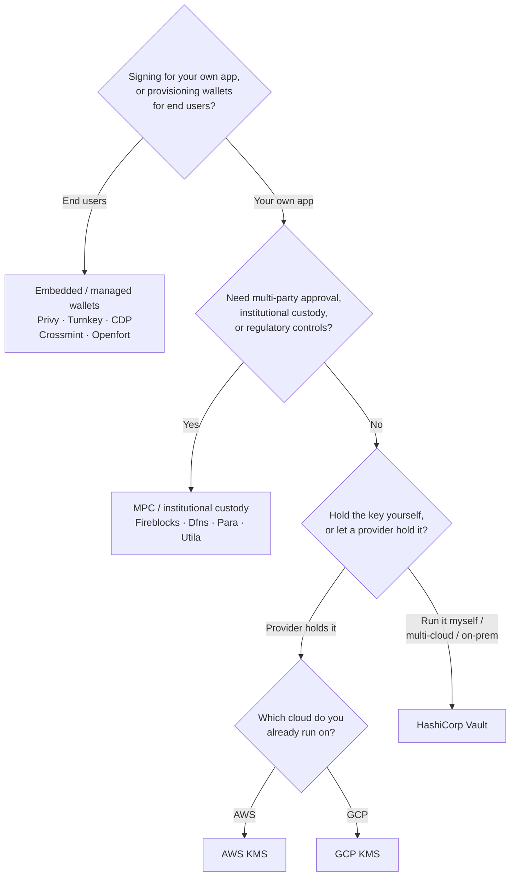

Keychain espone un'unica interfaccia `SolanaSigner` su ogni backend, quindi la
scelta è operativa, non architetturale — puoi cambiarla in seguito tramite
configurazione. Per questo motivo, **parti dai tuoi requisiti, non da un
prodotto.** Due domande risolvono gran parte della questione: _dove risiede la
chiave privata e chi è autorizzato a firmare con essa?_

Non esiste un backend universalmente migliore. Ognuno è più adatto a un
determinato insieme di vincoli — il cloud su cui già operi, se vuoi gestire
un'infrastruttura di chiavi e quali controlli di custodia e approvazione sei
tenuto ad avere. Il flusso seguente associa questi vincoli a un backend.

<Callout type="info">
  Questa guida tratta la firma lato server (backend). Quando i tuoi utenti
  finali firmano le proprie transazioni in un browser, utilizza un wallet
  tramite il Wallet Standard — vedi [Firma in
  Produzione](/docs/core/transactions/signing-in-production).
</Callout>

## Flusso decisionale

<Callout type="info">
  Lo sviluppo locale e i test non richiedono nulla di tutto ciò — usa il backend
  **Memory** per la prototipazione, poi passa a uno dei backend di produzione
  indicati sopra tramite configurazione.
</Callout>

## Percorri le domande

<Steps>

<Step>

### Stai firmando per la tua applicazione o per i tuoi utenti finali?

Se fornisci wallet che gli **utenti finali** possiedono e gestiscono (app
consumer, flussi di onboarding), utilizza un backend di tipo **wallet integrato
/ gestito** — Privy, Turnkey, CDP, Crossmint o Openfort. Questi servizi
gestiscono wallet per singolo utente e authentication per tuo conto.

Se stai firmando come **tua applicazione** — un fee payer, un treasury,
automazione backend — continua di seguito.

</Step>

<Step>

### Hai bisogno di approvazione multi-parte, custodia istituzionale o controlli normativi?

Se le firme devono superare una politica di approvazione, un limite di spesa o
un flusso di lavoro di conformità prima di essere prodotte — oppure hai bisogno
di un custode regolamentato che detenga le chiavi — usa un backend **MPC /
custodia istituzionale**: Fireblocks, Dfns, Para o Utila. Questi suddividono o
custodiscono la chiave e co-firmano secondo la tua politica.

Se hai bisogno solo di una chiave che firmi su richiesta, continua di seguito.

</Step>

<Step>

### Vuoi gestire la chiave tu stesso o affidarla a un provider?

Se un cloud provider deve detenere la chiave in un'infrastruttura con supporto
hardware e la tua politica IAM controlla chi può firmare, usa il KMS di quel
cloud:

- **In esecuzione su AWS** → AWS KMS
- **In esecuzione su GCP** → GCP KMS

Se vuoi gestire tu stesso l'infrastruttura delle chiavi — o sei multi-cloud o
on-prem — usa **HashiCorp Vault**. Lo esegui e lo verifichi tu; la chiave rimane
all'interno del motore Transit e firma su richiesta.

</Step>

</Steps>

## Modelli di custodia

I backend si raggruppano in cinque modelli di custodia. Il flusso sopra ti porta
in uno di essi.

- **Autocustodia (in-process)** — la tua applicazione detiene la chiave privata
  grezza. Comoda per lo sviluppo, ma non adatta alla produzione. Backend:
  **Memory**.
- **Gestione delle chiavi self-hosted** — gestisci tu l'infrastruttura delle
  chiavi; la chiave rimane al suo interno e firma su richiesta. Backend:
  **HashiCorp Vault**.
- **Cloud KMS / HSM** — un cloud provider archivia la chiave in
  un'infrastruttura con supporto hardware; la chiave non lascia mai il servizio
  e la tua politica IAM controlla chi può firmare. Backend: **AWS KMS**, **GCP
  KMS**.
- **MPC e custodia istituzionale** — la chiave è suddivisa o affidata a un
  provider, che co-firma secondo la tua politica (approvazioni, limiti).
  Backend: **Fireblocks**, **Dfns**, **Para**, **Utila**.
- **Wallet embedded e gestiti** — un provider gestisce i wallet per tuo conto,
  spesso per l'onboarding degli utenti finali. Backend: **Privy**, **Turnkey**,
  **CDP**, **Crossmint**, **Openfort**.

## Confronto tra backend

| Backend         | Modello di custodia            | Ideale per                                              | Note                                                      |
| --------------- | ------------------------------ | ------------------------------------------------------- | --------------------------------------------------------- |
| Memory          | Auto-custodia (in-process)     | Sviluppo locale, test, CI                               | Chiave grezza nel processo — non utilizzare in produzione |
| HashiCorp Vault | Gestione chiavi self-hosted    | Team che gestiscono la propria infrastruttura di chiavi | Motore Transit; sei tu a gestirlo e verificarlo           |
| AWS KMS         | Cloud KMS / HSM                | Backend in esecuzione su AWS                            | La chiave non lascia mai KMS; IAM controlla la firma      |
| GCP KMS         | Cloud KMS / HSM                | Backend in esecuzione su GCP                            | La chiave non lascia mai KMS; IAM controlla la firma      |
| Fireblocks      | Custodia MPC / istituzionale   | Tesorerie, exchange, custodia regolamentata             | Motore di policy e flussi di approvazione                 |
| Dfns            | Infrastruttura wallet MPC      | Wallet programmatici con controlli di policy            | Firma Ed25519                                             |
| Para            | Wallet MPC                     | App che desiderano wallet basati su MPC                 | Chiave API + ID wallet                                    |
| Utila           | Custodia MPC + co-firmatario   | Wallet Solana gestiti da Utila                          | `signMessage` non supportato; sei tu a trasmettere la tx  |
| Privy           | Wallet integrati               | App consumer per l'onboarding degli utenti ai wallet    | Wallet integrati gestiti dall'app                         |
| Turnkey         | Gestione chiavi non custodiale | Firma programmatica con gate di policy                  | Gestione chiavi non custodiale                            |
| CDP             | Wallet gestito (Coinbase)      | App sulla Coinbase Developer Platform                   | `signMessage` accetta solo payload UTF-8                  |
| Crossmint       | Wallet gestiti                 | Marketplace e app con wallet gestiti                    | Wallet `smart` e `mpc`; `signMessage` non supportato      |
| Openfort        | Wallet backend integrati       | Wallet lato server                                      | Chiavi archiviate in TEE                                  |

## Scenari enterprise

Una singola applicazione spesso ha bisogno di più di uno di questi
contemporaneamente. Poiché l'interfaccia è identica, è possibile eseguire un
backend diverso per ruolo senza modificare i punti di chiamata.

- **Operazioni di tesoreria** — separare un firmatario operativo "hot" da un
  firmatario "cold" della tesoreria. Supportare la tesoreria con custodia MPC o
  un cloud HSM e richiedere politiche di approvazione prima delle firme ad alto
  valore.
- **Flussi di approvazione** — i backend MPC e di custodia (es. Fireblocks)
  impongono l'approvazione multi-parte prima che venga prodotta una firma.
- **Conformità e audit** — cloud KMS (AWS/GCP) e Vault emettono log di audit
  della firma; i custodi istituzionali aggiungono l'applicazione delle policy e
  la reportistica.
- **Ambienti regolamentati** — mantenere il materiale delle chiavi in un HSM,
  KMS o custode istituzionale in modo che le chiavi raw non tocchino mai
  l'applicazione.

Consulta
[Best practice per la produzione](/docs/tools/keychain/production-best-practices)
per operare questi backend in modo sicuro.

<Cards>
  <Card title="Guida Rust" href="/docs/tools/keychain/getting-started/rust">
    Configura ogni backend in Rust.
  </Card>
  <Card
    title="Guida TypeScript"
    href="/docs/tools/keychain/getting-started/typescript"
  >
    Configura ogni backend in TypeScript.
  </Card>
</Cards>
