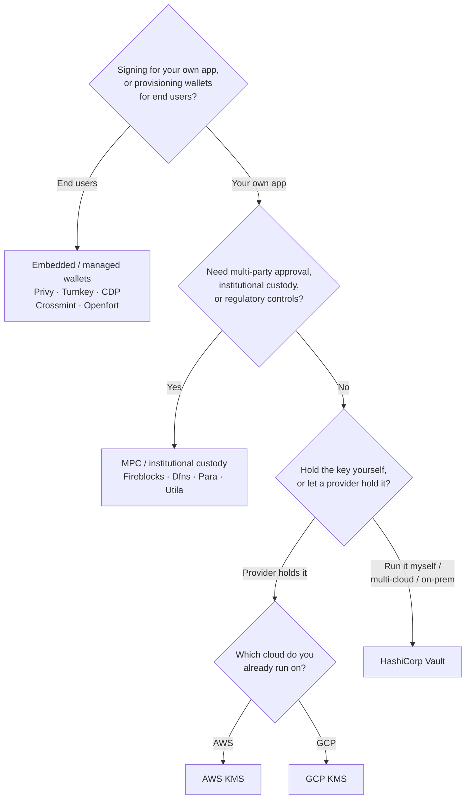

Keychain espone un'unica interfaccia `SolanaSigner` su tutti i backend, quindi
la scelta è operativa, non architetturale — puoi cambiarla in seguito tramite
configurazione. Per questo motivo, **parti dalle tue esigenze, non da un
prodotto.** Due domande risolvono gran parte della questione: _dove risiede la
chiave privata e chi è autorizzato a firmare con essa?_

Non esiste un backend universalmente migliore. Ognuno è più adatto a un
determinato insieme di requisiti — il cloud su cui già operi, se vuoi gestire
l'infrastruttura delle chiavi e quali controlli di custodia e approvazione sei
tenuto ad avere. Il flusso seguente associa tali requisiti a un backend.

<Callout type="info">
  Questa guida tratta la firma lato server (backend). Quando i tuoi utenti
  finali firmano le proprie transazioni in un browser, utilizza invece un wallet
  tramite il Wallet Standard — consulta [Firma in
  Produzione](/docs/core/transactions/signing-in-production).
</Callout>

## Flusso decisionale

<Callout type="info">
  Lo sviluppo locale e i test non richiedono nulla di tutto questo — usa il
  backend **Memory** per i prototipi, poi passa a uno dei backend di produzione
  indicati sopra tramite configurazione.
</Callout>

## Analisi delle domande

<Steps>

<Step>

### Stai firmando per la tua applicazione o per i tuoi utenti finali?

Se fornisci wallet di cui **gli utenti finali** sono proprietari e che
gestiscono autonomamente (app consumer, flussi di onboarding), utilizza un
backend **embedded / managed wallet** — Privy, Turnkey, CDP, Crossmint o
Openfort. Questi gestiscono i wallet per singolo utente e l'autenticazione per
tuo conto.

Se stai firmando come **tua propria applicazione** — un fee payer, un treasury,
automazione backend — continua di seguito.

</Step>

<Step>

### Hai bisogno di approvazione multi-parte, custodia istituzionale o controlli normativi?

Se le firme devono superare una policy di approvazione, un limite di spesa o un
flusso di lavoro di conformità prima di essere prodotte — oppure hai bisogno di
un custode regolamentato che detenga le chiavi — utilizza un backend **MPC /
custodia istituzionale**: Fireblocks, Dfns, Para o Utila. Questi suddividono o
custodiscono la chiave e co-firmano secondo la tua policy.

Se hai bisogno solo di una chiave che firma su richiesta, continua di seguito.

</Step>

<Step>

### Vuoi gestire la chiave tu stesso, o preferisci affidarla a un provider?

Se un provider cloud deve custodire la chiave in un'infrastruttura con supporto
hardware e la tua policy IAM controlla chi può firmare, utilizza il KMS di quel
cloud:

- **In esecuzione su AWS** → AWS KMS
- **In esecuzione su GCP** → GCP KMS

Se vuoi gestire autonomamente l'infrastruttura delle chiavi — oppure sei in un
ambiente multi-cloud o on-prem — utilizza **HashiCorp Vault**. Sei tu a
eseguirlo e verificarlo; la chiave rimane all'interno del motore Transit e firma
su richiesta.

</Step>

</Steps>

## Modelli di custodia

I backend si raggruppano in cinque modelli di custodia. Il flusso sopra
descritto ti colloca in uno di essi.

- **Self-custody (in-process)** — la tua applicazione detiene la chiave privata
  grezza. Comoda per lo sviluppo, ma non adatta alla produzione. Backend:
  **Memory**.
- **Gestione delle chiavi self-hosted** — sei tu a gestire l'infrastruttura
  delle chiavi; la chiave rimane al suo interno e firma su richiesta. Backend:
  **HashiCorp Vault**.
- **Cloud KMS / HSM** — un provider cloud archivia la chiave in
  un'infrastruttura con supporto hardware; la chiave non lascia mai il servizio
  e la tua policy IAM controlla chi può firmare. Backend: **AWS KMS**, **GCP
  KMS**.
- **MPC e custodia istituzionale** — la chiave è suddivisa o custodita tramite
  un provider, che co-firma secondo la tua policy (approvazioni, limiti).
  Backend: **Fireblocks**, **Dfns**, **Para**, **Utila**.
- **Wallet embedded e gestiti** — un provider gestisce i wallet per tuo conto,
  spesso per l'onboarding degli utenti finali. Backend: **Privy**, **Turnkey**,
  **CDP**, **Crossmint**, **Openfort**.

## Confronto dei backend

| Backend         | Modello di custodia           | Ideale per                                              | Note                                                            |
| --------------- | ----------------------------- | ------------------------------------------------------- | --------------------------------------------------------------- |
| Memory          | Auto-custodia (in-process)    | Sviluppo locale, test, CI                               | Chiave grezza nel processo — non utilizzare in produzione       |
| HashiCorp Vault | Gestione chiavi self-hosted   | Team che gestiscono la propria infrastruttura di chiavi | Motore Transit; gestione e auditing a carico dell'utente        |
| AWS KMS         | Cloud KMS / HSM               | Backend in esecuzione su AWS                            | La chiave non lascia mai il KMS; IAM controlla la firma         |
| GCP KMS         | Cloud KMS / HSM               | Backend in esecuzione su GCP                            | La chiave non lascia mai il KMS; IAM controlla la firma         |
| Fireblocks      | Custodia MPC / istituzionale  | Treasury, exchange, custodia regolamentata              | Motore di policy e flussi di approvazione                       |
| Dfns            | Infrastruttura wallet MPC     | Wallet programmatici con controlli di policy            | Firma Ed25519                                                   |
| Para            | Wallet MPC                    | App che desiderano wallet basati su MPC                 | API key + wallet ID                                             |
| Utila           | Custodia MPC + co-firmatario  | Wallet Solana gestiti da Utila                          | `signMessage` non supportato; la tx viene trasmessa dall'utente |
| Privy           | Wallet incorporati            | App consumer per l'onboarding degli utenti ai wallet    | Wallet incorporati gestiti dall'app                             |
| Turnkey         | Gestione chiavi non-custodial | Firma programmatica con controllo di policy             | Gestione chiavi non-custodial                                   |
| CDP             | Wallet gestito (Coinbase)     | App sulla Coinbase Developer Platform                   | `signMessage` accetta solo payload UTF-8                        |
| Crossmint       | Wallet gestiti                | Marketplace e app con wallet gestiti                    | Wallet `smart` e `mpc`; `signMessage` non supportato            |
| Openfort        | Wallet backend incorporati    | Wallet lato server                                      | Chiavi archiviate in TEE                                        |

## Scenari enterprise

Un'applicazione singola spesso ha bisogno di più di uno di questi
contemporaneamente. Poiché l'interfaccia è identica, è possibile eseguire un
backend diverso per ruolo senza modificare i punti di chiamata.

- **Operazioni di tesoreria** — separare un firmatario operativo "hot" da un
  firmatario "cold" per la tesoreria. Supportare la tesoreria con la custodia
  MPC o un HSM cloud e richiedere politiche di approvazione prima delle firme ad
  alto valore.
- **Flussi di approvazione** — i backend MPC e di custodia (es. Fireblocks)
  applicano l'approvazione multi-parte prima che venga prodotta una firma.
- **Conformità e audit** — i KMS cloud (AWS/GCP) e Vault emettono log di audit
  per la firma; i custodi istituzionali aggiungono applicazione delle policy e
  reportistica.
- **Ambienti regolamentati** — mantenere il materiale delle chiavi in un HSM,
  KMS o custode istituzionale in modo che le chiavi grezze non tocchino mai
  l'applicazione.

Consulta
[Best practice per la produzione](/docs/tools/keychain/production-best-practices)
per gestire questi backend in modo sicuro.

<Cards>
  <Card title="Guida Rust" href="/docs/tools/keychain/getting-started/rust">
    Configura ogni backend in Rust.
  </Card>
  <Card
    title="Guida TypeScript"
    href="/docs/tools/keychain/getting-started/typescript"
  >
    Configura ogni backend in TypeScript.
  </Card>
</Cards>
