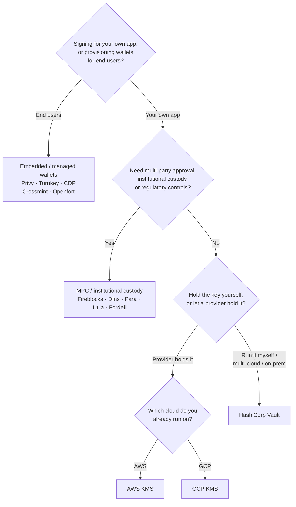

Keychain espone un'unica interfaccia di base `SolanaSigner` per ogni backend, quindi per
la maggior parte dei backend la scelta è operativa, non architetturale: puoi cambiarla
in seguito tramite configurazione. L'eccezione è la forma della transazione. Crossmint
e la modalità auto nativa di Fordefi firmano e trasmettono lato server, e la modalità
manuale nativa di Fordefi riscrive la transazione prima di firmarla, quindi passare a
uno di essi, o abbandonarlo, cambia il modo in cui chiami il signer. Per questo motivo, **parti dai tuoi
requisiti, non da un prodotto.** Due domande decidono la maggior parte della scelta: _dove
risiede la chiave privata e chi è autorizzato ad approvare una firma con essa?_

Ogni backend tranne Ledger è disponibile in tutti e quattro i linguaggi (Rust, TypeScript,
Python e Go). Ledger è solo per Rust, dietro la feature opt-in `ledger`.

Non esiste un backend migliore in assoluto. Ognuno è più adatto a un determinato insieme
di vincoli: il cloud che già utilizzi, se vuoi gestire in prima persona l'infrastruttura delle chiavi
e quali controlli di custodia e approvazione sei tenuto ad avere.
Il flusso qui sotto associa questi vincoli a un backend.

<Callout type="info">
  Questa guida riguarda la firma lato backend (server-side). Quando i tuoi utenti finali firmano
  le proprie transazioni in un browser, usa invece un wallet tramite il Wallet Standard.
  Consulta [Signing in
  Production](/docs/core/transactions/signing-in-production).
</Callout>

## Flusso decisionale

```mermaid title="Choosing a Keychain backend"
flowchart TD
    Start{Signing for your own app,<br/>or provisioning wallets<br/>for end users?}
    Start -->|End users| Managed[Embedded / managed wallets<br/>Privy · Turnkey · CDP<br/>Crossmint · Openfort]
    Start -->|Your own app| Q2{Need multi-party approval,<br/>institutional custody,<br/>or regulatory controls?}
    Q2 -->|Yes| MPC[MPC / institutional custody<br/>Fireblocks · Dfns · Para · Utila · Fordefi]
    Q2 -->|No| Q3{Hold the key yourself,<br/>or let a provider hold it?}
    Q3 -->|Provider holds it| Q4{Which cloud do you<br/>already run on?}
    Q4 -->|AWS| AWS[AWS KMS]
    Q4 -->|GCP| GCP[GCP KMS]
    Q3 -->|Run it myself /<br/>multi-cloud / on-prem| Vault[HashiCorp Vault]
```

<Callout type="info">
  Lo sviluppo locale e i test non richiedono nulla di tutto questo: usa il backend **Memory**
  per il prototipo, quindi passa a uno dei backend di produzione indicati sopra tramite
  configurazione.
</Callout>

## Percorri le domande

<Steps>

<Step>

### Firmi per la tua applicazione o per i tuoi utenti finali?

Se effettui il provisioning di wallet che appartengono agli **utenti finali** e che da loro vengono utilizzati (app consumer,
flussi di onboarding), usa un backend di **wallet embedded / gestiti**: Privy, Turnkey,
CDP, Crossmint oppure Openfort. Questi gestiscono per tuo conto i wallet e l'autenticazione
dei singoli utenti.

Se firmi come **applicazione propria** (un fee payer, una tesoreria, un'automazione backend),
continua qui sotto.

</Step>

<Step>

### Ti servono approvazione multi-parte, custodia istituzionale o controlli normativi?

Se le firme devono superare una policy di approvazione, un limite di spesa o un flusso di
compliance prima di essere prodotte, oppure ti serve un custode regolamentato che detenga le
chiavi, usa un backend **MPC / custodia istituzionale**: Fireblocks, Dfns, Para,
Utila oppure Fordefi. Questi dividono la chiave o ne assumono la custodia e cofirmano secondo la tua
policy.

Se ti serve solo una chiave che firma su richiesta, continua qui sotto.

</Step>

<Step>

### Vuoi custodire tu la chiave o lasciare che lo faccia un provider?

Se un cloud provider deve custodire la chiave in un'infrastruttura basata su hardware e
la tua policy IAM controlla chi può firmare, usa il KMS di quel cloud:

- **Esecuzione su AWS** → AWS KMS
- **Esecuzione su GCP** → GCP KMS

Se vuoi gestire tu stesso l'infrastruttura delle chiavi, oppure sei in multi-cloud o
on-prem, usa **HashiCorp Vault**. Lo gestisci e lo controlli tu; la chiave resta all'interno del
Transit engine e firma su richiesta.

</Step>

</Steps>

## Modelli di custodia

I backend si raggruppano in sei modelli di custodia. Il flusso qui sopra ti porta a uno
di essi.

- **Self-custody (in-process)**: la tua applicazione detiene la chiave privata in chiaro.
  Comoda per lo sviluppo, ma non adatta alla produzione. Backend:
  **Memory**.
- **Self-custody (hardware wallet)**: la chiave non lascia mai il dispositivo Ledger, e
  una persona conferma ogni firma sul suo schermo. Adatta alla firma interattiva
  da parte di un operatore, non a servizi non presidiati. Solo Rust, opt-in e non coperta
  dall'audit. Backend: **Ledger**.
- **Gestione delle chiavi self-hosted**: gestisci tu l'infrastruttura delle chiavi; la chiave
  resta al suo interno e firma su richiesta. Backend: **HashiCorp Vault**.
- **Cloud KMS / HSM**: un cloud provider conserva la chiave in un'infrastruttura
  basata su hardware; la chiave non lascia mai il servizio e la tua policy IAM controlla
  chi può firmare. Backend: **AWS KMS**, **GCP KMS**.
- **MPC e custodia istituzionale**: la chiave è suddivisa o custodita presso un
  provider, che cofirma secondo la tua policy (approvazioni, limiti).
  Backend: **Fireblocks**, **Dfns**, **Para**, **Utila**, **Fordefi**.
- **Wallet embedded e gestiti**: un provider gestisce i wallet per tuo conto,
  spesso per effettuare l'onboarding degli utenti finali. Backend: **Privy**, **Turnkey**, **CDP**,
  **Crossmint**, **Openfort**.

## Confronto tra backend

| Backend         | Modello di custodia                  | Ideale per                                     | Note                                                                                                              |
| --------------- | ------------------------------ | -------------------------------------------- | ------------------------------------------------------------------------------------------------------------------ |
| Memory          | Auto-custodia (in-process)      | Sviluppo locale, test, CI                 | Chiave in chiaro nel processo; non usare in produzione                                                                       |
| Ledger          | Self-custody (hardware wallet) | Firma interattiva da parte dell'operatore tramite strumenti Rust | Solo Rust, feature opt-in `ledger`, non sottoposto ad audit; ogni firma viene confermata sul dispositivo                                 |
| HashiCorp Vault | Gestione chiavi self-hosted     | Team che gestiscono la propria infrastruttura di chiavi   | Motore Transit; sei tu a gestirlo e verificarlo                                                                           |
| AWS KMS         | Cloud KMS / HSM                | Backend in esecuzione su AWS                      | La chiave non lascia mai KMS; IAM controlla la firma                                                                         |
| GCP KMS         | Cloud KMS / HSM                | Backend in esecuzione su GCP                      | La chiave non lascia mai KMS; IAM controlla la firma                                                                         |
| Fireblocks      | Custodia MPC / istituzionale    | Tesorerie, exchange, custodia regolamentata     | Motore di policy e flussi di approvazione                                                                               |
| Dfns            | Infrastruttura wallet MPC      | Wallet programmatici con controlli di policy    | Firma Ed25519                                                                                                    |
| Para            | Wallet MPC                    | App che desiderano wallet basati su MPC            | Chiave API + ID wallet                                                                                                |
| Utila           | Custodia MPC + co-firmatario        | Wallet Solana gestiti da Utila        | `signMessage` non supportato; sei tu a trasmettere la tx                                                                    |
| Fordefi         | Custodia MPC / istituzionale    | Custodia istituzionale con controlli di policy   | Black box: invii tu. Native auto: Fordefi riscrive e invia. Native manual: Fordefi riscrive, tu invii il risultato |
| Privy           | Wallet integrati               | App consumer per l'onboarding degli utenti ai wallet    | Wallet integrati gestiti dall'app                                                                                       |
| Turnkey         | Gestione chiavi non custodiale   | Firma programmatica con gate di policy           | Gestione chiavi non custodiale                                                                                       |
| CDP             | Wallet gestito (Coinbase)      | App sulla Coinbase Developer Platform      | `signMessage` accetta solo payload UTF-8                                                                          |
| Crossmint       | Wallet gestiti                | Marketplace e app con wallet gestiti         | Solo invio: trasmette lato server, può riscrivere per lo sponsoring del gas; `signMessage` non supportato                   |
| Openfort        | Wallet backend integrati       | Wallet lato server                          | Chiavi archiviate in TEE                                                                                                    |

## Forma delle capacità

Oltre alla custodia, ogni backend ha una sola forma di transazione, che determina il modo in cui
chiami il signer:

- **Sign**: il provider firma i byte che hai costruito e tu li trasmetti. La maggior parte
  dei backend, inclusi Ledger e la modalità black box di Fordefi.
- **Rewrite and sign**: il provider riscrive la transazione, quindi la firma
  senza trasmetterla. Prosegui dalla transazione che restituisce. Modalità native
  manual di Fordefi.
- **Sign and broadcast**: il provider firma e trasmette lato server, quindi un
  errore non significa che non sia stato registrato nulla. Crossmint e la modalità native auto di Fordefi.

La tabella delle capacità del signer nel README di ciascun linguaggio elenca la forma di ogni
backend; il
[modello di sicurezza](https://github.com/solana-foundation/solana-keychain/blob/main/docs/SECURITY_MODEL.md)
spiega cosa garantisce ciascuna forma.

## Scenari enterprise

Una singola applicazione ha spesso bisogno di più di uno di questi contemporaneamente. Poiché
l'interfaccia è condivisa, puoi eseguire un backend diverso per ciascun ruolo senza modificare
le chiamate, purché i backend condividano la stessa forma di capacità.

- **Operazioni di tesoreria** — separare un firmatario operativo "hot" da un
  firmatario "cold" della tesoreria. Supportare la tesoreria con custodia MPC o
  un cloud HSM e richiedere politiche di approvazione prima delle firme ad alto
  valore.
- **Flussi di approvazione** — i backend MPC e di custodia (es. Fireblocks)
  impongono l'approvazione multi-parte prima che venga prodotta una firma.
- **Conformità e audit** — cloud KMS (AWS/GCP) e Vault emettono log di audit
  della firma; i custodi istituzionali aggiungono l'applicazione delle policy e
  la reportistica.
- **Ambienti regolamentati** — mantenere il materiale delle chiavi in un HSM,
  KMS o custode istituzionale in modo che le chiavi raw non tocchino mai
  l'applicazione.

Consulta
[Best practice per la produzione](/docs/tools/keychain/production-best-practices)
per operare questi backend in modo sicuro.

<Cards>
  <Card title="Guida Rust" href="/docs/tools/keychain/getting-started/rust">
    Configura ogni backend in Rust.
  </Card>
  <Card
    title="Guida TypeScript"
    href="/docs/tools/keychain/getting-started/typescript"
  >
    Configura ogni backend in TypeScript.
  </Card>
</Cards>
