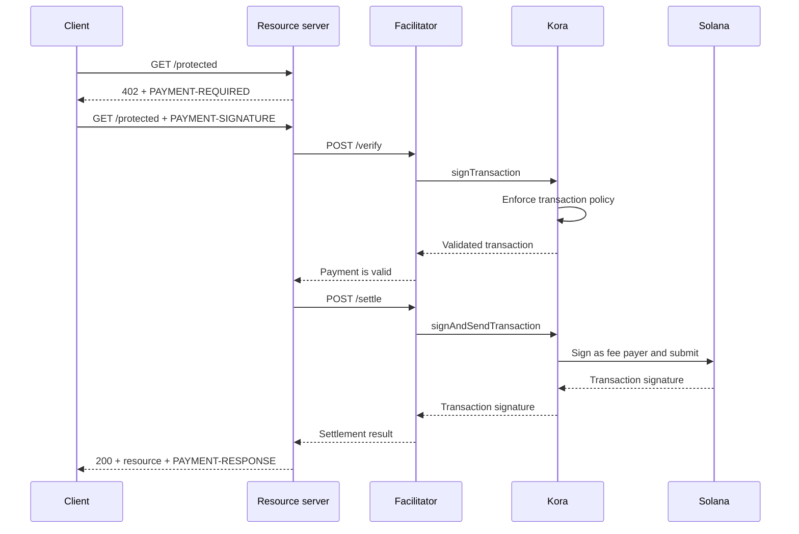

Kora può fornire il livello di firma Solana, policy sulle transazioni e sponsorizzazione delle commissioni dietro un [facilitatore x402 V2](/docs/tools/x402-facilitator). Il facilitatore implementa l'API HTTP x402; Kora valida, firma e invia le transazioni di pagamento che accetta.

Questa guida avvia il facilitatore Kora di riferimento su Solana Devnet. Si tratta di un ambiente di sviluppo per testare l'integrazione, non di un deployment in produzione.

## Architettura



I quattro ruoli applicativi rimangono separati:

- Il **client** seleziona un requisito di pagamento e firma l'autorizzazione al pagamento.
- Il **resource server** determina il prezzo di una route e la soddisfa solo dopo la verifica e il settlement con successo.
- Il **facilitatore** espone gli endpoint `/supported`, `/verify` e `/settle` di x402.
- **Kora** firma solo le transazioni consentite dalla sua policy e può sponsorizzare le relative commissioni di rete Solana.

Kora non sostituisce il protocollo x402. È il confine di firma e policy utilizzato da questa implementazione del facilitatore.

## Avvia il facilitatore di riferimento

Sono necessari Git e [Docker con Compose](https://docs.docker.com/compose/). Clona l'ultima release stabile di Kora ed entra nella demo x402:

```bash
git clone --branch v2.0.5 --depth 1 https://github.com/solana-foundation/kora.git
cd kora/examples/x402/demo
cp .env.example .env
```

Imposta `KORA_PRIVATE_KEY` nel file `.env` su un keypair Devnet usa e getta. La configurazione del firmatario della demo accetta un segreto base58, un keypair come array di byte o il percorso a un file keypair JSON. Finanzia il suo indirizzo pubblico con SOL Devnet in modo che possa sponsorizzare le commissioni sulle transazioni.

<Callout type="caution" title="Usa un firmatario Devnet usa e getta">
  La demo Docker carica il firmatario Kora da una variabile d'ambiente. Non inserire una chiave di firma di produzione in questa demo né eseguire il commit del file `.env`.
</Callout>

Avvia Kora e il facilitatore:

```bash
docker compose up --build
```

La prima build può richiedere alcuni minuti. Quando entrambi i controlli di integrità sono superati, ispeziona le capacità pubblicizzate dal facilitatore da un altro terminale:

```bash
curl http://127.0.0.1:3000/supported
```

La risposta dovrebbe pubblicizzare la versione x402 `2`, lo schema `exact` e l'identificatore di rete CAIP-2 di Devnet:

```json
{
  "kinds": [
    {
      "x402Version": 2,
      "scheme": "exact",
      "network": "solana:EtWTRABZaYq6iMfeYKouRu166VU2xqa1",
      "extra": {
        "feePayer": "<KORA_SIGNER_ADDRESS>"
      }
    }
  ]
}
```

Kora è in ascolto su `127.0.0.1:8080` e il facilitatore su `127.0.0.1:3000` per impostazione predefinita. Ferma la demo con `Ctrl+C`.

## Connetti un resource server

Configura il resource server x402 per utilizzare il facilitatore locale e l'indirizzo pubblico del firmatario Kora come destinatario:

```bash
FACILITATOR_URL=http://127.0.0.1:3000
SOLANA_PAY_TO=<KORA_SIGNER_ADDRESS>
```

Poi segui [x402 su Solana](/docs/payments/agentic-payments/x402) per aggiungere il middleware x402 V2 a una route Express. Una richiesta non pagata riceve `PAYMENT-REQUIRED`, il nuovo tentativo porta `PAYMENT-SIGNATURE` e una risposta con successo porta `PAYMENT-RESPONSE`.

Non copiare esempi che utilizzano `X-PAYMENT`, `X-PAYMENT-RESPONSE` o il nome di rete `solana-devnet`. Questi campi appartengono a x402 V1.

Il repository Kora include anche un'API protetta e un client con supporto ai pagamenti nella stessa directory `examples/x402/demo`. Usa quelle applicazioni quando hai bisogno di testare il flusso locale completo.

## Configura la policy di Kora

Il file `kora/kora.toml` di riferimento è volutamente restrittivo. La sua policy di validazione controlla:

- quali programmi Solana il firmatario autorizza;
- quali mint di token SPL possono essere utilizzati;
- il numero massimo di lamport sponsorizzati e il conteggio delle firme;
- quali operazioni del fee-payer sono vietate; e
- quali estensioni Token-2022 vengono rifiutate.

La demo abilita solo i metodi RPC di Kora necessari al suo facilitatore:
`signTransaction`, `signAndSendTransaction`, `getBlockhash`, `getPayerSigner`,
`getConfig` e `getVersion`.

Tratta la policy come il confine di sicurezza per la chiave del fee-payer. Per un servizio in produzione:

1. Inserisci in allowlist solo i programmi, i mint di token e le forme di transazione prodotte dal tuo schema x402.
2. Nega trasferimenti, modifiche di autorità, chiusura di account e altre istruzioni che possono spostare valore dal firmatario Kora.
3. Imposta limiti di transazione e utilizzo che contengano le perdite in caso di compromissione delle credenziali del facilitatore.
4. Usa un backend di firma gestito anziché una chiave privata conservata in una variabile d'ambiente.

## Proteggi la connessione dal facilitatore a Kora

La demo abilita l'autenticazione tramite API key di Kora. Il facilitatore invia il valore di `KORA_API_KEY`, che deve corrispondere a `[kora.auth].api_key` in `kora.toml`.

Per la produzione, inoltre:

- mantieni Kora su una rete privata e termina TLS a un confine attendibile;
- archivia le credenziali API in un secret manager e ruotale periodicamente;
- considera l'autenticazione delle richieste HMAC di Kora per protezione da manomissioni e replay;
- separa le chiavi del fee-payer e del destinatario del pagamento quando il tuo modello contabile lo richiede; e
- configura avvisi su rifiuti di policy, errori di settlement, consumo di commissioni e saldo del firmatario.

## Rafforza il settlement dei pagamenti

Kora valida la transazione Solana, ma il facilitatore e il resource server sono ancora responsabili della correttezza del protocollo x402. Prima di servire una risorsa, verifica:

- la versione x402 selezionata, lo schema, la rete, l'asset, l'importo e il destinatario;
- la durata dell'autorizzazione e l'esatto layout delle istruzioni Solana;
- la protezione atomica dal replay e il settlement idempotente;
- la conferma al livello di commitment richiesto dal prodotto; e
- una mappatura duratura tra l'acquisto, il risultato del settlement e l'evasione.

Non restituire contenuto pagato solo perché Kora ha accettato una transazione per la firma. Evadi la richiesta solo dopo che il facilitatore restituisce un risultato di settlement con successo.

## Risorse correlate

- [Repository Kora e demo x402](https://github.com/solana-foundation/kora/tree/main/examples/x402/demo)
- [Configurazione dell'operatore Kora](/docs/tools/kora/operators/configuration)
- [Backend di firma Kora](/docs/tools/kora/operators/signers)
- [Audit di sicurezza Kora](/docs/tools/kora/security-audits)
- [Specifica x402 V2](https://github.com/x402-foundation/x402/blob/main/specs/x402-specification-v2.md)
- [Panoramica dei pagamenti agentici](/docs/payments/agentic-payments)
