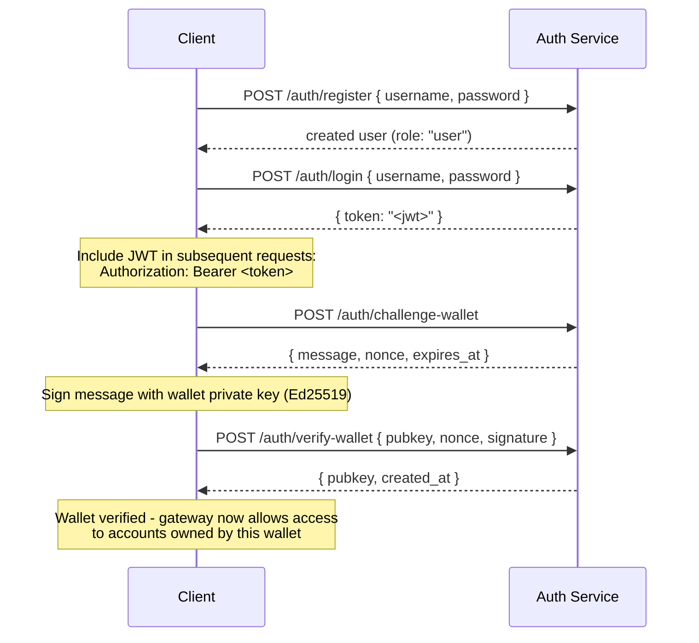

## Panoramica

Private Channels include un Auth Service opzionale che protegge l'accesso al gateway
tramite autenticazione JWT e controllo degli accessi basato sui ruoli (RBAC). Quando
l'autenticazione è disabilitata, il gateway accetta tutte le connessioni. Quando è abilitata,
i client devono presentare un JWT valido in ogni richiesta.

Questa pagina si rivolge a entrambi i destinatari:

- **Sviluppatori** - registrazione, accesso, verifica del wallet e richieste
  autenticate
- **Operatori** - abilitazione del servizio di autenticazione, configurazione di `JWT_SECRET` e
  provisioning del ruolo `operator`

## Abilitazione dell'Autenticazione

L'autenticazione viene abilitata impostando `JWT_SECRET` (non vuoto) sia sul
gateway che sull'Auth Service. L'Auth Service richiede anche
`AUTH_DATABASE_URL`.

Quando `JWT_SECRET` non è impostato, il gateway opera in modalità aperta; non è richiesto
alcun token.

> **Docker Compose:** Il servizio di autenticazione è un profilo Docker Compose e **non
> viene avviato per impostazione predefinita**. Per includerlo, passa `--profile auth` al
> comando `docker compose`, includendo `--env-file .env` affinché i segreti come
> `JWT_SECRET` e `POSTGRES_PASSWORD` vengano effettivamente risolti (Compose disabilita il
> caricamento automatico di `.env` non appena viene passato qualsiasi flag `--env-file`):
>
> ```bash
> docker compose -f docker-compose.devnet.yml --env-file versions.env --env-file .env.devnet --env-file .env --profile auth up -d
> ```

## API dell'Auth Service

Tutti gli endpoint si trovano sotto `/auth`. L'auth service è in ascolto su `AUTH_PORT`
(predefinito `8903`).

### `POST /auth/register`

Crea un nuovo account. Tutti gli utenti vengono registrati con il ruolo `user`.

```json
{ "username": "alice", "password": "hunter2" }
```

- Nome utente: 5-32 caratteri, alfanumerici più `_` e `-`
- Password: 6-128 caratteri
- Restituisce l'utente creato; la password non viene mai restituita

### `POST /auth/login`

Autenticati e ricevi un JWT firmato valido per 24 ore.

```json
{ "username": "alice", "password": "hunter2" }
```

Restituisce `{ "token": "<jwt>" }`. Sia un nome utente errato che una password errata restituiscono
`401` per prevenire l'enumerazione dei nomi utente.

### `POST /auth/challenge-wallet`

Richiedi una sfida di firma per dimostrare la proprietà di un wallet Solana. Richiede un
JWT valido.

Restituisce un messaggio, un nonce e una scadenza. La sfida scade in 10 minuti.

```json
{
  "message": "PrivateChannel wallet verification\nuser: <uuid>\nnonce: <uuid>\nexpires: <unix>",
  "nonce": "<uuid>",
  "expires_at": "<iso8601>"
}
```

### `POST /auth/verify-wallet`

Invia la sfida firmata per registrare un wallet come verificato. Richiede un JWT
valido.

```json
{
  "pubkey": "<base58 pubkey>",
  "nonce": "<uuid from challenge>",
  "signature": "<base58 Ed25519 signature>"
}
```

Il servizio ricostruisce il messaggio di sfida, verifica la firma Ed25519
e memorizza il wallet. Ogni nonce può essere consumato una sola volta; i replay vengono
rifiutati.

Restituisce `{ "pubkey": "<base58>", "created_at": "<iso8601>" }`.

### `GET /auth/wallets`

Elenca tutti i wallet verificati per l'utente autenticato. Richiede un JWT valido.

### `DELETE /auth/wallets/{pubkey}`

Rimuove un wallet verificato dall'account dell'utente autenticato. Richiede un JWT
valido.

### `GET /health`

Controllo di liveness. Restituisce `200 ok`. Nessuna autenticazione richiesta.

## Struttura JWT

I token utilizzano l'algoritmo HS256 e scadono 24 ore dopo l'emissione.

| Claim  | Valore                           |
| ------ | ------------------------------- |
| `sub`  | UUID utente                       |
| `role` | `"user"` o `"operator"`        |
| `iss`  | `"private-channel-auth"`        |
| `aud`  | `"private-channel-gateway"`     |
| `exp`  | Timestamp Unix (24h dall'emissione) |

> `iss` e `aud` sono presenti nel payload JWT ma vengono validati dalla
> configurazione JWT del gateway, non deserializzati nella struct dei claim
> dell'applicazione. Il codice a livello applicativo ha accesso solo a `sub`, `role` e `exp`.

Passa il token nell'intestazione `Authorization`:

```
Authorization: Bearer <JWT_TOKEN>
```

## Ruoli

### user

Ruolo predefinito alla registrazione.

- L'accesso è limitato ai wallet verificati dell'utente
- Bloccato da: `getBlock`, `getTransaction`, `simulateTransaction`
- Può: chiamare `Deposit` sull'Escrow Program, avviare prelievi tramite
  `WithdrawFunds`

### operator

Ruolo con privilegi elevati. Deve essere assegnato direttamente; non esiste un percorso
automatico per passare da `user` a `operator`.

**Assegna il ruolo**, tramite Admin CLI (`private-channel-auth-admin`):

```bash
private-channel-auth-admin set-role --username alice --role operator
```

oppure con SQL diretto:

<Callout type="warning">
  Si tratta di un'operazione privilegiata sul database. Limita l'accesso al database
  dell'Auth Service di conseguenza e controlla qualsiasi modifica ai ruoli.
</Callout>

```sql
UPDATE private_channel_auth.users SET role = 'operator' WHERE username = 'alice';
```

**Registra un wallet senza il flusso di auto-verifica (Admin CLI,
`private-channel-auth-admin`):**

```bash
private-channel-auth-admin attach-wallet --username alice --pubkey <base58-pubkey>
```

Questo inserisce un wallet verificato direttamente nella tabella `verified_wallets`,
bypassando il flusso challenge/verify. Applica un vincolo di unicità su
`(user_id, pubkey)`. **Non** assegna di per sé il ruolo `operator`; usa
`set-role` o l'aggiornamento SQL precedente per quello. Questo comando serve ad associare un
wallet a un account (ad esempio, un account di servizio) senza richiedere il
flusso interattivo challenge/verify.

**Funzionalità:**

- Bypassa tutti i controlli di proprietà del wallet
- Accesso completo a tutti i metodi RPC del gateway, inclusi `getBlock`,
  `getTransaction`, `simulateTransaction`
- Obbligatorio per: `ReleaseFunds`, `ResetSmtRoot`

## Flusso di Autenticazione Completo



## Esecuzione di Richieste Autenticate

```typescript
const response = await fetch("http://localhost:8899/", {
  method: "POST",
  headers: {
    "Content-Type": "application/json",
    Authorization: `Bearer ${jwtToken}`
  },
  body: JSON.stringify({
    jsonrpc: "2.0",
    id: 1,
    method: "getBalance",
    params: [walletAddress]
  })
});
const data = await response.json();
```

## Endpoint del Gateway

Questi endpoint non richiedono autenticazione:

| Endpoint  | Metodo | Descrizione                               | Successo                  | Errore                     |
| --------- | ------ | ----------------------------------------- | ------------------------ | --------------------------- |
| `/health` | GET    | Controllo di liveness                            | `200 {"status":"ok"}`    | -                           |
| `/ready`  | GET    | Readiness approfondita; verifica i nodi di scrittura e lettura | `200 {"status":"ready"}` | `503 {"status":"degraded"}` |

Per il riferimento alle variabili d'ambiente di `JWT_SECRET` e del gateway, consulta il
[Riferimento alla configurazione](/docs/tools/private-channels/operators/configuration).

## Matrice di Accesso ai Metodi RPC

I seguenti metodi sono riconosciuti dal gateway. Quando `JWT_SECRET` è impostato,
l'accesso dipende dal ruolo JWT:

| Metodo                        | Route      | Senza JWT | `user`           | `operator` |
| ----------------------------- | ---------- | ------ | ---------------- | ---------- |
| `sendTransaction`             | Nodo di scrittura | ✓      | ✓                | ✓          |
| `getLatestBlockhash`          | Nodo di lettura  | ✓      | ✓                | ✓          |
| `getSlot`                     | Nodo di lettura  | ✓      | ✓                | ✓          |
| `getRecentBlockhash`          | Nodo di lettura  | ✓      | ✓                | ✓          |
| `getSignatureStatuses`        | Nodo di lettura  | ✓      | ✓                | ✓          |
| `getTransactionCount`         | Nodo di lettura  | ✓      | ✓                | ✓          |
| `getFirstAvailableBlock`      | Nodo di lettura  | ✓      | ✓                | ✓          |
| `getBlocks`                   | Nodo di lettura  | ✓      | ✓                | ✓          |
| `getEpochInfo`                | Nodo di lettura  | ✓      | ✓                | ✓          |
| `getEpochSchedule`            | Nodo di lettura  | ✓      | ✓                | ✓          |
| `getRecentPerformanceSamples` | Nodo di lettura  | ✓      | ✓                | ✓          |
| `getBlockTime`                | Nodo di lettura  | ✓      | ✓                | ✓          |
| `getVoteAccounts`             | Nodo di lettura  | ✓      | ✓                | ✓          |
| `getSupply`                   | Nodo di lettura  | ✓      | ✓                | ✓          |
| `getSlotLeaders`              | Nodo di lettura  | ✓      | ✓                | ✓          |
| `isBlockhashValid`            | Nodo di lettura  | ✓      | ✓                | ✓          |
| `getAccountInfo`              | Nodo di lettura  | 401    | ownership-gated¹ | ✓          |
| `getTokenAccountBalance`      | Nodo di lettura  | 401    | ownership-gated¹ | ✓          |
| `getSignaturesForAddress`     | Nodo di lettura  | 401    | ownership-gated¹ | ✓          |
| `getBlock`                    | Nodo di lettura  | 401    | 403              | ✓          |
| `getTransaction`              | Nodo di lettura  | 401    | 403              | ✓          |
| `simulateTransaction`         | Nodo di lettura  | 401    | 403              | ✓          |

¹ **Ownership-gated**: per un SPL token account (il campo owner è `TokenkegQ...`
o `TokenzQ...`, dati di almeno 165 byte), il gateway verifica che il campo
`owner` o `delegate` corrisponda a uno dei wallet verificati dell'utente autenticato. Per qualsiasi altro tipo di account (un wallet System Program, o un PDA sconosciuto),
verifica invece se il pubkey interrogato è uno dei wallet verificati dell'utente,
poiché tali account non dispongono di un campo owner/delegate da ispezionare.
Se uno dei due controlli fallisce, viene restituito 403.
