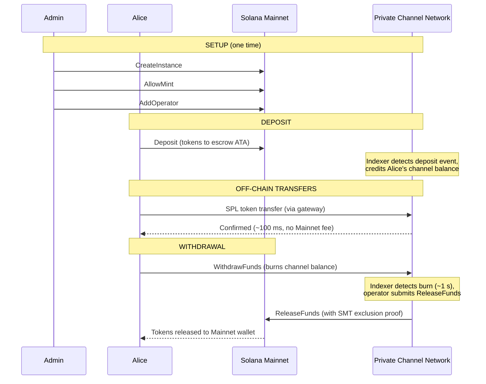
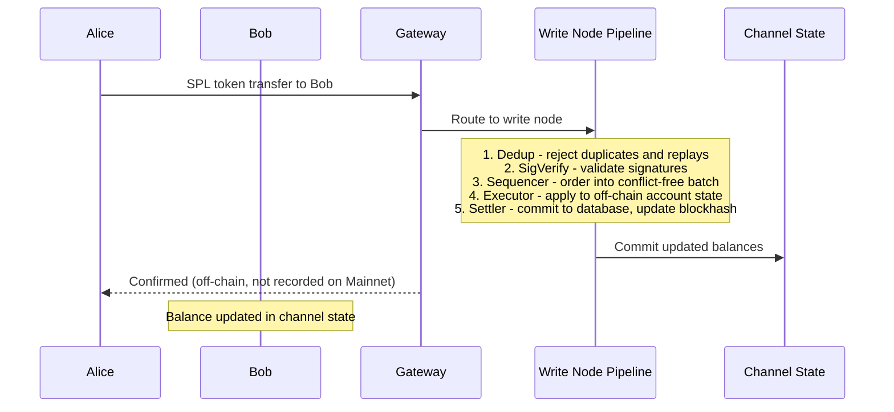
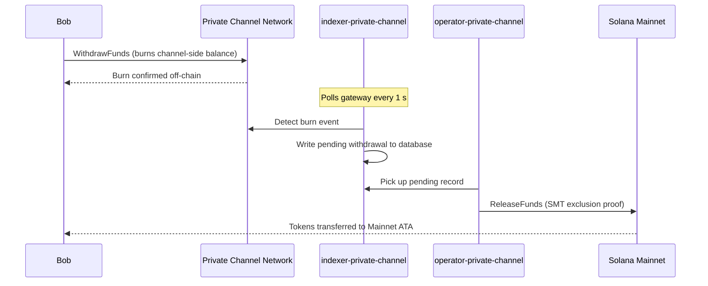

## Cos'è un Canale Privato?

Un canale privato è una rete di pagamento off-chain ancorata a Solana. Gli utenti depositano token SPL in un programma di escrow on-chain, quindi effettuano transazioni off-chain tramite un gateway ad alta velocità e senza costi per trasferimento. Il regolamento su Solana Mainnet avviene tramite una prova Sparse Merkle Tree, garantendo che i fondi siano sempre riscattabili e che il double-spend sia impossibile.

A differenza del flusso di pagamento nativo di Solana, i trasferimenti all'interno di un canale non appaiono on-chain fino al momento del prelievo. La rete del canale gestisce una propria pipeline di transazioni (dedup -> sig verify -> sequencer -> executor -> settler) che elabora le transazioni indipendentemente dal block time di Solana.

## Partecipanti

### Admin dell'Istanza

L'admin distribuisce il PDA `Instance` tramite `CreateInstance` e controlla quali mint di token SPL sono accettati (`AllowMint` / `BlockMint`). L'admin fornisce e revoca gli operatori tramite `AddOperator` / `RemoveOperator`, e può trasferire i diritti di amministrazione tramite `SetNewAdmin`. Esiste un solo admin per istanza. Il trasferimento dei diritti di amministrazione è irreversibile in un singolo passaggio: l'admin attuale non può recuperare il ruolo senza la collaborazione del nuovo admin.

### Operatori

Gli operatori vengono forniti dall'admin. Detengono un PDA `Operator` e sono gli unici account autorizzati a chiamare `ReleaseFunds` (per regolare i prelievi su Mainnet) e `ResetSmtRoot` (per ruotare lo Sparse Merkle Tree). Gli operatori bypassano tutti i controlli di proprietà nel gateway e hanno accesso a tutti i metodi JSON-RPC, inclusi `getBlock`, `getTransaction` e `simulateTransaction`. Ruolo JWT: `"operator"`. Gli operatori devono essere forniti direttamente nel database; non è prevista alcuna escalation self-service. Consulta la
[guida agli Operatori](/docs/tools/private-channels/operators) per i dettagli di deployment e configurazione.

### Utenti

Gli utenti si registrano autonomamente tramite il Servizio di Autenticazione. Ruolo JWT: `"user"`. Gli utenti possono chiamare `Deposit` direttamente sull'Escrow Program e avviare prelievi tramite l'istruzione `WithdrawFunds` lato canale sul Withdraw Program. L'accesso al gateway è limitato ai propri wallet verificati; non possono chiamare `getBlock`, `getTransaction` o `simulateTransaction`.

## Ciclo di Vita del Canale

1. **Creazione dell'istanza** - L'admin chiama `CreateInstance`, creando il PDA `Instance` e configurando i mint consentiti.
2. **Deposito** - Gli utenti depositano token SPL nell'escrow tramite l'istruzione `Deposit`. I token vengono trasferiti all'associated token account dell'istanza.
3. **Trasferimenti off-chain** - Gli utenti inviano trasferimenti tramite il gateway. I trasferimenti vengono sequenziati ed eseguiti sulla rete del canale senza toccare Mainnet.
4. **Avvio del prelievo** - Un utente chiama `WithdrawFunds` sul Withdraw Program (lato canale) per bruciare il proprio saldo e segnalare un prelievo.
5. **Regolamento su Mainnet** - Un operatore fornisce una prova di esclusione SMT valida e chiama `ReleaseFunds` sull'Escrow Program (Mainnet), rilasciando i token al wallet dell'utente.
6. **Rotazione dell'albero** - Quando lo SMT si avvicina alla capacità massima (65.536 foglie), l'operatore chiama `ResetSmtRoot` per ruotare l'albero e avviare un nuovo epoch.

### Trasferimento

### Prelievo

## Quando Utilizzare i Canali Privati

Utilizza i canali privati quando la tua applicazione necessita di:

- **Throughput off-chain** - il volume dei tuoi trasferimenti saturerebb il TPS di Solana oppure hai bisogno di conferme in tempi inferiori al secondo
- **Privacy** - le identità delle controparti e gli importi dei trasferimenti non devono apparire on-chain
- **Zero commissioni per trasferimento** - trasferimenti frequenti in cui il costo in SOL per transazione è proibitivo

Utilizza invece i trasferimenti SPL nativi quando:

- **La componibilità on-chain** è necessaria (DeFi, swap, prestiti; altri programmi devono poter osservare o agire sul trasferimento)
- **Il regolamento con trasferimento singolo** è sufficiente e la privacy non è una preoccupazione
- **Nessuna infrastruttura gateway** è disponibile o operativamente realizzabile
