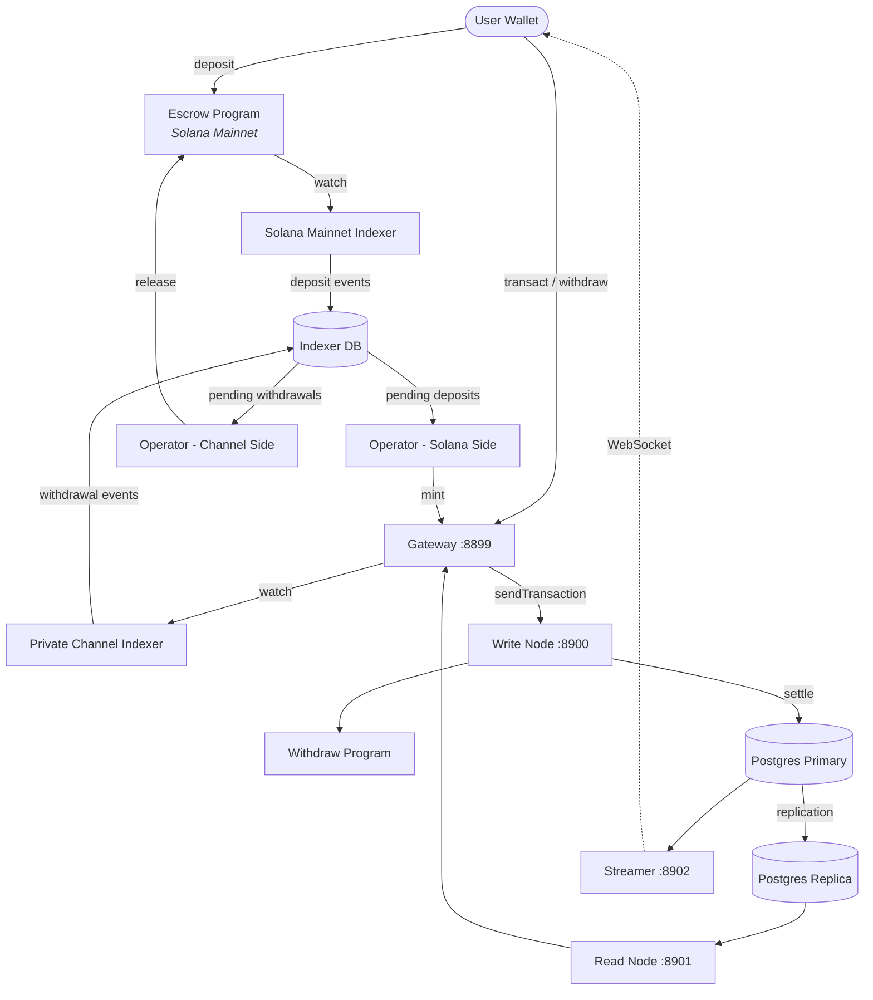

<Callout type="warning">
  Private Channels non è stato sottoposto a un audit di sicurezza e non è consigliato per
  l'uso in produzione con fondi reali senza una revisione approfondita della sicurezza.
</Callout>

<Callout type="info">
  **Stai effettuando un deployment?** Vai alla [guida per gli
  operatori](/docs/tools/private-channels/operators). **Stai integrando un'istanza
  esistente?** Vai alla
  [Quickstart](/docs/tools/private-channels/quickstart/installation). Questa pagina
  è il riferimento architetturale per entrambi i tipi di utenti.
</Callout>

## Architettura

Private Channels è composto da quattro componenti: due programmi Solana on-chain
(Escrow e Withdraw) e due servizi off-chain (Gateway e Auth Service).
Insieme formano un protocollo di canale di stato in cui i fondi risiedono su Mainnet ma
i trasferimenti vengono regolati off-chain.

### Programma Escrow

Il Programma Escrow è un programma Solana on-chain che conserva i token SPL
depositati. È l'ancora di fiducia del sistema: tutti i fondi risiedono in definitiva in
escrow finché un operatore non fornisce una prova di esclusione valida tramite Sparse Merkle Tree per
liberarli.

- Program ID: `9tgHa1DcnaSSUtmMsst8ovKTe1Gfxzezn27KnH9xXYeU`
- Questo ID è compilato nel binario del programma tramite `declare_id!()`. I servizi off-chain
  leggono lo stesso ID in fase di compilazione dal crate client generato, non
  da una variabile d'ambiente.
- Gestisce i PDA `Instance`, `AllowedMint` e `Operator`
- Istruzioni: `CreateInstance`, `AllowMint`, `BlockMint`, `AddOperator`,
  `RemoveOperator`, `SetNewAdmin`, `Deposit`, `ReleaseFunds`, `ResetSmtRoot`

### Programma Withdraw

Il Programma Withdraw è eseguito sulla rete del canale privato, non su Solana Mainnet.
Gli utenti chiamano `WithdrawFunds` per bruciare il saldo dei token lato canale. Questa operazione di burn
non rilascia automaticamente i fondi; segnala all'operatore che un
prelievo è in attesa. L'operatore chiama quindi `ReleaseFunds` sul Programma Escrow
con una prova SMT valida per completare il regolamento.

- Program ID: `J231K9UEpS4y4KAPwGc4gsMNCjKFRMYcQBcjVW7vBhVi`
- Questo ID è compilato nel binario del programma. I servizi off-chain leggono lo stesso
  ID in fase di compilazione dal crate client generato, non da una variabile
  d'ambiente.

### Gateway

Il Gateway è un proxy compatibile con Solana JSON-RPC che instrada le richieste dei client al
nodo di scrittura della rete del canale (per l'invio delle transazioni) e al nodo di lettura (per le
query). È configurato tramite variabili d'ambiente: `GATEWAY_PORT`,
`GATEWAY_WRITE_URL`, `GATEWAY_READ_URL`.

Endpoint di health (autenticazione non richiesta):

- `GET /health` - verifica di liveness; restituisce `200 {"status":"ok"}`
- `GET /ready` - readiness approfondita, verifica i nodi di scrittura e lettura; restituisce
  `200 {"status":"ready"}` oppure `503 {"status":"degraded"}`

#### Routing dei Metodi RPC e Accesso

Il gateway instrada `sendTransaction` al nodo di scrittura e tutti gli altri metodi al
nodo di lettura. Le richieste superiori a 64 KB vengono rifiutate con HTTP 413. Quando
l'autenticazione è abilitata, l'accesso ai metodi è controllato dal ruolo JWT. Consulta
**[Autenticazione e Ruoli](/docs/tools/private-channels/concepts/auth)** per la
matrice completa dei metodi.

### Auth Service

L'Auth Service è un componente opzionale che emette JWT HS256 (scadenza a 24 ore)
per il controllo degli accessi al gateway. Viene abilitato quando la variabile d'ambiente `JWT_SECRET`
è impostata. In sua assenza, il gateway accetta tutte le connessioni.

Claim JWT: `sub` (UUID utente), `role` (`"user"` o `"operator"`), `iss`
(`"private-channel-auth"`), `aud` (`"private-channel-gateway"`), `exp` (timestamp
Unix). `iss` e `aud` sono validati dalla configurazione JWT del gateway,
non deserializzati nella struct dei claim dell'applicazione: solo `sub`, `role` e
`exp` sono disponibili al codice a livello applicativo.

Ruoli:

- `user` - accesso limitato ai propri wallet verificati; non può chiamare `getBlock`,
  `getTransaction` o `simulateTransaction`
- `operator` - aggira tutti i controlli di proprietà; accesso completo ai metodi RPC; deve essere
  provisioning nel database (nessuna escalation self-service)

### Streamer

Lo Streamer è un server WebSocket che invia aggiornamenti sullo stato del canale ai
client connessi in tempo reale, eliminando la necessità di eseguire polling sull'RPC. Esegue il polling di
PostgreSQL per i cambiamenti di stato. Fa parte dello stack Docker Compose base, non
dello stack devnet che questa guida distribuisce; consulta il
[riferimento alla configurazione](/docs/tools/private-channels/operators/configuration#service-port-reference).

- Porta: `8902`, configurabile tramite `STREAMER_PORT`
- Connessione: `ws://localhost:8902`
- Endpoint di health: `GET /health` - restituisce `503` se un loop di polling interno
  si blocca per più di 30 secondi

<Callout type="warning">
  Lo schema degli eventi WebSocket non è ancora documentato pubblicamente. Fare riferimento a
  [`core/src/bin/streamer.rs`](https://github.com/solana-foundation/solana-private-channels/blob/main/core/src/bin/streamer.rs)
  per i dettagli implementativi fino a quando non sarà disponibile la documentazione ufficiale.
</Callout>



## Pipeline delle Transazioni

```text
Transaction -> [1:Dedup] -> [2:SigVerify] -> [3:Sequencer] -> [4:Executor] -> [5:Settler] -> Database
```

Le transazioni inviate al Gateway attraversano una pipeline in cinque fasi prima
che il loro stato venga consolidato:

1. **Dedup** - filtra le transazioni duplicate prima che entrino nella pipeline
2. **SigVerify** - valida le firme delle transazioni rispetto alla chiave pubblica del firmatario
3. **Sequencer** - ordina deterministicamente le transazioni valide per stabilire una
   cronologia canonica
4. **Executor** - esegue le transazioni sul layer degli account del canale
   (BOB Cache + AccountsDB), aggiornando i saldi off-chain
5. **Settler** - consolida i risultati accumulati delle transazioni in PostgreSQL e
   aggiorna la cache Redis; genera nuovi blockhash per il prossimo ciclo di blocchi.
   Il regolamento su Mainnet (la chiamata a `ReleaseFunds`) è gestito separatamente dal
   servizio `operator-private-channel`

## Caratteristiche Principali

### Privacy

I trasferimenti tra i partecipanti al canale non vengono registrati su Solana Mainnet. Solo
i depositi (ingresso nel canale) e i prelievi finali (uscita dal canale)
compaiono on-chain. Le identità delle controparti e gli importi dei trasferimenti non sono visibili agli
osservatori esterni durante il funzionamento del canale.

### Prestazioni

La pipeline off-chain rimuove il block time di Solana dal percorso critico.
I trasferimenti vengono confermati quando il sequencer li elabora, non quando un blocco Solana
viene confermato. Ciò consente una finalità in tempi inferiori al secondo e un throughput superiore al TPS
nativo di Solana per i trasferimenti a livello applicativo.

### Regolamento

Ogni prelievo è protetto da una prova Sparse Merkle Tree on-chain. La radice SMT
è memorizzata in `Instance.withdrawal_transactions_root` nel Programma Escrow.
Quando viene chiamato `ReleaseFunds`, il programma verifica prima una prova di esclusione per
un nonce mai visto rispetto alla radice on-chain corrente, quindi verifica una prova di
inclusione separata per quel nonce rispetto alla nuova radice fornita dal chiamante. Solo dopo
che entrambi i controlli sono superati viene memorizzata la nuova radice, rendendo impossibile il double-spend anche
se una chiave operatore è compromessa.

## Modello di Sicurezza

**Chiave admin** - controlla la creazione delle istanze (`CreateInstance`) e il
provisioning degli operatori (`AddOperator` / `RemoveOperator`). La compromissione della chiave admin
consente il provisioning arbitrario di operatori. `SetNewAdmin` trasferisce l'autorità admin
in modo irreversibile in un singolo passaggio; proteggere di conseguenza la chiave admin.

**Chiavi operatore** - possono chiamare `ReleaseFunds` e `ResetSmtRoot`. Non possono
liberare fondi senza una prova di esclusione SMT valida rispetto alla radice on-chain corrente.
Il controllo on-chain `verify_smt_exclusion_proof` è l'ultima linea di
difesa contro i prelievi non autorizzati: una chiave operatore compromessa da sola non
è sufficiente a svuotare l'escrow.

**Radice SMT** - memorizzata on-chain in `Instance.withdrawal_transactions_root`.
Aggiornata atomicamente a ogni chiamata a `ReleaseFunds`. Poiché ogni prova deve
far riferimento a un nonce mai visto, spendere due volte lo stesso saldo del canale è
impossibile anche se una chiave operatore è compromessa.

**Rotazione dell'albero** - `Instance.current_tree_index` tiene traccia degli epoch dell'albero. Quando
viene chiamato `ResetSmtRoot`, incrementa l'indice dell'albero e invalida tutti i
nonce dell'epoch dell'albero precedente, fornendo una base pulita per i nuovi cicli di regolamento.

## Sicurezza Operativa delle Chiavi

<Callout type="warning">
  I servizi off-chain utilizzano un proprio vocabolario di firmatari, non correlato alle
  autorità admin/operatore on-chain descritte nel Modello di Sicurezza sopra.
  `ADMIN_PRIVATE_KEY` è richiesta per ogni servizio operatore e paga le
  commissioni di transazione; un `OPERATOR_PRIVATE_KEY` separato e opzionale fornisce la
  firma Operator on-chain per `ReleaseFunds` e `ResetSmtRoot`, e utilizza il valore di
  `ADMIN_PRIVATE_KEY` come fallback quando non è impostato. Non inserire mai la chiave admin dell'istanza a livello di protocollo
  (usata per `CreateInstance` / `AddOperator` / `SetNewAdmin`)
  in nessuna delle due variabili né esporla a runtime; tenere quella chiave cold e offline.
</Callout>

`ReleaseFunds` e `ResetSmtRoot` richiedono due firme on-chain: il fee payer
(da `ADMIN_PRIVATE_KEY`) e l'autorità del PDA Operator (da
`OPERATOR_PRIVATE_KEY`, oppure `ADMIN_PRIVATE_KEY` se non impostato). Il walkthrough devnet di questa guida di
deployment inserisce il keypair dell'operatore generato in
`ADMIN_PRIVATE_KEY` e lascia `OPERATOR_PRIVATE_KEY` non impostato, così lo stesso keypair
ricopre entrambi i ruoli di firmatario. Applicare alla chiave che finisce in `ADMIN_PRIVATE_KEY` gli
stessi controlli di una chiave privata di un hot wallet:

- Conservarla solo nel file `.env` con gitignore, mai in `.env.devnet` o in qualsiasi
  configurazione committata
- Per i deployment in produzione, considerare un secrets manager (AWS Secrets Manager,
  HashiCorp Vault) anziché una variabile d'ambiente in chiaro
- Il keypair admin dell'istanza a livello di protocollo (usato per chiamare `AddOperator` /
  `SetNewAdmin`) dovrebbe essere tenuto cold; è necessario solo durante la configurazione dell'istanza
  e il provisioning degli operatori, non durante il runtime

`SetNewAdmin` trasferisce i diritti admin **in modo irreversibile in una singola transazione**:
l'admin corrente non ha percorsi di recupero senza la collaborazione del nuovo admin. Non
chiamarlo senza aver verificato l'indirizzo di destinazione.

## Prossimi Passi

<Cards>
  <Card
    title="Quickstart"
    href="/docs/tools/private-channels/quickstart/installation"
  >
    Configura il tuo ambiente e genera i client TypeScript.
  </Card>
  <Card title="Canali" href="/docs/tools/private-channels/concepts/channels">
    Comprendi i partecipanti e il ciclo di vita del canale.
  </Card>
  <Card
    title="Sparse Merkle Tree"
    href="/docs/tools/private-channels/concepts/smt"
  >
    Comprendi come le prove di prelievo vengono verificate on-chain.
  </Card>
  <Card
    title="Istruzioni"
    href="/docs/tools/private-channels/instructions/deposit"
  >
    Riferimento completo alle istruzioni per tutti i programmi.
  </Card>
</Cards>
