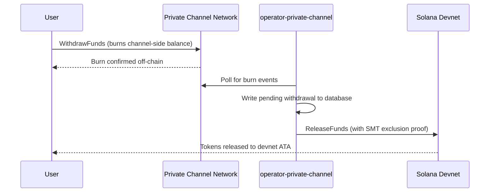

## Panoramica

Il prelievo da Private Channels è un processo in due fasi. Prima, l'utente brucia
il saldo token lato canale chiamando `WithdrawFunds` sul Withdraw
Program. Poi, un operatore chiama `ReleaseFunds` sull'Escrow Program (devnet,
in questa guida) con una prova di esclusione Sparse Merkle Tree valida per rilasciare
i fondi. La prova SMT garantisce che ogni nonce di prelievo possa essere utilizzato una sola volta,
prevenendo il double-spend.



## Passo 1: Avvia il Prelievo sul Canale

Chiama `WithdrawFunds` sul Withdraw Program per bruciare il saldo lato canale.
Usa la variante `Async`, che deriva automaticamente il PDA `tokenAccount` ed è la
forma consigliata per l'uso in produzione:

```typescript
import { getWithdrawFundsInstructionAsync } from "../private-channel-withdraw-program/clients/typescript/src/generated";
import {
  createSolanaRpc,
  address,
  pipe,
  createTransactionMessage,
  setTransactionMessageFeePayerSigner,
  setTransactionMessageLifetimeUsingBlockhash,
  appendTransactionMessageInstruction,
  signAndSendTransactionMessageWithSigners,
  assertIsTransactionMessageWithSingleSendingSigner,
  getBase58Decoder
} from "@solana/kit";

// Point to the gateway, not a public Solana RPC
const privateChannelRpc = createSolanaRpc("http://localhost:8899");

const withdrawIx = await getWithdrawFundsInstructionAsync({
  user: userSigner,
  mint: address(mintAddress),
  amount: 1_000_000n, // 1 USDC (6 decimals)
  destination: null // null = release to signer's devnet wallet
});

const { value: latestBlockhash } = await privateChannelRpc
  .getLatestBlockhash({ commitment: "confirmed" })
  .send();

// Sent to the Private Channels gateway (not Solana RPC directly), which
// expects the legacy transaction format - do not switch this to version 0.
const transactionMessage = pipe(
  createTransactionMessage({ version: "legacy" }),
  (m) => setTransactionMessageFeePayerSigner(userSigner, m),
  (m) => setTransactionMessageLifetimeUsingBlockhash(latestBlockhash, m),
  (m) => appendTransactionMessageInstruction(withdrawIx, m)
);

assertIsTransactionMessageWithSingleSendingSigner(transactionMessage);

const signatureBytes =
  await signAndSendTransactionMessageWithSigners(transactionMessage);
const signature = getBase58Decoder().decode(signatureBytes);
console.log("Withdrawal initiated:", signature);
```

- ID Withdraw Program: `J231K9UEpS4y4KAPwGc4gsMNCjKFRMYcQBcjVW7vBhVi`
- Invia questa transazione al gateway (`http://localhost:8899`), non a un
  RPC Solana pubblico
- Se viene fornito `destination`, i fondi rilasciati vengono inviati a quel wallet invece che al
  firmatario

## Cosa Aspettarsi

Non è richiesta nessun'altra azione dopo aver chiamato `WithdrawFunds`. I servizi
operatore gestiscono il settlement automaticamente:

1. `indexer-private-channel` interroga il canale ogni 1 secondo alla ricerca di eventi di burn
   e registra un record di prelievo in sospeso quando il tuo viene rilevato
2. `operator-private-channel` interroga il database ogni 1 secondo alla ricerca di record
   in sospeso e invia `ReleaseFunds` all'Escrow Program su Solana devnet
   con la prova di esclusione SMT richiesta; interroga la conferma su devnet fino a
   5 volte a intervalli di 400 ms prima di riprovare

I fondi in genere compaiono nel tuo wallet devnet entro pochi secondi in condizioni
normali.

## Come l'Operatore Effettua il Settlement (Riferimento)

Dopo il burn lato canale, un operatore abilitato deve chiamare `ReleaseFunds` sull'
Escrow Program con una prova di esclusione SMT valida; l'operatore non può rilasciare
i fondi senza dimostrare che il nonce di prelievo non è stato utilizzato in precedenza. Questo passaggio
viene gestito automaticamente da `operator-private-channel`; non è necessario chiamarlo
direttamente.

L'operatore fornisce:

- `amount`: deve corrispondere all'importo bruciato
- `user`: wallet destinatario su devnet
- `new_withdrawal_root`: radice SMT aggiornata dopo questo prelievo
- `transaction_nonce`: nonce univoco per questa foglia
- `sibling_proofs`: 512 byte (16 hash sibling da 32 byte ciascuno per la prova dell'albero)

## Verifica

Dopo la conferma della chiamata dell'operatore, controlla il saldo token su devnet:

```bash
spl-token balance <MINT_ADDRESS> --owner <YOUR_WALLET>
```

Oppure tramite RPC:

```typescript
import { createSolanaRpc, address } from "@solana/kit";
import { findAssociatedTokenPda } from "@solana-program/token";

const TOKEN_PROGRAM_ADDRESS = address(
  "TokenkegQfeZyiNwAJbNbGKPFXCWuBvf9Ss623VQ5DA"
);

// Query devnet directly; ReleaseFunds settles here, not through the gateway
const rpc = createSolanaRpc("https://api.devnet.solana.com");

const [yourDevnetAta] = await findAssociatedTokenPda({
  mint: address(mintAddress),
  owner: address(userSigner.address),
  tokenProgram: TOKEN_PROGRAM_ADDRESS
});

const balance = await rpc.getTokenAccountBalance(yourDevnetAta).send();
console.log(balance.value.uiAmountString);
```

## Hai Completato il Quickstart

Hai eseguito l'intero ciclo di Private Channels su devnet: depositato token SPL nell'
escrow, inviato un trasferimento off-chain attraverso il gateway e prelevato i fondi
nel tuo wallet devnet.

<Cards>
  <Card
    title="Ciclo di Vita del Canale"
    href="/docs/tools/private-channels/concepts/channels"
  >
    Comprendi in profondità i partecipanti e l'intero flusso dal deposito al prelievo.
  </Card>
  <Card
    title="Autenticazione e Ruoli"
    href="/docs/tools/private-channels/concepts/auth"
  >
    Aggiungi l'autenticazione JWT alla tua integrazione.
  </Card>
  <Card
    title="Riferimento Release Funds"
    href="/docs/tools/private-channels/instructions/release-funds"
  >
    Riferimento completo dell'istruzione ReleaseFunds per gli strumenti operatore.
  </Card>
  <Card
    title="Sparse Merkle Tree"
    href="/docs/tools/private-channels/concepts/smt"
  >
    Scopri come le prove di prelievo prevengono il double-spend.
  </Card>
</Cards>
