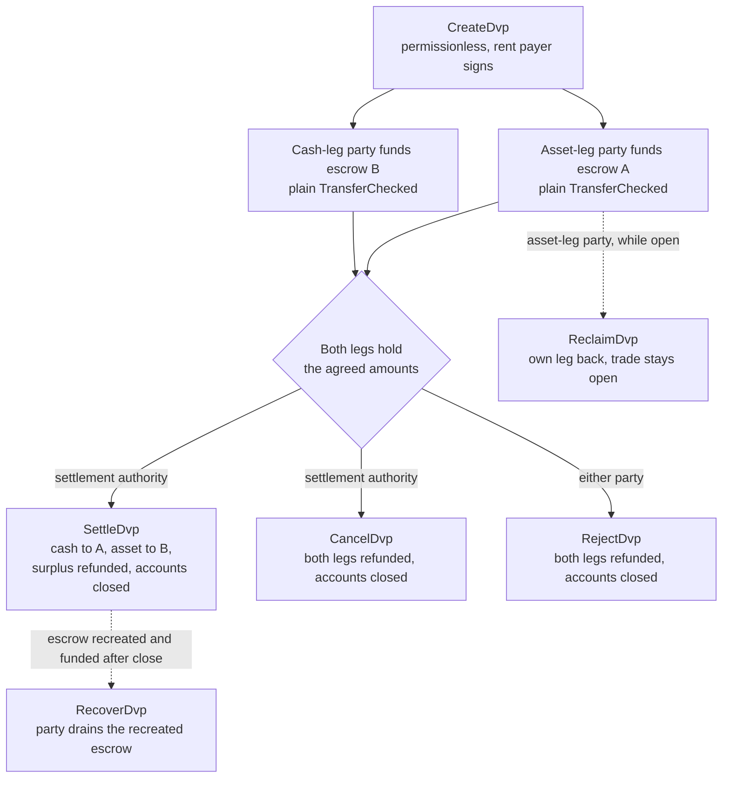
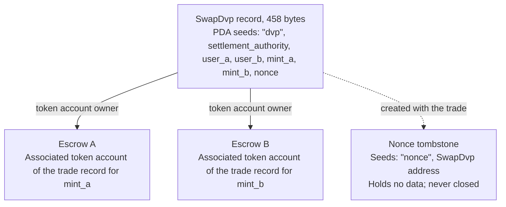

DvPプログラムは、Solana Foundationが管理し、Cantinaが監査を行った、Solana上のDelivery versus Payment(資産の引渡しと代金支払いの同時履行)のための標準プログラムです。2者が取引に合意し、それぞれが通常のトークン転送でエスクローアカウントに自分のレッグを送り、決済権限者が1つのトランザクションで両方のレッグを決済します。そのため、両方が移動するか、どちらも移動しないかのいずれかになります。決済権限者は、取引を仲介した取引所やエージェントなど、取引で指定された第三のアドレスです。どちらの当事者もプログラムを書いたりデプロイしたりする必要はなく、標準のトークン転送(`TransferChecked`)を送信できるウォレットやカストディアンであれば、DvP固有の連携なしでレッグに入金できます。決済までは、いずれの当事者も自分のレッグを引き戻したり、取引を取り消したりできます。

<Callout type="warn" title="操作する前にレコードを確認してください">

取引レコードの作成にはパーミッションが不要なため、レコードが存在しても合意の証明にはなりません。各当事者は入金前に保存されている条件を確認し、決済権限者は決済前に確認してください([検証](#verification-before-funding-and-settlement)を参照)。

</Callout>

## 仕組み

各取引には、プログラム所有のレコードと、レッグごとに1つずつ、計2つのエスクローアカウントが割り当てられます。アセットレッグの当事者(`user_a`)とキャッシュレッグの当事者(`user_b`)は、それぞれのレッグ用のエスクローアカウントにトークンを転送して入金します。決済を実行できる署名者は決済権限者のみです。決済では、各レッグの合意された数量が相手側に転送され、余剰分はそのレッグを所有する当事者に返却され、レコードと両方のエスクローがクローズされます。アトミック性はSolanaの[トランザクション](/docs/core/transactions)によって保証されます。両方の転送が1つのトランザクションに含まれるため、両方が反映されるか、どちらも反映されないかのいずれかになります。

返金、引き戻し、余剰分の返却はすべて、当事者自身のassociated token accountに送られます。`mint_a`については`user_a`のアカウント、`mint_b`については`user_b`のアカウントです。カストディアンやトレジャリーシステムは自身のアカウントからレッグに入金できますが、返却されるものはすべて当事者のアカウントに入り、カストディアンには戻りません。また、各取引は永続的なマーカーアカウントを残します([State](#state)を参照)。

## ガイド

ステップごとのページでは、1つの取引を作成から決済まで進めながら、各instructionについてTypeScriptとRustのコードを紹介します。

<Cards>
  <Card title="取引を作成する" href="/docs/defi/dvp-program/create-a-trade">
    クライアントをインストールし、CreateDvpで取引条件を記録します
  </Card>
  <Card title="レッグに入金する" href="/docs/defi/dvp-program/fund-the-legs">
    保存された条件を確認し、通常の転送で各レッグに入金します
  </Card>
  <Card title="取引を決済する" href="/docs/defi/dvp-program/settle-the-trade">
    決済権限者として、1つのトランザクションで両方のレッグを決済します
  </Card>
  <Card title="取引を取り消す" href="/docs/defi/dvp-program/unwind-a-trade">
    レッグの引き戻し、取引のキャンセルまたは拒否、遅れて入金された資金の回収を行います
  </Card>
</Cards>

[devnetデモ](https://solana.com/delivery-vs-payment/demo)では、取引の作成、標準のトークン転送による両エスクローへの入金、1つのトランザクションでの両レッグの決済まで、取引を最初から最後まで実行します。

## プログラムとデリゲーションの選び方

[デリゲーションを使用したDelivery vs Payment(DvP)](/docs/tokenization/dvp)では、プログラムを使わずに同じ交換を決済します。各当事者が自身のポジションを決済エージェントにデリゲートし、エージェントが1つのトランザクションで両方のレッグを移動します。

- **プログラム**はデリゲーションを必要としないため、token accountごとにデリゲートは1つまでという制限が適用されず、決済権限者が受取先を変更することもできません。ただし、各取引はアップグレード可能なプログラムとそのアップグレード権限に依存します。
- **デリゲーションパターン**はプログラムに依存せず、Scaled UI Amountを持つmintでも動作します。プログラムはそのようなmintを拒否するため、Mosaicの`tokenized-security`テンプレートから作成されたmintは使用できません([mintの設定上の制約](#mint-configuration-constraints)を参照)。

## ロール

このプログラムは対称的です。インターフェース上、2者は`mint_a`を引き渡す`user_a`と、`mint_b`を引き渡す`user_b`です。READMEと生成されたクライアントでは`mint_a`をアセットレッグ、`mint_b`をキャッシュレッグと呼んでおり、本ページもこの慣例に従いますが、プログラム上、キャッシュレッグが現金性の資産である必要はありません。2つの資産や2つのステーブルコインでも、同じように決済されます。

| ロール                 | 対象                               | 署名                                              | 備考                                                                                                                                                                                                     |
| -------------------- | --------------------------------- | -------------------------------------------------- | --------------------------------------------------------------------------------------------------------------------------------------------------------------------------------------------------------- |
| アセットレッグの当事者      | `user_a`(`mint_a`を引き渡す)       | 自身の入金転送、Reclaim、Reject、Recover | keypairウォレット、またはマルチシグボールトなどのPDAベースのスマートウォレット。SPL Tokenのマルチシグアカウントやprogram accountは当事者になれません。その場合、Createは`PartyNotSignerCapable`で失敗します                   |
| キャッシュレッグの当事者       | `user_b`(`mint_b`を引き渡す)       | 自身の入金転送、Reclaim、Reject、Recover | 同じ要件                                                                                                                                                                                          |
| 決済権限者 | 作成時に指定される第三のアドレス | Settle、Cancel                                     | 決済できる唯一の署名者。受取先は作成時に固定されているため、変更することはできません。決済またはキャンセル時に、クローズされたアカウントのrentを受け取ります                                         |
| rent支払者           | `CreateDvp`に署名した者         | Create                                             | レコード、nonce tombstone、および両エスクローのrent(アカウントを維持するためのSOLの預託金)を支払います。rentの受取人としては記録されません。クローズされたアカウントのrentは、取引をクローズした者に送られます |

## プログラムID

```text
dvp34bdbcEm4f4FCUjGV4mDAkDshaQR4LkK8fdcsyZq
```

| クラスター      | プログラム                                       | アップグレード権限                              | 最後にデプロイされたslot |
| ------------ | --------------------------------------------- | ---------------------------------------------- | ------------------ |
| mainnet-beta | `dvp34bdbcEm4f4FCUjGV4mDAkDshaQR4LkK8fdcsyZq` | `DXtFpbPjcn2hxPnw79x1Pfoj35vXh5AsWBkS37YnXMVv` | 452,058,374        |
| devnet       | `dvp34bdbcEm4f4FCUjGV4mDAkDshaQR4LkK8fdcsyZq` | `5EX1zFeJWj4rGYZv432WnYw8CbaSUeTdxPx4r573UgYU` | 479,376,863        |

このプログラムは両クラスターでアップグレード可能です。上記の数値は、2026年10月2日に`solana program show`が報告した内容です。最新の値については、同じコマンドを実行してください。devnet版は、ステップページが基準としているコミット([Install](/docs/defi/dvp-program/create-a-trade#install)を参照)より古いものですが、instructionとエラーのセットは同じです。

## ライフサイクル



取引は`CreateDvp`から、Settle、Cancel、Rejectのいずれかでクローズされるまでオープンです。入金には専用のinstructionはなく、エスクローアカウントが合意された数量以上を保持した時点で、そのレッグは入金済みとなります。Reclaimはレッグ単位で行われ、取引はオープンのままとなるため、一方のレッグに問題があっても、相手方が取引全体をキャンセルする必要はありません。

## State

各取引には、プログラムが所有する458バイトの`SwapDvp`アカウントが1つあります。そのアドレスは、決済権限者、2者の当事者、2つのmint、およびnonceから導出されます(シード:`["dvp", settlement_authority, user_a, user_b, mint_a, mint_b, nonce]`)。数量と時刻はアカウント内部に保存され、アドレスには影響しないため、推測ではなく実際に読み取る必要があります。`["nonce", swap_dvp]`にある小さなマーカーアカウントであるnonce tombstoneは、取引とともに作成され、クローズされることはありません。そのため、当事者、mint、権限者、nonceの各組み合わせは、1回の取引にのみ使用できます。



| フィールド                                  | 型          | 意味                                                                                                 |
| -------------------------------------- | ------------- | ------------------------------------------------------------------------------------------------------- |
| `bump`                                 | `u8`          | PDAのbump                                                                                                |
| `user_a`、`user_b`                     | `Pubkey`      | 2者の当事者                                                                                         |
| `mint_a`、`mint_b`                     | `Pubkey`      | アセットレッグとキャッシュレッグのmint                                                                        |
| `settlement_authority`                 | `Pubkey`      | 決済またはキャンセルできる唯一の署名者                                                               |
| `token_program_a`、`token_program_b`   | `Pubkey`      | 各mintを所有するToken Program。1つの取引でSPL TokenのレッグとToken-2022のレッグを混在させることができます                    |
| `amount_a`、`amount_b`                 | `u64`         | 各レッグの合意された数量(mintの最小単位であるベース単位)                                 |
| `expiry_timestamp`                     | `i64`         | このネットワーク時刻(オンチェーンクロック)を過ぎると、Settleは拒否されます。Reclaim、Cancel、Rejectは引き続き利用できます |
| `nonce`                                | `u64`         | 他のシードが同じ取引を区別します。1回限り有効です                                             |
| `ref_string`                           | `[u8; 64]`    | クライアント用の不透明な参照情報(ゼロ埋め)。プログラムはこれを読み取りません                                     |
| `user_a_settlement_destination`        | `Pubkey`      | Settle時にキャッシュレッグを受け取ります。デフォルトは`user_a`です                                                   |
| `user_b_settlement_destination`        | `Pubkey`      | Settle時にアセットレッグを受け取ります。デフォルトは`user_b`です                                                  |
| `mint_a_authority`、`mint_b_authority` | `Pubkey`      | 作成時に記録されたmint authority。どちらかが変更されている場合、Settleは失敗します                           |
| `earliest_settlement_timestamp`        | `Option<i64>` | 設定されている場合、このネットワーク時刻より前のSettleは拒否されます                                                     |

フィールド一覧は、[取引を作成する](/docs/defi/dvp-program/create-a-trade#install)に記載されているコミット時点のプログラムのIDLから取得したものです。

## Instructions

| Instruction  | 署名者               | 効果                                                                                                                                                              |
| ------------ | -------------------- | ------------------------------------------------------------------------------------------------------------------------------------------------------------------- |
| `CreateDvp`  | 任意の支払者            | `SwapDvp`レコード、そのnonce tombstone、および両エスクローアカウントを作成します。トークンは移動しません                                                                        |
| `ReclaimDvp` | `user_a`または`user_b` | 署名者自身のレッグをエスクローから返却します。取引はオープンのままで、そのレッグには再度入金できます                                                                      |
| `SettleDvp`  | 決済権限者 | `amount_a`を`user_b`の受取先に、`amount_b`を`user_a`の受取先に転送し、余剰分をそのレッグの当事者に返却して、レコードと両エスクローをクローズします |
| `CancelDvp`  | 決済権限者 | エスクローAが保持している分を`user_a`に、エスクローBが保持している分を`user_b`に返金し、レコードと両エスクローをクローズします                                                            |
| `RejectDvp`  | `user_a`または`user_b` | Cancelと同じ効果ですが、当事者が署名します                                                                                                                            |
| `RecoverDvp` | `user_a`または`user_b` | 取引がクローズされた後に、再作成されたエスクローの残高を署名者自身のtoken accountに移し、クローズします。Settle、Cancel、Rejectの後に着金した入金分が対象です  |

返金はすべて、エスクローに入金した者が誰であっても、そのレッグのmintに対する当事者自身のassociated token accountに送られます。

各instructionのアカウントと引数は、該当するステップのページに記載されています。

## エラー

| コード | エラー                            | 発生条件                                                                                                   |
| ---- | -------------------------------- | ------------------------------------------------------------------------------------------------------ |
| 0    | `SignerNotParty`                 | Reclaim、Reject、Recoverが`user_a`でも`user_b`でもないアドレスで署名された場合                      |
| 1    | `DvpExpired`                     | `expiry_timestamp`の後にSettleした場合                                                                        |
| 2    | `SettlementAuthorityMismatch`    | SettleまたはCancelが決済権限者以外のアドレスで署名された場合                              |
| 3    | `SettlementTooEarly`             | `earliest_settlement_timestamp`より前にSettleした場合                                                          |
| 4    | `LegNotFunded`                   | エスクローの保持額が合意された数量に満たない状態でSettleした場合                                               |
| 5    | `ExpiryNotInFuture`              | 現在のネットワーク時刻以前の有効期限でCreateした場合                                            |
| 6    | `EarliestAfterExpiry`            | 有効期限より後の最早決済時刻でCreateした場合                                               |
| 7    | `SelfDvp`                        | `user_a`と`user_b`が同一の状態でCreateした場合                                                                 |
| 8    | `SameMint`                       | `mint_a`と`mint_b`が同一の状態でCreateした場合                                                                 |
| 9    | `ZeroAmount`                     | いずれかのレッグの数量がゼロの状態でCreateした場合                                                                |
| 10   | `BlockedMintExtension`           | TransferFee、InterestBearing、ScaledUiAmount、またはNonTransferableを持つmintでCreateまたはSettleした場合 |
| 11   | `SettlementAuthorityIsParty`     | 決済権限者が当事者のいずれかと同一の状態でCreateした場合                                                  |
| 12   | `SettlementAuthorityExecutable`  | 実行可能アカウントを決済権限者としてCreateした場合                                                         |
| 13   | `NonceAlreadyUsed`               | すでにtombstoneが存在する`(seeds, nonce)`を再利用してCreateした場合                                         |
| 14   | `ExpiryTooFarInFuture`           | 1年を超える先の有効期限でCreateした場合                                                         |
| 15   | `RefStringTooLong`               | 64バイトを超える参照情報でCreateした場合                                                           |
| 16   | `DvpStillOpen`                   | 取引がまだオープンの状態でRecoverした場合。代わりにReclaimを使用してください                                                     |
| 17   | `DvpNeverCreated`                | トゥームストーンのないシードで Recover を実行する                                                              |
| 18   | `EscrowPreloadedWithLamports`    | 非ネイティブのエスクローが rent 免除の最小額を超える lamport を保持している状態で Create を実行する                           |
| 19   | `SettlementDestinationIsSwapDvp` | 決済先が取引レコードと同一の状態で Create を実行する                                         |
| 20   | `SwapDvpPreloadedWithLamports`   | レコードのアドレスが rent 準備額を超える lamport を保持している状態で Create を実行する                                   |
| 21   | `RecipientAtaMismatch`           | 受取人用または返金用の token account が、想定されるウォレットとミントに属さなくなった                  |
| 22   | `PartyNotSignerCapable`          | システムが所有する実行不可のアカウントではない当事者を指定して Create を実行する                                 |
| 23   | `MintAuthorityChanged`           | レッグのミント権限が作成時に記録された値と異なる状態で Settle を実行する                         |

## イベントとインデックス作成

このプログラムはオンチェーンイベントを発行しません。インデクサーや照合システムは、`SwapDvp` アカウントの状態と2つのエスクローのトークン残高を読み取り、`ref_string` を使って取引をオフチェーンの注文と突き合わせます。レコードは決済時にクローズされるため、後から取引条件が必要なシステムは、読み取った時点で条件を保存しておくか、取引を作成したトランザクションから再構築する必要があります。

## 対応トークン

取引では、SPL Token のレッグと Token-2022 のレッグを組み合わせることができます。各レッグはそれぞれ独自の token program を持ちます。Wrapped SOL のレッグにも対応しています。

| レッグのミントにおける Token-2022 エクステンション                                                     | プログラムの動作                                                  |
| ---------------------------------------------------------------------------------------- | ----------------------------------------------------------------- |
| TransferFee, InterestBearing, ScaledUiAmount, NonTransferable                            | Create と Settle で `BlockedMintExtension` により拒否されます         |
| PermanentDelegate, Pausable, DefaultAccountState, freeze authority, MintCloseAuthority | 受け入れられます。各権限者はエスクロー中のトークンに対して操作を行えます           |
| ConfidentialTransfer                                                                     | 受け入れられます。そのレッグの金額は公開されます                          |
| TransferHook                                                                             | 対応しています。レッグごとに最大32個の追加アカウントまで                        |
| 受取先または返金先アカウントの MemoTransfer                                          | 受け入れられます。プログラムは転送の前に必要なメモを発行します |

転送手数料があると、受け取る側は合意した金額に満たなくなります。Interest Bearing と Scaled UI Amount は生の金額を変更しませんが、取引の作成から決済までの間にそのレートや乗数が変わることがあり、合意した金額の表示が変わってしまいます。NonTransferable は両方のレッグを動かせない状態にしてしまいます。

受け入れられる権限者は、取引の存続期間中、エスクロー中のトークンを移動、凍結、または停止できます(後述)。エスクローは機密転送を受け取るように構成できないため、機密レッグにおけるエスクロー額と決済額は公開されます。

フック付きのミントの場合、クライアントはフックの追加アカウントを解決し、Settle、Cancel、Reject、Reclaim、Recover に追加します。レッグごとの上限である32個には、フックプログラムとその検証アカウントも含まれます。フック権限者がフックのアカウントリストをこの上限を超えて拡大すると、権限者が元に戻すまで、そのレッグでの Reclaim、Cancel、Reject、Recover を含むすべての転送が失敗します。両方のレッグにフックがある場合は、レッグごとの上限よりも先にトランザクションのアカウント数の上限に達することがあります。

受取先または返金先アカウントがメモを必須としている場合、プログラムは転送の前に Memo プログラムを呼び出します。このため、エスクローからトークンを移動するすべての instruction は `memo_program` アカウントを必要とします。

### ミント設定の制約

**Scaled UI Amount。** Solana Foundation の発行ツールキットである[Mosaic](https://github.com/solana-foundation/mosaic)の `tokenized-security` テンプレートは常に Scaled UI Amount を追加するため、このプログラムはそのテンプレートから作成されたミントをレッグとして受け付けません。このプログラム向けのミントは、このエクステンションなしで作成できます([Token Extensions](/docs/tokens/extensions)を参照)。[委任を使った DvP](/docs/tokenization/dvp)は委任された権限を通じて決済するため、このチェックは適用されません。

**デフォルトで凍結されるミント。** 各取引のエスクローは、その取引のために新規に作成された Program Derived Address が所有する associated token account です。Default Account State が frozen に設定されたミントでは、エスクローは凍結状態で作成され、解凍されるまで入金の転送は失敗します。[Token ACL](/docs/tokenization/token-acl)の下では、資金を入れる前に、発行者またはその名義書換代理人が取引のエスクローを承認する必要があります。方法は2つあります。取引レコードのアドレス(エスクローの所有者)を許可リストに追加し、ミントの Token ACL 設定でパーミッションレス解凍が有効な場合に誰でもエスクローを解凍できるようにする方法と、freeze authority が直接解凍する方法です。凍結されたエスクローは、そのレッグの Settle、Reclaim、Cancel、Reject、Recover もブロックするため、freeze authority(フック付きミントではフック権限者も)は、取引の存続期間中、信頼すべき当事者となります。凍結エスクローの経路はここで説明するのみで、devnet のスニペットでは実行していません。

## 制限事項

- マッチング、価格発見、オーダーブックはありません。当事者がレジャーの外で条件に合意し、そのうちの一方が記録します。
- ネッティングはなく、二者間のみです。1つのレコードは2当事者間の1つの取引です。
- 部分約定はありません。Settle は各レッグの合意された金額ちょうどを移動し、余剰分はそのレッグの当事者に返却されます。
- レジャー外のレッグはありません。両方のレッグが Solana 上の token account である必要があります。既存の決済網での現金レッグは別途決済され、照合されます。
- 資格確認、許可リスト、KYC はありません。保有者の資格は、ミント自身の制御によって強制されます。
- 自動決済はありません。決済権限者による署名が必要です。
- イベントはなく、トランザクション手数料と rent 以外のプロトコル手数料もありません。

このプログラムは2当事者間の元本リスクを取り除きます。両方が動かない限り、どちらのレッグも移動しません。一方、どちらのトークンについても発行体の信用リスクや償還リスク、ミントの freeze、pause、permanent delegate 権限がエスクロー中のトークンに作用できること([対応トークン](#supported-tokens)を参照)、そして決済権限者が署名可能であることへの依存は取り除きません。

## 資金投入および決済前の検証

`CreateDvp` はパーミッションレスです。署名するのは支払者のみで、当事者と決済権限者は署名しません。そのため、誰でも任意の当事者と任意の条件を指定したレコードを作成できます。資金を入れる前と、決済する前に、あらためて `SwapDvp` アカウントを読み取り、次を確認してください。

1. アカウントが DvP プログラムによって所有されており、サイズがちょうど458バイトであること。プログラムに所有されていないアカウントには、本物のレコードのようにデコードできるバイト列を書き込める場合があります。
2. `user_a`、`user_b`、`mint_a`、`mint_b`、`settlement_authority` が合意した取引と一致していること。
3. `amount_a`、`amount_b`、`expiry_timestamp`、`earliest_settlement_timestamp` が合意した条件と一致していること。
4. 両方の決済先が合意したアドレスであること。偽造されたレコードは代金の送付先を書き換える可能性があります。

[レッグへの資金投入](/docs/defi/dvp-program/fund-the-legs#verify-the-terms)では、生成されたクライアントのチェック付きリーダーを一覧にし、コードでの確認方法を示しています。

Settle トランザクションが[`finalized`](/docs/rpc#configuring-state-commitment)に達した時点で、取引が決済されたものとして扱ってください。これはネットワークのコミットメントレベルであり、法的な意味での決済完了性も示すかどうかは、当事者間の契約や適用される法制度によって異なります。

## バージョン管理

`SwapDvp` アカウントにはバージョンフィールドがありません。レイアウトは458バイト(`SwapDvp::LEN`)に固定されており、チェック付きリーダーは他の長さのアカウントを拒否します。IDL 自体にはバージョンがあり、2026年10月2日時点で `0.1.0` です。

このプログラムは両方のクラスターでアップグレード可能です([プログラム ID](#program-id)を参照)。取引レコードは、決済、キャンセル、または拒否されるまでしか存在しないため、アップグレードが未決済の取引をどのように扱うかはリポジトリで確認し、クライアントはデプロイ済みビルドの IDL から再生成してください。

## リポジトリと監査

ソース、IDL、生成されたクライアント、テストは MIT ライセンスのもと、[`solana-foundation/dvp`](https://github.com/solana-foundation/dvp)にあります。このプログラムは `no_std` の Pinocchio プログラムで、クライアントは Codama を使って IDL から生成されています。脆弱性の報告は、`SECURITY.md` に従い、リポジトリのセキュリティアドバイザリのリンクから行ってください。

このプログラムは[Cantina](https://cantina.xyz/portfolio/fe870bb4-d96d-4902-8aec-9dfcfa2d6a79)による監査を受けています。

## 関連情報

- [委任を使った Delivery vs Payment(DvP)](/docs/tokenization/dvp):プログラムを使わない委任パターン
- [Token ACL](/docs/tokenization/token-acl):ゲート付きミントとエスクローアカウントの相互作用
