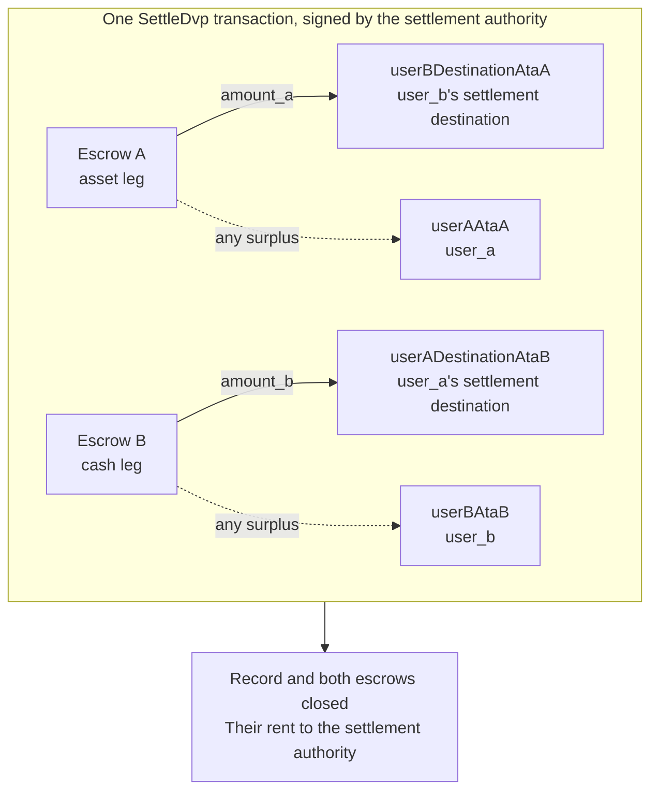

`SettleDvp` には、取引レコードに指定された決済権限者が署名します。1つのトランザクションで、資産レッグの `amount_a` をキャッシュレッグ側の当事者の宛先へ、キャッシュレッグの `amount_b` を資産レッグ側の当事者の宛先へ移動します。いずれかのエスクローに余剰があれば、そのレッグの当事者へ返却し、レコードと両方のエスクローをクローズします。これらの転送のいずれかが完了できない場合、instruction は失敗し、何も移動しません。

このページは、[取引の作成](/docs/defi/dvp-program/create-a-trade)と[レッグへの入金](/docs/defi/dvp-program/fund-the-legs)の続きです。クライアント、署名者、`trade`、当事者の token account は引き続き使用します。

## 署名前に再検証する

決済権限者は両レッグを移動するトランザクションに署名するため、署名前に各当事者と同じ読み取りを行います。確認するのは、オーナー、サイズ、当事者、ミント、金額、有効期限、両方の宛先です（[レッグへの入金](/docs/defi/dvp-program/fund-the-legs#verify-the-terms)を参照）。さらにプログラム自体も、決済時に、各ミントが作成時に記録された token program に引き続き属していること、ブロック対象の拡張機能を持たないこと、取引作成時と同じミント権限を持つことを再確認します。そのため、ブロック対象の拡張機能付きで再作成されたミント、別の token program のミント、別のミント権限を持つミントは決済できません。

## 受取用アカウントを作成する

Settle は、プログラムが作成しない4つの token account に書き込みます。

| アカウント                | 受取内容                     | オーナー                           |
| ---------------------- | ---------------------------- | ------------------------------- |
| `userADestinationAtaB` | キャッシュレッグ（`amount_b`）    | `user_a_settlement_destination` |
| `userBDestinationAtaA` | 資産レッグ（`amount_a`）   | `user_b_settlement_destination` |
| `userAAtaA`            | 資産レッグの余剰分 | `user_a`                        |
| `userBAtaB`            | キャッシュレッグの余剰分  | `user_b`                        |

余剰分用のアカウントは、エスクローが合意額を超えて保有している場合にのみ使用されます。ただし、そのミントを保有していれば誰でも、エスクローに少量のベース単位を送るだけで余剰を発生させられます。返金先のアカウントが存在しない場合は Settle 全体が失敗するため、4つすべてを同じトランザクション内で冪等に作成してください。

<Tabs items={["TypeScript", "Rust"]}>
  <Tab value="TypeScript">
    ```ts
    import {
      findAssociatedTokenPda,
      getCreateAssociatedTokenIdempotentInstruction,
    } from "@solana-program/token-2022";

    const destinationA = t.userASettlementDestination; // defaults to userA
    const destinationB = t.userBSettlementDestination; // defaults to userB

    const [userADestinationAtaB] = await findAssociatedTokenPda({
      mint: mintB,
      owner: destinationA,
      tokenProgram: tokenProgramB,
    });
    const [userBDestinationAtaA] = await findAssociatedTokenPda({
      mint: mintA,
      owner: destinationB,
      tokenProgram: tokenProgramA,
    });
    // userAAtaA and userBAtaB are from fund the legs.

    const createRecipientAccounts = [
      { ata: userADestinationAtaB, owner: destinationA, mint: mintB, tokenProgram: tokenProgramB },
      { ata: userBDestinationAtaA, owner: destinationB, mint: mintA, tokenProgram: tokenProgramA },
      { ata: userAAtaA, owner: userA, mint: mintA, tokenProgram: tokenProgramA },
      { ata: userBAtaB, owner: userB, mint: mintB, tokenProgram: tokenProgramB },
    ].map(({ ata, owner, mint, tokenProgram }) =>
      getCreateAssociatedTokenIdempotentInstruction({
        payer: authoritySigner,
        ata,
        owner,
        mint,
        tokenProgram,
      }),
    );
    ```

  </Tab>

  <Tab value="Rust">
    ```rust
    use spl_associated_token_account_client::address::get_associated_token_address_with_program_id;
    use spl_associated_token_account_client::instruction::create_associated_token_account_idempotent;

    let authority: Pubkey = pubkey!("SETTLEMENT_AUTHORITY_ADDRESS_HERE");
    let destination_a = trade.user_a_settlement_destination; // defaults to user_a
    let destination_b = trade.user_b_settlement_destination; // defaults to user_b

    let user_a_destination_ata_b =
        get_associated_token_address_with_program_id(&destination_a, &mint_b, &token_program_b);
    let user_b_destination_ata_a =
        get_associated_token_address_with_program_id(&destination_b, &mint_a, &token_program_a);
    let user_a_ata_a = get_associated_token_address_with_program_id(&user_a, &mint_a, &token_program_a);
    let user_b_ata_b = get_associated_token_address_with_program_id(&user_b, &mint_b, &token_program_b);

    let create_recipient_accounts = [
        create_associated_token_account_idempotent(&authority, &destination_a, &mint_b, &token_program_b),
        create_associated_token_account_idempotent(&authority, &destination_b, &mint_a, &token_program_a),
        create_associated_token_account_idempotent(&authority, &user_a, &mint_a, &token_program_a),
        create_associated_token_account_idempotent(&authority, &user_b, &mint_b, &token_program_b),
    ];
    ```

  </Tab>
</Tabs>

## 決済を実行する

`legAExtrasCount` は、固定リストの後ろに追加されたアカウントのうち、いくつが資産レッグの転送フックに属するかをプログラムに伝えます。残りはキャッシュレッグのものです。転送フックのないミントの場合は 0 を渡し、何も追加しません。memo program account は instruction で必須であり、メモを必要とする宛先に対してのみ使用されます。

<Tabs items={["TypeScript", "Rust"]}>
  <Tab value="TypeScript">
    ```ts
    import { MEMO_PROGRAM_ADDRESS } from "@solana-program/memo";
    import { getSettleDvpInstruction } from "./dvp";

    const settleInstruction = getSettleDvpInstruction({
      settlementAuthority: authoritySigner,
      swapDvp,
      mintA,
      mintB,
      dvpAtaA: escrowA,
      dvpAtaB: escrowB,
      userADestinationAtaB,
      userBDestinationAtaA,
      userAAtaA,
      userBAtaB,
      tokenProgramA,
      tokenProgramB,
      memoProgram: MEMO_PROGRAM_ADDRESS,
      legAExtrasCount: 0,
    });

    const { context: settleContext } = await client.sendTransaction([
      ...createRecipientAccounts,
      settleInstruction,
    ]);
    const settleSignature = settleContext.signature;
    console.log("Submitted:", settleSignature);

    // sendTransaction returns at the client's commitment (confirmed by default).
    // Wait for finalized before recording the trade as settled.
    let finalized = false;
    for (let attempt = 0; attempt < 30 && !finalized; attempt++) {
      const {
        value: [status],
      } = await client.rpc.getSignatureStatuses([settleSignature]).send();
      if (status?.err) {
        throw new Error("Settle transaction failed");
      }
      finalized = status?.confirmationStatus === "finalized";
      if (!finalized) {
        await new Promise((resolve) => setTimeout(resolve, 2_000));
      }
    }
    if (!finalized) {
      // A closed record means it settled; an open one is safe to settle again.
      throw new Error("Settle not finalized after 60s; read the trade record");
    }
    console.log("Settled:", settleSignature);
    ```

  </Tab>

  <Tab value="Rust">
    ```rust
    use dvp_swap_program_client::instructions::SettleDvpBuilder;

    const MEMO_PROGRAM_ID: Pubkey = pubkey!("MemoSq4gqABAXKb96qnH8TysNcWxMyWCqXgDLGmfcHr");

    let settle_ix = SettleDvpBuilder::new()
        .settlement_authority(authority)
        .swap_dvp(swap_dvp)
        .mint_a(mint_a)
        .mint_b(mint_b)
        .dvp_ata_a(escrow_a)
        .dvp_ata_b(escrow_b)
        .user_a_destination_ata_b(user_a_destination_ata_b)
        .user_b_destination_ata_a(user_b_destination_ata_a)
        .user_a_ata_a(user_a_ata_a)
        .user_b_ata_b(user_b_ata_b)
        .token_program_a(token_program_a)
        .token_program_b(token_program_b)
        .memo_program(MEMO_PROGRAM_ID)
        .leg_a_extras_count(0)
        .instruction();
    ```

  </Tab>
</Tabs>



### 転送フック

生成された IDL には固定アカウントのみが記載されているため、生成されたビルダーはフック用アカウントを認識しません。各フック対象ミントの追加アカウントメタは、そのトークンを直接転送する場合と同じ方法で解決し、instruction に追加してください。順序は、資産レッグのアカウントが先、キャッシュレッグのアカウントが後で、`legAExtrasCount` には最初のグループの数を設定します。TypeScript では、解決したメタを instruction の `accounts` 配列に展開（スプレッド）します。Rust では、ビルダーの `add_remaining_accounts` を使用します。上限は1レッグあたり32アカウントで、フックプログラムと検証アカウントも含まれます。両方のレッグにフックがある場合は、トランザクションのアカウント数の上限に先に達することがあります。プログラムは転送されるすべてのアカウントから署名者フラグを取り除くため、フックがこの経路を通じて決済権限者の署名を取得することはできません。

## 結果を記録する

Settle トランザクションが `finalized` に達した時点で、取引は決済済みとみなします。決済後はレコードと両方のエスクローが存在しなくなるため、後で条件が必要なシステムは、決済前の読み取り結果、または作成時のトランザクションから条件を保存しておいてください。クローズされたアカウントの rent は決済権限者に渡っています。

## Settle のエラー

`LegNotFunded` は、エスクローの保有額が合意額に満たないことを意味します。`DvpExpired` と `SettlementTooEarly` は、時間枠を逃したことを意味します。`MintAuthorityChanged` と `BlockedMintExtension` は、作成後にミントが変更されたことを意味します。`RecipientAtaMismatch` は、宛先または返金先の token account が存在しないか、期待されるオーナーおよびミントに属さなくなっていることを意味します。多くの場合、上記のアカウント作成ステップを省略したことが原因です。いずれの場合も何も移動しておらず、当事者はミントの権限に従って取引を巻き戻せます（[取引の巻き戻し](/docs/defi/dvp-program/unwind-a-trade)を参照）。

## 次のステップ

- [取引の巻き戻し](/docs/defi/dvp-program/unwind-a-trade)：取引が決済されない場合に、入金済みのレッグを回収する
