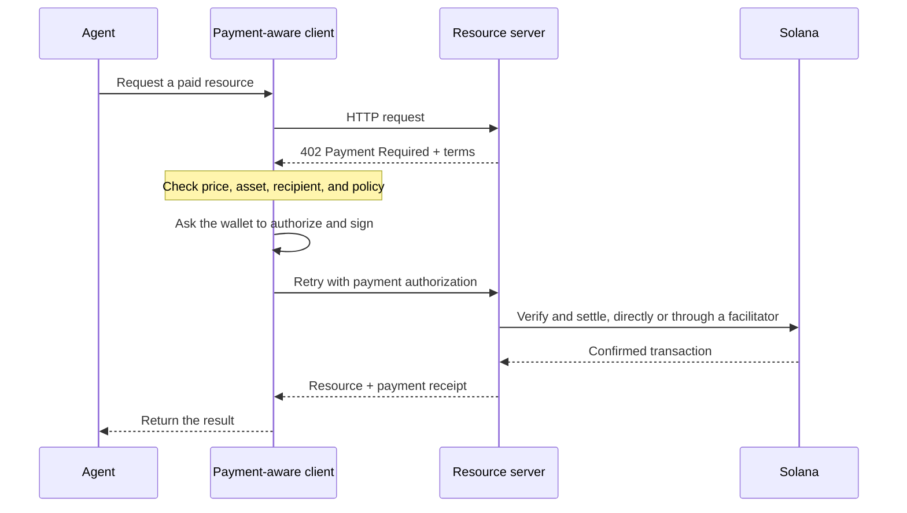

エージェント型決済を使うと、ソフトウェアが価格の確認、支払いの承認、リソースの受け取りを、同じHTTPワークフロー内で行えます。エージェントは、請求アカウントを事前に作成したりAPIキーをコピーしたりすることなく、データクエリ、モデル推論、ツール呼び出しの代金を支払えます。

<Cards>
  <Card title="MPP" href="/docs/payments/agentic-payments/mpp">
    HTTP認証を使用して、1回限りの課金や従量制の支払いセッションを実現します。
  </Card>
  <Card title="x402" href="/docs/payments/agentic-payments/x402">
    x402 V2の支払い要件、署名、決済をHTTPリソースに追加します。
  </Card>
</Cards>

## 共通の支払いフロー

MPPとx402は使用するヘッダーやデータモデルが異なりますが、基本的なHTTPフローは似ています。

## MPPとx402

どちらのプロトコルも、Solana上でステーブルコインによる支払いを決済できます。共通の `402` ステータスコードだけで判断せず、サービスに必要な支払いモデルや相互運用性に基づいて選択してください。

|                         | MPP                                                               | x402                                                                     |
| ----------------------- | ----------------------------------------------------------------- | ------------------------------------------------------------------------ |
| チャレンジ               | `WWW-Authenticate: Payment`                                       | `PAYMENT-REQUIRED`                                                       |
| クライアント認可    | `Authorization: Payment`                                          | `PAYMENT-SIGNATURE`                                                      |
| レシート                 | `Payment-Receipt`                                                 | `PAYMENT-RESPONSE`                                                       |
| Solanaの支払いモデル   | 1回限りの `charge` インテントと、上限付き従量制の `session` インテント           | `exact` や `upto` などのスキーム。サポート状況はネットワークやクライアントによって異なります |
| 決済アーキテクチャ | サーバーでの検証、またはオプションのリレーやゲートウェイ                | ローカル検証を行うリソースサーバー、またはファシリテーター                 |
| 最初の一歩に適したケース     | HTTP認証のセマンティクスや繰り返しの従量計測が必要なAPI | リクエストごとの支払いが必要なリソースや、既存のx402クライアント                      |

MPPは**Machine Payments Protocol**の略称です。**Model Context Protocol(MCP)**と混同しないでください。MCPはエージェントにツールやリソースを公開するもので、MPPまたはx402は、エージェントがそれらのツールを呼び出す際に支払いを要求できます。

<Callout type="info">
  サービスは複数のプロトコルを提示する場合があります。クライアントは自身が対応している支払いオプションを選択し、やり取り全体を通じて、対応するチャレンジ、認可、レシートの各ヘッダーを使用します。
</Callout>
