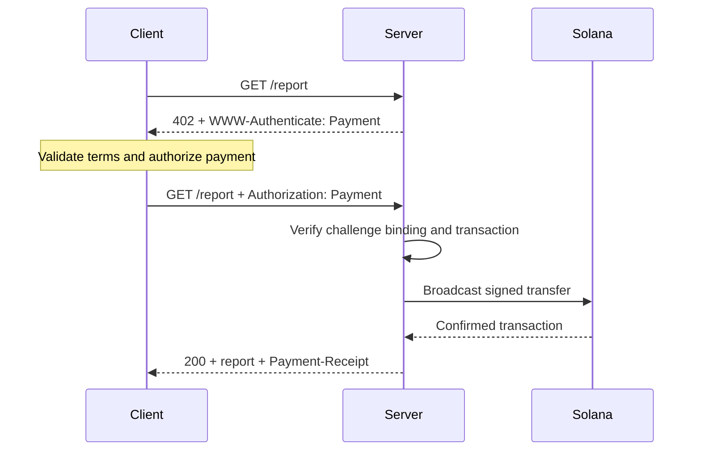
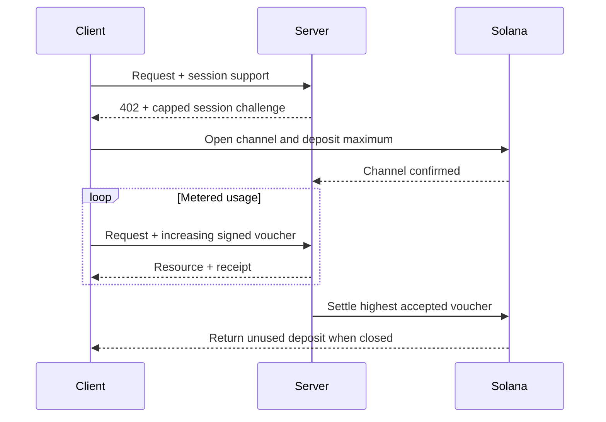

[Machine Payments Protocol(MPP)](https://mpp.dev/)は、HTTP認証のセマンティクスを決済に応用したものです。サーバーは未払いのリクエストに対してチャレンジを返し、クライアントは支払いクレデンシャルを返送し、サーバーは支払いを受理した後にレシートを返します。

MPPは3つの関心事を分離しています。

- **intent**は、1回限りの`charge`や従量制の`session`など、商取引上のやり取りを表します。
- **支払いメソッド**は、価値がどのように移動するかを表します。Solanaメソッドは、チャージにおいてネイティブのSOLとSPLトークンをサポートします。
- HTTPの**トランスポート**が、チャレンジ、クレデンシャル、レシート、エラーを運びます。

MPPはInternet-Draftのセットとして公開されています。[最新の仕様](https://paymentauth.org/)を正式な情報源として扱ってください。ドラフトは作業中のため、詳細は今後変更される可能性があります。

## HTTPのやり取り

MPPは、プロトコル固有の支払いヘッダーではなく、標準のHTTP認証フィールドを使用します。

| メッセージ                 | HTTPでの表現                                         |
| ----------------------- | ----------------------------------------------------------- |
| 支払いチャレンジ       | `WWW-Authenticate: Payment ...`を伴う`402 Payment Required` |
| 支払いクレデンシャル      | `Authorization: Payment ...`を付けて再送信されたリクエスト           |
| 成功時のレシート      | `Payment-Receipt: ...`を伴うリソースレスポンス               |
| 無効な支払い詳細 | `application/problem+json`を使用するProblem Detailsボディ       |



チャレンジには、サーバーが生成したID、realm、メソッド、intent、エンコードされた支払いリクエスト、有効期限が含まれます。クレデンシャルはチャレンジをそのまま返し、メソッド固有の支払い証明を追加します。サーバーは両方を検証する必要があります。別のチャレンジに属する有効な送金によって、リソースのロックが解除されてはなりません。

## Solanaでの1回限りの課金

Solanaの`charge` intentは、2種類のクレデンシャルタイプをサポートします。

- **プルモード**は署名済みトランザクションを使用します。クライアントが送金に署名し、そのトランザクションをサーバーに送信します。サーバーは検証を行い、必要に応じて手数料支払者の署名を追加し、ブロードキャストして承認を確認したうえで、レシートにトランザクション署名を含めて返します。
- **プッシュモード**はトランザクション署名を使用します。クライアントが先にブロードキャストし、確認済みの署名をサーバーに送信します。サーバーはトランザクションを取得して検証してから、リソースを返します。

プルモードでは、サーバーによるトランザクション手数料の肩代わりや、サーバー側でのリトライロジックが可能になります。プッシュモードは、ウォレットがクライアント自身によるトランザクション送信を必要とする場合に便利ですが、サーバーによる手数料の肩代わりは利用できません。

規範となるフィールドと検証ルールについては、[Solana charge仕様](https://paymentauth.org/draft-solana-charge-00.html)を参照してください。

## Express APIにMPPチャージを追加する

Solana Pay Kitは、MPPとx402向けの最新のTypeScript統合を提供します。Expressと一緒にインストールします。

```bash
pnpm add @solana/pay-kit @solana/kit@^6.9.0 express
pnpm add --save-dev @types/express tsx
```

この最小限の例では、ホスト型のSurfpoolサンドボックスと、パッケージの公開デモ用受取人を使用します。ローカル開発専用です。

```ts filename=server.ts
import express from "express";
import { createPayKit, usd } from "@solana/pay-kit";

const pay = await createPayKit({
  accept: ["mpp"],
  rpcUrl: "https://402.surfnet.dev:8899"
});

const app = express();

app.get("/report", pay.express(usd("0.01")), (_req, res) => {
  res.json({ report: "Paid report" });
});

app.listen(4567, () => {
  console.log("Paid API listening on http://127.0.0.1:4567");
});
```

実行して、未払いのリクエストと、支払い対応のリクエストを比較してみましょう。

```bash
pnpm tsx server.ts
curl -i http://127.0.0.1:4567/report
pay --sandbox curl http://127.0.0.1:4567/report
```

ルートハンドラーは、ミドルウェアが支払いを受理した後にのみ実行されます。

<Callout type="warn" title="本番環境ではすべてのサンドボックス用デフォルト値を置き換えてください">
  明示的なネットワーク、加盟店の受取人、専用RPC、安定したチャレンジバインディング用シークレット、本番用署名者、永続的なリプレイストアを設定してください。実際の支払いをパッケージのデモ用署名者に送ってはいけません。
</Callout>

## 従量制セッション

クライアントが関連する少額の支払いを何度も行う場合は、Solana MPPの`session`を使用します。セッションは上限デポジット付きのオンチェーン支払いチャネルを開き、利用量の増加に応じて累積署名済みバウチャーを使用します。サーバーはバウチャーをオフチェーンで検証し、受理した最大金額を後でまとめて精算できます。

これは、トークン従量制の推論、バイト従量制のダウンロード、ライブデータ、繰り返されるツール呼び出しなどに便利です。イベントごとに個別のオンチェーン支払いを送るのとは異なります。



セッションは**セッション支払い**、**支払いチャネル**、または**上限付き反復承認**と呼んでください。サービスと支払いコントラクトが実際に利用のストリームを計測する場合に限り、ストリーミング支払いと呼びます。

## 本番環境での検証

Solanaのチャージごとに、サーバーは少なくとも次の点を検証する必要があります。

- チャレンジが正当で、有効期限内であり、このリクエストに紐づいており、このrealm向けであること。
- トランザクションが、想定されるネットワーク、アセットまたはmint、受取人、金額、token programを使用していること。
- 手数料支払者やassociated-token-accountのinstructionsが明示的に許可されており、サーバーの署名者の資金を流出させるものでないこと。
- トランザクションが、要求されるコミットメントレベルで成功していること。
- トランザクション署名がまだ消費されていないこと。
- リプレイチェックと消費操作が、すべてのサーバーインスタンスにわたってアトミックであること。

セッションの場合は、チャネルの状態、受理した累積金額、精算ウォーターマークも共有ストアに永続化してください。サーバーが利用できなくなった場合に、クライアントが未使用の資金を回収する方法も文書化しておきましょう。

## 関連リソース

- [MPP仕様](https://paymentauth.org/)
- [MPPプロトコルのドキュメント](https://mpp.dev/protocol)
- [Solana Pay Kit](https://github.com/solana-foundation/pay-kit)
- [エージェント決済の概要](/docs/payments/agentic-payments)
- [本番環境への準備](/docs/tools/production-readiness)
