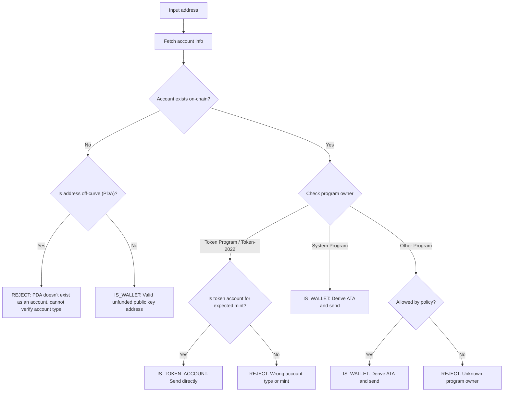

誤ったアドレスにトークンを送信すると、資金が永久に失われる可能性があります。アドレス検証により、適切に受信してアクセスできるアドレスにのみトークンを送信できるようになります。

<Callout>
  支払いの基本概念については、[Solanaでの支払いの仕組み](/docs/payments/how-payments-work)を参照してください。
</Callout>

## Solanaアドレスの理解

Solanaアカウントには、オンカーブとオフカーブの2種類のアドレスがあります。

### オンカーブアドレス

標準アドレスは、Ed25519鍵ペアの公開鍵です。これらのアドレスは:

- トランザクションに署名できる対応する秘密鍵を持つ
- ウォレットアドレスとして使用される

### オフカーブアドレス(PDA)

[プログラム派生アドレス](/docs/core/pda)は、プログラムIDとシードから決定論的に派生されます。これらのアドレスは:

- 対応する秘密鍵を**持たない**
- アドレスが派生されたプログラムによってのみ署名できる

## 支払いにおけるアカウントタイプ

アドレスを使用してネットワークから[アカウント](/docs/core/accounts)を取得し、そのプログラム所有者とアカウントタイプを確認して、アドレスの処理方法を決定します。

<Callout>
  アドレスがオンカーブかオフカーブかを知るだけでは、それがどのタイプのアカウントか、どのプログラムが所有しているか、またはそのアドレスにアカウントが存在するかはわかりません。これらの詳細を判断するには、ネットワークからアカウントを取得する必要があります。
</Callout>

### System Programアカウント(ウォレット)

System
Programが所有するアカウントは標準的なウォレットです。ウォレットにSPLトークンを送信するには、その[関連トークンアカウント(ATA)](/docs/tokens/basics/create-token-account#whats-an-associated-token-account)を派生して使用します。

ATAアドレスを派生した後、トークンアカウントがオンチェーンに存在するかどうかを確認します。ATAが存在しない場合、転送と同じトランザクション内に受信者のトークンアカウントを作成する命令を含めることができます。ただし、これには新しいトークンアカウントのrentの支払いが必要です。受信者がATAを所有しているため、rentに支払われたSOLは送信者が回収することはできません。

<Callout type="warn">
  セーフガードがない場合、ATAの作成を補助することは悪用される可能性があります。悪意のあるユーザーは転送をリクエストし、あなたの費用でATAを作成させ、ATAを閉じてレントSOLを回収し、これを繰り返すことができます。
</Callout>

### トークンアカウント

[トークンアカウント](/docs/tokens/basics/create-token-account)はToken
ProgramまたはToken-2022
Programによって所有され、トークン残高を保持します。受け取ったアドレスがトークンプログラムによって所有されている場合、送信する前にそのアカウントがトークンアカウント(mint
accountではない)であり、期待されるトークンmint
accountと一致することを確認する必要があります。

<Callout type="info">
  Token
  Programsは、転送における両方のトークンアカウントが同じmintのトークンを保持していることを自動的に検証します。検証が失敗した場合、トランザクションは拒否され、資金は失われません。
</Callout>

### Mint account

[Mint account](/docs/tokens/basics/create-mint)は、特定のトークンのトークン供給量とメタデータを追跡します。Mint
accountもToken
Programsによって所有されていますが、トークン転送の有効な受取先では**ありません**。Mintアドレスにトークンを送信しようとすると、トランザクションは失敗しますが、資金は失われません。

### その他のアカウント

他のプログラムによって所有されているアカウントには、ポリシー決定が必要です。一部のアカウント(例:マルチシグウォレット)は有効なトークンアカウント所有者である可能性がありますが、他のアカウントは拒否されるべきです。

## 検証フロー

次の図は、アドレスを検証するための参照決定木を示しています:



<Steps>
<Step>

### アカウントを取得

アドレスを使用して、ネットワークからアカウントの詳細を取得します。

</Step>
<Step>

### アカウントが存在しない

このアドレスにアカウントが存在しない場合、アドレスがオンカーブかオフカーブかを確認します:

- **オフカーブ（PDA）**: アクセス不可能なATAへの送信を避けるため、アドレスを保守的に拒否します。既存のアカウントがない場合、アドレスだけからこのPDAを導出したプログラムや、アドレスがATAのものかどうかを判断できません。このアドレスのATAを導出してトークンを送信すると、アクセス不可能なトークンアカウントに資金がロックされる可能性があります。

- **オンカーブ**: これはまだ資金が供給されていない有効なウォレットアドレス（公開鍵）です。ATAを導出し、存在するか確認してトークンを送信します。ATAが存在しない場合、その作成に資金を供給するかどうかのポリシー決定を行う必要があります。

</Step>
<Step>

### アカウントが存在する場合

アカウントが存在する場合、どのプログラムが所有しているか確認します:

- **システムプログラム**: これは標準的なウォレットです。ATAを導出し、存在するか確認してトークンを送信します。ATAが存在しない場合、その作成に資金を供給するかどうかのポリシー決定を行う必要があります。

- **トークンプログラム /
  Token-2022**: アカウントがトークンアカウント（ミントアカウントではない）であり、送信しようとしているトークン（ミント）を保持していることを確認します。有効な場合、このアドレスに直接トークンを送信します。ミントアカウントまたは別のミントのトークンアカウントの場合、アドレスを拒否します。

- **その他のプログラム**: これはポリシー決定が必要です。マルチシグウォレットなどの一部のプログラムは、トークンアカウントの所有者として許容される場合があります。ポリシーで許可されている場合、ATAを導出して送信します。それ以外の場合、アドレスを拒否します。

</Step>
</Steps>

## デモ

次の例は、アドレス検証ロジックのみを示しています。これは説明目的の参考コードです。

<Callout>
  このデモでは、ATAの導出方法やトークン送信のトランザクション構築方法は示していません。サンプルコードについては、[トークンアカウント](/docs/tokens/basics/create-token-account#how-to-create-an-associated-token-account)および[トークン転送](/docs/tokens/basics/transfer-tokens)のドキュメントを参照してください。
</Callout>

以下のデモでは、3つの可能な結果を使用します。

| 結果               | 意味                     | アクション                             |
| ------------------ | ------------------------ | -------------------------------------- |
| `IS_WALLET`        | 有効なウォレットアドレス | associated token accountを導出して送信 |
| `IS_TOKEN_ACCOUNT` | 有効なトークンアカウント | このアドレスに直接トークンを送信       |
| `REJECT`           | 無効なアドレス           | 送信しない                             |

<CodeTabs flags="r">

```ts !! title="Demo"
// !collapse(1:35) collapsed

import {
  type Address,
  type Rpc,
  type GetAccountInfoApi,
  createSolanaRpc,
  fetchJsonParsedAccount,
  isOffCurveAddress,
  generateKeyPairSigner,
  getProgramDerivedAddress
} from "@solana/kit";

// =============================================================================
// Constants
// =============================================================================

const defaultRpc = createSolanaRpc("https://api.mainnet-beta.solana.com");

const SYSTEM_PROGRAM = "11111111111111111111111111111111" as Address;
const TOKEN_PROGRAM = "TokenkegQfeZyiNwAJbNbGKPFXCWuBvf9Ss623VQ5DA" as Address;
const TOKEN_2022_PROGRAM =
  "TokenzQdBNbLqP5VEhdkAS6EPFLC1PHnBqCXEpPxuEb" as Address;

// =============================================================================
// Validation Function
// =============================================================================

/**
 * Possible validation results for an input address.
 */
export type ValidationResult =
  | { type: "IS_TOKEN_ACCOUNT" }
  | { type: "IS_WALLET" }
  | { type: "REJECT"; reason: string };

/**
 * Validates an input address and classifies it as a wallet, token account, or invalid.
 *
 * @param inputAddress - The address to validate
 * @param rpc - Optional RPC client (defaults to mainnet)
 * @returns Classification result:
 *   - IS_WALLET: Valid wallet address
 *   - IS_TOKEN_ACCOUNT: Valid token account
 *   - REJECT: Invalid address for transfers
 */
export async function validateAddress(
  inputAddress: Address,
  rpc: Rpc<GetAccountInfoApi> = defaultRpc
): Promise<ValidationResult> {
  const account = await fetchJsonParsedAccount(rpc, inputAddress);
  // Log the account data for demo
  console.log("\nAccount:", account);

  // Account doesn't exist on-chain
  if (!account.exists) {
    // Off-curve = PDA that doesn't exist as an account
    // Reject conservatively to avoid sending to an address that may be inaccessible.
    if (isOffCurveAddress(inputAddress)) {
      return { type: "REJECT", reason: "PDA doesn't exist as an account" };
    }
    // On-curve = valid keypair address, treat as unfunded wallet
    return { type: "IS_WALLET" };
  }

  // Account exists, check program owner
  const owner = account.programAddress;

  // System Program = wallet
  if (owner === SYSTEM_PROGRAM) {
    return { type: "IS_WALLET" };
  }

  // Token Program or Token-2022, check if token account
  if (owner === TOKEN_PROGRAM || owner === TOKEN_2022_PROGRAM) {
    const accountType = (
      account.data as { parsedAccountMeta?: { type?: string } }
    ).parsedAccountMeta?.type;

    if (accountType === "account") {
      return { type: "IS_TOKEN_ACCOUNT" };
    }
    // Reject if not a token account (mint account)
    return {
      type: "REJECT",
      reason: "Not a token account"
    };
  }

  // Unknown program owner
  return { type: "REJECT", reason: "Unknown program owner" };
}

// =============================================================================
// Examples
// =============================================================================
// !collapse(1:1000) collapsed

// Wallets
const EXISTING_WALLET =
  "H8sMJSCQxfKiFTCfDR3DUMLPwcRbM61LGFJ8N4dK3WjS" as Address;
const NEW_WALLET = (await generateKeyPairSigner()).address;

// Token accounts
const USDC_TOKEN_ACCOUNT =
  "3emsAVdmGKERbHjmGfQ6oZ1e35dkf5iYcS6U4CPKFVaa" as Address;
const PYUSD_TOKEN_ACCOUNT =
  "47od2TPRvqJipfPVWZdyenLEngPw8hC36nDxiLyvGsEP" as Address;

// Token mints (should be rejected)
const USDC_MINT = "EPjFWdd5AufqSSqeM2qN1xzybapC8G4wEGGkZwyTDt1v" as Address;
const PYUSD_MINT = "2b1kV6DkPAnxd5ixfnxCpjxmKwqjjaYmCZfHsFu24GXo" as Address;

// PDA that doesn't exist (should be rejected)
const [NON_EXISTENT_PDA] = await getProgramDerivedAddress({
  programAddress: (await generateKeyPairSigner()).address,
  seeds: ["seed"]
});

// Program account (should be rejected)
const PROGRAM_ACCOUNT =
  "p1exdMJcjVao65QdewkaZRUnU6VPSXhus9n2GzWfh98" as Address;

async function runExample(label: string, address: Address) {
  console.log(`\n${"─".repeat(60)}`);
  console.log(`Example: ${label}`);
  console.log(`Input: ${address}`);
  console.log(`${"─".repeat(60)}`);

  const result = await validateAddress(address);
  console.log("\nResult:", result);
}

console.log("\n" + "═".repeat(60));
console.log("  IS_WALLET Examples");
console.log("═".repeat(60));

await runExample("Existing funded wallet", EXISTING_WALLET);
await runExample("New wallet (unfunded)", NEW_WALLET);

console.log("\n" + "═".repeat(60));
console.log("  IS_TOKEN_ACCOUNT Examples");
console.log("═".repeat(60));

await runExample("USDC token account (Token Program)", USDC_TOKEN_ACCOUNT);
await runExample("PYUSD token account (Token-2022)", PYUSD_TOKEN_ACCOUNT);

console.log("\n" + "═".repeat(60));
console.log("  REJECT Examples");
console.log("═".repeat(60));

await runExample("USDC mint address", USDC_MINT);
await runExample("PYUSD mint address", PYUSD_MINT);
await runExample("Non-existent PDA", NON_EXISTENT_PDA);
await runExample("Program account", PROGRAM_ACCOUNT);

console.log("\n" + "═".repeat(60));
console.log("  Done!");
console.log("═".repeat(60) + "\n");
```

</CodeTabs>
