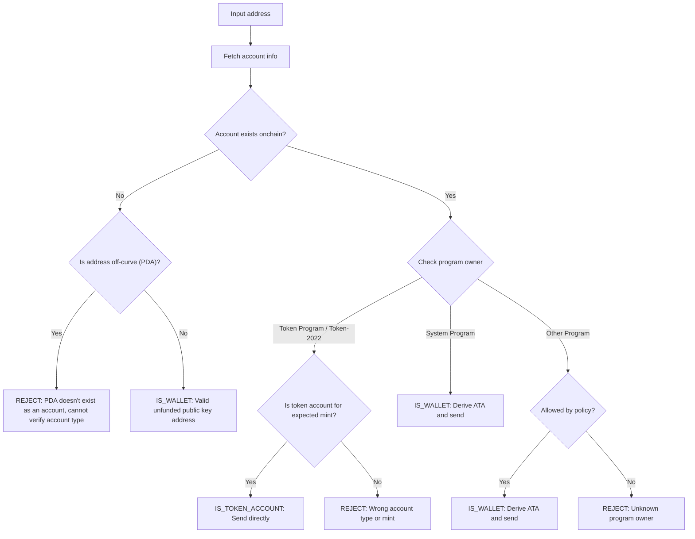

誤ったアドレスへの送金は、資金の永久損失につながる可能性があります。アドレスの検証により、資金を適切に受け取り、アクセスできるアドレスにのみ送金することができます。

検証内容は送信するものによって異なります：

- **SPLトークン**は部分的に自己保護機能を備えています。Token
  Programは、アカウントが期待されるミントと一致しない転送を拒否するため、誤ったアドレスへのトークン転送は資金を失うことなく失敗します。このページの大部分はSPLトークンの送信について説明しています。
- **ネイティブSOL**にはそのような保護機能はありません。System
  Programの転送はあらゆるアカウントへ成功してしまうため、誤った受取人を指定するとSOLが永久にロックされます。[ネイティブSOLの送信](#sending-native-sol)を参照してください。

<Callout>
  コアとなる支払いの概念については、[Solanaにおける支払いの仕組み](/docs/payments/how-payments-work)を参照してください。
</Callout>

## Solanaアドレスについて

Solanaアカウントには、オンカーブとオフカーブの2種類のアドレスがあります。

### オンカーブアドレス

標準アドレスは、Ed25519 keypairの公開鍵です。これらのアドレスは：

- トランザクションに署名できる対応する秘密鍵を持つ
- ウォレットアドレスとして使用される

### オフカーブアドレス（PDA）

[Program Derived Address](/docs/core/pda)は、プログラムIDとシードから決定論的に導出されます。これらのアドレスは：

- 対応する秘密鍵を持た**ない**
- アドレスの導出元であるプログラムによってのみ署名できる

## 支払いにおけるアカウントの種類

アドレスを使用してネットワークから[アカウント](/docs/core/accounts)を取得し、プログラムオーナーとアカウントタイプを確認して、そのアドレスの処理方法を判断してください。

<Callout>
  アドレスがオンカーブかオフカーブかを知るだけでは、アカウントの種類、所有プログラム、またはそのアドレスにアカウントが存在するかどうかはわかりません。これらの詳細を確認するには、ネットワークからアカウントを取得する必要があります。
</Callout>

### System Program アカウント（ウォレット）

System
Program が所有するアカウントは標準的なウォレットです。SPL トークンをウォレットに送信するには、対応する
[Associated Token Account (ATA)](/docs/tokens/basics/create-token-account#whats-an-associated-token-account)
を導出して使用します。

ATA アドレスを導出したら、その token
account がオンチェーンに存在するかどうかを確認します。ATA が存在しない場合は、転送と同じトランザクション内に受信者の token
account を作成する instruction を含めることができます。ただし、これには新しい token
account の rent の支払いが必要です。受信者が ATA を所有しているため、rent として支払われた SOL は送信者が回収することはできません。

<Callout type="warn">
  適切な保護措置がない場合、ATA
  作成のコスト負担は悪用される可能性があります。悪意のあるユーザーが転送をリクエストし、あなたの費用で
  ATA を作成させた後、ATA を閉じて rent の SOL
  を回収し、これを繰り返す可能性があります。
</Callout>

### Token Accounts

[Token accounts](/docs/tokens/basics/create-token-account) は Token
Program または Token-2022
Program によって所有され、トークン残高を保持します。受け取ったアドレスが token
program によって所有されている場合、そのアカウントが token
account であること（mint
account ではないこと）を確認し、送信前に期待するトークンの mint
account と一致しているかどうかを検証してください。

<Callout type="info">
  Token Programs は、転送における両方の token accounts が同じ mint
  のトークンを保持していることを自動的に検証します。検証に失敗した場合、トランザクションは拒否され、資金は失われません。
</Callout>

### Mint Accounts

[Mint accounts](/docs/tokens/basics/create-mint)
は特定トークンのトークン供給量とメタデータを追跡します。Mint accounts も Token
Programs によって所有されていますが、トークン転送の有効な受取先では**ありません**。mint アドレスにトークンを送信しようとするとトランザクションは失敗しますが、資金は失われません。

### その他のアカウント

他のプログラムが所有するアカウントはポリシーの判断が必要です。一部のアカウント（例：マルチシグウォレット）は有効なtoken
account所有者である場合がありますが、その他は拒否すべきです。

## ネイティブSOLの送金

上記の分類により、SPLトークンの送金先が決まります。ネイティブSOLはより厳格です。安全な送金先は**System
Programウォレット**（またはアカウントが未作成のオンカーブアドレスで、後にSystem
Programウォレットになるもの）に限られます。

System Programの送金は、ミント、token
account、プログラム、PDAを含む任意のアカウントにlamportを追加します。lamportはアカウントの所有プログラムによってのみ移動できるため、誤った送金先にSOLを送ると、資金が永久に失われる可能性があります。

SPLトークンの送金とは異なり、送金先が予期しないアドレスであっても、トランザクションは**失敗しません**。

ネイティブSOLを送金する場合、`IS_WALLET`
の結果のみが許容されます。`IS_TOKEN_ACCOUNT` は**許容されません**。token
accountはSPLトークンを保持しており、そこに送られたSOLは送信者の管理外となります。

<Callout type="warn">
  これはSOLが失われる一般的なケースです。ユーザーがトークンのミントアドレス（またはプログラムアドレス）をSOL出金先に貼り付けてしまうことがあります。送金は成功しますが、SOLは回収不能となります。SOL送金に署名する前に、必ず送金先を確認してください。
</Callout>

## 検証フロー

以下の図は、アドレスを検証するための参考デシジョンツリーを示しています。


```mermaid title="Address Verification Flow"
flowchart TD
    A["Input address"]
    B["Fetch account info"]

    A --> B
    B --> C{"Account exists onchain?"}

    %% --- Non-existent account path ---
    C -- "No" --> D{"Is address off-curve (PDA)?"}
    D -- "Yes" --> R1["REJECT: PDA doesn't exist as an account, cannot verify account type"]
    D -- "No" --> W1["IS_WALLET: Valid unfunded public key address"]

    %% --- Existing account path ---
    C -- "Yes" --> F{"Check program owner"}

    F -- "Token Program / Token-2022" --> G{"Is token account for expected mint?"}
    G -- "Yes" --> T1["IS_TOKEN_ACCOUNT: Send directly"]
    G -- "No" --> R2["REJECT: Wrong account type or mint"]

    F -- "System Program" --> W2["IS_WALLET: Derive ATA and send"]

    F -- "Other Program" --> K{"Allowed by policy?"}
    K -- "Yes" --> W3["IS_WALLET: Derive ATA and send"]
    K -- "No" --> R3["REJECT: Unknown program owner"]
```

<Steps>
<Step>

### アカウントの取得

アドレスを使用してネットワークからアカウントの詳細を取得します。

</Step>
<Step>

### アカウントが存在しない場合

このアドレスにアカウントが存在しない場合、そのアドレスがオンカーブかオフカーブかを確認してください。

- **オフカーブ（PDA）**: アクセス不能なATAへの送金を避けるため、保守的にアドレスを拒否してください。既存のアカウントがない場合、アドレスだけではこのPDAがどのプログラムから派生したものか、またそのアドレスがATAのものかどうかを判断できません。このアドレスにトークンを送るためにATAを導出すると、アクセスできないtoken
  accountに資金がロックされる可能性があります。

- **オンカーブ**: これはまだ資金が入っていない有効なウォレットアドレス（公開鍵）です。ATAを導出し、存在するか確認してからトークンを送信してください。ATAが存在しない場合、その作成に資金を提供するかどうかのポリシー上の判断が必要です。

</Step>
<Step>

### アカウントが存在する場合

アカウントが存在する場合は、どのプログラムがそれを所有しているか確認してください：

- **System
  Program**: これは標準的なウォレットです。ATAを導出し、存在するか確認してからトークンを送信してください。ATAが存在しない場合、その作成に資金を提供するかどうかのポリシー上の判断が必要です。

- **Token Program / Token-2022**: そのアカウントがtoken account（mint
  accountではない）であること、および送信しようとするトークン（mint）を保有していることを確認してください。有効であれば、このアドレスに直接トークンを送信してください。mint
  accountまたは別のmintのtoken
  accountである場合は、そのアドレスを拒否してください。

- **その他のプログラム**: これはポリシー上の判断が必要です。マルチシグウォレットなど一部のプログラムは、token
  accountの許容可能な所有者となる場合があります。ポリシーで許可されている場合はATAを導出して送信し、そうでない場合はアドレスを拒否してください。

</Step>
</Steps>

## デモ

以下の例はアドレス検証ロジックのみを示しています。これは説明目的の参考コードです。

<Callout>
  このデモでは、ATAの導出方法やトークンを送信するトランザクションの構築方法については説明していません。サンプルコードについては、[token
  account](/docs/tokens/basics/create-token-account#how-to-create-an-associated-token-account)
  および [token transfer](/docs/tokens/basics/transfer-tokens)
  のドキュメントを参照してください。
</Callout>

以下のデモでは、3つの考えられる結果を使用しています：

| 結果               | 意味                     | アクション                             |
| ------------------ | ------------------------ | -------------------------------------- |
| `IS_WALLET`        | 有効なウォレットアドレス | associated token accountを導出して送信 |
| `IS_TOKEN_ACCOUNT` | 有効なtoken account      | このアドレスに直接トークンを送信       |
| `REJECT`           | 無効なアドレス           | 送信しない                             |

次に、各結果を`canReceiveNativeSol`
（ウォレットのみ）および`canReceiveSplToken`（ウォレットまたはtoken
account）を使用して、アセットごとの受け入れ可否にマッピングします。token
accountは`IS_TOKEN_ACCOUNT`を返すため、SPLトークンを受け取ることはできますが、ネイティブSOLは受け取れません。これがSOLがロックされるのを防ぐための重要な区別です。

<CodeTabs flags="r">

```ts !! title="Demo"
// !collapse(1:35) collapsed

import {
  type Address,
  type Rpc,
  type GetAccountInfoApi,
  createSolanaRpc,
  fetchJsonParsedAccount,
  isOffCurveAddress,
  generateKeyPairSigner,
  getProgramDerivedAddress
} from "@solana/kit";

// =============================================================================
// Constants
// =============================================================================

const defaultRpc = createSolanaRpc("https://api.mainnet-beta.solana.com");

const SYSTEM_PROGRAM = "11111111111111111111111111111111" as Address;
const TOKEN_PROGRAM = "TokenkegQfeZyiNwAJbNbGKPFXCWuBvf9Ss623VQ5DA" as Address;
const TOKEN_2022_PROGRAM =
  "TokenzQdBNbLqP5VEhdkAS6EPFLC1PHnBqCXEpPxuEb" as Address;

// =============================================================================
// Validation Function
// =============================================================================

/**
 * Possible validation results for an input address.
 */
export type ValidationResult =
  | { type: "IS_TOKEN_ACCOUNT" }
  | { type: "IS_WALLET" }
  | { type: "REJECT"; reason: string };

/**
 * Validates an input address and classifies it as a wallet, token account, or invalid.
 *
 * @param inputAddress - The address to validate
 * @param rpc - Optional RPC client (defaults to mainnet)
 * @returns Classification result:
 *   - IS_WALLET: Valid wallet address
 *   - IS_TOKEN_ACCOUNT: Valid token account
 *   - REJECT: Invalid address for transfers
 */
export async function validateAddress(
  inputAddress: Address,
  rpc: Rpc<GetAccountInfoApi> = defaultRpc
): Promise<ValidationResult> {
  const account = await fetchJsonParsedAccount(rpc, inputAddress);
  // Log the account data for demo
  console.log("\nAccount:", account);

  // Account doesn't exist onchain
  if (!account.exists) {
    // Off-curve = PDA that doesn't exist as an account
    // Reject conservatively to avoid sending to an address that may be inaccessible.
    if (isOffCurveAddress(inputAddress)) {
      return { type: "REJECT", reason: "PDA doesn't exist as an account" };
    }
    // On-curve = valid keypair address, treat as unfunded wallet
    return { type: "IS_WALLET" };
  }

  // Account exists, check program owner
  const owner = account.programAddress;

  // System Program = wallet
  if (owner === SYSTEM_PROGRAM) {
    return { type: "IS_WALLET" };
  }

  // Token Program or Token-2022, check if token account
  if (owner === TOKEN_PROGRAM || owner === TOKEN_2022_PROGRAM) {
    const accountType = (
      account.data as { parsedAccountMeta?: { type?: string } }
    ).parsedAccountMeta?.type;

    if (accountType === "account") {
      return { type: "IS_TOKEN_ACCOUNT" };
    }
    // Reject if not a token account (mint account)
    return {
      type: "REJECT",
      reason: "Not a token account"
    };
  }

  // Unknown program owner
  return { type: "REJECT", reason: "Unknown program owner" };
}

/**
 * Native SOL is only safe to send to a wallet. Any other account locks it.
 */
function canReceiveNativeSol(result: ValidationResult): boolean {
  return result.type === "IS_WALLET";
}

/**
 * SPL tokens can go to a wallet (via its ATA) or directly to a token account.
 */
function canReceiveSplToken(result: ValidationResult): boolean {
  return result.type === "IS_WALLET" || result.type === "IS_TOKEN_ACCOUNT";
}

// =============================================================================
// Examples
// =============================================================================
// !collapse(1:1000) collapsed

// Wallets
const EXISTING_WALLET =
  "H8sMJSCQxfKiFTCfDR3DUMLPwcRbM61LGFJ8N4dK3WjS" as Address;
const NEW_WALLET = (await generateKeyPairSigner()).address;

// Token accounts
const USDC_TOKEN_ACCOUNT =
  "3emsAVdmGKERbHjmGfQ6oZ1e35dkf5iYcS6U4CPKFVaa" as Address;
const PYUSD_TOKEN_ACCOUNT =
  "47od2TPRvqJipfPVWZdyenLEngPw8hC36nDxiLyvGsEP" as Address;

// Token mints (should be rejected)
const USDC_MINT = "EPjFWdd5AufqSSqeM2qN1xzybapC8G4wEGGkZwyTDt1v" as Address;
const PYUSD_MINT = "2b1kV6DkPAnxd5ixfnxCpjxmKwqjjaYmCZfHsFu24GXo" as Address;

// PDA that doesn't exist (should be rejected)
const [NON_EXISTENT_PDA] = await getProgramDerivedAddress({
  programAddress: (await generateKeyPairSigner()).address,
  seeds: ["seed"]
});

// Program account (should be rejected)
const PROGRAM_ACCOUNT =
  "p1exdMJcjVao65QdewkaZRUnU6VPSXhus9n2GzWfh98" as Address;

async function runExample(label: string, address: Address) {
  console.log(`\n${"─".repeat(60)}`);
  console.log(`Example: ${label}`);
  console.log(`Input: ${address}`);
  console.log(`${"─".repeat(60)}`);

  const result = await validateAddress(address);
  console.log("\nResult:", result);
  console.log(
    `Can receive SOL?   ${canReceiveNativeSol(result) ? "YES" : "NO"}`
  );
  console.log(
    `Can receive token? ${canReceiveSplToken(result) ? "YES" : "NO"}`
  );
}

console.log("\n" + "═".repeat(60));
console.log("  IS_WALLET Examples");
console.log("═".repeat(60));

await runExample("Existing funded wallet", EXISTING_WALLET);
await runExample("New wallet (unfunded)", NEW_WALLET);

console.log("\n" + "═".repeat(60));
console.log("  IS_TOKEN_ACCOUNT Examples");
console.log("═".repeat(60));

await runExample("USDC token account (Token Program)", USDC_TOKEN_ACCOUNT);
await runExample("PYUSD token account (Token-2022)", PYUSD_TOKEN_ACCOUNT);

console.log("\n" + "═".repeat(60));
console.log("  REJECT Examples");
console.log("═".repeat(60));

await runExample("USDC mint address", USDC_MINT);
await runExample("PYUSD mint address", PYUSD_MINT);
await runExample("Non-existent PDA", NON_EXISTENT_PDA);
await runExample("Program account", PROGRAM_ACCOUNT);

console.log("\n" + "═".repeat(60));
console.log("  Done!");
console.log("═".repeat(60) + "\n");
```

</CodeTabs>
