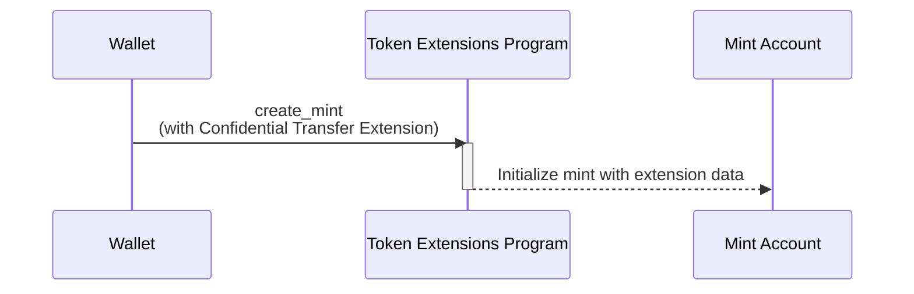

## Confidential Transfer拡張機能を使用したmint accountの作成方法

Confidential Transfer拡張機能は、mint
accountに追加の状態を加えることで、プライベートなトークン転送を可能にします。このセクションでは、この拡張機能を有効にしたトークンmintの作成方法について説明します。

以下の図は、Confidential
Transfer拡張機能を使用したmintの作成に関わるステップを示しています：



### Confidential Transfer Mintの状態

この拡張機能は、mint accountに
[ConfidentialTransferMint](https://github.com/solana-program/token-2022/blob/efd0c957fefbd79882d77df5fb2dac88c001249c/program/src/extension/confidential_transfer/mod.rs#L48-L69)
状態を追加します：

```rust title="Confidential Mint State"
#[repr(C)]
#[derive(Clone, Copy, Debug, Default, PartialEq, Pod, Zeroable)]
pub struct ConfidentialTransferMint {
    /// Authority to modify the `ConfidentialTransferMint` configuration and to
    /// approve new accounts (if `auto_approve_new_accounts` is true)
    ///
    /// The legacy Token Multisig account is not supported as the authority
    pub authority: OptionalNonZeroPubkey,

    /// Indicate if newly configured accounts must be approved by the
    /// `authority` before they may be used by the user.
    ///
    /// * If `true`, no approval is required and new accounts may be used
    ///   immediately
    /// * If `false`, the authority must approve newly configured accounts (see
    ///   `ConfidentialTransferInstruction::ConfigureAccount`)
    pub auto_approve_new_accounts: PodBool,

    /// Authority to decode any transfer amount in a confidential transfer.
    pub auditor_elgamal_pubkey: OptionalNonZeroElGamalPubkey,
}
```

_rs`ConfidentialTransferMint`_ には3つの設定フィールドが含まれています：

- **authority**：auto-approvalが無効になっている場合に、mintのConfidential
  Transfer設定を変更し、新しいconfidentialアカウントを承認する権限を持つアカウント。

- **auto_approve_new_accounts**：trueに設定すると、ユーザーはデフォルトでConfidential
  Transferが有効なtoken
  accountを作成できます。falseの場合、authorityはConfidential
  Transferに使用される前に各新しいtoken accountを承認する必要があります。

- **auditor_elgamal_pubkey**：Confidential
  Transactionにおける転送金額を復号できるオプションの監査人。一般公開からプライバシーを維持しつつ、コンプライアンスの仕組みを提供します。

### 必要なinstructions

Confidential
Transferを有効にしたmintの作成には、1つのトランザクションに3つのinstructionsが必要です：

1. **Mint Accountの作成**：System Programの _rs`CreateAccount`_
   instructionを呼び出して、mint accountを作成します。

2. **Confidential Transfer拡張機能の初期化**：Token Extensions Programの
   [ConfidentialTransferInstruction::InitializeMint](https://github.com/solana-program/token-2022/blob/efd0c957fefbd79882d77df5fb2dac88c001249c/program/src/extension/confidential_transfer/processor.rs#L48)
   instructionを呼び出して、mintの _rs`ConfidentialTransferMint`_
   状態を設定します。

3. **Mintの初期化**：Token Extensions Programの
   _rs`Instruction::InitializeMint`_
   instructionを呼び出して、標準のmint状態を初期化します。

これらのinstructionsを手動で記述することも可能ですが、`spl_token_client`
クレートは、以下の例に示すように、1つの関数呼び出しで3つのinstructionsすべてを含むトランザクションをビルドして送信する`create_mint`
メソッドを提供しています。

## コード例

以下のコードは、Confidential
Transfer拡張機能を使用してミントを作成する方法を示しています。

Confidential Transferは、ZK ElGamal
Proofプログラムに依存しており、メインネットとdevnetで有効になっています。標準的な`solana-test-validator`ではこれが有効になっていませんが、[Surfpool](https://surfpool.run)のようなメインネットフォーキング対応のローカルvalidatorでは有効です。資金が充填されたpayerを使用して、いずれかの環境（コードはdevnetを使用）でサンプルを実行し、プレースホルダーのミントアドレスとアカウントアドレスをご自身のものに置き換えてください。

### Rust

<CodeTabs>

```rust !! title="main.rs"
// !collapse(1:18) collapsed
// Imports: dependencies used by this example.
use anyhow::{Context, Result};
use solana_client::rpc_client::RpcClient;
use solana_commitment_config::CommitmentConfig;
use solana_keypair::Keypair;
use solana_signer::Signer;
use solana_system_interface::instruction as system_instruction;
use solana_transaction::Transaction;
use solana_zk_sdk::encryption::elgamal::ElGamalKeypair;
use solana_zk_sdk_pod::encryption::elgamal::PodElGamalPubkey;
use spl_token_2022::{
    extension::{
        confidential_transfer::instruction::initialize_mint as initialize_confidential_transfer_mint,
        ExtensionType,
    },
    instruction::initialize_mint as initialize_mint_base,
    state::Mint,
};

fn main() -> Result<()> {
    let rpc_client = RpcClient::new_with_commitment(
        String::from("https://api.devnet.solana.com"),
        CommitmentConfig::confirmed(),
    );

    let payer = load_keypair()?;
    let mint = Keypair::new();
    let decimals: u8 = 2;

    // Allocate space for a mint that carries the ConfidentialTransferMint
    // extension, then fund it for rent exemption.
    let space =
        ExtensionType::try_calculate_account_len::<Mint>(&[ExtensionType::ConfidentialTransferMint])?;
    let rent = rpc_client.get_minimum_balance_for_rent_exemption(space)?;

    // The auditor ElGamal key lets the issuer decrypt transfer amounts for
    // compliance. Persist this key. Pass `None` to create a mint with no auditor.
    let auditor = ElGamalKeypair::new_rand();
    let auditor_pubkey: PodElGamalPubkey = (*auditor.pubkey()).into();

    let create_account_ix = system_instruction::create_account(
        &payer.pubkey(),
        &mint.pubkey(),
        rent,
        space as u64,
        &spl_token_2022::id(),
    );

    // The confidential-transfer extension must be initialized before the base
    // mint and cannot be added later.
    let init_confidential_ix = initialize_confidential_transfer_mint(
        &spl_token_2022::id(),
        &mint.pubkey(),
        Some(payer.pubkey()), // authority that can update confidential settings
        true,                 // auto-approve new accounts
        Some(auditor_pubkey),
    )?;

    let init_mint_ix = initialize_mint_base(
        &spl_token_2022::id(),
        &mint.pubkey(),
        &payer.pubkey(), // mint authority
        None,            // freeze authority
        decimals,
    )?;

    let blockhash = rpc_client.get_latest_blockhash()?;
    let transaction = Transaction::new_signed_with_payer(
        &[create_account_ix, init_confidential_ix, init_mint_ix],
        Some(&payer.pubkey()),
        &[&payer, &mint],
        blockhash,
    );
    let signature = rpc_client.send_and_confirm_transaction(&transaction)?;
    println!("Created confidential mint {}: {signature}", mint.pubkey());
    Ok(())
}

fn load_keypair() -> Result<Keypair> {
    let keypair_path = dirs::home_dir()
        .context("could not find home directory")?
        .join(".config/solana/id.json");
    let bytes: Vec<u8> = serde_json::from_reader(std::fs::File::open(keypair_path)?)?;
    let mut secret = [0u8; 32];
    secret.copy_from_slice(&bytes[0..32]);
    Ok(Keypair::new_from_array(secret))
}
```

```toml !! title="Cargo.toml"
[package]
name = "confidential-mint"
version = "0.1.0"
edition = "2021"

# spl-token-2022 11 requires solana-system-interface 3.2 (which needs
# solana-instruction >= 3.4). The stable solana-client 4.0.0 caps it lower, so
# pin the 4.0.0-rc.0 line and use the granular solana crates instead of the
# solana-sdk umbrella. This collapses back to solana-sdk once a stable
# solana-client that allows solana-instruction 3.4 ships.
[dependencies]
solana-client = "4.0.0-rc.0"
solana-pubkey = "4.2"
solana-keypair = "3.1"
solana-signer = "3.0"
solana-transaction = "3.1"
solana-commitment-config = "3.1.1"
solana-system-interface = { version = "3.2.0", features = ["bincode"] }
solana-zk-sdk = "7.0.1"
solana-zk-sdk-pod = "0.1.2"
spl-token-2022 = { version = "11.0.0", features = ["zk-ops"] }

anyhow = "1.0"
dirs = "6.0.0"
serde_json = "1.0"
```

</CodeTabs>

### Typescript

<CodeTabs>

```ts !! title="index.ts"
// !collapse(1:8) collapsed
// Imports: dependencies used by this example.
import { getCreateMintInstructionPlan } from "@solana-program/token-2022";
import { deriveElGamalKeypairForOwnerMint } from "@solana-program/token-2022/confidential";
import { createClient, generateKeyPairSigner, some } from "@solana/kit";
import { solanaRpc } from "@solana/kit-plugin-rpc";
import { signerFromFile } from "@solana/kit-plugin-signer";
import { homedir } from "node:os";
import { join } from "node:path";

const client = await createClient()
  .use(signerFromFile(join(homedir(), ".config/solana/id.json")))
  .use(
    solanaRpc({
      rpcUrl: "https://api.devnet.solana.com"
    })
  );
const payer = client.payer;

const mint = await generateKeyPairSigner();

// The auditor ElGamal key lets the issuer decrypt transfer amounts for
// compliance. Persist it; omit `auditorElgamalPubkey` to create a mint with no
// auditor.
const auditor = await deriveElGamalKeypairForOwnerMint({
  signer: payer,
  owner: payer.address,
  mint: mint.address
});

const plan = getCreateMintInstructionPlan({
  payer,
  newMint: mint,
  decimals: 2,
  mintAuthority: payer,
  extensions: [
    {
      __kind: "ConfidentialTransferMint",
      authority: some(payer.address),
      autoApproveNewAccounts: true,
      auditorElgamalPubkey: some(auditor.elgamalPubkey)
    }
  ]
});

const result = await client.sendTransaction(plan);

console.log(
  `Created confidential mint ${mint.address}: ${result.context.signature}`
);
```

```json !! title="package.json"
{
  "name": "confidential-mint",
  "version": "0.1.0",
  "type": "module",
  "dependencies": {
    "@solana-program/system": "^0.12.2",
    "@solana-program/token-2022": "^0.12.0",
    "@solana/kit": "^6.10.0",
    "@solana/kit-plugin-rpc": "^0.11.1",
    "@solana/kit-plugin-signer": "^0.10.0",
    "@solana/zk-sdk": "^0.4.2"
  },
  "devDependencies": {
    "@types/node": "^24.10.0",
    "typescript": "^5.8.3"
  }
}
```

</CodeTabs>
