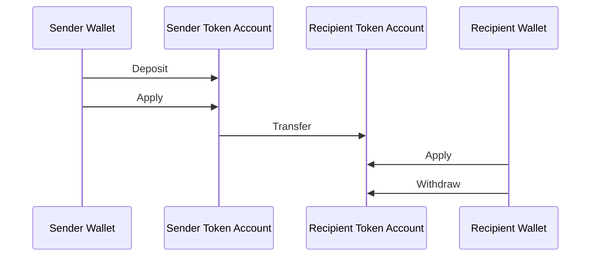
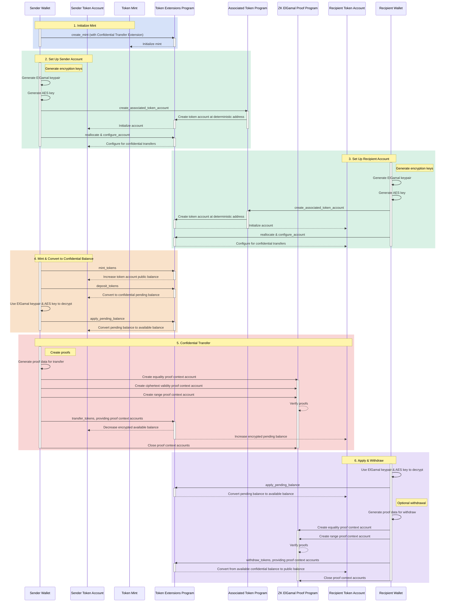

## コンフィデンシャル転送とは何ですか？

<Embed url="https://youtu.be/Bqs95tFcRIU" />

コンフィデンシャル転送を使用すると、転送金額を公開せずにtoken
accounts间でトークンを転送できます。これはプライバシーを保護するトランザクションに役立ちます。非公開となるのは転送金額とトークン残高のみです。token
accountのアドレスは引き続き公開されます。

- [プロトコル概要](https://www.solana-program.com/docs/confidential-balances/overview) - 基盤となる暗号プロトコルの詳細
- [クイックスタートガイド](https://www.solana-program.com/docs/confidential-balances#setup) - セットアップおよび基本的なCLIコマンド
- [Confidential Balances Cookbook](https://github.com/solana-developers/Confidential-Balances-Sample) -
  Confidential Transfer拡張機能の使用方法に関するコードスニペット

### どのように機能しますか？

Confidential Transfer拡張機能は、Token Extensions
Programに[instructions](https://github.com/solana-program/token-2022/blob/efd0c957fefbd79882d77df5fb2dac88c001249c/program/src/extension/confidential_transfer/instruction.rs#L29)を追加し、転送金額を公開せずにアカウント間でトークンを転送できるようにします。

コンフィデンシャルトークン転送の基本的な流れは次のとおりです：

1. Confidential Transfer拡張機能を持つmint accountを作成する。
2. 送信者と受信者用にConfidential Transfer拡張機能を持つtoken
   accountsを作成する。
3. 送信者のアカウントにトークンをミントする。
4. 送信者の公開残高を**コンフィデンシャル保留残高**に**デポジット**する。
5. 送信者の保留残高を**コンフィデンシャル利用可能残高**に**適用**する。
6. 送信者のtoken accountから受信者のtoken
   accountへトークンをコンフィデンシャルに**転送**する。
7. 受信者の保留残高を**コンフィデンシャル利用可能残高**に**適用**する。
8. 受信者のコンフィデンシャル利用可能残高を**公開残高**に**引き出す**。

コンフィデンシャル転送フローの各ステップの詳細については、対応するページを参照してください：

<Cards>
  <Card
    title="Mint Accountの作成"
    href="/docs/tokens/extensions/confidential-transfer/create-mint"
  >
    Confidential Transfer拡張機能を持つmint accountの作成方法
  </Card>
  <Card
    title="Token Accountの作成"
    href="/docs/tokens/extensions/confidential-transfer/create-token-account"
  >
    Confidential Transfer拡張機能を持つtoken accountの設定方法
  </Card>
  <Card
    title="トークンのデポジット"
    href="/docs/tokens/extensions/confidential-transfer/deposit-tokens"
  >
    コンフィデンシャル保留残高へのトークンのデポジット方法
  </Card>
  <Card
    title="保留残高の適用"
    href="/docs/tokens/extensions/confidential-transfer/apply-pending-balance"
  >
    保留残高をコンフィデンシャル利用可能残高に適用する方法
  </Card>
  <Card
    title="トークンの引き出し"
    href="/docs/tokens/extensions/confidential-transfer/withdraw-tokens"
  >
    コンフィデンシャル利用可能残高からのトークンの引き出し方法
  </Card>
  <Card
    title="トークンの転送"
    href="/docs/tokens/extensions/confidential-transfer/transfer-tokens"
  >
    token accounts間でのトークンのコンフィデンシャル転送方法
  </Card>
  <Card
    title="インテグレーションガイド"
    href="/docs/tokens/extensions/confidential-transfer/integration-guide"
  >
    ウォレット、エクスプローラー、取引所がコンフィデンシャル転送トークンをサポートする方法
  </Card>
  <Card
    title="発行者ガイド"
    href="/docs/tokens/extensions/confidential-transfer/issuer-guide"
  >
    コンフィデンシャル転送トークンの発行および運用方法（承認ポリシー、監査人、手数料、ミントおよびバーン）
  </Card>
</Cards>

以下の図は、機密トークン転送の基本フローの詳細なシーケンスを示しています：

## 機密転送 instructions

Confidential
Transfer拡張機能の[instructions](https://github.com/solana-program/token-2022/blob/efd0c957fefbd79882d77df5fb2dac88c001249c/program/src/extension/confidential_transfer/instruction.rs#L29)の完全なリストは以下の通りです：

| Instruction                         | 説明                                                                                                                                                         |
| ----------------------------------- | ------------------------------------------------------------------------------------------------------------------------------------------------------------ |
| _rs`InitializeMint`_                | 機密転送のためのmint accountを設定します。このinstructionは _rs`TokenInstruction::InitializeMint`_ instructionと同じトランザクションに含める必要があります。 |
| _rs`UpdateMint`_                    | mint accountの機密転送設定を更新します。                                                                                                                     |
| _rs`ConfigureAccount`_              | token accountを機密転送用に設定します。                                                                                                                      |
| _rs`ApproveAccount`_                | mintが新しいtoken accountの承認を要求する場合、token accountを機密転送用に承認します。                                                                       |
| _rs`EmptyAccount`_                  | token accountをクローズできるよう、保留中および利用可能な機密残高を空にします。                                                                              |
| _rs`Deposit`_                       | 公開トークン残高を保留中の機密残高に変換します。                                                                                                             |
| _rs`Withdraw`_                      | 利用可能な機密残高を公開残高に戻します。                                                                                                                     |
| _rs`Transfer`_                      | token account間で機密的にトークンを転送します。                                                                                                              |
| _rs`ApplyPendingBalance`_           | デポジットまたは転送後に、保留中の残高を利用可能な残高に変換します。                                                                                         |
| _rs`EnableConfidentialCredits`_     | token accountが機密トークン転送を受け取れるようにします。                                                                                                    |
| _rs`DisableConfidentialCredits`_    | 公開転送は許可しながら、受信側の機密転送をブロックします。                                                                                                   |
| _rs`EnableNonConfidentialCredits`_  | token accountが公開トークン転送を受け取れるようにします。                                                                                                    |
| _rs`DisableNonConfidentialCredits`_ | 通常の転送をブロックし、アカウントが機密転送のみを受け取るようにします。                                                                                     |
| _rs`TransferWithFee`_               | 手数料付きでtoken account間で機密的にトークンを転送します。                                                                                                  |
| _rs`ConfigureAccountWithRegistry`_  | _rs`VerifyPubkeyValidity`_ proofの代わりに _rs`ElGamalRegistry`_ アカウントを使用して、機密転送用のtoken accountを設定する別の方法です。                     |
