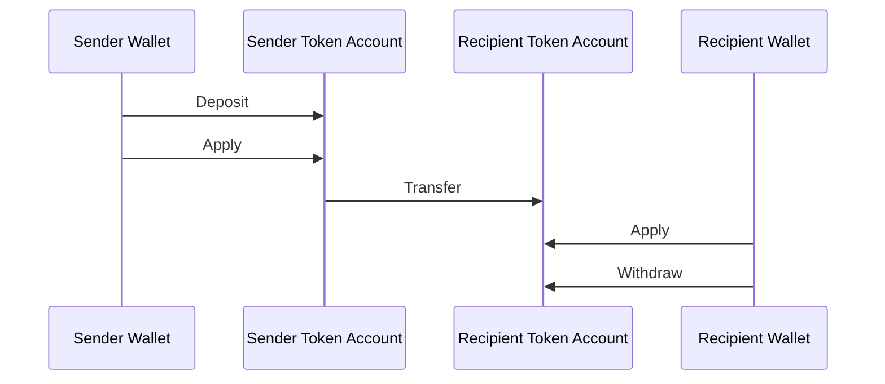
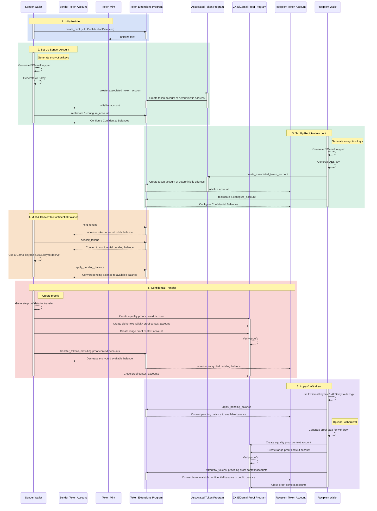

## Confidential Balancesとは？

<Embed url="https://youtu.be/Bqs95tFcRIU" />

Confidential BalancesはToken-2022の拡張機能で、転送金額を公開せずにtoken account間でトークンを転送できます。これはプライバシーを保護するトランザクションに役立ちます。非公開になるのは転送金額とトークン残高のみです。token accountのアドレスは公開されたままです。

- [プロトコル概要](https://www.solana-program.com/docs/confidential-balances/overview) - 基盤となる暗号プロトコルの詳細
- [クイックスタートガイド](https://www.solana-program.com/docs/confidential-balances#setup) - セットアップおよび基本的なCLIコマンド
- [Confidential Balances Cookbook](https://github.com/solana-developers/Confidential-Balances-Sample) -
  Confidential Balancesの使用方法を示すコードスニペット

### どのように機能しますか？

Confidential Balances拡張機能は、Token Extension programに
[instructions](https://github.com/solana-program/token-2022/blob/efd0c957fefbd79882d77df5fb2dac88c001249c/program/src/extension/confidential_transfer/instruction.rs#L29)
を追加し、転送金額を公開せずにアカウント間でトークンを転送できるようにします。

```mermaid title="Confidential Balances Basic Overview"
    sequenceDiagram

    participant A as Sender Wallet
    participant AA as Sender Token Account
    participant BB as Recipient Token Account
    participant B as Recipient Wallet

    A->>AA: Deposit
    A->>AA: Apply

    AA->>BB: Transfer
    B->>BB: Apply

    B->>BB: Withdraw

```

コンフィデンシャルトークン転送の基本的な流れは次のとおりです：

1. Confidential Balancesを有効にしたmint accountを作成します。
2. 送信者と受信者向けにConfidential Balancesを有効にしたtoken accountを作成します。
3. 送信者のアカウントにトークンをミントする。
4. 送信者の公開残高を**コンフィデンシャル保留残高**に**デポジット**する。
5. 送信者の保留残高を**コンフィデンシャル利用可能残高**に**適用**する。
6. 送信者のtoken accountから受信者のtoken
   accountへトークンをコンフィデンシャルに**転送**する。
7. 受信者の保留残高を**コンフィデンシャル利用可能残高**に**適用**する。
8. 受信者のコンフィデンシャル利用可能残高を**公開残高**に**引き出す**。

### 監査者キー

Confidential Balancesのmintには、オプションのグローバル監査者ElGamal公開鍵を保存できます。設定されている場合、すべての機密転送には送信者、受信者、および監査者向けに暗号化された金額が含まれます。転送プルーフは、3つの暗号文がすべて同じ金額を含んでいることを検証します。一般の人々は金額を読み取ることができませんが、監査者の秘密鍵を保持している人は、そのmintの転送金額を復号化できます。

Confidential Balancesの権限は、拡張機能の初期化時に監査者キーを設定するか、後から _rs`UpdateMint`_ を使用して変更します。権限はキーのローテーションまたは削除が可能です。ローテーションは将来の転送にのみ適用されるため、過去の監査アクセスが必要な場合は以前の秘密鍵を保持してください。監査者キーは読み取りアクセスを提供するものであり、トークン転送の承認やアカウントの完全な機密残高の公開は行いません。

セットアップとローテーションの例については、
[監査者の設定](/docs/tokens/extensions/confidential-transfer/issuer-guide#configure-an-auditor)
を参照してください。
ウォレット、エクスプローラー、取引所、およびコンプライアンスプロバイダーは、
[監査者統合ガイダンス](/docs/tokens/extensions/confidential-transfer/integration-guide#auditors-and-compliance)
も確認してください。

コンフィデンシャル転送フローの各ステップの詳細については、対応するページを参照してください：

<Cards>
  <Card
    title="Mint Accountの作成"
    href="/docs/tokens/extensions/confidential-transfer/create-mint"
  >
    Confidential Balancesを有効にしたmint accountの作成方法
  </Card>
  <Card
    title="Token Accountの作成"
    href="/docs/tokens/extensions/confidential-transfer/create-token-account"
  >
    Confidential Balancesを有効にしたtoken accountの設定方法
  </Card>
  <Card
    title="トークンのデポジット"
    href="/docs/tokens/extensions/confidential-transfer/deposit-tokens"
  >
    コンフィデンシャル保留残高へのトークンのデポジット方法
  </Card>
  <Card
    title="保留残高の適用"
    href="/docs/tokens/extensions/confidential-transfer/apply-pending-balance"
  >
    保留残高をコンフィデンシャル利用可能残高に適用する方法
  </Card>
  <Card
    title="トークンの引き出し"
    href="/docs/tokens/extensions/confidential-transfer/withdraw-tokens"
  >
    コンフィデンシャル利用可能残高からのトークンの引き出し方法
  </Card>
  <Card
    title="トークンの転送"
    href="/docs/tokens/extensions/confidential-transfer/transfer-tokens"
  >
    token accounts間でのトークンのコンフィデンシャル転送方法
  </Card>
  <Card
    title="インテグレーションガイド"
    href="/docs/tokens/extensions/confidential-transfer/integration-guide"
  >
    ウォレット、エクスプローラー、取引所がConfidential Balancesトークンをサポートする方法
  </Card>
  <Card
    title="発行者ガイド"
    href="/docs/tokens/extensions/confidential-transfer/issuer-guide"
  >
    Confidential Balancesトークンの発行と運用方法（承認ポリシー、監査者、手数料、mintおよびバーン）
  </Card>
</Cards>

以下の図は、機密トークン転送の基本フローの詳細なシーケンスを示しています：

```mermaid title="Confidential Balances Detailed Overview"
sequenceDiagram
    participant Sender as Sender Wallet
    participant SenderAccount as Sender Token Account
    participant Mint as Token Mint
    participant Token22 as Token Extensions Program
    participant ATAProgram as Associated Token Program
    participant ElGamal as ZK ElGamal Proof Program
    participant RecipientAccount as Recipient Token Account
    participant Recipient as Recipient Wallet

    rect rgba(120, 160, 235, 0.3)
    Note over Sender,Mint: 1. Initialize Mint

    activate Sender
    Sender->>Token22: create_mint (with Confidential Balances)
    activate Token22
    Token22-->>Mint: Initialize mint
    deactivate Token22
    deactivate Sender
    end

    rect rgba(130, 210, 170, 0.3)
    Note over Sender,SenderAccount: 2. Set Up Sender Account

    activate Sender
    Note right of Sender: Generate encryption keys
    Sender->>Sender: Generate ElGamal keypair
    Sender->>Sender: Generate AES key

    Sender->>ATAProgram: create_associated_token_account
    activate ATAProgram
    ATAProgram->>Token22: Create token account at deterministic address
    activate Token22
    Token22-->>SenderAccount: Initialize account
    deactivate Token22
    deactivate ATAProgram

    Sender->>Token22: reallocate & configure_account
    activate Token22
    Token22-->>SenderAccount: Configure Confidential Balances
    deactivate Token22
    deactivate Sender
    end

    rect rgba(130, 210, 170, 0.3)
    Note over Recipient,RecipientAccount: 3. Set Up Recipient Account

    activate Recipient
    Note right of Recipient: Generate encryption keys
    Recipient->>Recipient: Generate ElGamal keypair
    Recipient->>Recipient: Generate AES key

    Recipient->>ATAProgram: create_associated_token_account
    activate ATAProgram
    ATAProgram->>Token22: Create token account at deterministic address
    activate Token22
    Token22-->>RecipientAccount: Initialize account
    deactivate Token22
    deactivate ATAProgram

    Recipient->>Token22: reallocate & configure_account
    activate Token22
    Token22-->>RecipientAccount: Configure Confidential Balances
    deactivate Token22
    deactivate Recipient
    end

    rect rgba(235, 160, 80, 0.3)
    Note over Sender,SenderAccount: 4. Mint & Convert to Confidential Balance

    activate Sender
    Sender->>Token22: mint_tokens
    activate Token22
    Token22-->>SenderAccount: Increase token account public balance
    deactivate Token22

    Sender->>Token22: deposit_tokens
    activate Token22
    Token22-->>SenderAccount: Convert to confidential pending balance
    deactivate Token22

    Sender->>Sender: Use ElGamal keypair & AES key to decrypt
    Sender->>Token22: apply_pending_balance
    activate Token22
    Token22-->>SenderAccount: Convert pending balance to available balance
    deactivate Token22
    deactivate Sender
    end

    rect rgba(235, 120, 120, 0.3)
    Note over Sender,RecipientAccount: 5. Confidential Transfer

    activate Sender
    Note right of Sender: Create proofs
    Sender->>Sender: Generate proof data for transfer

    Sender->>ElGamal: Create equality proof context account
    activate ElGamal
    Sender->>ElGamal: Create ciphertext validity proof context account
    Sender->>ElGamal: Create range proof context account
    ElGamal-->>ElGamal: Verify proofs

    Sender->>Token22: transfer_tokens, providing proof context accounts
    activate Token22
    Token22-->>SenderAccount: Decrease encrypted available balance
    Token22-->>RecipientAccount: Increase encrypted pending balance
    deactivate Token22

    Sender->>ElGamal: Close proof context accounts
    deactivate ElGamal
    deactivate Sender
    end

    rect rgba(180, 150, 235, 0.3)
    Note over Recipient,RecipientAccount: 6. Apply & Withdraw

    activate Recipient
    Recipient->>Recipient: Use ElGamal keypair & AES key to decrypt
    Recipient->>Token22: apply_pending_balance
    activate Token22
    Token22-->>RecipientAccount: Convert pending balance to available balance
    deactivate Token22

    Note right of Recipient: Optional withdrawal
    Recipient->>Recipient: Generate proof data for withdraw

    Recipient->>ElGamal: Create equality proof context account
    activate ElGamal
    Recipient->>ElGamal: Create range proof context account
    ElGamal-->>ElGamal: Verify proofs

    Recipient->>Token22: withdraw_tokens, providing proof context accounts
    activate Token22
    Token22-->>RecipientAccount: Convert from available confidential balance to public balance
    deactivate Token22

    Recipient->>ElGamal: Close proof context accounts
    deactivate ElGamal
    deactivate Recipient
    end
```

## Confidential Balances Instructions

Confidential Balances拡張機能の
[instructions](https://github.com/solana-program/token-2022/blob/efd0c957fefbd79882d77df5fb2dac88c001249c/program/src/extension/confidential_transfer/instruction.rs#L29)
の完全なリストは以下のとおりです：

| Instruction                         | 説明                                                                                                                                                       |
| ----------------------------------- | ----------------------------------------------------------------------------------------------------------------------------------------------------------------- |
| _rs`InitializeMint`_                | mint accountでConfidential Balancesを有効にします。このinstructionは _rs`TokenInstruction::InitializeMint`_ instructionと同じトランザクションに含める必要があります。 |
| _rs`UpdateMint`_                    | mintのアカウント承認ポリシーおよびオプションのグローバル監査者ElGamal公開鍵を更新します。                                                                        |
| _rs`ConfigureAccount`_              | token accountでConfidential Balancesを有効にします。                                                                                                                 |
| _rs`ApproveAccount`_                | mintが新しいtoken accountの承認を必要とする場合、Confidential Balances向けにtoken accountを承認します。                                                          |
| _rs`EmptyAccount`_                  | token accountをクローズできるよう、保留中および利用可能な機密残高を空にします。                                                                         |
| _rs`Deposit`_                       | 公開トークン残高を保留中の機密残高に変換します。                                                                                                  |
| _rs`Withdraw`_                      | 利用可能な機密残高を公開残高に戻します。                                                                                                   |
| _rs`Transfer`_                      | token account間で機密的にトークンを転送します。                                                                                                           |
| _rs`ApplyPendingBalance`_           | デポジットまたは転送後に、保留中の残高を利用可能な残高に変換します。                                                                                      |
| _rs`EnableConfidentialCredits`_     | token accountが機密トークン転送を受け取れるようにします。                                                                                                   |
| _rs`DisableConfidentialCredits`_    | 公開転送は許可しながら、受信側の機密転送をブロックします。                                                                                     |
| _rs`EnableNonConfidentialCredits`_  | token accountが公開トークン転送を受け取れるようにします。                                                                                                         |
| _rs`DisableNonConfidentialCredits`_ | 通常の転送をブロックし、アカウントが機密転送のみを受け取るようにします。                                                                                     |
| _rs`TransferWithFee`_               | 手数料付きでtoken account間で機密的にトークンを転送します。                                                                                                |
| _rs`ConfigureAccountWithRegistry`_  | _rs`VerifyPubkeyValidity`_ プルーフの代わりに _rs`ElGamalRegistry`_ アカウントを使用して、Confidential Balances向けにtoken accountを設定する代替方法。         |
