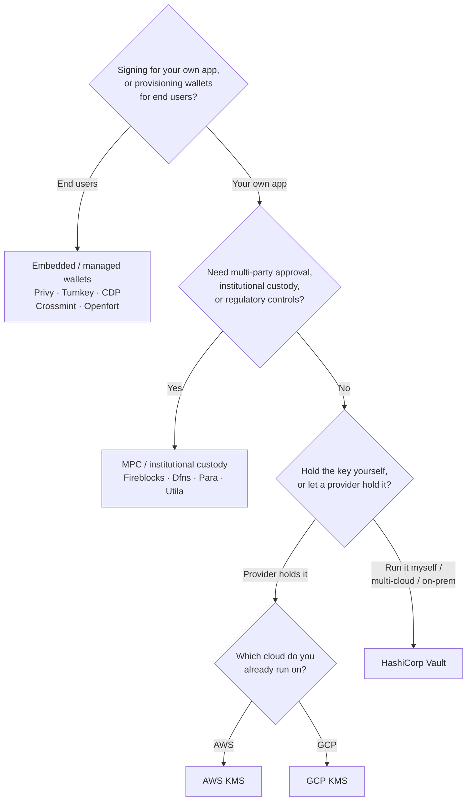

Keychainはすべてのバックエンドにわたって単一の `SolanaSigner`
インターフェースを公開しているため、選択はアーキテクチャ上の問題ではなく運用上の問題です — 後から設定を変更することも可能です。そのため、**製品から考えるのではなく、要件から考えることが重要です。**
主に2つの問いで方針が決まります:
_秘密鍵はどこに保管されるのか、そして誰がその鍵を使った署名を承認できるのか？_

最適なバックエンドというものは存在しません。それぞれのバックエンドは、特定の制約条件 — すでに利用しているクラウド環境、鍵インフラを自分で運用するかどうか、必要なカストディおよび承認制御の内容 — に最も適した選択肢です。以下のフローでは、それらの制約条件をバックエンドに対応付けています。

<Callout type="info">
  このガイドはバックエンド（サーバーサイド）署名について説明しています。エンドユーザーがブラウザで自分自身のトランザクションに署名する場合は、Wallet
  Standardを通じてウォレットを使用してください —
  [本番環境での署名](/docs/core/transactions/signing-in-production)をご参照ください。
</Callout>

## 選択フロー

<Callout type="info">
  ローカル開発とテストにはこれらは不要です —
  プロトタイピングには**Memory**バックエンドを使用し、その後は設定を通じて上記の本番バックエンドのいずれかに切り替えてください。
</Callout>

## 各質問の解説

<Steps>

<Step>

### 自社アプリケーションへの署名ですか、それともエンドユーザー向けですか？

**エンドユーザー**が所有・操作するウォレットをプロビジョニングする場合（コンシューマー向けアプリ、オンボーディングフローなど）は、**組み込み／マネージドウォレット**バックエンドを使用してください —
Privy、Turnkey、CDP、Crossmint、またはOpenfortが対象です。これらはユーザーごとのウォレットと認証をお客様に代わって管理します。

**自身のアプリケーション**として署名する場合（手数料支払者、トレジャリー、バックエンド自動化など）は、以下に進んでください。

</Step>

<Step>

### マルチパーティ承認、機関向けカストディ、または規制上のコントロールが必要ですか？

署名が生成される前に承認ポリシー、支出制限、またはコンプライアンスワークフローを通過する必要がある場合、あるいは規制対象のカストディアンによる鍵の管理が必要な場合は、**MPC／機関向けカストディ**バックエンドを使用してください：Fireblocks、Dfns、Para、またはUtila。これらは鍵を分割またはカストディし、ポリシーに従って共同署名を行います。

リクエストに応じて署名する鍵のみが必要な場合は、以下に進んでください。

</Step>

<Step>

### 鍵を自身で管理しますか、それともプロバイダーに管理を委ねますか？

クラウドプロバイダーがハードウェアに裏付けられたインフラで鍵を管理し、IAMポリシーで署名権限を制御する場合は、そのクラウドのKMSを使用してください：

- **AWSで実行中** → AWS KMS
- **GCPで実行中** → GCP KMS

鍵インフラを自身で運用したい場合、またはマルチクラウド環境やオンプレミス環境の場合は、**HashiCorp
Vault**を使用してください。運用と監査はご自身で行い、鍵はTransitエンジン内に保持されリクエストに応じて署名します。

</Step>

</Steps>

## カストディモデル

バックエンドは5つのカストディモデルに分類されます。上記のフローにより、いずれかのモデルに該当します。

- **セルフカストディ（インプロセス）**
  — アプリケーションが生の秘密鍵を保持します。開発時には便利ですが、本番環境には適していません。バックエンド：**Memory**。
- **セルフホスト型鍵管理**
  — 鍵インフラを自身で運用し、鍵はその内部に保持されリクエストに応じて署名します。バックエンド：**HashiCorp
  Vault**。
- **クラウドKMS／HSM**
  — クラウドプロバイダーがハードウェアに裏付けられたインフラで鍵を保管し、鍵はサービス外に出ることなく、IAMポリシーで署名権限を制御します。バックエンド：**AWS
  KMS**、**GCP KMS**。
- **MPC・機関向けカストディ**
  — 鍵はプロバイダー間で分割またはカストディされ、ポリシー（承認、制限）に従って共同署名が行われます。バックエンド：**Fireblocks**、**Dfns**、**Para**、**Utila**。
- **エンベデッド・マネージドウォレット**
  — プロバイダーがウォレットを代理管理します。エンドユーザーのオンボーディングに多く利用されます。バックエンド：**Privy**、**Turnkey**、**CDP**、**Crossmint**、**Openfort**。

## バックエンド比較

| バックエンド    | カストディモデル               | 最適な用途                                                       | 備考                                                                       |
| --------------- | ------------------------------ | ---------------------------------------------------------------- | -------------------------------------------------------------------------- |
| Memory          | セルフカストディ（プロセス内） | ローカル開発、テスト、CI                                         | プロセス内に生の鍵が存在するため、本番環境では使用しないこと               |
| HashiCorp Vault | セルフホスト型鍵管理           | 独自の鍵インフラを運用するチーム                                 | Transitエンジンを使用。運用・監査はユーザー側で実施                        |
| AWS KMS         | クラウドKMS / HSM              | AWSで稼働するバックエンド                                        | 鍵はKMSの外に出ない。IAMが署名を制御                                       |
| GCP KMS         | クラウドKMS / HSM              | GCPで稼働するバックエンド                                        | 鍵はKMSの外に出ない。IAMが署名を制御                                       |
| Fireblocks      | MPC / 機関向けカストディ       | 資金管理、取引所、規制対応カストディ                             | ポリシーエンジンと承認ワークフローを搭載                                   |
| Dfns            | MPCウォレットインフラ          | ポリシー制御付きプログラマティックウォレット                     | Ed25519署名                                                                |
| Para            | MPCウォレット                  | MPCバックアップウォレットを利用するアプリ                        | APIキー＋ウォレットID                                                      |
| Utila           | MPCカストディ＋共同署名者      | 既存のUtila管理Solanaウォレット                                  | `signMessage` 非対応。トランザクションのブロードキャストはユーザー側で実施 |
| Privy           | 組み込みウォレット             | ウォレットへのユーザーオンボーディングを行うコンシューマーアプリ | アプリ管理の組み込みウォレット                                             |
| Turnkey         | 非カストディ型鍵管理           | ポリシーゲート付きプログラマティック署名                         | 非カストディ型鍵管理                                                       |
| CDP             | 管理型ウォレット（Coinbase）   | Coinbase開発者プラットフォーム上のアプリ                         | `signMessage` はUTF-8ペイロードのみ対応                                    |
| Crossmint       | 管理型ウォレット               | マーケットプレイスおよび管理型ウォレットアプリ                   | `smart` および `mpc` ウォレット対応。`signMessage` 非対応                  |
| Openfort        | 組み込みバックエンドウォレット | サーバーサイドウォレット                                         | TEE保管キーを使用                                                          |

## エンタープライズシナリオ

単一のアプリケーションが、これらのうち複数を同時に必要とすることはよくあります。インターフェースは同一であるため、呼び出し箇所を変更することなく、ロールごとに異なるバックエンドを使用できます。

- **トレジャリー運用**
  — 運用上の「ホット」署名者と「コールド」トレジャリー署名者を分離します。トレジャリーはMPCカストディまたはクラウドHSMでバックアップし、高額署名の前に承認ポリシーを要求します。
- **承認ワークフロー** —
  MPCおよびカストディバックエンド（Fireblocks等）が署名生成前にマルチパーティ承認を強制します。
- **コンプライアンスと監査**
  — クラウドKMS（AWS/GCP）およびVaultが署名監査ログを出力し、機関投資家向けカストディアンはポリシー適用とレポート機能を追加します。
- **規制対応環境**
  — 鍵素材をHSM、KMS、または機関投資家向けカストディアンに保管し、生の鍵がアプリケーションに触れないようにします。

これらのバックエンドを安全に運用するには、[本番環境のベストプラクティス](/docs/tools/keychain/production-best-practices)を参照してください。

<Cards>
  <Card title="Rustガイド" href="/docs/tools/keychain/getting-started/rust">
    Rustで各バックエンドを設定します。
  </Card>
  <Card
    title="TypeScriptガイド"
    href="/docs/tools/keychain/getting-started/typescript"
  >
    TypeScriptで各バックエンドを設定します。
  </Card>
</Cards>
