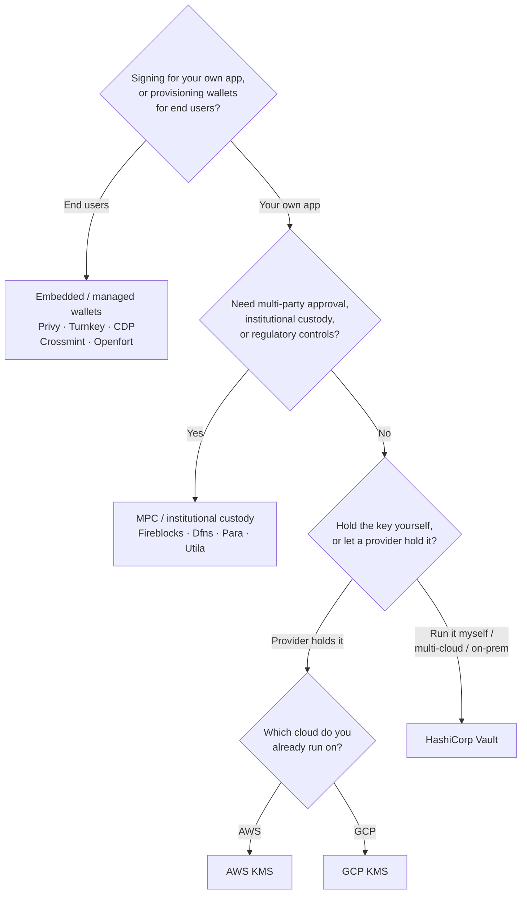

Keychainはすべてのバックエンドにわたって1つの`SolanaSigner`インターフェースを公開しているため、選択はアーキテクチャではなく運用上の問題です — 設定を通じて後から変更できます。そのため、**製品からではなく、要件から始めてください。**
主に2つの問いが決め手となります:
_秘密鍵はどこに保管されるのか、そして誰がそれを使って署名を承認できるのか？_

唯一の最善バックエンドというものは存在しません。それぞれが特定の制約に対して最適です — すでに利用しているクラウド、鍵インフラを自社運用するかどうか、そして必要なカストディと承認制御の要件。以下のフローはそれらの制約をバックエンドにマッピングします。

<Callout type="info">
  このガイドはバックエンド（サーバーサイド）の署名を対象としています。エンドユーザーがブラウザで自分のトランザクションに署名する場合は、Wallet
  Standardを通じてウォレットを使用してください —
  [本番環境での署名](/docs/core/transactions/signing-in-production)を参照してください。
</Callout>

## 判断フロー

<Callout type="info">
  ローカル開発およびテストにはこれらは不要です —
  プロトタイピングには**Memory**バックエンドを使用し、その後設定を通じて上記の本番バックエンドのいずれかに切り替えてください。
</Callout>

## 質問を順に確認する

<Steps>

<Step>

### 自社アプリケーションのために署名していますか、それともエンドユーザーのために署名していますか？

エンドユーザーが所有・操作するウォレットをプロビジョニングする場合（コンシューマー向けアプリ、オンボーディングフロー）は、**エンベデッド / マネージドウォレット**バックエンドを使用してください —
Privy、Turnkey、CDP、Crossmint、またはOpenfortです。これらはユーザーごとのウォレットと認証を代わりに管理します。

**自身のアプリケーション**として署名する場合 — 手数料支払者、トレジャリー、バックエンド自動化など — 以下に進んでください。

</Step>

<Step>

### マルチパーティ承認、機関カストディ、または規制コントロールが必要ですか？

署名が生成される前に承認ポリシー、支出制限、またはコンプライアンスワークフローをクリアする必要がある場合、あるいは鍵を保管する規制カストディアンが必要な場合は、**MPC
/ 機関カストディ**バックエンドを使用してください：Fireblocks、Dfns、Para、または Utila。これらは鍵を分割またはカストディし、ポリシーに従って共同署名します。

リクエストに応じて署名する鍵のみが必要な場合は、以下に進んでください。

</Step>

<Step>

### 鍵を自分で保持しますか？それともプロバイダーに保持させますか？

クラウドプロバイダーがハードウェアバックインフラストラクチャで鍵を保持し、IAM ポリシーによって署名者を制御する場合は、そのクラウドの KMS を使用してください：

- **AWS で実行中** → AWS KMS
- **GCP で実行中** → GCP KMS

鍵インフラストラクチャを自分で運用したい場合、またはマルチクラウド環境やオンプレミスの場合は、**HashiCorp
Vault**
を使用してください。自身で運用・監査し、鍵は Transit エンジン内に保持されてリクエストに応じて署名します。

</Step>

</Steps>

## カストディモデル

バックエンドは5つのカストディモデルに分類されます。上記のフローによっていずれかに該当します。

- **セルフカストディ（インプロセス）**
  — アプリケーションが生の秘密鍵を保持します。開発には便利ですが、本番環境には適していません。バックエンド：
  **Memory**。
- **セルフホスト型鍵管理**
  — 鍵インフラストラクチャを自身で運用し、鍵はその内部に保持されてリクエストに応じて署名します。バックエンド：**HashiCorp
  Vault**。
- **クラウド KMS / HSM**
  — クラウドプロバイダーがハードウェアバックインフラストラクチャに鍵を保存し、鍵はサービス外に出ることなく、IAM ポリシーによって署名者を制御します。バックエンド：**AWS
  KMS**、**GCP KMS**。
- **MPC & 機関カストディ**
  — 鍵はプロバイダーによって分割またはカストディされ、ポリシー（承認、制限）に従って共同署名します。バックエンド：**Fireblocks**、**Dfns**、**Para**、**Utila**。
- **埋め込み & マネージドウォレット**
  — プロバイダーがウォレットを代理管理し、多くの場合エンドユーザーのオンボーディングに使用されます。バックエンド：**Privy**、**Turnkey**、**CDP**、**Crossmint**、**Openfort**。

## バックエンド比較

| バックエンド    | カストディモデル                 | 最適な用途                                                     | 備考                                                         |
| --------------- | -------------------------------- | -------------------------------------------------------------- | ------------------------------------------------------------ |
| Memory          | セルフカストディ（プロセス内）   | ローカル開発、テスト、CI                                       | プロセス内に生の鍵が存在 — 本番環境での使用不可              |
| HashiCorp Vault | セルフホスト型鍵管理             | 独自の鍵インフラを運用するチーム                               | Transitエンジン使用；運用および監査はユーザー側で実施        |
| AWS KMS         | クラウドKMS / HSM                | AWSで稼働するバックエンド                                      | 鍵はKMS外に出ない；IAMが署名を制御                           |
| GCP KMS         | クラウドKMS / HSM                | GCPで稼働するバックエンド                                      | 鍵はKMS外に出ない；IAMが署名を制御                           |
| Fireblocks      | MPC / 機関向けカストディ         | トレジャリー、取引所、規制対応カストディ                       | ポリシーエンジンと承認ワークフロー                           |
| Dfns            | MPCウォレットインフラ            | ポリシー制御付きプログラマティックウォレット                   | Ed25519署名                                                  |
| Para            | MPCウォレット                    | MPCバックアップウォレットを求めるアプリ                        | APIキー＋ウォレットID                                        |
| Utila           | MPCカストディ＋共同署名者        | 既存のUtila管理Solanaウォレット                                | `signMessage` 非対応；txのブロードキャストはユーザー側で実施 |
| Privy           | 組み込みウォレット               | ウォレットへユーザーをオンボーディングするコンシューマーアプリ | アプリ管理の組み込みウォレット                               |
| Turnkey         | 非カストディ型鍵管理             | ポリシーゲート付きプログラマティック署名                       | 非カストディ型鍵管理                                         |
| CDP             | マネージドウォレット（Coinbase） | Coinbaseデベロッパープラットフォーム上のアプリ                 | `signMessage` はUTF-8ペイロードのみ受け付ける                |
| Crossmint       | マネージドウォレット             | マーケットプレイスおよびマネージドウォレットアプリ             | `smart` および `mpc` ウォレット；`signMessage` 非対応        |
| Openfort        | 組み込みバックエンドウォレット   | サーバーサイドウォレット                                       | TEE保管鍵                                                    |

## エンタープライズシナリオ

単一のアプリケーションが、これらのうち複数を同時に必要とするケースはよくあります。インターフェースは統一されているため、コールサイトを変更することなく、ロールごとに異なるバックエンドを実行できます。

- **トレジャリー運用**
  — 運用上の「ホット」署名者と「コールド」トレジャリー署名者を分離します。トレジャリーはMPCカストディまたはクラウドHSMでバックアップし、高額署名の前に承認ポリシーを必須とします。
- **承認ワークフロー** —
  MPCおよびカストディバックエンド（例：Fireblocks）は、署名が生成される前にマルチパーティ承認を強制します。
- **コンプライアンスと監査**
  — クラウドKMS（AWS/GCP）およびVaultは署名監査ログを出力し、機関投資家向けカストディアンはポリシー適用とレポーティングを追加します。
- **規制対応環境**
  — 鍵素材をHSM、KMS、または機関投資家向けカストディアンに保管し、生の鍵がアプリケーションに触れないようにします。

これらのバックエンドを安全に運用するには、[本番環境のベストプラクティス](/docs/tools/keychain/production-best-practices)をご参照ください。

<Cards>
  <Card title="Rustガイド" href="/docs/tools/keychain/getting-started/rust">
    Rustで各バックエンドを設定します。
  </Card>
  <Card
    title="TypeScriptガイド"
    href="/docs/tools/keychain/getting-started/typescript"
  >
    TypeScriptで各バックエンドを設定します。
  </Card>
</Cards>
