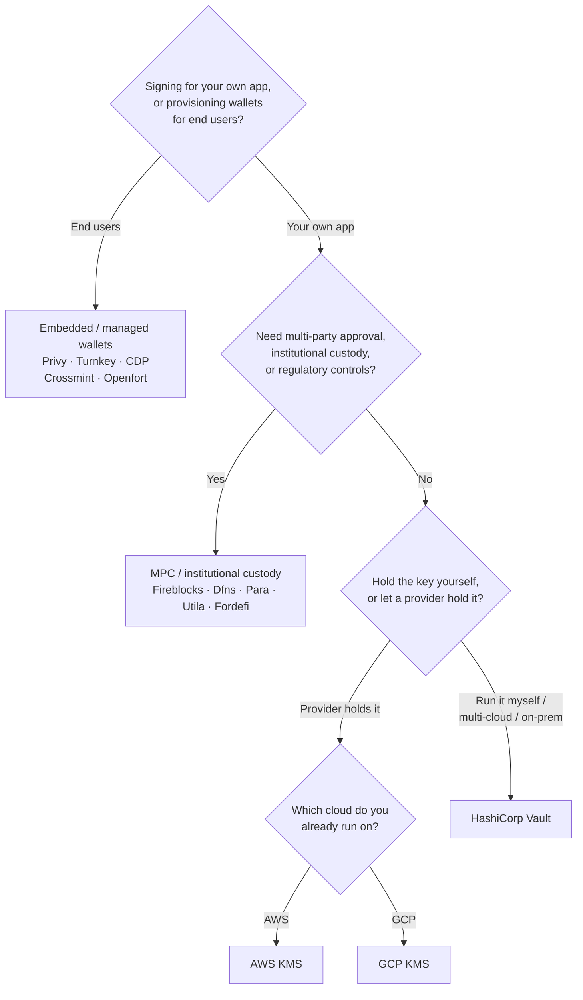

Keychainはすべてのバックエンドに共通の `SolanaSigner` ベースインターフェースを提供しているため、
ほとんどのバックエンドでは、選択はアーキテクチャ上の問題ではなく運用上の問題になります。つまり、後から
設定で変更できます。例外はトランザクションの形式です。CrossmintとFordefiのネイティブ自動モードはサーバー側で署名とブロードキャストを行い、Fordefiのネイティブ手動モードは署名前にトランザクションを書き換えるため、これらのいずれかへ移行する場合、あるいはこれらから移行する場合は、署名者の呼び出し方が変わります。そのため、**製品からではなく、要件から考え始めてください。** ほとんどの判断は次の2つの問いで決まります。_秘密鍵はどこに置かれ、その鍵による署名を誰が承認できるのか?_

Ledgerを除くすべてのバックエンドが、4つの言語(Rust、TypeScript、Python、Go)すべてで提供されています。LedgerはRust専用で、オプトインの `ledger` フィーチャーが必要です。

唯一の最適なバックエンドというものはありません。それぞれが特定の条件に適しています。すでに利用しているクラウド、鍵インフラを自分で運用したいかどうか、そして必要なカストディや承認コントロールの要件などです。以下のフローは、こうした条件をバックエンドに対応付けたものです。

<Callout type="info">
  このガイドでは、バックエンド(サーバー側)での署名を扱います。エンドユーザーがブラウザで自分のトランザクションに署名する場合は、代わりにWallet Standard経由でウォレットを使用してください。[本番環境での署名](/docs/core/transactions/signing-in-production)を参照してください。
</Callout>

## 判断フロー

```mermaid title="Choosing a Keychain backend"
flowchart TD
    Start{Signing for your own app,<br/>or provisioning wallets<br/>for end users?}
    Start -->|End users| Managed[Embedded / managed wallets<br/>Privy · Turnkey · CDP<br/>Crossmint · Openfort]
    Start -->|Your own app| Q2{Need multi-party approval,<br/>institutional custody,<br/>or regulatory controls?}
    Q2 -->|Yes| MPC[MPC / institutional custody<br/>Fireblocks · Dfns · Para · Utila · Fordefi]
    Q2 -->|No| Q3{Hold the key yourself,<br/>or let a provider hold it?}
    Q3 -->|Provider holds it| Q4{Which cloud do you<br/>already run on?}
    Q4 -->|AWS| AWS[AWS KMS]
    Q4 -->|GCP| GCP[GCP KMS]
    Q3 -->|Run it myself /<br/>multi-cloud / on-prem| Vault[HashiCorp Vault]
```

<Callout type="info">
  ローカル開発やテストでは、これらは一切必要ありません。プロトタイピングには **Memory** バックエンドを使用し、その後、設定を通じて上記の本番向けバックエンドのいずれかに切り替えてください。
</Callout>

## 質問を順に確認する

<Steps>

<Step>

### 自社アプリケーション用に署名しますか、それともエンドユーザー用ですか?

**エンドユーザー**が所有・操作するウォレットをプロビジョニングする場合(コンシューマー向けアプリ、オンボーディングフローなど)は、**エンベデッド/マネージドウォレット**バックエンドを使用します。Privy、Turnkey、CDP、Crossmint、Openfortが該当します。これらはユーザーごとのウォレットと認証をお客様に代わって管理します。

**自社アプリケーション**として署名する場合(手数料支払者、トレジャリー、バックエンドの自動化など)は、以下に進んでください。

</Step>

<Step>

### マルチパーティ承認、機関向けカストディ、または規制対応のコントロールが必要ですか?

署名の生成前に承認ポリシー、支出上限、コンプライアンスワークフローを通過する必要がある場合、または規制対象のカストディアンに鍵を保管してもらう必要がある場合は、**MPC/機関向けカストディ**バックエンドを使用します。Fireblocks、Dfns、Para、Utila、Fordefiが該当します。これらは鍵を分割または保管し、お客様のポリシーに従って共同署名を行います。

リクエストに応じて署名する鍵があれば十分な場合は、以下に進んでください。

</Step>

<Step>

### 鍵を自分で保持しますか、それともプロバイダーに保持させますか?

クラウドプロバイダーにハードウェアベースのインフラで鍵を保持させ、IAMポリシーで署名できるユーザーを制御したい場合は、そのクラウドのKMSを使用します。

- **AWSで稼働している場合** → AWS KMS
- **GCPで稼働している場合** → GCP KMS

鍵インフラを自分で運用したい場合、またはマルチクラウドやオンプレミス環境の場合は、**HashiCorp Vault** を使用します。運用と監査はお客様自身で行い、鍵はTransitエンジン内に留まり、リクエストに応じて署名します。

</Step>

</Steps>

## カストディモデル

バックエンドは6つのカストディモデルに分類されます。上記のフローで、そのいずれかに行き着きます。

- **セルフカストディ(インプロセス)**:アプリケーションが生の秘密鍵を保持します。開発には便利ですが、本番環境には適していません。バックエンド:**Memory**。
- **セルフカストディ(ハードウェアウォレット)**:鍵はLedgerデバイスの外に出ることはなく、すべての署名は担当者がデバイスの画面上で確認します。無人で稼働するサービスではなく、対話型のオペレーター署名に適しています。Rust専用、オプトインで、監査の対象外です。バックエンド:**Ledger**。
- **セルフホスト型の鍵管理**:鍵インフラを自分で運用します。鍵はその内部に留まり、リクエストに応じて署名します。バックエンド:**HashiCorp Vault**。
- **クラウドKMS/HSM**:クラウドプロバイダーがハードウェアベースのインフラに鍵を保管します。鍵がサービスの外に出ることはなく、IAMポリシーで署名できるユーザーを制御します。バックエンド:**AWS KMS**、**GCP KMS**。
- **MPCと機関向けカストディ**:鍵はプロバイダーに分割または預託され、プロバイダーがお客様のポリシー(承認、上限)に従って共同署名します。バックエンド:**Fireblocks**、**Dfns**、**Para**、**Utila**、**Fordefi**。
- **エンベデッドウォレットとマネージドウォレット**:プロバイダーがお客様に代わってウォレットを管理します。多くの場合、エンドユーザーのオンボーディングに使われます。バックエンド:**Privy**、**Turnkey**、**CDP**、**Crossmint**、**Openfort**。

## バックエンド比較

| バックエンド         | カストディモデル                  | 最適な用途                                     | 備考                                                                                                              |
| --------------- | ------------------------------ | -------------------------------------------- | ------------------------------------------------------------------------------------------------------------------ |
| Memory          | セルフカストディ（プロセス内）      | ローカル開発、テスト、CI                 | 鍵がプロセス内に存在するため、本番環境では使用しないでください                                                                       |
| Ledger          | セルフカストディ(ハードウェアウォレット) | Rustツールからの対話型オペレーター署名 | Rust専用、オプトインの `ledger` フィーチャー、未監査。すべての署名をデバイス上で確認                                 |
| HashiCorp Vault | セルフホスト型鍵管理     | 独自の鍵インフラを運用するチーム   | Transitエンジン使用；運用および監査はユーザー側で実施                                                                           |
| AWS KMS         | クラウドKMS / HSM                | AWSで稼働するバックエンド                      | 鍵はKMS外に出ない；IAMが署名を制御                                                                         |
| GCP KMS         | クラウドKMS / HSM                | GCPで稼働するバックエンド                      | 鍵はKMS外に出ない；IAMが署名を制御                                                                         |
| Fireblocks      | MPC / 機関向けカストディ    | トレジャリー、取引所、規制対応カストディ     | ポリシーエンジンと承認ワークフロー                                                                               |
| Dfns            | MPCウォレットインフラ      | ポリシー制御付きプログラマティックウォレット    | Ed25519署名                                                                                                    |
| Para            | MPCウォレット                    | MPCバックアップウォレットを求めるアプリ            | APIキー＋ウォレットID                                                                                                |
| Utila           | MPCカストディ＋共同署名者        | 既存のUtila管理Solanaウォレット        | `signMessage` 非対応；txのブロードキャストはユーザー側で実施                                                                    |
| Fordefi         | MPC / 機関向けカストディ    | ポリシーコントロールを備えた機関向けカストディ   | ブラックボックス:お客様が送信。ネイティブ自動:Fordefiが書き換えて送信。ネイティブ手動:Fordefiが書き換え、その結果をお客様が送信 |
| Privy           | 組み込みウォレット               | ウォレットへユーザーをオンボーディングするコンシューマーアプリ    | アプリ管理の組み込みウォレット                                                                                       |
| Turnkey         | 非カストディ型鍵管理   | ポリシーゲート付きプログラマティック署名           | 非カストディ型鍵管理                                                                                       |
| CDP             | マネージドウォレット（Coinbase）      | Coinbaseデベロッパープラットフォーム上のアプリ      | `signMessage` はUTF-8ペイロードのみ受け付ける                                                                          |
| Crossmint       | マネージドウォレット                | マーケットプレイスおよびマネージドウォレットアプリ         | 送信専用:サーバー側でブロードキャストし、ガススポンサーシップのために書き換える場合があります。`signMessage` は非対応                   |
| Openfort        | 組み込みバックエンドウォレット       | サーバーサイドウォレット                          | TEE保管鍵                                                                                                    |

## 機能の形式

カストディとは別に、各バックエンドにはそれぞれ1つのトランザクション形式があり、署名者の呼び出し方はそれによって決まります。

- **署名**:プロバイダーが、お客様が構築したバイト列に署名し、お客様がそれをブロードキャストします。LedgerやFordefiのブラックボックスモードを含む、ほとんどのバックエンドが該当します。
- **書き換えと署名**:プロバイダーがトランザクションを書き換えてから、ブロードキャストせずに署名します。返されたトランザクションを引き継いで処理を続けます。Fordefiのネイティブ手動モードが該当します。
- **署名とブロードキャスト**:プロバイダーがサーバー側で署名とブロードキャストを行うため、失敗したとしても何も反映されていないとは限りません。CrossmintとFordefiのネイティブ自動モードが該当します。

各言語のREADMEにあるシグナー機能テーブルに、すべてのバックエンドの形式が一覧で記載されています。各形式が何を保証するかについては、[セキュリティモデル](https://github.com/solana-foundation/solana-keychain/blob/main/docs/SECURITY_MODEL.md)で説明しています。

## エンタープライズシナリオ

1つのアプリケーションで、これらのうち複数が同時に必要になることはよくあります。インターフェースが共通であるため、バックエンド同士が同じ機能形式を持っていれば、呼び出し箇所を変更せずに、役割ごとに異なるバックエンドを使い分けられます。

- **トレジャリー運用**
  — 運用上の「ホット」署名者と「コールド」トレジャリー署名者を分離します。トレジャリーはMPCカストディまたはクラウドHSMでバックアップし、高額署名の前に承認ポリシーを必須とします。
- **承認ワークフロー** —
  MPCおよびカストディバックエンド（例：Fireblocks）は、署名が生成される前にマルチパーティ承認を強制します。
- **コンプライアンスと監査**
  — クラウドKMS（AWS/GCP）およびVaultは署名監査ログを出力し、機関投資家向けカストディアンはポリシー適用とレポーティングを追加します。
- **規制対応環境**
  — 鍵素材をHSM、KMS、または機関投資家向けカストディアンに保管し、生の鍵がアプリケーションに触れないようにします。

これらのバックエンドを安全に運用するには、[本番環境のベストプラクティス](/docs/tools/keychain/production-best-practices)をご参照ください。

<Cards>
  <Card title="Rustガイド" href="/docs/tools/keychain/getting-started/rust">
    Rustで各バックエンドを設定します。
  </Card>
  <Card
    title="TypeScriptガイド"
    href="/docs/tools/keychain/getting-started/typescript"
  >
    TypeScriptで各バックエンドを設定します。
  </Card>
</Cards>
