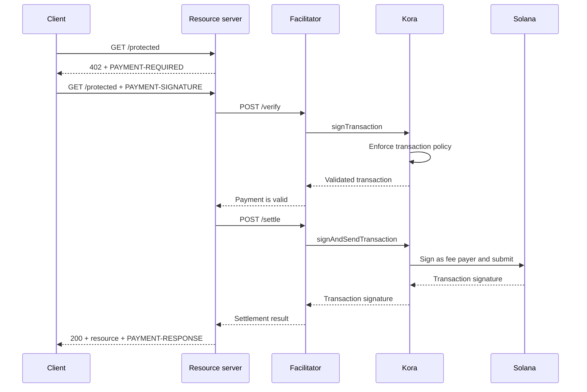

Koraは、[x402 V2ファシリテーター](/docs/tools/x402-facilitator)の背後でSolana署名、トランザクションポリシー、および手数料スポンサーシップレイヤーを提供できます。ファシリテーターはx402 HTTP APIを実装し、Koraは受け付けた支払いトランザクションの検証、署名、および送信を行います。

このガイドでは、Solana Devnet上でリファレンスKoraファシリテーターを起動します。これは統合テスト用の開発環境であり、本番デプロイメントではありません。

## アーキテクチャ



4つのアプリケーションロールは独立して機能します：

- **クライアント**は支払い要件を選択し、支払い承認に署名します。
- **リソースサーバー**はルートの料金を設定し、検証と決済が成功した場合にのみそれを履行します。
- **ファシリテーター**はx402の`/supported`、`/verify`、および`/settle`エンドポイントを公開します。
- **Kora**はポリシーで許可されたトランザクションのみに署名し、Solanaネットワーク手数料をスポンサーできます。

KoraはX402プロトコルを置き換えるものではありません。このファシリテーター実装で使用される署名およびポリシーの境界です。

## リファレンスファシリテーターの起動

Gitおよび[Docker with Compose](https://docs.docker.com/compose/)が必要です。最新の安定版Koraリリースをクローンし、x402デモに入ります：

```bash
git clone --branch v2.0.5 --depth 1 https://github.com/solana-foundation/kora.git
cd kora/examples/x402/demo
cp .env.example .env
```

`.env`の`KORA_PRIVATE_KEY`に使い捨てのDevnet keypairを設定してください。デモの署名者設定は、base58形式のシークレット、バイト配列のkeypair、またはJSON keypairファイルへのパスを受け付けます。トランザクション手数料をスポンサーできるよう、その公開アドレスにDevnet SOLを送金してください。

<Callout type="caution" title="使い捨てのDevnet署名者を使用する">
  Dockerデモは環境変数からKora署名者を読み込みます。このデモに本番用署名キーを使用したり、`.env`ファイルをコミットしたりしないでください。
</Callout>

Koraとファシリテーターを起動します：

```bash
docker compose up --build
```

初回ビルドには数分かかる場合があります。両方のヘルスチェックが通過したら、別のターミナルからファシリテーターのアドバタイズされた機能を確認してください：

```bash
curl http://127.0.0.1:3000/supported
```

レスポンスはx402バージョン`2`、`exact`スキーム、およびDevnet CAIP-2ネットワーク識別子をアドバタイズするはずです：

```json
{
  "kinds": [
    {
      "x402Version": 2,
      "scheme": "exact",
      "network": "solana:EtWTRABZaYq6iMfeYKouRu166VU2xqa1",
      "extra": {
        "feePayer": "<KORA_SIGNER_ADDRESS>"
      }
    }
  ]
}
```

Koraはデフォルトで`127.0.0.1:8080`をリッスンし、ファシリテーターは`127.0.0.1:3000`をリッスンします。`Ctrl+C`でデモを停止します。

## リソースサーバーの接続

x402リソースサーバーがローカルファシリテーターとKora署名者の公開アドレスを受信者として使用するよう設定します：

```bash
FACILITATOR_URL=http://127.0.0.1:3000
SOLANA_PAY_TO=<KORA_SIGNER_ADDRESS>
```

次に、[x402 on Solana](/docs/payments/agentic-payments/x402)に従って、ExpressルートにX402 V2ミドルウェアを追加します。未払いリクエストは`PAYMENT-REQUIRED`を受け取り、リトライには`PAYMENT-SIGNATURE`が付き、成功したレスポンスには`PAYMENT-RESPONSE`が付きます。

`X-PAYMENT`、`X-PAYMENT-RESPONSE`、または`solana-devnet`ネットワーク名を使用した例をコピーしないでください。これらのフィールドはx402 V1に属するものです。

Koraリポジトリには、同じ`examples/x402/demo`ディレクトリに保護されたAPIと支払い対応クライアントも含まれています。完全なローカルフローを検証する必要がある場合は、これらのアプリケーションを使用してください。

## Koraポリシーの設定

リファレンスの`kora/kora.toml`は意図的に制限されています。その検証ポリシーは以下を制御します：

- 署名者が許可するSolanaプログラム；
- 使用できるSPLトークンミント；
- スポンサーされる最大lamport数および署名数；
- 禁止されている手数料支払者オペレーション；および
- 拒否されるToken-2022拡張機能。

デモはファシリテーターが必要とするKora RPCメソッドのみを有効にします：`signTransaction`、`signAndSendTransaction`、`getBlockhash`、`getPayerSigner`、`getConfig`、および`getVersion`。

ポリシーを手数料支払者キーのセキュリティ境界として扱ってください。本番サービスでは：

1. x402スキームが生成するプログラム、トークンミント、およびトランザクション形式のみをアローリストに登録してください。
2. Kora署名者から価値を移動できる転送、権限変更、アカウントクローズ、およびその他のinstructionsを拒否してください。
3. 侵害されたファシリテーター認証情報による損失を制限するトランザクションおよび使用量の制限を設定してください。
4. 環境変数に保持される秘密鍵の代わりに、管理された署名者バックエンドを使用してください。

## ファシリテーターからKoraへの接続のセキュリティ確保

デモはKora APIキー認証を有効にします。ファシリテーターは`KORA_API_KEY`の値を送信し、これは`kora.toml`の`[kora.auth].api_key`と一致する必要があります。

本番環境では、さらに以下も実施してください：

- Koraをプライベートネットワーク上に置き、信頼された境界でTLSを終端してください；
- API認証情報をシークレットマネージャーに保存し、定期的にローテーションしてください；
- 改ざんおよびリプレイ保護のためにKoraのHMACリクエスト認証を検討してください；
- 会計モデルで必要な場合は、手数料支払者キーと支払い受信者キーを分離してください；および
- ポリシー拒否、決済失敗、手数料消費、および署名者残高についてアラートを設定してください。

## 支払い決済の強化

Koraはsolanaトランザクションを検証しますが、ファシリテーターとリソースサーバーは引き続きx402プロトコルの正確性を担います。リソースを提供する前に、以下を強制してください：

- 選択されたx402バージョン、スキーム、ネットワーク、アセット、金額、および受信者；
- 承認の有効期間と正確なSolana instructionレイアウト；
- アトミックなリプレイ保護とべき等な決済；
- 製品が必要とするコミットメントレベルでの確認；および
- 購入、決済結果、および履行の間の永続的なマッピング。

Koraがトランザクションへの署名を受け入れたからといって、有料コンテンツを返さないでください。ファシリテーターが決済成功の結果を返した後にのみ履行してください。

## 関連リソース

- [Koraリポジトリとx402デモ](https://github.com/solana-foundation/kora/tree/main/examples/x402/demo)
- [Koraオペレーター設定](/docs/tools/kora/operators/configuration)
- [Kora署名者バックエンド](/docs/tools/kora/operators/signers)
- [Koraセキュリティ監査](/docs/tools/kora/security-audits)
- [x402 V2仕様](https://github.com/x402-foundation/x402/blob/main/specs/x402-specification-v2.md)
- [エージェント型決済の概要](/docs/payments/agentic-payments)
