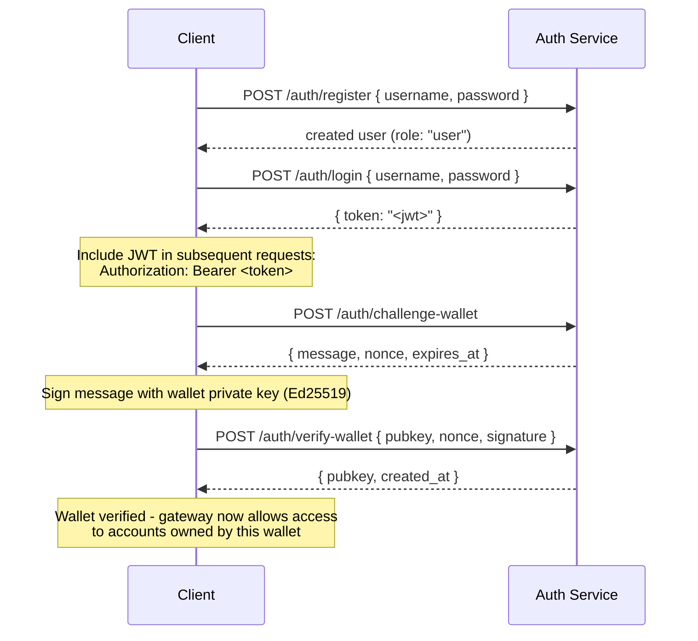

## 概要

Private Channelsには、JWT認証とロールベースアクセス制御（RBAC）でゲートウェイアクセスを管理するオプションのAuth Serviceが含まれています。認証が無効の場合、ゲートウェイはすべての接続を受け入れます。有効の場合、クライアントはすべてのリクエストで有効なJWTを提示する必要があります。

このページは以下の両方の対象者を対象としています：

- **開発者** - 登録、ログイン、ウォレット確認、および認証済みリクエストの実行
- **オペレーター** - Authサービスの有効化、`JWT_SECRET`の設定、および`operator`ロールのプロビジョニング

## 認証の有効化

認証は、ゲートウェイとAuth Serviceの両方に`JWT_SECRET`（空でない値）を設定することで有効になります。Auth Serviceにはさらに`AUTH_DATABASE_URL`が必要です。

`JWT_SECRET`が設定されていない場合、ゲートウェイはオープンモードで動作し、トークンは不要です。

> **Docker Compose:** Authサービスは Docker Compose プロファイルであり、**デフォルトでは起動しません**。含めるには、`docker compose`コマンドに`--profile auth`を渡し、`JWT_SECRET`や`POSTGRES_PASSWORD`などのシークレットが正しく解決されるよう`--env-file .env`も指定してください（`--env-file`フラグを一度でも渡すと、Composeの自動`.env`読み込みが無効になります）：
>
> ```bash
> docker compose -f docker-compose.devnet.yml --env-file versions.env --env-file .env.devnet --env-file .env --profile auth up -d
> ```

## Auth Service API

すべてのエンドポイントは`/auth`配下にあります。Authサービスは`AUTH_PORT`（デフォルト`8903`）でリッスンします。

### `POST /auth/register`

新しいアカウントを作成します。すべてのユーザーは`user`ロールで登録されます。

```json
{ "username": "alice", "password": "hunter2" }
```

- ユーザー名：5〜32文字、英数字および`_`と`-`
- パスワード：6〜128文字
- 作成されたユーザーを返します。パスワードは返されません

### `POST /auth/login`

認証を行い、24時間有効な署名済みJWTを受け取ります。

```json
{ "username": "alice", "password": "hunter2" }
```

`{ "token": "<jwt>" }`を返します。ユーザー名・パスワードのいずれが誤っていても、ユーザー名の列挙を防ぐため`401`を返します。

### `POST /auth/challenge-wallet`

Solanaウォレットの所有権を証明するための署名チャレンジをリクエストします。有効なJWTが必要です。

メッセージ、ノンス、および有効期限を返します。チャレンジは10分で期限切れになります。

```json
{
  "message": "PrivateChannel wallet verification\nuser: <uuid>\nnonce: <uuid>\nexpires: <unix>",
  "nonce": "<uuid>",
  "expires_at": "<iso8601>"
}
```

### `POST /auth/verify-wallet`

署名済みチャレンジを送信して、ウォレットを確認済みとして登録します。有効なJWTが必要です。

```json
{
  "pubkey": "<base58 pubkey>",
  "nonce": "<uuid from challenge>",
  "signature": "<base58 Ed25519 signature>"
}
```

サービスはチャレンジメッセージを再構築し、Ed25519署名を検証してウォレットを保存します。各ノンスは一度しか使用できず、リプレイは拒否されます。

`{ "pubkey": "<base58>", "created_at": "<iso8601>" }`を返します。

### `GET /auth/wallets`

認証済みユーザーのすべての確認済みウォレットを一覧表示します。有効なJWTが必要です。

### `DELETE /auth/wallets/{pubkey}`

認証済みユーザーのアカウントから確認済みウォレットを削除します。有効なJWTが必要です。

### `GET /health`

生存確認。`200 ok`を返します。認証は不要です。

## JWT構造

トークンはHS256アルゴリズムを使用し、発行から24時間後に期限切れになります。

| クレーム  | 値                           |
| ------ | ------------------------------- |
| `sub`  | ユーザーUUID                       |
| `role` | `"user"` または `"operator"`        |
| `iss`  | `"private-channel-auth"`        |
| `aud`  | `"private-channel-gateway"`     |
| `exp`  | Unixタイムスタンプ（発行から24時間） |

> `iss`と`aud`はJWTペイロードに含まれていますが、アプリケーションのクレーム構造体にデシリアライズされるのではなく、ゲートウェイのJWT設定によって検証されます。アプリケーション層のコードがアクセスできるのは`sub`、`role`、`exp`のみです。

`Authorization`ヘッダーにトークンを渡します：

```
Authorization: Bearer <JWT_TOKEN>
```

## ロール

### user

登録時のデフォルトロール。

- アクセスはユーザー自身の確認済みウォレットに限定されます
- 制限対象：`getBlock`、`getTransaction`、`simulateTransaction`
- 使用可能：EscrowプログラムでのDepositの呼び出し、`WithdrawFunds`による出金の開始

### operator

昇格されたロール。直接プロビジョニングが必要であり、`user`から`operator`へのセルフサービスによる昇格手段はありません。

**ロールの付与**（Admin CLI `private-channel-auth-admin`経由）：

```bash
private-channel-auth-admin set-role --username alice --role operator
```

または直接SQLで：

<Callout type="warning">
  これは特権データベース操作です。Auth Serviceのデータベースへのアクセスを適切に制限し、ロール変更を監査してください。
</Callout>

```sql
UPDATE private_channel_auth.users SET role = 'operator' WHERE username = 'alice';
```

**セルフ検証フローを使用せずにウォレットを登録する（Admin CLI、`private-channel-auth-admin`）：**

```bash
private-channel-auth-admin attach-wallet --username alice --pubkey <base58-pubkey>
```

このコマンドは、チャレンジ/検証フローをバイパスして、確認済みウォレットを`verified_wallets`テーブルに直接挿入します。`(user_id, pubkey)`に対する一意制約が適用されます。このコマンド自体は`operator`ロールを付与しません。その場合は`set-role`または上記のSQLアップデートを使用してください。このコマンドは、インタラクティブなチャレンジ/検証フローを必要とせず、ウォレットをアカウント（サービスアカウントなど）に紐付けるためのものです。

**権限：**

- すべてのウォレット所有権チェックをバイパス
- `getBlock`、`getTransaction`、`simulateTransaction`を含む、すべてのゲートウェイRPCメソッドへのフルアクセス
- 必須：`ReleaseFunds`、`ResetSmtRoot`

## 完全な認証フロー



## 認証済みリクエストの実行

```typescript
const response = await fetch("http://localhost:8899/", {
  method: "POST",
  headers: {
    "Content-Type": "application/json",
    Authorization: `Bearer ${jwtToken}`
  },
  body: JSON.stringify({
    jsonrpc: "2.0",
    id: 1,
    method: "getBalance",
    params: [walletAddress]
  })
});
const data = await response.json();
```

## ゲートウェイエンドポイント

以下のエンドポイントは認証を必要としません：

| エンドポイント  | メソッド | 説明                               | 成功                  | 失敗                     |
| --------- | ------ | ----------------------------------------- | ------------------------ | --------------------------- |
| `/health` | GET    | 生存確認                            | `200 {"status":"ok"}`    | -                           |
| `/ready`  | GET    | 深いレディネス確認；書き込みノードと読み取りノードをプローブ | `200 {"status":"ready"}` | `503 {"status":"degraded"}` |

`JWT_SECRET`およびゲートウェイ環境変数のリファレンスについては、[設定リファレンス](/docs/tools/private-channels/operators/configuration)を参照してください。

## RPCメソッドアクセスマトリックス

以下のメソッドはゲートウェイによって認識されます。`JWT_SECRET`が設定されている場合、アクセスはJWTロールに依存します：

| メソッド                        | ルート      | JWTなし | `user`           | `operator` |
| ----------------------------- | ---------- | ------ | ---------------- | ---------- |
| `sendTransaction`             | 書き込みノード | ✓      | ✓                | ✓          |
| `getLatestBlockhash`          | 読み取りノード  | ✓      | ✓                | ✓          |
| `getSlot`                     | 読み取りノード  | ✓      | ✓                | ✓          |
| `getRecentBlockhash`          | 読み取りノード  | ✓      | ✓                | ✓          |
| `getSignatureStatuses`        | 読み取りノード  | ✓      | ✓                | ✓          |
| `getTransactionCount`         | 読み取りノード  | ✓      | ✓                | ✓          |
| `getFirstAvailableBlock`      | 読み取りノード  | ✓      | ✓                | ✓          |
| `getBlocks`                   | 読み取りノード  | ✓      | ✓                | ✓          |
| `getEpochInfo`                | 読み取りノード  | ✓      | ✓                | ✓          |
| `getEpochSchedule`            | 読み取りノード  | ✓      | ✓                | ✓          |
| `getRecentPerformanceSamples` | 読み取りノード  | ✓      | ✓                | ✓          |
| `getBlockTime`                | 読み取りノード  | ✓      | ✓                | ✓          |
| `getVoteAccounts`             | 読み取りノード  | ✓      | ✓                | ✓          |
| `getSupply`                   | 読み取りノード  | ✓      | ✓                | ✓          |
| `getSlotLeaders`              | 読み取りノード  | ✓      | ✓                | ✓          |
| `isBlockhashValid`            | 読み取りノード  | ✓      | ✓                | ✓          |
| `getAccountInfo`              | 読み取りノード  | 401    | 所有権ゲート¹ | ✓          |
| `getTokenAccountBalance`      | 読み取りノード  | 401    | 所有権ゲート¹ | ✓          |
| `getSignaturesForAddress`     | 読み取りノード  | 401    | 所有権ゲート¹ | ✓          |
| `getBlock`                    | 読み取りノード  | 401    | 403              | ✓          |
| `getTransaction`              | 読み取りノード  | 401    | 403              | ✓          |
| `simulateTransaction`         | 読み取りノード  | 401    | 403              | ✓          |

¹ **所有権ゲート**：SPL token account（ownerフィールドが`TokenkegQ...`または`TokenzQ...`で、データが165バイト以上）の場合、ゲートウェイは`owner`または`delegate`フィールドが認証済みユーザーの確認済みウォレットのいずれかと一致するかを確認します。その他のアカウントタイプ（System Programのウォレット、または不明なPDA）の場合、そのようなアカウントには検査すべきowner/delegateフィールドがないため、クエリされたpubkey自体がユーザーの確認済みウォレットの一つであるかを確認します。いずれのチェックも失敗した場合は403を返します。
