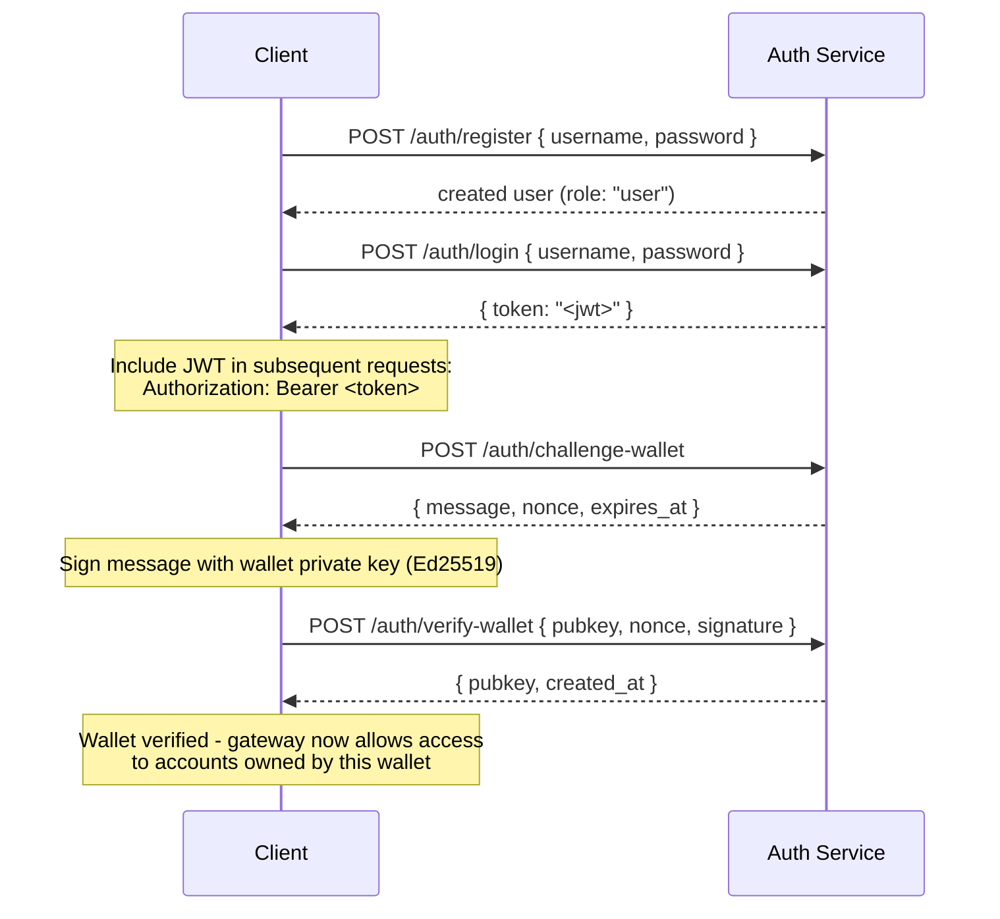

## 概要

Private Channelsには、JWT認証とロールベースのアクセス制御（RBAC）によってゲートウェイアクセスを管理するオプションのAuth Serviceが含まれています。認証が無効の場合、ゲートウェイはすべての接続を受け入れます。有効な場合、クライアントはすべてのリクエストに有効なJWTを提示する必要があります。

このページでは、以下の両方の対象者を扱います：

- **開発者** - 登録、ログイン、ウォレット検証、および認証済みリクエストの実行
- **オペレーター** - Authサービスの有効化、`JWT_SECRET`の設定、および`operator`ロールのプロビジョニング

## 認証の有効化

認証は、ゲートウェイとAuth Serviceの両方に`JWT_SECRET`（空でない値）を設定することで有効になります。Auth Serviceにはさらに`AUTH_DATABASE_URL`も必要です。

`JWT_SECRET`が設定されていない場合、ゲートウェイはオープンモードで動作し、トークンは不要です。

> **Docker Compose:** Authサービスは Docker Compose プロファイルであり、**デフォルトでは起動しません**。含めるには、`docker compose` コマンドに `--profile auth` を渡してください。また、`JWT_SECRET` や `POSTGRES_PASSWORD` などのシークレットが正しく解決されるよう `--env-file .env` も合わせて指定してください（`--env-file` フラグが一つでも渡されると、Compose は自動的な `.env` の読み込みを無効化します）：
>
> ```bash
> docker compose -f docker-compose.devnet.yml --env-file versions.env --env-file .env.devnet --env-file .env --profile auth up -d
> ```

## Auth Service API

すべてのエンドポイントは `/auth` 以下にあります。Authサービスは `AUTH_PORT`（デフォルト `8903`）でリッスンします。

### `POST /auth/register`

新しいアカウントを作成します。すべてのユーザーは `user` ロールで登録されます。

```json
{ "username": "alice", "password": "hunter2" }
```

- ユーザー名：5〜32文字、英数字および `_` と `-`
- パスワード：6〜128文字
- 作成されたユーザーを返します。パスワードは返されません

### `POST /auth/login`

認証を行い、24時間有効な署名済みJWTを受け取ります。

```json
{ "username": "alice", "password": "hunter2" }
```

`{ "token": "<jwt>" }` を返します。ユーザー名・パスワードのどちらが誤っていても `401` を返し、ユーザー名の列挙を防ぎます。

### `POST /auth/challenge-wallet`

Solanaウォレットの所有権を証明するための署名チャレンジをリクエストします。有効なJWTが必要です。

メッセージ、ノンス、および有効期限を返します。チャレンジは10分で失効します。

```json
{
  "message": "PrivateChannel wallet verification\nuser: <uuid>\nnonce: <uuid>\nexpires: <unix>",
  "nonce": "<uuid>",
  "expires_at": "<iso8601>"
}
```

### `POST /auth/verify-wallet`

署名済みチャレンジを送信して、ウォレットを検証済みとして登録します。有効なJWTが必要です。

```json
{
  "pubkey": "<base58 pubkey>",
  "nonce": "<uuid from challenge>",
  "signature": "<base58 Ed25519 signature>"
}
```

サービスはチャレンジメッセージを再構築し、Ed25519署名を検証してウォレットを保存します。各ノンスは一度しか使用できず、リプレイは拒否されます。

`{ "pubkey": "<base58>", "created_at": "<iso8601>" }` を返します。

### `GET /auth/wallets`

認証済みユーザーのすべての検証済みウォレットを一覧表示します。有効なJWTが必要です。

### `DELETE /auth/wallets/{pubkey}`

認証済みユーザーのアカウントから検証済みウォレットを削除します。有効なJWTが必要です。

### `GET /health`

死活確認。`200 ok` を返します。認証不要です。

## JWT構造

トークンはHS256アルゴリズムを使用し、発行から24時間後に失効します。

| クレーム  | 値                           |
| ------ | ------------------------------- |
| `sub`  | ユーザーUUID                       |
| `role` | `"user"` または `"operator"`        |
| `iss`  | `"private-channel-auth"`        |
| `aud`  | `"private-channel-gateway"`     |
| `exp`  | Unixタイムスタンプ（発行から24時間後） |

> `iss` と `aud` はJWTペイロードに含まれていますが、アプリケーションのクレーム構造体にデシリアライズされるのではなく、ゲートウェイのJWT設定によって検証されます。アプリケーション層のコードがアクセスできるのは `sub`、`role`、`exp` のみです。

`Authorization` ヘッダーにトークンを渡してください：

```
Authorization: Bearer <JWT_TOKEN>
```

## ロール

### user

登録時のデフォルトロール。

- アクセスはユーザー自身の検証済みウォレットに限定されます
- 制限対象：`getBlock`、`getTransaction`、`simulateTransaction`
- 可能な操作：EscrowプログラムでのDepositの呼び出し、`WithdrawFunds`を通じた出金の開始

### operator

昇格されたロール。直接プロビジョニングが必要で、`user`から`operator`へのセルフサービスの昇格パスは存在しません。

**ロールの付与**（Admin CLI `private-channel-auth-admin` を使用）：

```bash
private-channel-auth-admin set-role --username alice --role operator
```

または直接SQLで：

<Callout type="warning">
  これは特権的なデータベース操作です。Auth Serviceのデータベースへのアクセスを適切に制限し、ロール変更を監査してください。
</Callout>

```sql
UPDATE private_channel_auth.users SET role = 'operator' WHERE username = 'alice';
```

**セルフ検証フローを経ずにウォレットを登録する（Admin CLI、`private-channel-auth-admin`）：**

```bash
private-channel-auth-admin attach-wallet --username alice --pubkey <base58-pubkey>
```

このコマンドは、チャレンジ/検証フローを経ずに、検証済みウォレットを `verified_wallets` テーブルに直接挿入します。`(user_id, pubkey)` に対するユニーク制約が適用されます。このコマンド単体では `operator` ロールは付与されません。ロールの付与には `set-role` または上記のSQLアップデートを使用してください。このコマンドは、インタラクティブなチャレンジ/検証フローを必要とせず、アカウント（例：サービスアカウント）にウォレットを紐付けるためのものです。

**権限：**

- すべてのウォレット所有権チェックをバイパス
- `getBlock`、`getTransaction`、`simulateTransaction` を含む、すべてのゲートウェイRPCメソッドへのフルアクセス
- 必須対象：`ReleaseFunds`、`ResetSmtRoot`

## 完全な認証フロー



## 認証済みリクエストの実行

```typescript
const response = await fetch("http://localhost:8899/", {
  method: "POST",
  headers: {
    "Content-Type": "application/json",
    Authorization: `Bearer ${jwtToken}`
  },
  body: JSON.stringify({
    jsonrpc: "2.0",
    id: 1,
    method: "getBalance",
    params: [walletAddress]
  })
});
const data = await response.json();
```

## ゲートウェイエンドポイント

以下のエンドポイントは認証不要です：

| エンドポイント  | メソッド | 説明                               | 成功                  | 失敗                     |
| --------- | ------ | ----------------------------------------- | ------------------------ | --------------------------- |
| `/health` | GET    | 死活確認                            | `200 {"status":"ok"}`    | -                           |
| `/ready`  | GET    | 詳細な準備状態確認；書き込みノードと読み取りノードを検査 | `200 {"status":"ready"}` | `503 {"status":"degraded"}` |

`JWT_SECRET` およびゲートウェイ環境変数のリファレンスについては、[設定リファレンス](/docs/tools/private-channels/operators/configuration)を参照してください。

## RPCメソッドアクセスマトリクス

以下のメソッドはゲートウェイによって認識されます。`JWT_SECRET` が設定されている場合、アクセスはJWTロールによって異なります：

| メソッド                        | ルート      | JWT なし | `user`           | `operator` |
| ----------------------------- | ---------- | ------ | ---------------- | ---------- |
| `sendTransaction`             | 書き込みノード | ✓      | ✓                | ✓          |
| `getLatestBlockhash`          | 読み取りノード  | ✓      | ✓                | ✓          |
| `getSlot`                     | 読み取りノード  | ✓      | ✓                | ✓          |
| `getRecentBlockhash`          | 読み取りノード  | ✓      | ✓                | ✓          |
| `getSignatureStatuses`        | 読み取りノード  | ✓      | ✓                | ✓          |
| `getTransactionCount`         | 読み取りノード  | ✓      | ✓                | ✓          |
| `getFirstAvailableBlock`      | 読み取りノード  | ✓      | ✓                | ✓          |
| `getBlocks`                   | 読み取りノード  | ✓      | ✓                | ✓          |
| `getEpochInfo`                | 読み取りノード  | ✓      | ✓                | ✓          |
| `getEpochSchedule`            | 読み取りノード  | ✓      | ✓                | ✓          |
| `getRecentPerformanceSamples` | 読み取りノード  | ✓      | ✓                | ✓          |
| `getBlockTime`                | 読み取りノード  | ✓      | ✓                | ✓          |
| `getVoteAccounts`             | 読み取りノード  | ✓      | ✓                | ✓          |
| `getSupply`                   | 読み取りノード  | ✓      | ✓                | ✓          |
| `getSlotLeaders`              | 読み取りノード  | ✓      | ✓                | ✓          |
| `isBlockhashValid`            | 読み取りノード  | ✓      | ✓                | ✓          |
| `getAccountInfo`              | 読み取りノード  | 401    | 所有権ゲート¹ | ✓          |
| `getTokenAccountBalance`      | 読み取りノード  | 401    | 所有権ゲート¹ | ✓          |
| `getSignaturesForAddress`     | 読み取りノード  | 401    | 所有権ゲート¹ | ✓          |
| `getBlock`                    | 読み取りノード  | 401    | 403              | ✓          |
| `getTransaction`              | 読み取りノード  | 401    | 403              | ✓          |
| `simulateTransaction`         | 読み取りノード  | 401    | 403              | ✓          |

¹ **所有権ゲート**：SPL token account（ownerフィールドが `TokenkegQ...` または `TokenzQ...` で、データが165バイト以上）の場合、ゲートウェイは `owner` または `delegate` フィールドが認証済みユーザーの検証済みウォレットのいずれかと一致するかを確認します。それ以外のアカウントタイプ（System Program ウォレット、または不明なPDA）の場合は、そのようなアカウントには検査すべき owner/delegate フィールドがないため、クエリされた pubkey 自体がユーザーの検証済みウォレットの一つであるかどうかを確認します。いずれかのチェックが失敗した場合は403を返します。
