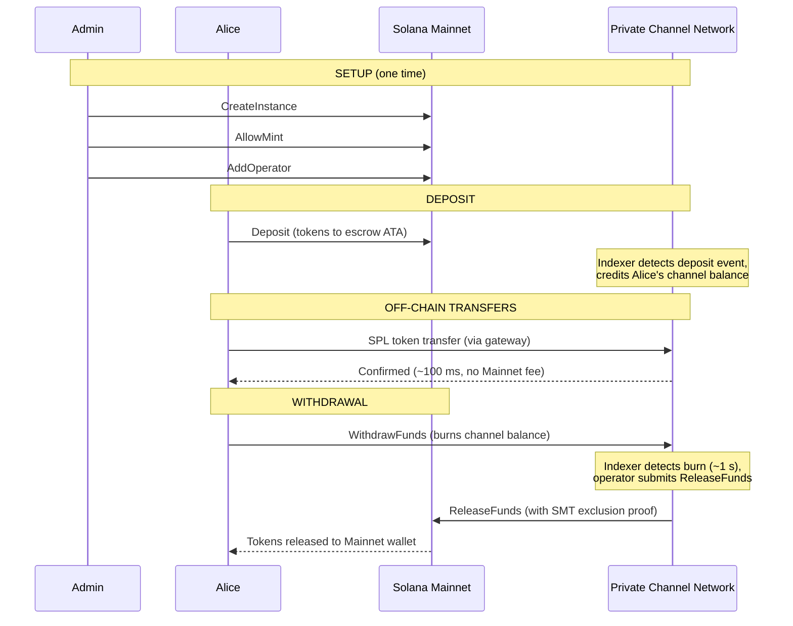
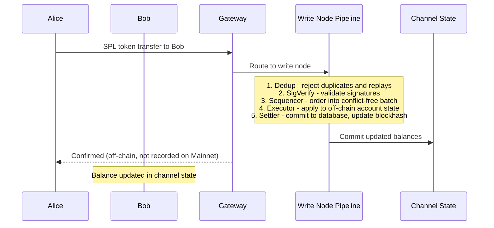
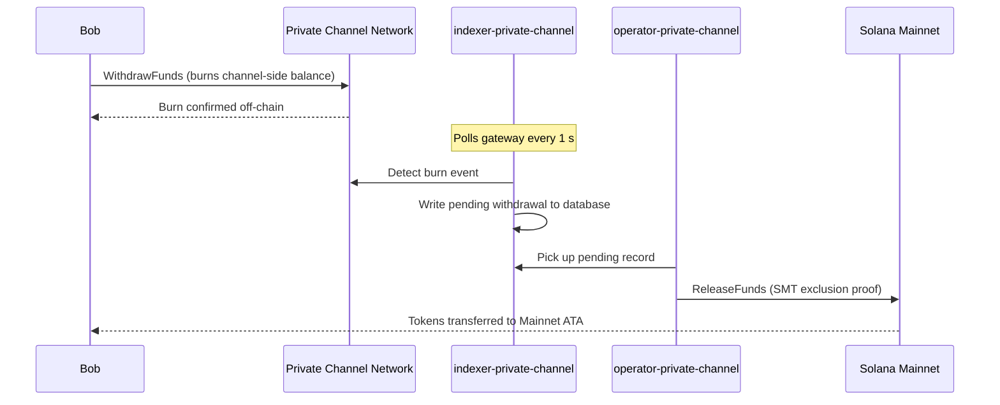

## プライベートチャンネルとは？

プライベートチャンネルは、Solanaに連携したオフチェーン決済ネットワークです。ユーザーはSPLトークンをオンチェーンのエスクロープログラムにデポジットし、ゲートウェイを通じてオフチェーンで高速かつ転送ごとのコストゼロで取引を行います。Solana Mainnetへの決済はSparse Merkle Tree証明を通じて行われ、資金は常に引き出し可能であり、二重使用は不可能です。

Solanaのネイティブ決済フローとは異なり、チャンネル内の転送はユーザーが引き出しを行うまでオンチェーンに表示されません。チャンネルネットワークは独自のトランザクションパイプライン（dedup -> sig verify -> sequencer -> executor -> settler）を実行し、Solanaのブロック時間とは独立してトランザクションを処理します。

## 参加者

### インスタンス管理者

管理者は`CreateInstance`を通じて`Instance` PDAをデプロイし、受け入れるSPLトークンのミント（`AllowMint` / `BlockMint`）を管理します。管理者は`AddOperator` / `RemoveOperator`を通じてオペレーターのプロビジョニングおよび失効を行い、`SetNewAdmin`を通じて管理者権限を移譲できます。インスタンスごとに管理者は1名です。管理者権限の移譲は一度行うと元に戻せません。現在の管理者は、新しい管理者の協力なしに権限を取り戻すことはできません。

### オペレーター

オペレーターは管理者によってプロビジョニングされます。オペレーターは`Operator` PDAを保持し、`ReleaseFunds`（Mainnetへの引き出し決済）および`ResetSmtRoot`（Sparse Merkle Treeのローテーション）を呼び出せる唯一のアカウントです。オペレーターはゲートウェイ内のすべての所有権チェックをバイパスし、`getBlock`、`getTransaction`、`simulateTransaction`を含むすべてのJSON-RPCメソッドにアクセスできます。JWTロール：`"operator"`。オペレーターはデータベースに直接プロビジョニングする必要があります。セルフサービスによる権限昇格はありません。デプロイおよび設定の詳細については、[オペレーターガイド](/docs/tools/private-channels/operators)を参照してください。

### ユーザー

ユーザーはAuth Serviceを通じてセルフ登録します。JWTロール：`"user"`。ユーザーはエスクロープログラムで直接`Deposit`を呼び出し、Withdrawプログラムのチャンネル側`WithdrawFunds` instructionsを通じて引き出しを開始できます。ゲートウェイアクセスは各自の検証済みウォレットに限定されており、`getBlock`、`getTransaction`、`simulateTransaction`を呼び出すことはできません。

## チャンネルのライフサイクル

1. **インスタンス作成** - 管理者が`CreateInstance`を呼び出し、`Instance` PDAを作成して許可されたミントを設定します。
2. **デポジット** - ユーザーが`Deposit` instructionsを通じてエスクローにSPLトークンをデポジットします。トークンはインスタンスのassociated token accountに移動します。
3. **オフチェーン転送** - ユーザーがゲートウェイを通じて転送を送信します。転送はMainnetに触れることなく、チャンネルネットワーク上でシーケンスおよび実行されます。
4. **引き出し開始** - ユーザーがWithdrawプログラム（チャンネル側）の`WithdrawFunds`を呼び出し、残高をバーンして引き出しを要求します。
5. **Mainnet決済** - オペレーターが有効なSMT排除証明を提供し、エスクロープログラム（Mainnet）の`ReleaseFunds`を呼び出して、ユーザーのウォレットにトークンをリリースします。
6. **ツリーローテーション** - SMTが容量上限（65,536リーフ）に近づくと、オペレーターが`ResetSmtRoot`を呼び出してツリーをローテーションし、新しいepochを開始します。

### 転送

### 引き出し

## プライベートチャンネルを使用する場面

以下のニーズがあるアプリケーションにはプライベートチャンネルをご利用ください：

- **オフチェーンスループット** - 転送量がSolanaのTPSを飽和させる可能性がある場合、またはサブ秒の確認が必要な場合
- **プライバシー** - 取引相手の身元と転送金額をオンチェーンに公開したくない場合
- **転送ごとの手数料ゼロ** - 頻繁に転送を行い、トランザクションごとのSOLコストが高負担となる場合

以下の場合はネイティブSPL転送をご利用ください：

- **オンチェーンの組み合わせ可能性**が必要な場合（DeFi、スワップ、レンディングなど、他のプログラムが転送を観察または操作できる必要がある場合）
- **単一転送での決済**で十分であり、プライバシーが懸念事項でない場合
- **ゲートウェイインフラ**が利用できない、または運用上の実現が困難な場合
