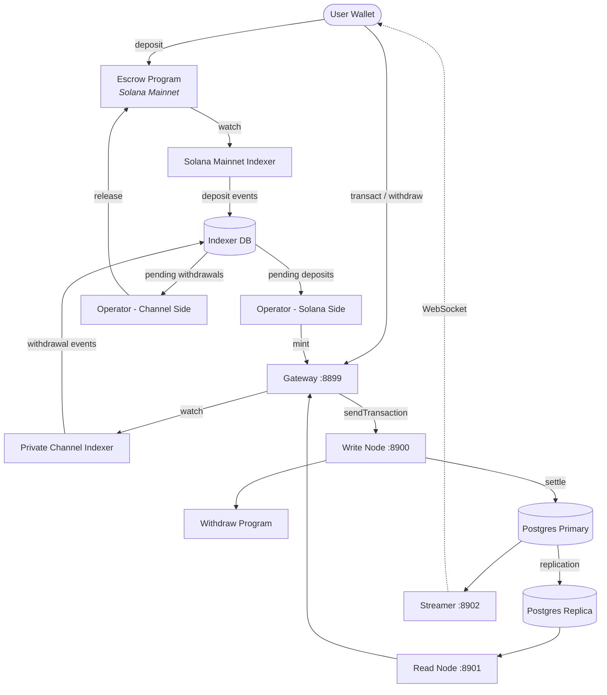

<Callout type="warning">
  Private Channelsはセキュリティ監査を受けておらず、十分なセキュリティレビューなしに実際の資金を使用する本番環境での利用は推奨されません。
</Callout>

<Callout type="info">
  **インスタンスをデプロイしますか？** [オペレーターガイド](/docs/tools/private-channels/operators)をご覧ください。**既存のインスタンスに統合しますか？** [クイックスタート](/docs/tools/private-channels/quickstart/installation)をご覧ください。このページは両方の読者向けのアーキテクチャリファレンスです。
</Callout>

## アーキテクチャ

Private Channelsは4つのコンポーネントで構成されています。オンチェーンのSolanaプログラムが2つ（EscrowとWithdraw）、オフチェーンのサービスが2つ（GatewayとAuth Service）です。これらが連携してステートチャネルプロトコルを形成し、資金はMainnet上に保持されながらも、送金はオフチェーンで決済されます。

### Escrowプログラム

Escrowプログラムは、預け入れられたSPLトークンを保持するオンチェーンのSolanaプログラムです。システムの信頼の基盤であり、オペレーターが有効なSparse Merkle Tree除外証明を提供してリリースするまで、すべての資金は最終的にエスクローに保持されます。

- プログラムID: `9tgHa1DcnaSSUtmMsst8ovKTe1Gfxzezn27KnH9xXYeU`
- このIDは`declare_id!()`を通じてプログラムバイナリにコンパイルされます。オフチェーンサービスは、環境変数からではなく、生成されたクライアントクレートからコンパイル時に同じIDを読み取ります。
- `Instance`、`AllowedMint`、`Operator` PDAを管理します
- instructions: `CreateInstance`、`AllowMint`、`BlockMint`、`AddOperator`、`RemoveOperator`、`SetNewAdmin`、`Deposit`、`ReleaseFunds`、`ResetSmtRoot`

### Withdrawプログラム

Withdrawプログラムは、Solana Mainnetではなくプライベートチャネルネットワーク上で動作します。ユーザーは`WithdrawFunds`を呼び出してチャネル側のトークン残高をバーンします。このバーンは自動的に資金をリリースするわけではなく、出金が保留中であることをオペレーターに通知します。その後、オペレーターが有効なSMT証明とともにEscrowプログラムの`ReleaseFunds`を呼び出して決済を完了します。

- プログラムID: `J231K9UEpS4y4KAPwGc4gsMNCjKFRMYcQBcjVW7vBhVi`
- このIDはプログラムバイナリにコンパイルされます。オフチェーンサービスは、環境変数からではなく、生成されたクライアントクレートからコンパイル時に同じIDを読み取ります。

### Gateway

GatewayはSolana JSON-RPC互換のプロキシで、クライアントリクエストをチャネルネットワークの書き込みノード（トランザクション送信用）と読み取りノード（クエリ用）にルーティングします。環境変数`GATEWAY_PORT`、`GATEWAY_WRITE_URL`、`GATEWAY_READ_URL`で設定します。

ヘルスエンドポイント（認証不要）:

- `GET /health` - 死活確認。`200 {"status":"ok"}`を返します
- `GET /ready` - 詳細な準備状況確認。書き込みノードと読み取りノードを検査し、`200 {"status":"ready"}`または`503 {"status":"degraded"}`を返します

#### RPCメソッドのルーティングとアクセス

Gatewayは`sendTransaction`を書き込みノードへ、その他のメソッドはすべて読み取りノードへルーティングします。64 KBを超えるリクエストはHTTP 413で拒否されます。認証が有効な場合、メソッドへのアクセスはJWTロールによって制御されます。完全なメソッドマトリックスについては**[認証とロール](/docs/tools/private-channels/concepts/auth)**を参照してください。

### Auth Service

Auth Serviceは、Gatewayのアクセス制御のためにHS256 JWT（有効期限24時間）を発行するオプションのコンポーネントです。環境変数`JWT_SECRET`が設定されている場合に有効になります。設定がない場合、Gatewayはすべての接続を受け入れます。

JWTクレーム: `sub`（ユーザーUUID）、`role`（`"user"`または`"operator"`）、`iss`（`"private-channel-auth"`）、`aud`（`"private-channel-gateway"`）、`exp`（Unixタイムスタンプ）。`iss`と`aud`はGatewayのJWT設定によって検証され、アプリケーションクレーム構造体にはデシリアライズされません。アプリケーション層のコードで利用できるのは`sub`、`role`、`exp`のみです。

ロール:

- `user` - 自分の検証済みウォレットのみアクセス可能。`getBlock`、`getTransaction`、`simulateTransaction`は呼び出し不可
- `operator` - すべての所有権チェックをバイパス。全RPCメソッドへのフルアクセス。データベースでのプロビジョニングが必要（セルフサービスによる権限昇格不可）

### Streamer

StreamerはWebSocketサーバーで、チャネルの状態更新をリアルタイムで接続中のクライアントにプッシュし、RPCへのポーリングを不要にします。PostgreSQLをポーリングして状態変化を検出します。このガイドがデプロイするdevnetスタックではなく、ベースのDocker Composeスタックの一部です。詳細は[設定リファレンス](/docs/tools/private-channels/operators/configuration#service-port-reference)を参照してください。

- ポート: `8902`、`STREAMER_PORT`で変更可能
- 接続: `ws://localhost:8902`
- ヘルスエンドポイント: `GET /health` - 内部ポーリングループが30秒以上停止した場合に`503`を返します

<Callout type="warning">
  WebSocketイベントスキーマはまだ公式にドキュメント化されていません。正式なドキュメントが公開されるまでは、実装の詳細について[`core/src/bin/streamer.rs`](https://github.com/solana-foundation/solana-private-channels/blob/main/core/src/bin/streamer.rs)を参照してください。
</Callout>



## トランザクションパイプライン

```text
Transaction -> [1:Dedup] -> [2:SigVerify] -> [3:Sequencer] -> [4:Executor] -> [5:Settler] -> Database
```

Gatewayに送信されたトランザクションは、状態がコミットされるまでに5段階のパイプラインを経由します:

1. **Dedup** - パイプラインに入る前に重複トランザクションをフィルタリング
2. **SigVerify** - 署名者の公開鍵に対してトランザクション署名を検証
3. **Sequencer** - 有効なトランザクションを決定論的に順序付けし、正規の履歴を確立
4. **Executor** - チャネルのアカウント層（BOBキャッシュ + AccountsDB）に対してトランザクションを実行し、残高をオフチェーンで更新
5. **Settler** - 蓄積されたトランザクション結果をPostgreSQLにコミットし、Redisキャッシュを更新。次のブロックサイクルに向けて新しいブロックハッシュを生成します。Mainnetの決済（`ReleaseFunds`の呼び出し）は`operator-private-channel`サービスによって個別に処理されます

## 主な特徴

### プライバシー

チャネル参加者間の送金はSolana Mainnetに記録されません。オンチェーンに記録されるのは、デポジット（チャネルへの入金）と最終出金（チャネルからの出金）のみです。チャネル運用中、相手方の身元と送金額は外部の観察者には見えません。

### パフォーマンス

オフチェーンパイプラインにより、Solanaのブロック時間がクリティカルパスから除外されます。送金はSolanaのブロックが確定したときではなく、シーケンサーが処理した時点で確定します。これにより、アプリケーション層の送金においてサブ秒のファイナリティとSolanaのネイティブTPSを超えるスループットが実現します。

### 決済

すべての出金はオンチェーンのSparse Merkle Tree証明によって保護されます。SMTルートはEscrowプログラムの`Instance.withdrawal_transactions_root`に保存されます。`ReleaseFunds`が呼び出されると、プログラムはまず現在のオンチェーンルートに対して未使用のnonceの除外証明を検証し、次に呼び出し元が提供した新しいルートに対してそのnonceの包含証明を別途検証します。両方のチェックが通過して初めて新しいルートが保存されるため、オペレーターキーが侵害された場合でも二重支払いは不可能です。

## セキュリティモデル

**管理者キー** - インスタンス作成（`CreateInstance`）とオペレータープロビジョニング（`AddOperator` / `RemoveOperator`）を制御します。管理者キーが侵害されると、任意のオペレータープロビジョニングが可能になります。`SetNewAdmin`は管理者権限を単一ステップで不可逆的に移転します。管理者キーは適切に保護してください。

**オペレーターキー** - `ReleaseFunds`と`ResetSmtRoot`を呼び出せます。現在のオンチェーンルートに対する有効なSMT除外証明なしには資金をリリースできません。オンチェーンの`verify_smt_exclusion_proof`チェックは、不正な出金に対する最後の防衛線です。侵害されたオペレーターキーだけではエスクローを空にすることはできません。

**SMTルート** - `Instance.withdrawal_transactions_root`としてオンチェーンに保存されます。`ReleaseFunds`が呼び出されるたびにアトミックに更新されます。各証明は未使用のnonceを参照する必要があるため、オペレーターキーが侵害された場合でも同じチャネル残高の二重支払いは不可能です。

**ツリーローテーション** - `Instance.current_tree_index`はツリーのepochを追跡します。`ResetSmtRoot`が呼び出されると、ツリーインデックスがインクリメントされ、前のツリーepochのすべてのnonceが無効化され、新しい決済サイクルのためにクリーンな状態が提供されます。

## 運用キーのセキュリティ

<Callout type="warning">
  オフチェーンサービスは独自の署名者体系を使用しており、上記のセキュリティモデルで説明されたオンチェーンの管理者/オペレーター権限とは無関係です。`ADMIN_PRIVATE_KEY`はすべてのオペレーターサービスで必須であり、トランザクション手数料を支払います。別途オプションの`OPERATOR_PRIVATE_KEY`は`ReleaseFunds`と`ResetSmtRoot`のオンチェーンOperator署名を提供し、未設定の場合は`ADMIN_PRIVATE_KEY`の値にフォールバックします。プロトコルレベルのインスタンス管理者キー（`CreateInstance` / `AddOperator` / `SetNewAdmin`に使用）をいずれの変数にも設定したり、ランタイムで公開したりしないでください。そのキーはコールドかつオフラインで保管してください。
</Callout>

`ReleaseFunds`と`ResetSmtRoot`には2つのオンチェーン署名が必要です。手数料支払者（`ADMIN_PRIVATE_KEY`から）とOperator PDAの権限（`OPERATOR_PRIVATE_KEY`から、または未設定の場合は`ADMIN_PRIVATE_KEY`）です。このデプロイガイドのdevnetウォークスルーでは、生成されたオペレーターkeypairを`ADMIN_PRIVATE_KEY`に設定し、`OPERATOR_PRIVATE_KEY`を未設定のままにします。そのため、同じkeypairが両方の署名者ロールを担います。`ADMIN_PRIVATE_KEY`に設定されるキーは、ホットウォレットの秘密鍵と同等の管理を行ってください:

- gitignoreされた`.env`ファイルにのみ保存し、`.env.devnet`やコミットされる設定ファイルには絶対に記載しない
- 本番環境へのデプロイでは、平文の環境変数ではなくシークレットマネージャー（AWS Secrets Manager、HashiCorp Vault）の使用を検討してください
- プロトコルレベルのインスタンス管理者keypair（`AddOperator` / `SetNewAdmin`の呼び出しに使用）はコールドで保管してください。インスタンスのセットアップとオペレータープロビジョニング時にのみ必要であり、ランタイム中は不要です

`SetNewAdmin`は**単一トランザクションで不可逆的に**管理者権限を移転します。現在の管理者は、新しい管理者の協力なしには回復手段がありません。移転先アドレスを確認せずに呼び出さないでください。

## 次のステップ

<Cards>
  <Card
    title="クイックスタート"
    href="/docs/tools/private-channels/quickstart/installation"
  >
    環境をセットアップしてTypeScriptクライアントを生成します。
  </Card>
  <Card title="チャネル" href="/docs/tools/private-channels/concepts/channels">
    参加者とチャネルのライフサイクルを理解します。
  </Card>
  <Card
    title="Sparse Merkle Tree"
    href="/docs/tools/private-channels/concepts/smt"
  >
    出金証明がオンチェーンでどのように検証されるかを理解します。
  </Card>
  <Card
    title="Instructions"
    href="/docs/tools/private-channels/instructions/deposit"
  >
    すべてのプログラムの完全なinstructionsリファレンス。
  </Card>
</Cards>
