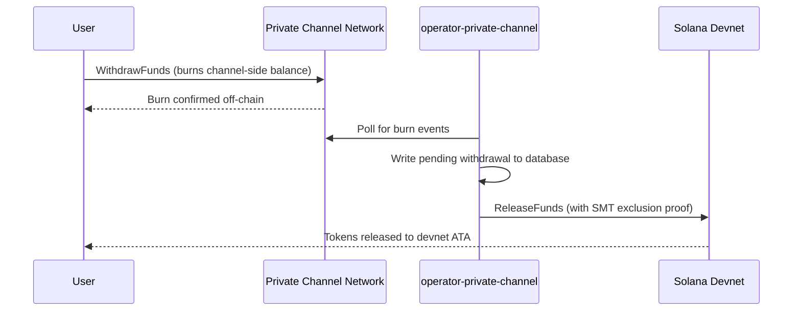

## 概要

Private Channelsからの引き出しは2段階のプロセスです。まず、ユーザーはWithdrawプログラムの`WithdrawFunds`を呼び出して、チャネル側のトークン残高をバーンします。次に、オペレーターがEscrowプログラム（このウォークスルーではdevnet）の`ReleaseFunds`を有効なSparse Merkle Tree除外証明とともに呼び出して、資金を解放します。SMT証明により、各引き出しナンスは一度しか使用できず、二重支払いを防止します。



## ステップ1：チャネルで引き出しを開始する

Withdrawプログラムの`WithdrawFunds`を呼び出して、チャネル側の残高をバーンします。`tokenAccount` PDAを自動導出し、本番環境での使用が推奨される`Async`バリアントを使用してください：

```typescript
import { getWithdrawFundsInstructionAsync } from "../private-channel-withdraw-program/clients/typescript/src/generated";
import {
  createSolanaRpc,
  address,
  pipe,
  createTransactionMessage,
  setTransactionMessageFeePayerSigner,
  setTransactionMessageLifetimeUsingBlockhash,
  appendTransactionMessageInstruction,
  signAndSendTransactionMessageWithSigners,
  assertIsTransactionMessageWithSingleSendingSigner,
  getBase58Decoder
} from "@solana/kit";

// Point to the gateway, not a public Solana RPC
const privateChannelRpc = createSolanaRpc("http://localhost:8899");

const withdrawIx = await getWithdrawFundsInstructionAsync({
  user: userSigner,
  mint: address(mintAddress),
  amount: 1_000_000n, // 1 USDC (6 decimals)
  destination: null // null = release to signer's devnet wallet
});

const { value: latestBlockhash } = await privateChannelRpc
  .getLatestBlockhash({ commitment: "confirmed" })
  .send();

// Sent to the Private Channels gateway (not Solana RPC directly), which
// expects the legacy transaction format - do not switch this to version 0.
const transactionMessage = pipe(
  createTransactionMessage({ version: "legacy" }),
  (m) => setTransactionMessageFeePayerSigner(userSigner, m),
  (m) => setTransactionMessageLifetimeUsingBlockhash(latestBlockhash, m),
  (m) => appendTransactionMessageInstruction(withdrawIx, m)
);

assertIsTransactionMessageWithSingleSendingSigner(transactionMessage);

const signatureBytes =
  await signAndSendTransactionMessageWithSigners(transactionMessage);
const signature = getBase58Decoder().decode(signatureBytes);
console.log("Withdrawal initiated:", signature);
```

- Withdraw Program ID: `J231K9UEpS4y4KAPwGc4gsMNCjKFRMYcQBcjVW7vBhVi`
- このトランザクションは公開SolanaRPCではなく、ゲートウェイ（`http://localhost:8899`）に送信してください
- `destination`が指定されている場合、解放された資金は署名者のウォレットではなく、そのウォレットに送られます

## 想定される動作

`WithdrawFunds`を呼び出した後、追加のアクションは不要です。オペレーターサービスが自動的に決済を処理します：

1. `indexer-private-channel`は1秒ごとにチャネルをポーリングしてバーンイベントを検出し、検出されると保留中の引き出しレコードをデータベースに書き込みます
2. `operator-private-channel`は1秒ごとにデータベースをポーリングして保留中のレコードを確認し、必要なSMT除外証明とともにSolana devnet上のEscrowプログラムに`ReleaseFunds`を送信します。devnetの確認を最大5回、400ミリ秒間隔でポーリングし、その後リトライします

通常の状況では、数秒以内にdevnetウォレットに資金が反映されます。

## オペレーターによる決済の仕組み（リファレンス）

チャネル側のバーン後、プロビジョニングされたオペレーターは有効なSMT除外証明とともにEscrowプログラムの`ReleaseFunds`を呼び出す必要があります。引き出しナンスが以前に使用されていないことを証明しなければ、オペレーターは資金を解放できません。このステップは`operator-private-channel`によって自動的に処理されるため、手動で呼び出す必要はありません。

オペレーターが提供する情報：

- `amount`：バーンされた金額と一致する必要があります
- `user`：devnet上の受取ウォレット
- `new_withdrawal_root`：この引き出し後に更新されたSMTルート
- `transaction_nonce`：このリーフに対する一意のナンス
- `sibling_proofs`：512バイト（ツリー証明用の16個の32バイト兄弟ハッシュ）

## 検証

オペレーターの呼び出しが確認された後、devnetのトークン残高を確認してください：

```bash
spl-token balance <MINT_ADDRESS> --owner <YOUR_WALLET>
```

またはRPC経由：

```typescript
import { createSolanaRpc, address } from "@solana/kit";
import { findAssociatedTokenPda } from "@solana-program/token";

const TOKEN_PROGRAM_ADDRESS = address(
  "TokenkegQfeZyiNwAJbNbGKPFXCWuBvf9Ss623VQ5DA"
);

// Query devnet directly; ReleaseFunds settles here, not through the gateway
const rpc = createSolanaRpc("https://api.devnet.solana.com");

const [yourDevnetAta] = await findAssociatedTokenPda({
  mint: address(mintAddress),
  owner: address(userSigner.address),
  tokenProgram: TOKEN_PROGRAM_ADDRESS
});

const balance = await rpc.getTokenAccountBalance(yourDevnetAta).send();
console.log(balance.value.uiAmountString);
```

## クイックスタート完了

devnet上でPrivate Channelsの完全なサイクルを実行しました：エスクローにSPLトークンを入金し、ゲートウェイを通じてオフチェーン転送を送信し、devnetウォレットに資金を引き出しました。

<Cards>
  <Card
    title="チャネルのライフサイクル"
    href="/docs/tools/private-channels/concepts/channels"
  >
    参加者と入金から引き出しまでの完全なフローを詳しく理解する。
  </Card>
  <Card
    title="認証とロール"
    href="/docs/tools/private-channels/concepts/auth"
  >
    インテグレーションにJWT認証を追加する。
  </Card>
  <Card
    title="ReleaseFundsリファレンス"
    href="/docs/tools/private-channels/instructions/release-funds"
  >
    オペレーターツール向けのReleaseFunds instructionsの完全リファレンス。
  </Card>
  <Card
    title="Sparse Merkle Tree"
    href="/docs/tools/private-channels/concepts/smt"
  >
    引き出し証明が二重支払いを防止する仕組みを理解する。
  </Card>
</Cards>
