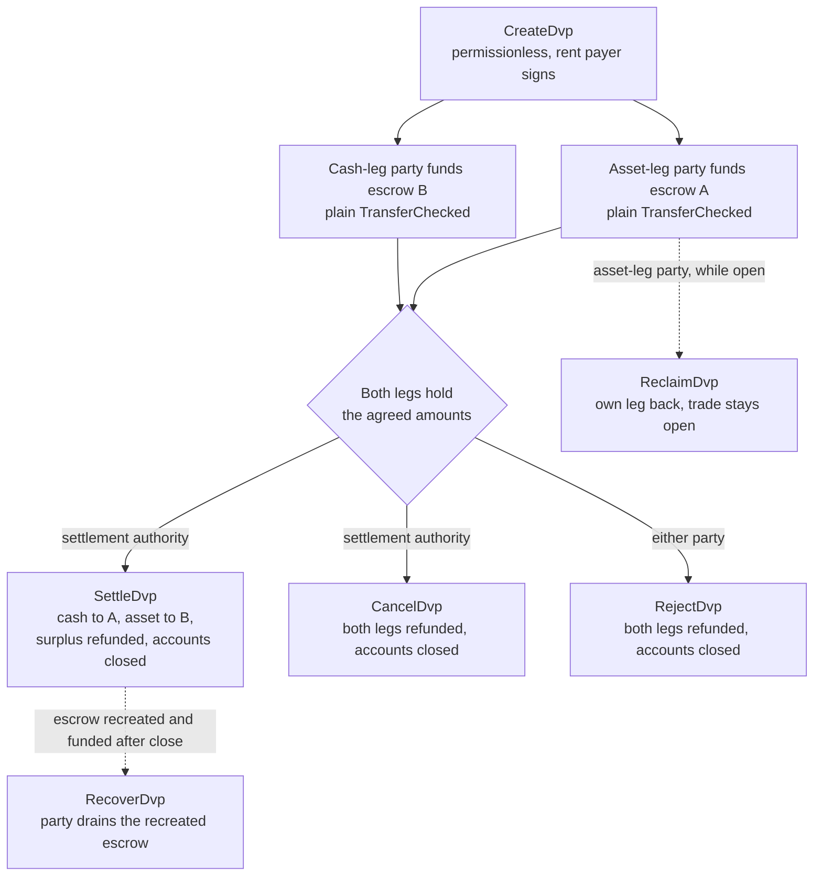
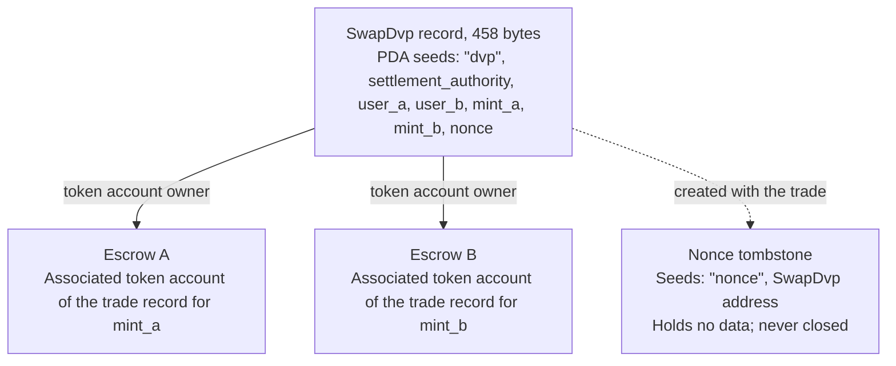

DvP 프로그램은 Solana Foundation이 관리하고 Cantina가 감사한 Solana의 표준 Delivery versus Payment 프로그램입니다.
두 당사자가 거래에 합의하고, 각자 일반 토큰 전송으로 자신의 레그를 에스크로 계정에 보내면,
결제 권한자가 하나의 트랜잭션으로 양쪽 레그를 결제하므로 둘 다 이동하거나 둘 다 이동하지 않습니다.
결제 권한자는 거래에 지정된 제3의 주소로, 거래를 주선한 거래소나 에이전트 등이 해당합니다.
어느 당사자도 프로그램을 작성하거나 배포할 필요가 없으며, 표준 토큰 전송(`TransferChecked`)을 보낼 수 있는 지갑이나 수탁기관이라면
DvP 전용 통합 없이 레그에 자금을 넣을 수 있습니다. 결제 전까지는 어느 쪽이든 자신의 레그를 되찾거나 거래를 해제할 수 있습니다.

<Callout type="warn" title="조치하기 전에 기록을 확인하세요">

거래 기록 생성은 허가가 필요 없으므로, 기록이 존재한다고 해서 합의가 있었다는 증거는 아닙니다.
각 당사자는 자금을 넣기 전에 저장된 조건을 읽고, 결제 권한자는 결제하기 전에 확인해야 합니다
([검증](#verification-before-funding-and-settlement) 참조).

</Callout>

## 작동 방식

각 거래에는 프로그램 소유 기록 하나와 레그별로 하나씩, 총 두 개의 에스크로 계정이 생깁니다.
자산 레그 당사자(`user_a`)와 현금 레그 당사자(`user_b`)는 해당 레그의 에스크로 계정으로 토큰을 전송하여 각자의 레그에 자금을 넣습니다.
결제 권한자는 결제할 수 있는 유일한 서명자입니다. 결제 시 각 레그의 합의된 수량이 상대방에게 전송되고,
초과분은 해당 레그를 소유한 당사자에게 반환되며, 기록과 두 에스크로가 모두 닫힙니다.
원자성은 Solana [트랜잭션](/docs/core/transactions)에서 비롯됩니다. 두 전송이 하나의 트랜잭션에 있으므로 둘 다 적용되거나 둘 다 적용되지 않습니다.

모든 환불, 회수, 초과분 반환은 당사자 본인의 associated token account로 갑니다.
`mint_a`는 `user_a`의 계정, `mint_b`는 `user_b`의 계정입니다.
수탁기관이나 트레저리 시스템이 자신의 계정에서 레그에 자금을 넣을 수는 있지만,
반환되는 모든 것은 수탁기관이 아니라 당사자의 계정에 들어갑니다.
또한 각 거래는 영구적인 마커 계정을 남깁니다([상태](#state) 참조).

## 가이드

단계별 페이지에서는 각 명령어마다 TypeScript와 Rust 예제와 함께 거래 하나를 생성부터 결제까지 다룹니다.

<Cards>
  <Card title="거래 생성" href="/docs/defi/dvp-program/create-a-trade">
    클라이언트를 설치하고 CreateDvp로 거래 조건을 기록합니다
  </Card>
  <Card title="레그에 자금 입금" href="/docs/defi/dvp-program/fund-the-legs">
    저장된 조건을 확인한 뒤 일반 전송으로 각 레그에 자금을 넣습니다
  </Card>
  <Card title="거래 결제" href="/docs/defi/dvp-program/settle-the-trade">
    결제 권한자로서 하나의 트랜잭션으로 양쪽 레그를 결제합니다
  </Card>
  <Card title="거래 해제" href="/docs/defi/dvp-program/unwind-a-trade">
    레그를 회수하고, 거래를 취소 또는 거부하며, 늦은 입금을 복구합니다
  </Card>
</Cards>

[devnet 데모](https://solana.com/delivery-vs-payment/demo)는 거래를 처음부터 끝까지 실행합니다.
거래를 생성하고, 표준 토큰 전송으로 두 에스크로에 자금을 넣은 뒤,
하나의 트랜잭션으로 양쪽 레그를 결제합니다.

## 프로그램과 위임 중 선택하기

[위임을 사용한 Delivery vs Payment(DvP)](/docs/tokenization/dvp)는 프로그램 없이 동일한 교환을 결제합니다.
각 당사자가 자신의 포지션을 결제 에이전트에게 위임하면, 에이전트가 하나의 트랜잭션으로 양쪽 레그를 이동합니다.

- **프로그램 방식**은 위임이 필요 없으므로 token account당 위임자 한 명이라는 제한이 적용되지 않으며,
결제 권한자가 수익금의 경로를 변경할 수 없습니다.
각 거래는 업그레이드 가능한 프로그램과 그 업그레이드 권한에 의존합니다.
- **위임 패턴**은 프로그램 의존성이 없으며 Scaled UI Amount가 적용된 mint에서도 작동합니다.
프로그램은 이러한 mint를 거부하므로, Mosaic의 `tokenized-security` 템플릿으로 만든 mint는 모두 사용할 수 없습니다
([mint 구성 제약 사항](#mint-configuration-constraints) 참조).

## 역할

이 프로그램은 대칭적입니다. 인터페이스에서 두 당사자는 `mint_a`를 인도하는 `user_a`와 `mint_b`를 인도하는 `user_b`입니다.
README와 생성된 클라이언트는 `mint_a`를 자산 레그, `mint_b`를 현금 레그라고 부르며 이 페이지들도 그 관례를 따르지만,
프로그램은 현금 레그가 현금성 상품일 것을 요구하지 않습니다.
자산 두 개나 스테이블코인 두 개도 같은 방식으로 결제됩니다.

| 역할                 | 대상                               | 서명                                              | 참고                                                                                                                                                                                                     |
| -------------------- | --------------------------------- | -------------------------------------------------- | --------------------------------------------------------------------------------------------------------------------------------------------------------------------------------------------------------- |
| 자산 레그 당사자      | `user_a`, `mint_a` 인도       | 본인의 자금 전송, Reclaim, Reject, Recover | keypair 지갑 또는 멀티시그 볼트 같은 PDA 기반 스마트 월렛. SPL Token 멀티시그 계정이나 program account는 당사자가 될 수 없으며, 이 경우 Create가 `PartyNotSignerCapable`로 실패합니다                   |
| 현금 레그 당사자       | `user_b`, `mint_b` 인도       | 본인의 자금 전송, Reclaim, Reject, Recover | 동일한 요건                                                                                                                                                                                          |
| 결제 권한자 | 생성 시 지정된 제3의 주소 | Settle, Cancel                                     | 결제할 수 있는 유일한 서명자입니다. 생성 시 고정된 수익금의 경로를 변경할 수 없습니다. 결제하거나 취소할 때 닫힌 계정의 rent를 받습니다                                         |
| rent 납부자           | `CreateDvp`에 서명하는 주체         | Create                                             | 기록, nonce tombstone, 두 에스크로의 rent(계정을 유지하기 위한 SOL 예치금)를 부담합니다. rent 수령인으로 기록되지는 않습니다. 닫힌 계정의 rent는 거래를 닫는 주체에게 돌아갑니다 |

## 프로그램 ID

```text
dvp34bdbcEm4f4FCUjGV4mDAkDshaQR4LkK8fdcsyZq
```

| 클러스터      | 프로그램                                       | 업그레이드 권한                              | 마지막 배포 slot |
| ------------ | --------------------------------------------- | ---------------------------------------------- | ------------------ |
| mainnet-beta | `dvp34bdbcEm4f4FCUjGV4mDAkDshaQR4LkK8fdcsyZq` | `DXtFpbPjcn2hxPnw79x1Pfoj35vXh5AsWBkS37YnXMVv` | 452,058,374        |
| devnet       | `dvp34bdbcEm4f4FCUjGV4mDAkDshaQR4LkK8fdcsyZq` | `5EX1zFeJWj4rGYZv432WnYw8CbaSUeTdxPx4r573UgYU` | 479,376,863        |

이 프로그램은 두 클러스터 모두에서 업그레이드할 수 있습니다. 위 수치는 2026년 10월 2일에 `solana program show`가 보고한 값이며,
현재 값은 같은 명령을 실행하여 확인하세요. devnet 빌드는 단계별 페이지가 작성된 기준 커밋([설치](/docs/defi/dvp-program/create-a-trade#install) 참조)보다 오래되었지만,
명령어 및 오류 집합은 동일합니다.

## 수명 주기



거래는 `CreateDvp`로 시작되어 Settle, Cancel, Reject 중 하나가 거래를 닫을 때까지 열려 있습니다.
자금 입금에는 별도의 명령어가 없습니다. 에스크로 계정이 합의된 수량 이상을 보유하면 해당 레그에 자금이 입금된 것입니다.
Reclaim은 레그별로 작동하며 거래를 열어 두므로, 한 레그에 문제가 생겨도 상대 당사자가 전체 거래를 취소해야 하는 것은 아닙니다.

## 상태

각 거래에는 프로그램이 소유한 458바이트의 `SwapDvp` 계정이 하나 있습니다. 계정 주소는 결제 권한자, 두 당사자, 두 mint, nonce로부터 파생됩니다
(시드 `["dvp", settlement_authority, user_a, user_b, mint_a, mint_b, nonce]`).
수량과 시간은 계정 내부에 저장되며 주소에 영향을 주지 않으므로, 추정하지 말고 직접 읽어야 합니다.
`["nonce", swap_dvp]`에 있는 nonce tombstone이라는 작은 마커 계정은 거래와 함께 생성되고 닫히지 않으므로,
당사자, mint, 권한자, nonce의 각 조합은 한 번의 거래에만 사용할 수 있습니다.



| 필드                                  | 타입          | 의미                                                                                                 |
| -------------------------------------- | ------------- | ------------------------------------------------------------------------------------------------------- |
| `bump`                                 | `u8`          | PDA bump                                                                                                |
| `user_a`, `user_b`                     | `Pubkey`      | 두 당사자                                                                                         |
| `mint_a`, `mint_b`                     | `Pubkey`      | 자산 레그 mint와 현금 레그 mint                                                                        |
| `settlement_authority`                 | `Pubkey`      | 결제 또는 취소할 수 있는 유일한 서명자                                                               |
| `token_program_a`, `token_program_b`   | `Pubkey`      | 각 mint를 소유한 token program. 하나의 거래에 SPL Token 레그와 Token-2022 레그를 섞을 수 있습니다                    |
| `amount_a`, `amount_b`                 | `u64`         | 각 레그의 합의된 수량이며, mint의 최소 단위(base unit)로 표시합니다                                 |
| `expiry_timestamp`                     | `i64`         | 이 네트워크 시간(온체인 클록) 이후에는 Settle이 거부됩니다. Reclaim, Cancel, Reject는 계속 작동합니다 |
| `nonce`                                | `u64`         | 다른 시드를 공유하는 거래를 구별합니다. 일회용입니다                                             |
| `ref_string`                           | `[u8; 64]`    | 불투명한 클라이언트 참조값으로, 0으로 패딩됩니다. 프로그램은 이를 읽지 않습니다                                     |
| `user_a_settlement_destination`        | `Pubkey`      | Settle 시 현금 레그를 받습니다. 기본값은 `user_a`입니다                                                   |
| `user_b_settlement_destination`        | `Pubkey`      | Settle 시 자산 레그를 받습니다. 기본값은 `user_b`입니다                                                  |
| `mint_a_authority`, `mint_b_authority` | `Pubkey`      | 생성 시점에 기록된 mint authority. 둘 중 하나라도 변경되면 Settle이 실패합니다                           |
| `earliest_settlement_timestamp`        | `Option<i64>` | 설정된 경우, 이 네트워크 시간 이전에는 Settle이 거부됩니다                                                     |

필드 목록은 [거래 생성](/docs/defi/dvp-program/create-a-trade#install)에 명시된 커밋의 프로그램 IDL에서 가져온 것입니다.

## 명령어

| 명령어  | 서명자               | 효과                                                                                                                                                              |
| ------------ | -------------------- | ------------------------------------------------------------------------------------------------------------------------------------------------------------------- |
| `CreateDvp`  | 모든 납부자            | `SwapDvp` 기록, nonce tombstone, 두 에스크로 계정을 생성합니다. 토큰은 이동하지 않습니다                                                                        |
| `ReclaimDvp` | `user_a` 또는 `user_b` | 서명자 본인의 레그를 에스크로에서 반환합니다. 거래는 열려 있으며 해당 레그에 다시 자금을 넣을 수 있습니다                                                                      |
| `SettleDvp`  | 결제 권한자 | `amount_a`를 `user_b`의 목적지로, `amount_b`를 `user_a`의 목적지로 전송하고, 초과분을 해당 레그의 당사자에게 반환하며, 기록과 두 에스크로를 닫습니다 |
| `CancelDvp`  | 결제 권한자 | 에스크로 A에 있는 모든 것을 `user_a`에게, 에스크로 B에 있는 모든 것을 `user_b`에게 환불하고, 기록과 두 에스크로를 닫습니다                                                            |
| `RejectDvp`  | `user_a` 또는 `user_b` | Cancel과 동일한 효과이며, 당사자가 서명합니다                                                                                                                            |
| `RecoverDvp` | `user_a` 또는 `user_b` | 거래가 닫힌 후: 다시 생성된 에스크로의 잔액을 서명자 본인의 token account로 모두 옮기고 에스크로를 닫습니다. Settle, Cancel, Reject 이후에 도착한 입금을 처리합니다  |

모든 환불은 에스크로에 누가 자금을 넣었든 관계없이 해당 레그 mint에 대한 당사자 본인의 associated token account로 갑니다.

각 명령어의 계정과 인자는 해당 단계 페이지에 있습니다.

## 오류

| 코드 | 오류                            | 발생 조건                                                                                                   |
| ---- | -------------------------------- | ------------------------------------------------------------------------------------------------------ |
| 0    | `SignerNotParty`                 | `user_a`나 `user_b`가 아닌 주소가 Reclaim, Reject 또는 Recover에 서명함                      |
| 1    | `DvpExpired`                     | `expiry_timestamp` 이후의 Settle                                                                        |
| 2    | `SettlementAuthorityMismatch`    | 결제 권한자가 아닌 주소가 Settle 또는 Cancel에 서명함                              |
| 3    | `SettlementTooEarly`             | `earliest_settlement_timestamp` 이전의 Settle                                                          |
| 4    | `LegNotFunded`                   | 에스크로가 합의된 수량보다 적게 보유한 상태에서 Settle                                               |
| 5    | `ExpiryNotInFuture`              | 현재 네트워크 시간과 같거나 그 이전의 만료 시간으로 Create                                            |
| 6    | `EarliestAfterExpiry`            | 만료 시간 이후의 가장 이른 결제 시간으로 Create                                               |
| 7    | `SelfDvp`                        | `user_a`와 `user_b`가 같은 상태로 Create                                                                 |
| 8    | `SameMint`                       | `mint_a`와 `mint_b`가 같은 상태로 Create                                                                 |
| 9    | `ZeroAmount`                     | 어느 한 레그의 수량이 0인 상태로 Create                                                                |
| 10   | `BlockedMintExtension`           | TransferFee, InterestBearing, ScaledUiAmount 또는 NonTransferable이 적용된 mint로 Create 또는 Settle |
| 11   | `SettlementAuthorityIsParty`     | 결제 권한자가 당사자 중 한 명과 같은 상태로 Create                                                  |
| 12   | `SettlementAuthorityExecutable`  | 실행 가능한(executable) 결제 권한자로 Create                                                         |
| 13   | `NonceAlreadyUsed`               | 이미 tombstone이 있는 `(seeds, nonce)`를 재사용하여 Create                                         |
| 14   | `ExpiryTooFarInFuture`           | 만료 시간이 1년을 초과하는 상태로 Create                                                         |
| 15   | `RefStringTooLong`               | 64바이트보다 긴 참조값으로 Create                                                           |
| 16   | `DvpStillOpen`                   | 거래가 아직 열려 있는 동안 Recover. Reclaim을 사용하세요                                                     |
| 17   | `DvpNeverCreated`                | tombstone이 없는 시드로 Recover 호출                                                              |
| 18   | `EscrowPreloadedWithLamports`    | 네이티브가 아닌 에스크로가 rent 면제 최소 금액을 초과하는 lamports를 보유한 상태에서 Create 호출                           |
| 19   | `SettlementDestinationIsSwapDvp` | 정산 대상 주소가 거래 레코드와 동일하게 설정된 상태로 Create 호출                                         |
| 20   | `SwapDvpPreloadedWithLamports`   | 레코드 주소가 rent 예치금을 초과하는 lamports를 보유한 상태에서 Create 호출                                   |
| 21   | `RecipientAtaMismatch`           | 수신자 또는 환불용 token account가 더 이상 예상된 지갑 및 mint에 속하지 않음                  |
| 22   | `PartyNotSignerCapable`          | 시스템 소유의 실행 불가능(non-executable) 계정이 아닌 당사자로 Create 호출                                 |
| 23   | `MintAuthorityChanged`           | 레그의 mint 권한이 생성 시점에 기록된 값과 다른 상태에서 Settle 호출                         |

## 이벤트와 인덱싱

이 프로그램은 온체인 이벤트를 발생시키지 않습니다. 인덱서 또는 대사(reconciliation) 시스템은 `SwapDvp` 계정 상태와 두 에스크로의 토큰 잔액을 읽고, `ref_string`을 사용해 거래를 오프체인 주문과 연결합니다. 레코드는 정산 시점에 닫히므로, 이후에 거래 조건이 필요한 시스템은 조건을 읽을 때 저장해 두거나 거래를 생성한 트랜잭션에서 다시 복원해야 합니다.

## 지원되는 토큰

하나의 거래에서 SPL Token 레그와 Token-2022 레그를 짝지을 수 있으며, 각 레그는 자체 token program을 가집니다. Wrapped SOL 레그도 지원됩니다.

| 레그의 mint에 적용된 Token-2022 확장                                                     | 프로그램 동작                                                  |
| ---------------------------------------------------------------------------------------- | ----------------------------------------------------------------- |
| TransferFee, InterestBearing, ScaledUiAmount, NonTransferable                            | Create 및 Settle 시 `BlockedMintExtension`과 함께 거부됨         |
| PermanentDelegate, Pausable, DefaultAccountState, 동결 권한(freeze authority), MintCloseAuthority | 허용됨. 각 권한은 에스크로된 토큰에 대해 작업을 수행할 수 있음           |
| ConfidentialTransfer                                                                     | 허용됨. 해당 레그의 금액은 공개됨                          |
| TransferHook                                                                             | 지원됨. 레그당 최대 32개의 추가 계정                        |
| 수신 또는 환불 계정의 MemoTransfer                                          | 허용됨. 프로그램이 전송 전에 필요한 메모를 발행함 |

전송 수수료가 있으면 수취 측이 합의된 금액보다 적게 받게 됩니다. Interest Bearing과 Scaled UI Amount는 원시 금액을 바꾸지 않지만, 이율이나 배수가 거래 생성과 정산 사이에 바뀔 수 있어 합의된 금액이 표시되는 방식이 달라집니다. NonTransferable은 두 레그를 모두 묶어 버립니다.

허용된 권한은 거래가 유지되는 동안 에스크로된 토큰을 이동, 동결 또는 중단시킬 수 있습니다(아래 참조). 에스크로는 기밀 전송을 수신하도록 구성할 수 없으므로, 기밀 레그에서 에스크로된 금액과 정산된 금액은 공개됩니다.

훅이 적용된 mint의 경우, 클라이언트가 훅의 추가 계정을 확인하여 Settle, Cancel, Reject, Reclaim, Recover에 덧붙입니다. 레그당 32개 제한에는 훅 프로그램과 해당 검증 계정이 포함됩니다. 훅 권한이 훅의 계정 목록을 이 제한 이상으로 늘리면, 권한이 이를 되돌릴 때까지 Reclaim, Cancel, Reject, Recover를 포함해 해당 레그의 모든 전송이 실패합니다. 두 레그 모두에 훅이 있는 경우 레그별 제한보다 트랜잭션 계정 제한이 먼저 걸릴 수 있습니다.

수신 또는 환불 계정이 메모를 요구하는 경우, 프로그램은 전송 전에 Memo 프로그램을 호출합니다. 이 때문에 에스크로에서 토큰을 이동시키는 모든 인스트럭션은 `memo_program` 계정을 받습니다.

### Mint 구성 제약 사항

**Scaled UI Amount.** Solana Foundation의 발행 툴킷인 [Mosaic](https://github.com/solana-foundation/mosaic)의 `tokenized-security` 템플릿은 항상 Scaled UI Amount를 추가하므로, 프로그램은 해당 템플릿으로 생성된 mint를 레그로 허용하지 않습니다. 이 프로그램용 mint는 해당 확장 없이 생성할 수 있습니다([Token Extensions](/docs/tokens/extensions) 참조). 위임을 사용하는 [DvP](/docs/tokenization/dvp)는 위임된 권한을 통해 정산되므로 이 검사를 적용하지 않습니다.

**기본 동결 상태의 mint.** 각 거래의 에스크로는 해당 거래마다 새로 생성되는 program-derived address가 소유하는 associated token account입니다. Default Account State가 frozen으로 설정된 mint에서는 에스크로가 동결된 상태로 생성되며, 동결이 해제되기 전까지는 에스크로로의 자금 전송이 실패합니다. [Token ACL](/docs/tokenization/token-acl) 환경에서는 발행자 또는 그 전송 대행자가 자금을 넣기 전에 해당 거래의 에스크로를 승인해야 합니다. 방법은 두 가지입니다. 거래 레코드의 주소(에스크로의 소유자)를 허용 목록에 추가하여, mint의 Token ACL 설정에서 권한 없는 동결 해제가 활성화된 경우 누구나 에스크로의 동결을 해제할 수 있게 하거나, 동결 권한이 직접 동결을 해제하는 것입니다. 동결된 에스크로는 해당 레그의 Settle, Reclaim, Cancel, Reject, Recover도 막으므로, 동결 권한(훅이 있는 mint의 경우 훅 권한 포함)은 거래가 유지되는 동안 신뢰해야 하는 주체입니다. 동결된 에스크로 경로는 여기에서 설명만 하며 devnet 스니펫에서는 실행하지 않습니다.

## 제한 사항

- 매칭, 가격 발견, 오더북이 없습니다. 당사자들이 원장 밖에서 조건에 합의하고 그중 한 명이 이를 기록합니다.
- 넷팅(netting)이 없으며 양자 간(bilateral) 거래만 가능합니다. 하나의 레코드는 두 당사자 간의 하나의 거래입니다.
- 부분 체결이 없습니다. Settle은 각 레그에 대해 합의된 금액을 정확히 이동하고, 남은 금액은 해당 레그의 당사자에게 반환합니다.
- 원장 밖의 레그가 없습니다. 두 레그 모두 Solana의 token account이며, 기존 결제망의 현금 레그는 별도로 정산되어 대사됩니다.
- 자격 확인, 허용 목록, KYC가 없습니다. 보유자 자격은 mint 자체의 통제 수단으로 강제합니다.
- 자동 정산이 없습니다. 정산 권한이 서명해야 합니다.
- 이벤트가 없으며, 트랜잭션 수수료와 rent 외에 프로토콜 수수료도 없습니다.

이 프로그램은 두 당사자 간의 원금 리스크를 제거합니다. 양쪽 레그가 모두 이동하지 않는 한 어느 쪽도 이동하지 않습니다. 그러나 각 토큰의 발행자 신용 리스크나 상환 리스크, mint의 동결·일시 중지·영구 위임 권한이 에스크로된 토큰에 대해 행사될 수 있는 가능성([지원되는 토큰](#supported-tokens) 참조), 그리고 정산 권한이 서명할 수 있는 상태여야 한다는 의존성은 제거하지 못합니다.

## 자금 투입 및 정산 전 검증

`CreateDvp`는 권한 없이 호출할 수 있습니다. 서명하는 쪽은 수수료 지불자(payer)뿐이며, 당사자와 정산 권한은 서명하지 않습니다. 따라서 누구나 임의의 당사자와 조건을 지정한 레코드를 만들 수 있습니다. 자금을 넣기 전, 그리고 정산하기 전에 다시 한번 `SwapDvp` 계정을 읽고 다음을 확인하세요.

1. 계정이 DvP 프로그램 소유이며 크기가 정확히 458바이트입니다. 프로그램이 소유하지 않은 계정에는 실제 레코드처럼 디코딩되는 바이트를 채워 넣을 수 있습니다.
2. `user_a`, `user_b`, `mint_a`, `mint_b`, `settlement_authority`가 합의된 거래와 일치합니다.
3. `amount_a`, `amount_b`, `expiry_timestamp`, `earliest_settlement_timestamp`가 합의된 조건과 일치합니다.
4. 두 정산 대상 주소가 모두 합의된 주소입니다. 위조된 레코드는 대금을 다른 곳으로 돌릴 수 있습니다.

[레그에 자금 투입하기](/docs/defi/dvp-program/fund-the-legs#verify-the-terms)에서는 생성된 클라이언트의 검증용 리더(checked reader)를 소개하고 코드로 검증하는 방법을 보여줍니다.

Settle 트랜잭션이 [`finalized`](/docs/rpc#configuring-state-commitment)에 도달하면 거래가 정산된 것으로 간주하세요. 이는 네트워크의 커밋먼트 수준이며, 법적 목적의 정산 완결성(settlement finality)까지 의미하는지는 당사자 간 합의와 적용되는 규제 체계에 따라 달라집니다.

## 버전 관리

`SwapDvp` 계정에는 버전 필드가 없습니다. 레이아웃은 458바이트(`SwapDvp::LEN`)로 고정되어 있으며, 검증용 리더는 다른 길이의 계정을 거부합니다. IDL은 자체 버전을 가지며, 2026년 10월 2일 기준 `0.1.0`입니다.

이 프로그램은 두 클러스터 모두에서 업그레이드가 가능합니다([프로그램 ID](#program-id) 참조). 거래 레코드는 정산, 취소 또는 거부되기 전까지만 존재하므로, 업그레이드가 진행 중인 거래를 어떻게 처리하는지는 리포지토리에서 확인하고, 배포된 빌드의 IDL로 클라이언트를 다시 생성하세요.

## 리포지토리 및 감사

소스 코드, IDL, 생성된 클라이언트, 테스트는 MIT 라이선스로 [`solana-foundation/dvp`](https://github.com/solana-foundation/dvp)에 있습니다. 이 프로그램은 `no_std` Pinocchio 프로그램이며, 클라이언트는 Codama로 IDL에서 생성됩니다. 취약점 신고는 `SECURITY.md`에 따라 리포지토리의 보안 권고(security advisory) 링크를 통해 접수합니다.

이 프로그램은 [Cantina](https://cantina.xyz/portfolio/fe870bb4-d96d-4902-8aec-9dfcfa2d6a79)의 감사를 받았습니다.

## 관련 문서

- [위임을 사용한 Delivery vs Payment (DvP)](/docs/tokenization/dvp): 프로그램 없이 위임 패턴을 사용하는 방식
- [Token ACL](/docs/tokenization/token-acl): 접근이 제한된 mint가 에스크로 계정과 상호작용하는 방식
