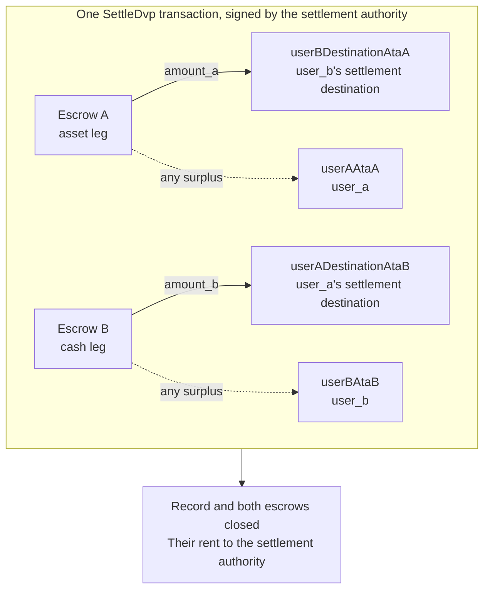

`SettleDvp`는 거래 레코드에 지정된 정산 권한자가 서명합니다. 하나의 트랜잭션에서 자산 레그의 `amount_a`를 현금 레그 당사자의 수령 대상으로, 현금 레그의 `amount_b`를 자산 레그 당사자의 수령 대상으로 이동하고, 두 에스크로 중 어느 쪽이든 초과분이 있으면 해당 레그의 당사자에게 반환하며, 레코드와 두 에스크로를 닫습니다. 이 전송 중 하나라도 완료할 수 없으면 명령어가 실패하고 아무것도 이동하지 않습니다.

이 페이지는 [거래 생성](/docs/defi/dvp-program/create-a-trade)과 [레그 펀딩](/docs/defi/dvp-program/fund-the-legs)에서 이어지며, 클라이언트, 서명자, `trade`, 그리고 당사자들의 token account를 그대로 사용합니다.

## 서명 전 다시 검증하기

정산 권한자는 두 레그를 이동하는 트랜잭션에 서명하므로, 서명하기 전에 각 당사자와 동일한 방식으로 소유자, 크기, 당사자, 민트, 금액, 만료 시점, 그리고 두 수령 대상을 읽어 확인합니다([레그 펀딩](/docs/defi/dvp-program/fund-the-legs#verify-the-terms) 참조). 프로그램 자체도 정산 시점에 각 민트가 생성 시 기록된 token program에 여전히 속해 있는지, 차단된 확장 기능이 없는지, 거래 생성 시와 동일한 민트 권한을 가지고 있는지 다시 확인합니다. 따라서 차단된 확장 기능이 추가되었거나, 다른 token program을 사용하거나, 민트 권한이 다른 상태로 다시 생성된 민트는 정산할 수 없습니다.

## 수령 계정 생성하기

Settle은 프로그램이 생성하지 않는 네 개의 token account에 기록합니다.

| 계정                | 수령 항목                     | 소유자                           |
| ---------------------- | ---------------------------- | ------------------------------- |
| `userADestinationAtaB` | 현금 레그(`amount_b`)    | `user_a_settlement_destination` |
| `userBDestinationAtaA` | 자산 레그(`amount_a`)   | `user_b_settlement_destination` |
| `userAAtaA`            | 자산 레그의 초과분 | `user_a`                        |
| `userBAtaB`            | 현금 레그의 초과분  | `user_b`                        |

초과분 계정은 에스크로에 합의된 금액보다 많은 금액이 있을 때만 사용되지만, 해당 민트를 보유한 누구나 에스크로에 최소 단위 몇 개를 보내 초과분을 만들 수 있습니다. 환불 계정이 존재하지 않으면 Settle 전체가 실패하므로, 네 계정 모두를 같은 트랜잭션에서 멱등성을 유지하며 생성하세요.

<Tabs items={["TypeScript", "Rust"]}>
  <Tab value="TypeScript">
    ```ts
    import {
      findAssociatedTokenPda,
      getCreateAssociatedTokenIdempotentInstruction,
    } from "@solana-program/token-2022";

    const destinationA = t.userASettlementDestination; // defaults to userA
    const destinationB = t.userBSettlementDestination; // defaults to userB

    const [userADestinationAtaB] = await findAssociatedTokenPda({
      mint: mintB,
      owner: destinationA,
      tokenProgram: tokenProgramB,
    });
    const [userBDestinationAtaA] = await findAssociatedTokenPda({
      mint: mintA,
      owner: destinationB,
      tokenProgram: tokenProgramA,
    });
    // userAAtaA and userBAtaB are from fund the legs.

    const createRecipientAccounts = [
      { ata: userADestinationAtaB, owner: destinationA, mint: mintB, tokenProgram: tokenProgramB },
      { ata: userBDestinationAtaA, owner: destinationB, mint: mintA, tokenProgram: tokenProgramA },
      { ata: userAAtaA, owner: userA, mint: mintA, tokenProgram: tokenProgramA },
      { ata: userBAtaB, owner: userB, mint: mintB, tokenProgram: tokenProgramB },
    ].map(({ ata, owner, mint, tokenProgram }) =>
      getCreateAssociatedTokenIdempotentInstruction({
        payer: authoritySigner,
        ata,
        owner,
        mint,
        tokenProgram,
      }),
    );
    ```

  </Tab>

  <Tab value="Rust">
    ```rust
    use spl_associated_token_account_client::address::get_associated_token_address_with_program_id;
    use spl_associated_token_account_client::instruction::create_associated_token_account_idempotent;

    let authority: Pubkey = pubkey!("SETTLEMENT_AUTHORITY_ADDRESS_HERE");
    let destination_a = trade.user_a_settlement_destination; // defaults to user_a
    let destination_b = trade.user_b_settlement_destination; // defaults to user_b

    let user_a_destination_ata_b =
        get_associated_token_address_with_program_id(&destination_a, &mint_b, &token_program_b);
    let user_b_destination_ata_a =
        get_associated_token_address_with_program_id(&destination_b, &mint_a, &token_program_a);
    let user_a_ata_a = get_associated_token_address_with_program_id(&user_a, &mint_a, &token_program_a);
    let user_b_ata_b = get_associated_token_address_with_program_id(&user_b, &mint_b, &token_program_b);

    let create_recipient_accounts = [
        create_associated_token_account_idempotent(&authority, &destination_a, &mint_b, &token_program_b),
        create_associated_token_account_idempotent(&authority, &destination_b, &mint_a, &token_program_a),
        create_associated_token_account_idempotent(&authority, &user_a, &mint_a, &token_program_a),
        create_associated_token_account_idempotent(&authority, &user_b, &mint_b, &token_program_b),
    ];
    ```

  </Tab>
</Tabs>

## 정산

`legAExtrasCount`는 고정 목록 뒤에 추가된 계정 중 몇 개가 자산 레그 전송의 transfer hook에 속하는지를 프로그램에 알려 주며, 나머지는 현금 레그의 transfer hook에 속합니다. transfer hook이 없는 민트의 경우 0을 전달하고 아무것도 추가하지 마세요. memo program account는 명령어에 필수이며, 메모가 필요한 수령 대상에만 사용됩니다.

<Tabs items={["TypeScript", "Rust"]}>
  <Tab value="TypeScript">
    ```ts
    import { MEMO_PROGRAM_ADDRESS } from "@solana-program/memo";
    import { getSettleDvpInstruction } from "./dvp";

    const settleInstruction = getSettleDvpInstruction({
      settlementAuthority: authoritySigner,
      swapDvp,
      mintA,
      mintB,
      dvpAtaA: escrowA,
      dvpAtaB: escrowB,
      userADestinationAtaB,
      userBDestinationAtaA,
      userAAtaA,
      userBAtaB,
      tokenProgramA,
      tokenProgramB,
      memoProgram: MEMO_PROGRAM_ADDRESS,
      legAExtrasCount: 0,
    });

    const { context: settleContext } = await client.sendTransaction([
      ...createRecipientAccounts,
      settleInstruction,
    ]);
    const settleSignature = settleContext.signature;
    console.log("Submitted:", settleSignature);

    // sendTransaction returns at the client's commitment (confirmed by default).
    // Wait for finalized before recording the trade as settled.
    let finalized = false;
    for (let attempt = 0; attempt < 30 && !finalized; attempt++) {
      const {
        value: [status],
      } = await client.rpc.getSignatureStatuses([settleSignature]).send();
      if (status?.err) {
        throw new Error("Settle transaction failed");
      }
      finalized = status?.confirmationStatus === "finalized";
      if (!finalized) {
        await new Promise((resolve) => setTimeout(resolve, 2_000));
      }
    }
    if (!finalized) {
      // A closed record means it settled; an open one is safe to settle again.
      throw new Error("Settle not finalized after 60s; read the trade record");
    }
    console.log("Settled:", settleSignature);
    ```

  </Tab>

  <Tab value="Rust">
    ```rust
    use dvp_swap_program_client::instructions::SettleDvpBuilder;

    const MEMO_PROGRAM_ID: Pubkey = pubkey!("MemoSq4gqABAXKb96qnH8TysNcWxMyWCqXgDLGmfcHr");

    let settle_ix = SettleDvpBuilder::new()
        .settlement_authority(authority)
        .swap_dvp(swap_dvp)
        .mint_a(mint_a)
        .mint_b(mint_b)
        .dvp_ata_a(escrow_a)
        .dvp_ata_b(escrow_b)
        .user_a_destination_ata_b(user_a_destination_ata_b)
        .user_b_destination_ata_a(user_b_destination_ata_a)
        .user_a_ata_a(user_a_ata_a)
        .user_b_ata_b(user_b_ata_b)
        .token_program_a(token_program_a)
        .token_program_b(token_program_b)
        .memo_program(MEMO_PROGRAM_ID)
        .leg_a_extras_count(0)
        .instruction();
    ```

  </Tab>
</Tabs>



### Transfer hook

생성된 IDL에는 고정 계정만 나열되므로, 생성된 빌더는 hook 계정에 대해 알지 못합니다. 해당 토큰을 직접 전송할 때와 같은 방식으로 각 hook 민트의 추가 계정 메타를 확인한 다음, 이를 명령어에 추가하세요. 자산 레그의 계정을 먼저, 그다음 현금 레그의 계정을 추가하고, `legAExtrasCount`에는 첫 번째 그룹의 개수를 설정합니다. TypeScript에서는 확인된 메타를 명령어의 `accounts` 배열에 펼쳐서 넣고, Rust에서는 빌더의 `add_remaining_accounts`를 사용합니다. 레그당 상한은 hook 프로그램과 검증 계정을 포함하여 32개이며, 두 레그 모두에 hook이 있는 경우 트랜잭션 계정 한도에 먼저 도달할 수 있습니다. 프로그램은 전달되는 모든 계정에서 서명자 플래그를 제거하므로, hook은 이 경로를 통해 정산 권한자의 서명을 얻을 수 없습니다.

## 결과 기록하기

Settle 트랜잭션이 `finalized`에 도달했을 때 거래가 정산된 것으로 간주하세요. 정산 후에는 레코드와 두 에스크로가 더 이상 존재하지 않으므로, 나중에 조건이 필요한 시스템은 정산 전에 읽어 둔 값이나 생성 트랜잭션에서 가져와 저장해야 합니다. 닫힌 계정의 rent는 정산 권한자에게 귀속되었습니다.

## 정산 오류

`LegNotFunded`는 에스크로에 합의된 금액보다 적은 금액이 있다는 뜻이고, `DvpExpired`와 `SettlementTooEarly`는 시간 범위를 놓쳤다는 뜻입니다. `MintAuthorityChanged`와 `BlockedMintExtension`은 생성 이후 민트가 변경되었다는 뜻이며, `RecipientAtaMismatch`는 수령 대상 또는 환불 token account가 없거나 더 이상 예상된 소유자와 민트에 속하지 않는다는 뜻으로, 대개 위의 계정 생성 단계를 건너뛰었기 때문입니다. 어떤 경우든 아무것도 이동하지 않았으며, 당사자들은 민트 권한의 제약 하에 거래를 되돌릴 수 있습니다([거래 되돌리기](/docs/defi/dvp-program/unwind-a-trade) 참조).

## 다음 단계

- [거래 되돌리기](/docs/defi/dvp-program/unwind-a-trade): 거래가 정산되지 않을 때 펀딩된 레그 회수하기
