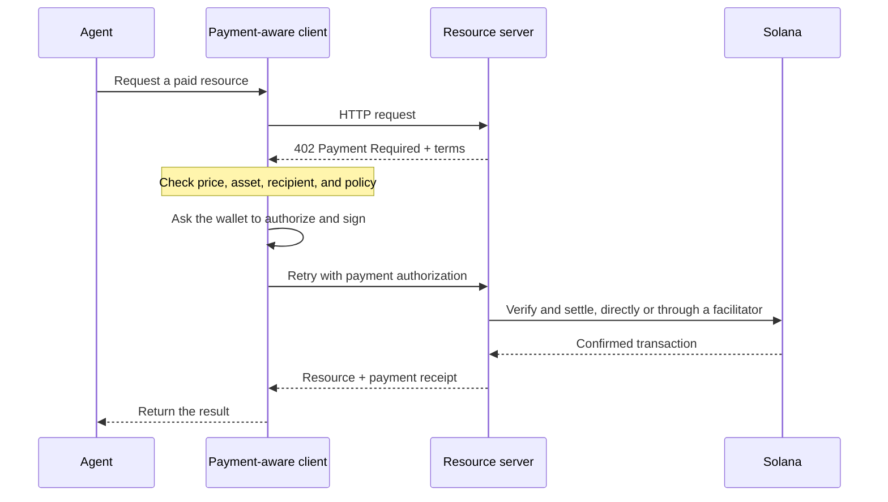

에이전트 결제를 사용하면 소프트웨어가 동일한 HTTP 워크플로 안에서 가격을 확인하고, 결제를 승인하고,
리소스를 받을 수 있습니다. 에이전트는 결제 계정을 먼저 만들거나 API 키를 복사하지 않고도 데이터 쿼리, 모델
추론, 도구 호출에 대한 비용을 지불할 수 있습니다.

<Cards>
  <Card title="MPP" href="/docs/payments/agentic-payments/mpp">
    일회성 결제와 사용량 기반 결제 세션에 HTTP 인증을 사용하세요.
  </Card>
  <Card title="x402" href="/docs/payments/agentic-payments/x402">
    HTTP 리소스에 x402 V2 결제 요구 사항, 서명, 정산을 추가하세요.
  </Card>
</Cards>

## 공통 결제 흐름

MPP와 x402는 서로 다른 헤더와 데이터 모델을 사용하지만, 기본적인 HTTP 흐름은
비슷합니다.

## MPP와 x402

두 프로토콜 모두 Solana에서 스테이블코인 결제를 정산할 수 있습니다. 공통으로 사용하는 `402`
상태 코드만 볼 것이 아니라, 서비스에 필요한 결제 모델과 상호 운용성을 기준으로 선택하세요.

|                         | MPP                                                               | x402                                                                     |
| ----------------------- | ----------------------------------------------------------------- | ------------------------------------------------------------------------ |
| 챌린지               | `WWW-Authenticate: Payment`                                       | `PAYMENT-REQUIRED`                                                       |
| 클라이언트 승인    | `Authorization: Payment`                                          | `PAYMENT-SIGNATURE`                                                      |
| 영수증                 | `Payment-Receipt`                                                 | `PAYMENT-RESPONSE`                                                       |
| Solana 결제 모델   | 일회성 `charge` 및 한도가 있는 사용량 기반 `session` 인텐트           | `exact`, `upto` 등의 스킴, 지원 여부는 네트워크와 클라이언트에 따라 다름 |
| 정산 아키텍처 | 서버 검증 또는 선택적 릴레이나 게이트웨이                | 로컬 검증을 수행하는 리소스 서버 또는 퍼실리테이터                 |
| 시작하기 좋은 용도     | HTTP 인증 방식이나 반복적인 사용량 측정이 필요한 API | 요청당 결제 방식의 리소스 및 기존 x402 클라이언트                      |

MPP는 **Machine Payments Protocol**의 약자입니다. **Model
Context Protocol(MCP)**과 혼동하지 마세요. MCP는 에이전트에 도구와 리소스를 제공하며, 에이전트가 해당 도구를 호출할 때 MPP 또는 x402로
결제를 요구할 수 있습니다.

<Callout type="info">
  서비스는 둘 이상의 프로토콜을 제공할 수 있습니다. 클라이언트는 지원하는 결제
  옵션을 선택한 다음, 전체 교환 과정에서 해당 옵션에 맞는 챌린지, 승인, 영수증
  헤더를 사용합니다.
</Callout>
