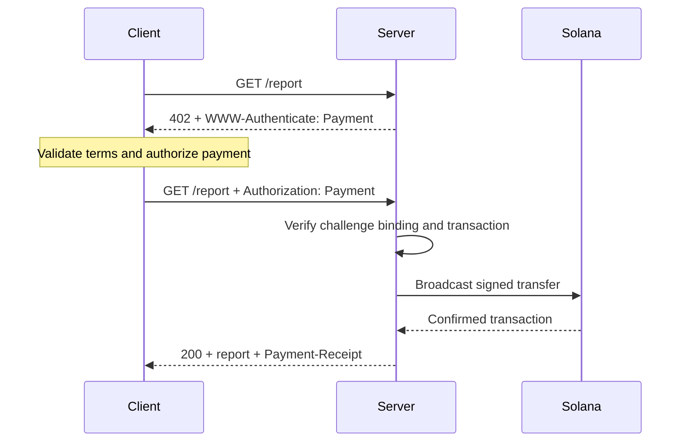
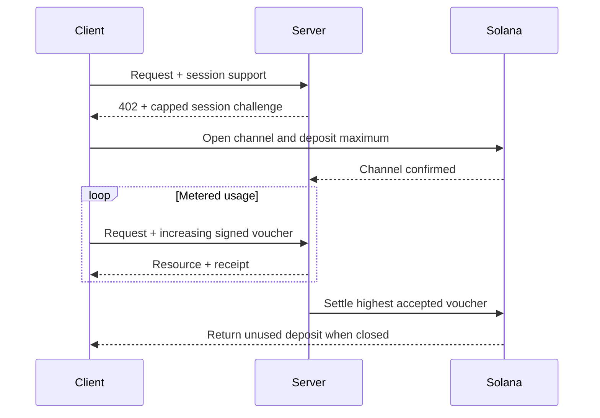

[Machine Payments Protocol(MPP)](https://mpp.dev/)는 HTTP 인증 시맨틱을 결제에 적용합니다. 서버가 미결제 요청에 챌린지를 보내면,
클라이언트는 결제 자격 증명을 반환하고, 서버는 결제를 수락한 뒤
영수증을 반환합니다.

MPP는 세 가지 관심사를 분리합니다.

- **intent**는 일회성 `charge` 또는 사용량 기반 `session`과 같은
  상거래 상호작용을 설명합니다.
- **결제 방식(payment method)**은 가치가 이동하는 방법을 설명합니다. Solana 방식은 charge에
  대해 네이티브 SOL과 SPL 토큰을 지원합니다.
- HTTP **트랜스포트(transport)**는 챌린지, 자격 증명, 영수증, 오류를 전달합니다.

MPP는 Internet-Draft 문서 모음으로 게시되어 있습니다.
[최신 사양](https://paymentauth.org/)을 기준 문서로 삼고, 초안이 작업 중인 동안에는
세부 내용이 바뀔 수 있음을 염두에 두세요.

## HTTP 교환

MPP는 프로토콜 전용 결제 헤더 대신 표준 HTTP 인증 필드를 사용합니다.

| 메시지                 | HTTP 표현                                         |
| ----------------------- | ----------------------------------------------------------- |
| 결제 챌린지       | `WWW-Authenticate: Payment ...`를 포함한 `402 Payment Required` |
| 결제 자격 증명      | `Authorization: Payment ...`를 포함해 다시 시도한 요청           |
| 결제 성공 영수증      | `Payment-Receipt: ...`를 포함한 리소스 응답               |
| 잘못된 결제 세부 정보 | `application/problem+json`을 사용하는 Problem Details 본문       |



챌린지에는 서버가 생성한 ID, realm, 방식(method), intent, 인코딩된 결제 요청, 만료 시간이 포함됩니다. 자격 증명은 챌린지를 그대로 반환하고
방식별 결제 증명을 추가합니다. 서버는 두 가지를 모두 검증해야 하며,
다른 챌린지에 속한 유효한 전송으로는 리소스를 열 수 없어야 합니다.

## Solana 일회성 결제

Solana `charge` intent는 두 가지 자격 증명 유형을 지원합니다.

- **Pull 모드**는 서명된 트랜잭션을 사용합니다. 클라이언트가 전송에 서명하고
  트랜잭션을 서버로 보냅니다. 서버는 이를 검증하고, 필요하면 수수료 지불자 서명을 추가한 뒤
  브로드캐스트하고 확정하며, 영수증에 트랜잭션 서명을 담아 반환합니다.
- **Push 모드**는 트랜잭션 서명을 사용합니다. 클라이언트가 먼저 브로드캐스트한 다음
  확정된 서명을 서버로 보냅니다. 서버는 트랜잭션을 조회하고 검증한 후
  리소스를 반환합니다.

Pull 모드에서는 서버가 트랜잭션 수수료를 대신 부담할 수 있고 서버 측 재시도 로직을 사용할 수 있습니다.
Push 모드는 지갑이 클라이언트가 직접 트랜잭션을 제출하도록 요구할 때 유용하지만,
서버의 수수료 대납은 사용할 수 없습니다.

규범적 필드와 검증 규칙은
[Solana charge 사양](https://paymentauth.org/draft-solana-charge-00.html)을 참고하세요.

## Express API에 MPP 결제 추가하기

Solana Pay Kit은 MPP와 x402를 위한 최신 TypeScript 통합을 제공합니다.
Express와 함께 설치하세요.

```bash
pnpm add @solana/pay-kit @solana/kit@^6.9.0 express
pnpm add --save-dev @types/express tsx
```

이 가장 간단한 예제는 호스팅되는 Surfpool 샌드박스와 패키지의 공개
데모 수신자를 사용합니다. 로컬 개발 전용입니다.

```ts filename=server.ts
import express from "express";
import { createPayKit, usd } from "@solana/pay-kit";

const pay = await createPayKit({
  accept: ["mpp"],
  rpcUrl: "https://402.surfnet.dev:8899"
});

const app = express();

app.get("/report", pay.express(usd("0.01")), (_req, res) => {
  res.json({ report: "Paid report" });
});

app.listen(4567, () => {
  console.log("Paid API listening on http://127.0.0.1:4567");
});
```

실행한 다음, 미결제 요청과 결제 인식 요청을 비교해 보세요.

```bash
pnpm tsx server.ts
curl -i http://127.0.0.1:4567/report
pay --sandbox curl http://127.0.0.1:4567/report
```

라우트 핸들러는 미들웨어가 결제를 수락한 후에만 실행됩니다.

<Callout type="warn" title="프로덕션에서는 모든 샌드박스 기본값을 교체하세요">
  명시적인 네트워크, 판매자 수신자, 전용 RPC, 안정적인
  챌린지 바인딩 시크릿, 프로덕션 서명자, 영구적인 리플레이 저장소를 설정하세요. 실제 결제를
  패키지 데모 서명자로 절대 보내지 마세요.
</Callout>

## 사용량 기반 세션

클라이언트가 서로 관련된 소액 결제를 여러 번 수행할 때는 Solana MPP `session`을 사용하세요.
세션은 최대 예치금을 설정해 온체인 결제 채널을 열고, 사용량이 늘어남에 따라
누적 서명 바우처를 사용합니다. 서버는 바우처를 오프체인에서 검증하고
수락된 최고 금액을 나중에 정산할 수 있습니다.

이는 토큰 단위 추론, 바이트 단위 다운로드, 실시간 데이터,
반복적인 도구 호출에 유용합니다. 이벤트마다 별도의 온체인 결제를 전송하는 것과는
다릅니다.



세션은 **세션 결제**, **결제 채널**, 또는 **한도가 있는 반복 승인**이라고 부르세요. 서비스와 결제 계약이 실제로 사용량 스트림을 측정하는 경우에만
스트리밍 결제라고 부르세요.

## 프로덕션 검증

모든 Solana 결제에 대해 서버는 최소한 다음을 검증해야 합니다.

- 챌린지가 진본이고, 만료되지 않았으며, 이 요청에 바인딩되어 있고, 이 realm을 대상으로 합니다.
- 트랜잭션이 예상된 네트워크, 자산 또는 민트, 수신자, 금액,
  Token Program을 사용합니다.
- 수수료 지불자 또는 associated token account 명령어는 명시적으로
  허용되어 있으며 서버 서명자의 자금을 빼갈 수 없습니다.
- 트랜잭션이 요구되는 커밋먼트 수준에서 성공했습니다.
- 트랜잭션 서명이 이미 사용되지 않았습니다.
- 리플레이 검사와 소비 작업은 모든 서버 인스턴스에 걸쳐 원자적입니다.

세션의 경우 채널 상태, 수락된 누적 금액, 정산 워터마크도
공유 저장소에 영구 저장하세요. 서버를 사용할 수 없게 되었을 때 클라이언트가 사용하지 않은
자금을 회수하는 방법도 문서화하세요.

## 관련 리소스

- [MPP 사양](https://paymentauth.org/)
- [MPP 프로토콜 문서](https://mpp.dev/protocol)
- [Solana Pay Kit](https://github.com/solana-foundation/pay-kit)
- [에이전트 결제 개요](/docs/payments/agentic-payments)
- [프로덕션 준비 상태](/docs/tools/production-readiness)
