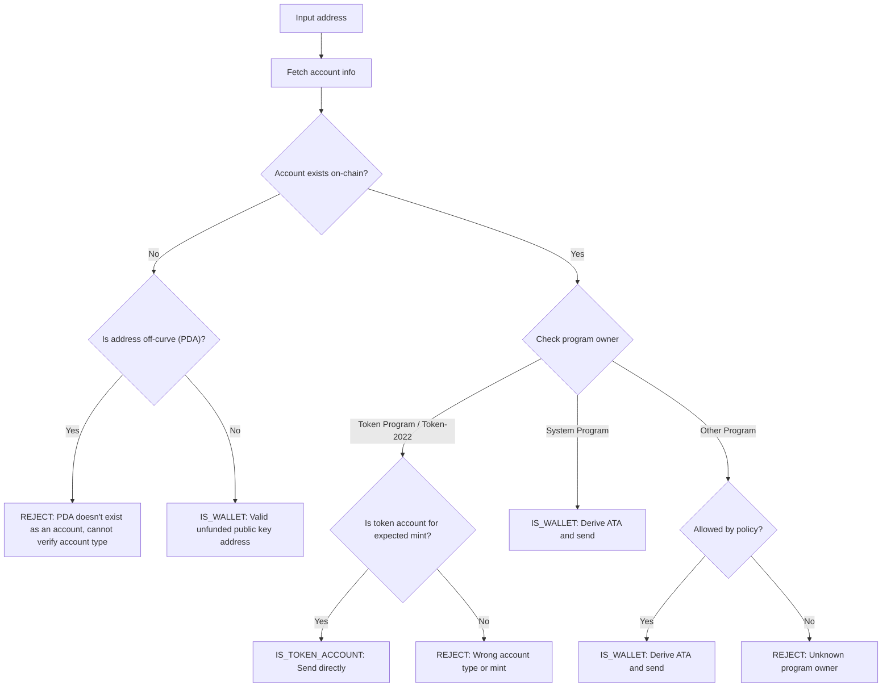

잘못된 주소로 토큰을 보내면 자금이 영구적으로 손실될 수 있습니다. 주소 확인을
통해 토큰을 올바르게 수신하고 액세스할 수 있는 주소로만 토큰을 보낼 수 있습니다.

<Callout>
  핵심 결제 개념은 [Solana에서 결제가 작동하는
  방식](/docs/payments/how-payments-work)을 참조하세요.
</Callout>

## Solana 주소 이해하기

Solana 계정에는 온커브와 오프커브라는 두 가지 유형의 주소가 있습니다.

### 온커브 주소

표준 주소는 Ed25519 키페어의 공개 키입니다. 이러한 주소는:

- 트랜잭션에 서명할 수 있는 해당 개인 키를 가지고 있습니다
- 지갑 주소로 사용됩니다

### 오프커브 주소 (PDA)

[프로그램 파생 주소](/docs/core/pda)는 프로그램 ID와 시드에서 결정론적으로
파생됩니다. 이러한 주소는:

- 해당 개인 키를 가지고 있지 **않습니다**
- 주소가 파생된 프로그램에 의해서만 서명될 수 있습니다

## 결제의 계정 유형

주소를 사용하여 네트워크에서 [계정](/docs/core/accounts)을 가져오고, 프로그램
소유자와 계정 유형을 확인하여 주소를 처리하는 방법을 결정하세요.

<Callout>
  주소가 온커브인지 오프커브인지 아는 것만으로는 계정 유형, 소유 프로그램, 또는
  해당 주소에 계정이 존재하는지 알 수 없습니다. 이러한 세부 정보를 확인하려면
  네트워크에서 계정을 가져와야 합니다.
</Callout>

### System Program 계정 (지갑)

System Program이 소유한 계정은 표준 지갑입니다. 지갑으로 SPL 토큰을 보내려면
해당
[associated token account (ATA)](/docs/tokens/basics/create-token-account#whats-an-associated-token-account)를
파생하여 사용하세요.

ATA 주소를 파생한 후 토큰 계정이 온체인에 존재하는지 확인하세요. ATA가 존재하지
않는 경우, 전송과 동일한 트랜잭션에 수신자의 토큰 계정을 생성하는 명령을 포함할
수 있습니다. 그러나 이를 위해서는 새 토큰 계정에 대한 rent를 지불해야 합니다.
수신자가 ATA를 소유하므로 rent로 지불된 SOL은 발신자가 회수할 수 없습니다.

<Callout type="warn">
  안전장치가 없으면 ATA 생성 보조금이 악용될 수 있습니다. 악의적인 사용자가
  전송을 요청하고, 귀하의 비용으로 ATA를 생성한 후, ATA를 닫아 rent SOL을
  회수하고, 이를 반복할 수 있습니다.
</Callout>

### Token accounts

[Token accounts](/docs/tokens/basics/create-token-account)는 Token Program 또는
Token-2022 Program이 소유하며 토큰 잔액을 보유합니다. 받은 주소가 토큰 프로그램
소유인 경우, 전송하기 전에 해당 계정이 token account(mint account가 아님)이고
예상되는 토큰 mint account와 일치하는지 확인해야 합니다.

<Callout type="info">
  Token Programs는 전송 시 두 token accounts가 동일한 mint의 토큰을 보유하고
  있는지 자동으로 검증합니다. 검증이 실패하면 트랜잭션이 거부되며 자금 손실은
  발생하지 않습니다.
</Callout>

### Mint accounts

[Mint accounts](/docs/tokens/basics/create-mint)는 특정 토큰의 공급량과
메타데이터를 추적합니다. Mint accounts도 Token Programs가 소유하지만 토큰 전송의
유효한 수신자가 **아닙니다**. Mint 주소로 토큰을 전송하려고 하면 트랜잭션이
실패하지만 자금 손실은 발생하지 않습니다.

### 기타 계정

다른 프로그램이 소유한 계정은 정책 결정이 필요합니다. 일부 계정(예: 다중 서명
지갑)은 유효한 token account 소유자일 수 있지만, 다른 계정은 거부되어야 합니다.

## 검증 흐름

다음 다이어그램은 주소 검증을 위한 참조 의사결정 트리를 보여줍니다:



<Steps>
<Step>

### 계정 가져오기

주소를 사용하여 네트워크에서 계정 세부 정보를 가져옵니다.

</Step>
<Step>

### 계정이 존재하지 않음

이 주소에 계정이 존재하지 않는 경우, 주소가 온커브(on-curve)인지
오프커브(off-curve)인지 확인합니다:

- **오프커브 (PDA)**: 접근할 수 없는 ATA로 전송하는 것을 방지하기 위해
  보수적으로 주소를 거부합니다. 기존 계정이 없으면 주소만으로는 어떤 프로그램이
  이 PDA를 파생했는지 또는 해당 주소가 ATA용인지 확인할 수 없습니다. 이 주소에
  대한 ATA를 파생하여 토큰을 전송하면 접근할 수 없는 토큰 계정에 자금이 잠길 수
  있습니다.

- **온커브**: 아직 자금이 입금되지 않은 유효한 지갑 주소(공개 키)입니다. ATA를
  파생하고 존재하는지 확인한 후 토큰을 전송합니다. ATA가 존재하지 않는 경우 생성
  비용을 부담할지 여부에 대한 정책 결정을 내려야 합니다.

</Step>
<Step>

### 계정이 존재하는 경우

계정이 존재하는 경우 어떤 프로그램이 소유하고 있는지 확인합니다:

- **시스템 프로그램**: 표준 지갑입니다. ATA를 파생하고 존재하는지 확인한 후
  토큰을 전송합니다. ATA가 존재하지 않는 경우 생성 비용을 부담할지 여부에 대한
  정책 결정을 내려야 합니다.

- **토큰 프로그램 / Token-2022**: 계정이 토큰 계정(민트 계정이 아님)이고
  전송하려는 토큰(민트)을 보유하고 있는지 확인합니다. 유효한 경우 이 주소로 직접
  토큰을 전송합니다. 민트 계정이거나 다른 민트의 토큰 계정인 경우 주소를
  거부합니다.

- **기타 프로그램**: 정책 결정이 필요합니다. 멀티시그 지갑과 같은 일부
  프로그램은 토큰 계정의 허용 가능한 소유자일 수 있습니다. 정책에서 허용하는
  경우 ATA를 파생하여 전송합니다. 그렇지 않으면 주소를 거부합니다.

</Step>
</Steps>

## 데모

다음 예제는 주소 검증 로직만 보여줍니다. 이것은 설명 목적의 참고 코드입니다.

<Callout>
  데모에서는 ATA를 파생하거나 토큰을 전송하는 트랜잭션을 구축하는 방법을
  보여주지 않습니다. 예제 코드는 [token
  account](/docs/tokens/basics/create-token-account#how-to-create-an-associated-token-account)
  및 [token transfer](/docs/tokens/basics/transfer-tokens) 문서를 참조하세요.
</Callout>

아래 데모는 세 가지 가능한 결과를 사용합니다:

| 결과               | 의미                 | 작업                                     |
| ------------------ | -------------------- | ---------------------------------------- |
| `IS_WALLET`        | 유효한 지갑 주소     | associated token account를 파생하여 전송 |
| `IS_TOKEN_ACCOUNT` | 유효한 token account | 이 주소로 토큰을 직접 전송               |
| `REJECT`           | 유효하지 않은 주소   | 전송하지 않음                            |

<CodeTabs flags="r">

```ts !! title="Demo"
// !collapse(1:35) collapsed

import {
  type Address,
  type Rpc,
  type GetAccountInfoApi,
  createSolanaRpc,
  fetchJsonParsedAccount,
  isOffCurveAddress,
  generateKeyPairSigner,
  getProgramDerivedAddress
} from "@solana/kit";

// =============================================================================
// Constants
// =============================================================================

const defaultRpc = createSolanaRpc("https://api.mainnet-beta.solana.com");

const SYSTEM_PROGRAM = "11111111111111111111111111111111" as Address;
const TOKEN_PROGRAM = "TokenkegQfeZyiNwAJbNbGKPFXCWuBvf9Ss623VQ5DA" as Address;
const TOKEN_2022_PROGRAM =
  "TokenzQdBNbLqP5VEhdkAS6EPFLC1PHnBqCXEpPxuEb" as Address;

// =============================================================================
// Validation Function
// =============================================================================

/**
 * Possible validation results for an input address.
 */
export type ValidationResult =
  | { type: "IS_TOKEN_ACCOUNT" }
  | { type: "IS_WALLET" }
  | { type: "REJECT"; reason: string };

/**
 * Validates an input address and classifies it as a wallet, token account, or invalid.
 *
 * @param inputAddress - The address to validate
 * @param rpc - Optional RPC client (defaults to mainnet)
 * @returns Classification result:
 *   - IS_WALLET: Valid wallet address
 *   - IS_TOKEN_ACCOUNT: Valid token account
 *   - REJECT: Invalid address for transfers
 */
export async function validateAddress(
  inputAddress: Address,
  rpc: Rpc<GetAccountInfoApi> = defaultRpc
): Promise<ValidationResult> {
  const account = await fetchJsonParsedAccount(rpc, inputAddress);
  // Log the account data for demo
  console.log("\nAccount:", account);

  // Account doesn't exist on-chain
  if (!account.exists) {
    // Off-curve = PDA that doesn't exist as an account
    // Reject conservatively to avoid sending to an address that may be inaccessible.
    if (isOffCurveAddress(inputAddress)) {
      return { type: "REJECT", reason: "PDA doesn't exist as an account" };
    }
    // On-curve = valid keypair address, treat as unfunded wallet
    return { type: "IS_WALLET" };
  }

  // Account exists, check program owner
  const owner = account.programAddress;

  // System Program = wallet
  if (owner === SYSTEM_PROGRAM) {
    return { type: "IS_WALLET" };
  }

  // Token Program or Token-2022, check if token account
  if (owner === TOKEN_PROGRAM || owner === TOKEN_2022_PROGRAM) {
    const accountType = (
      account.data as { parsedAccountMeta?: { type?: string } }
    ).parsedAccountMeta?.type;

    if (accountType === "account") {
      return { type: "IS_TOKEN_ACCOUNT" };
    }
    // Reject if not a token account (mint account)
    return {
      type: "REJECT",
      reason: "Not a token account"
    };
  }

  // Unknown program owner
  return { type: "REJECT", reason: "Unknown program owner" };
}

// =============================================================================
// Examples
// =============================================================================
// !collapse(1:1000) collapsed

// Wallets
const EXISTING_WALLET =
  "H8sMJSCQxfKiFTCfDR3DUMLPwcRbM61LGFJ8N4dK3WjS" as Address;
const NEW_WALLET = (await generateKeyPairSigner()).address;

// Token accounts
const USDC_TOKEN_ACCOUNT =
  "3emsAVdmGKERbHjmGfQ6oZ1e35dkf5iYcS6U4CPKFVaa" as Address;
const PYUSD_TOKEN_ACCOUNT =
  "47od2TPRvqJipfPVWZdyenLEngPw8hC36nDxiLyvGsEP" as Address;

// Token mints (should be rejected)
const USDC_MINT = "EPjFWdd5AufqSSqeM2qN1xzybapC8G4wEGGkZwyTDt1v" as Address;
const PYUSD_MINT = "2b1kV6DkPAnxd5ixfnxCpjxmKwqjjaYmCZfHsFu24GXo" as Address;

// PDA that doesn't exist (should be rejected)
const [NON_EXISTENT_PDA] = await getProgramDerivedAddress({
  programAddress: (await generateKeyPairSigner()).address,
  seeds: ["seed"]
});

// Program account (should be rejected)
const PROGRAM_ACCOUNT =
  "p1exdMJcjVao65QdewkaZRUnU6VPSXhus9n2GzWfh98" as Address;

async function runExample(label: string, address: Address) {
  console.log(`\n${"─".repeat(60)}`);
  console.log(`Example: ${label}`);
  console.log(`Input: ${address}`);
  console.log(`${"─".repeat(60)}`);

  const result = await validateAddress(address);
  console.log("\nResult:", result);
}

console.log("\n" + "═".repeat(60));
console.log("  IS_WALLET Examples");
console.log("═".repeat(60));

await runExample("Existing funded wallet", EXISTING_WALLET);
await runExample("New wallet (unfunded)", NEW_WALLET);

console.log("\n" + "═".repeat(60));
console.log("  IS_TOKEN_ACCOUNT Examples");
console.log("═".repeat(60));

await runExample("USDC token account (Token Program)", USDC_TOKEN_ACCOUNT);
await runExample("PYUSD token account (Token-2022)", PYUSD_TOKEN_ACCOUNT);

console.log("\n" + "═".repeat(60));
console.log("  REJECT Examples");
console.log("═".repeat(60));

await runExample("USDC mint address", USDC_MINT);
await runExample("PYUSD mint address", PYUSD_MINT);
await runExample("Non-existent PDA", NON_EXISTENT_PDA);
await runExample("Program account", PROGRAM_ACCOUNT);

console.log("\n" + "═".repeat(60));
console.log("  Done!");
console.log("═".repeat(60) + "\n");
```

</CodeTabs>
