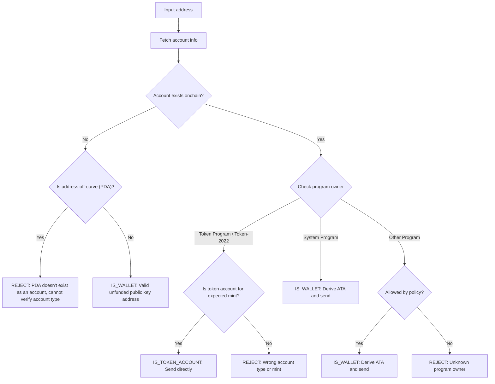

잘못된 주소로 자금을 보내면 영구적인 손실이 발생할 수 있습니다. 주소 검증을 통해
자금을 올바르게 수신하고 접근할 수 있는 주소로만 전송하도록 보장합니다.

유효성 검사는 전송하는 항목에 따라 달라집니다:

- **SPL 토큰**은 부분적으로 자체 보호 기능을 갖추고 있습니다. Token Program은
  계정이 예상된 민트와 일치하지 않는 전송을 거부하므로, 잘못된 주소로의 토큰
  전송은 자금 손실 없이 실패합니다. 이 페이지의 대부분은 SPL 토큰 전송을
  다룹니다.
- **네이티브 SOL**에는 이러한 보호 장치가 없습니다. System Program 전송은 어떤
  계정으로도 성공하므로, 잘못된 수신자에게 보내면 SOL이 영구적으로 잠깁니다.
  [네이티브 SOL 전송](#sending-native-sol)을 참조하세요.

<Callout>
  핵심 결제 개념은 [Solana에서 결제가 작동하는
  방식](/docs/payments/how-payments-work)을 참조하세요.
</Callout>

## Solana 주소 이해하기

Solana 계정에는 온커브(on-curve)와 오프커브(off-curve) 두 가지 유형의 주소가
있습니다.

### 온커브 주소

표준 주소는 Ed25519 keypair의 공개 키입니다. 이러한 주소는:

- 트랜잭션에 서명할 수 있는 개인 키가 존재합니다
- 지갑 주소로 사용됩니다

### 오프커브 주소 (PDA)

[Program Derived Address](/docs/core/pda)는 프로그램 ID와 시드로부터
결정론적으로 도출됩니다. 이러한 주소는:

- 대응하는 개인 키가 **없습니다**
- 해당 주소가 도출된 프로그램에 의해서만 서명될 수 있습니다

## 결제에서의 계정 유형

주소를 사용하여 네트워크에서 [계정](/docs/core/accounts)을 조회하고, 프로그램
소유자와 계정 유형을 확인하여 해당 주소를 어떻게 처리할지 결정하세요.

<Callout>
  주소가 온커브인지 오프커브인지 알더라도 계정의 유형, 소유 프로그램, 또는 해당
  주소에 계정이 존재하는지 여부는 알 수 없습니다. 이러한 세부 정보를 확인하려면
  네트워크에서 계정을 직접 조회해야 합니다.
</Callout>

### System Program 계정 (지갑)

System Program이 소유한 계정은 일반 지갑입니다. 지갑에 SPL 토큰을 전송하려면
해당 지갑의
[Associated Token Account (ATA)](/docs/tokens/basics/create-token-account#what-is-an-associated-token-account)를
파생하여 사용하세요.

ATA 주소를 파생한 후, 해당 token account가 온체인에 존재하는지 확인하세요. ATA가
존재하지 않는 경우, 전송과 동일한 트랜잭션에 수신자의 token account를 생성하는
명령을 포함할 수 있습니다. 단, 이 경우 새 token account에 대한 rent를 지불해야
합니다. 수신자가 ATA를 소유하므로, rent로 지불된 SOL은 송신자가 회수할 수
없습니다.

<Callout type="warn">
  안전장치 없이 ATA 생성 비용을 대신 부담하면 악용될 수 있습니다. 악의적인
  사용자가 전송을 요청하여 비용 없이 ATA를 생성하고, ATA를 닫아 rent SOL을
  회수한 뒤 이를 반복할 수 있습니다.
</Callout>

### Token Accounts

[Token accounts](/docs/tokens/basics/create-token-account)는 Token Program 또는
Token-2022 Program이 소유하며 토큰 잔액을 보관합니다. 수신한 주소가 token
program의 소유인 경우, 해당 계정이 token account인지(mint account가 아닌지)
확인하고, 전송 전에 예상되는 token mint account와 일치하는지 검증해야 합니다.

<Callout type="info">
  Token Program은 전송 시 두 token account 모두 동일한 mint의 토큰을 보유하고
  있는지 자동으로 검증합니다. 검증에 실패하면 트랜잭션이 거부되며 자금은
  손실되지 않습니다.
</Callout>

### Mint Accounts

[Mint accounts](/docs/tokens/basics/create-mint)는 특정 토큰의 공급량과
메타데이터를 추적합니다. Mint accounts 역시 Token Program이 소유하지만 토큰
전송의 유효한 수신자가 **아닙니다**. mint 주소로 토큰을 전송하려 하면 트랜잭션이
실패하지만, 자금은 손실되지 않습니다.

### 다른 계정

다른 프로그램이 소유한 계정은 정책적 판단이 필요합니다. 일부 계정(예: 멀티시그
지갑)은 유효한 token account 소유자일 수 있지만, 다른 계정은 거부되어야 합니다.

## 네이티브 SOL 전송

위의 분류는 SPL 토큰이 전송될 수 있는 곳을 결정합니다. 네이티브 SOL은 더욱
엄격합니다: 유일하게 안전한 수신자는 **System Program 지갑**(또는 하나가 될 수
있는 미개설 온-커브 주소)입니다.

System Program 전송은 민트, token account, 프로그램, PDA를 포함한 모든 계정에
lamport를 추가합니다. lamport는 해당 계정의 소유 프로그램만이 인출할 수
있으므로, 잘못된 수신자에게 SOL을 전송하면 자금이 영구적으로 손실될 수 있습니다.

SPL 토큰 전송과 달리, 수신자가 예상치 못한 주소인 경우에도 트랜잭션은 **실패하지
않습니다**.

네이티브 SOL을 전송할 때, `IS_WALLET` 결과만 허용됩니다. `IS_TOKEN_ACCOUNT`는
**허용되지 않습니다**: token account는 SPL 토큰을 보관하며, 그곳으로 전송된
SOL은 발신자의 통제 밖에 있습니다.

<Callout type="warn">
  이는 SOL이 손실되는 흔한 방법입니다: 사용자가 토큰의 민트 주소(또는 프로그램
  주소)를 SOL 출금 시 붙여넣는 경우입니다. 전송은 성공하지만 SOL은 복구할 수
  없습니다. SOL 전송에 서명하기 전에 항상 수신자를 분류하세요.
</Callout>

## 검증 흐름

다음 다이어그램은 주소 유효성 검사를 위한 참조 의사결정 트리를 보여줍니다:


```mermaid title="Address Verification Flow"
flowchart TD
    A["Input address"]
    B["Fetch account info"]

    A --> B
    B --> C{"Account exists onchain?"}

    %% --- Non-existent account path ---
    C -- "No" --> D{"Is address off-curve (PDA)?"}
    D -- "Yes" --> R1["REJECT: PDA doesn't exist as an account, cannot verify account type"]
    D -- "No" --> W1["IS_WALLET: Valid unfunded public key address"]

    %% --- Existing account path ---
    C -- "Yes" --> F{"Check program owner"}

    F -- "Token Program / Token-2022" --> G{"Is token account for expected mint?"}
    G -- "Yes" --> T1["IS_TOKEN_ACCOUNT: Send directly"]
    G -- "No" --> R2["REJECT: Wrong account type or mint"]

    F -- "System Program" --> W2["IS_WALLET: Derive ATA and send"]

    F -- "Other Program" --> K{"Allowed by policy?"}
    K -- "Yes" --> W3["IS_WALLET: Derive ATA and send"]
    K -- "No" --> R3["REJECT: Unknown program owner"]
```

<Steps>
<Step>

### 계정 가져오기

주소를 사용하여 네트워크에서 계정 정보를 가져옵니다.

</Step>
<Step>

### 계정이 존재하지 않는 경우

이 주소에 계정이 존재하지 않는 경우, 해당 주소가 온-커브인지 오프-커브인지
확인하세요:

- **오프-커브(PDA)**: 접근이 불가능할 수 있는 ATA로 전송하는 것을 방지하기 위해
  보수적으로 주소를 거부하세요. 기존 계정이 없으면 주소만으로는 어떤 프로그램이
  이 PDA를 파생했는지 또는 해당 주소가 ATA용인지 확인할 수 없습니다. 토큰 전송을
  위해 이 주소의 ATA를 파생하면 접근 불가능한 token account에 자금이 잠길 수
  있습니다.

- **온체인(On-curve)**: 아직 자금이 입금되지 않은 유효한 지갑 주소(공개
  키)입니다. ATA를 유도하고, 존재 여부를 확인한 후 토큰을 전송하세요. ATA가
  존재하지 않는 경우 생성 비용을 부담할지 여부에 대한 정책 결정이 필요합니다.

</Step>
<Step>

### 계정이 존재하는 경우

계정이 존재하는 경우, 해당 계정을 소유한 프로그램을 확인하세요:

- **System Program**: 일반 지갑입니다. ATA를 유도하고, 존재 여부를 확인한 후
  토큰을 전송하세요. ATA가 존재하지 않는 경우 생성 비용을 부담할지 여부에 대한
  정책 결정이 필요합니다.

- **Token Program / Token-2022**: 해당 계정이 token account인지(mint account가
  아닌지) 확인하고, 전송하려는 토큰(mint)을 보유하고 있는지 확인하세요.
  유효하다면 이 주소로 직접 토큰을 전송하세요. mint account이거나 다른 mint의
  token account인 경우 해당 주소를 거부하세요.

- **기타 프로그램**: 정책 결정이 필요합니다. 멀티시그 지갑과 같은 일부
  프로그램은 token account의 소유자로 허용될 수 있습니다. 정책상 허용된다면
  ATA를 유도하여 전송하고, 그렇지 않으면 주소를 거부하세요.

</Step>
</Steps>

## 데모

다음 예제는 주소 유효성 검사 로직만을 보여줍니다. 이는 설명을 위한 참고
코드입니다.

<Callout>
  데모에서는 ATA를 유도하거나 토큰 전송 트랜잭션을 구성하는 방법은 다루지
  않습니다. 예제 코드는 [token
  account](/docs/tokens/basics/create-token-account#how-to-create-an-associated-token-account)
  및 [토큰 전송](/docs/tokens/basics/transfer-tokens) 문서를 참고하세요.
</Callout>

아래 데모는 세 가지 가능한 결과를 사용합니다:

| 결과               | 의미                 | 조치                                     |
| ------------------ | -------------------- | ---------------------------------------- |
| `IS_WALLET`        | 유효한 지갑 주소     | associated token account를 유도하여 전송 |
| `IS_TOKEN_ACCOUNT` | 유효한 token account | 이 주소로 직접 토큰 전송                 |
| `REJECT`           | 유효하지 않은 주소   | 전송 금지                                |

그런 다음 각 결과를 `canReceiveNativeSol` (지갑 전용) 및 `canReceiveSplToken`
(지갑 또는 token account)를 사용하여 자산별 수용 가능 여부로 매핑합니다. token
account는 `IS_TOKEN_ACCOUNT`를 반환하므로 SPL 토큰은 수신할 수 있지만 네이티브
SOL은 수신할 수 **없습니다** — 이것이 SOL이 잠기는 것을 방지하는 핵심
차이점입니다.

<CodeTabs flags="r">

```ts !! title="Demo"
// !collapse(1:35) collapsed

import {
  type Address,
  type Rpc,
  type GetAccountInfoApi,
  createSolanaRpc,
  fetchJsonParsedAccount,
  isOffCurveAddress,
  generateKeyPairSigner,
  getProgramDerivedAddress
} from "@solana/kit";

// =============================================================================
// Constants
// =============================================================================

const defaultRpc = createSolanaRpc("https://api.mainnet-beta.solana.com");

const SYSTEM_PROGRAM = "11111111111111111111111111111111" as Address;
const TOKEN_PROGRAM = "TokenkegQfeZyiNwAJbNbGKPFXCWuBvf9Ss623VQ5DA" as Address;
const TOKEN_2022_PROGRAM =
  "TokenzQdBNbLqP5VEhdkAS6EPFLC1PHnBqCXEpPxuEb" as Address;

// =============================================================================
// Validation Function
// =============================================================================

/**
 * Possible validation results for an input address.
 */
export type ValidationResult =
  | { type: "IS_TOKEN_ACCOUNT" }
  | { type: "IS_WALLET" }
  | { type: "REJECT"; reason: string };

/**
 * Validates an input address and classifies it as a wallet, token account, or invalid.
 *
 * @param inputAddress - The address to validate
 * @param rpc - Optional RPC client (defaults to mainnet)
 * @returns Classification result:
 *   - IS_WALLET: Valid wallet address
 *   - IS_TOKEN_ACCOUNT: Valid token account
 *   - REJECT: Invalid address for transfers
 */
export async function validateAddress(
  inputAddress: Address,
  rpc: Rpc<GetAccountInfoApi> = defaultRpc
): Promise<ValidationResult> {
  const account = await fetchJsonParsedAccount(rpc, inputAddress);
  // Log the account data for demo
  console.log("\nAccount:", account);

  // Account doesn't exist onchain
  if (!account.exists) {
    // Off-curve = PDA that doesn't exist as an account
    // Reject conservatively to avoid sending to an address that may be inaccessible.
    if (isOffCurveAddress(inputAddress)) {
      return { type: "REJECT", reason: "PDA doesn't exist as an account" };
    }
    // On-curve = valid keypair address, treat as unfunded wallet
    return { type: "IS_WALLET" };
  }

  // Account exists, check program owner
  const owner = account.programAddress;

  // System Program = wallet
  if (owner === SYSTEM_PROGRAM) {
    return { type: "IS_WALLET" };
  }

  // Token Program or Token-2022, check if token account
  if (owner === TOKEN_PROGRAM || owner === TOKEN_2022_PROGRAM) {
    const accountType = (
      account.data as { parsedAccountMeta?: { type?: string } }
    ).parsedAccountMeta?.type;

    if (accountType === "account") {
      return { type: "IS_TOKEN_ACCOUNT" };
    }
    // Reject if not a token account (mint account)
    return {
      type: "REJECT",
      reason: "Not a token account"
    };
  }

  // Unknown program owner
  return { type: "REJECT", reason: "Unknown program owner" };
}

/**
 * Native SOL is only safe to send to a wallet. Any other account locks it.
 */
function canReceiveNativeSol(result: ValidationResult): boolean {
  return result.type === "IS_WALLET";
}

/**
 * SPL tokens can go to a wallet (via its ATA) or directly to a token account.
 */
function canReceiveSplToken(result: ValidationResult): boolean {
  return result.type === "IS_WALLET" || result.type === "IS_TOKEN_ACCOUNT";
}

// =============================================================================
// Examples
// =============================================================================
// !collapse(1:1000) collapsed

// Wallets
const EXISTING_WALLET =
  "H8sMJSCQxfKiFTCfDR3DUMLPwcRbM61LGFJ8N4dK3WjS" as Address;
const NEW_WALLET = (await generateKeyPairSigner()).address;

// Token accounts
const USDC_TOKEN_ACCOUNT =
  "3emsAVdmGKERbHjmGfQ6oZ1e35dkf5iYcS6U4CPKFVaa" as Address;
const PYUSD_TOKEN_ACCOUNT =
  "47od2TPRvqJipfPVWZdyenLEngPw8hC36nDxiLyvGsEP" as Address;

// Token mints (should be rejected)
const USDC_MINT = "EPjFWdd5AufqSSqeM2qN1xzybapC8G4wEGGkZwyTDt1v" as Address;
const PYUSD_MINT = "2b1kV6DkPAnxd5ixfnxCpjxmKwqjjaYmCZfHsFu24GXo" as Address;

// PDA that doesn't exist (should be rejected)
const [NON_EXISTENT_PDA] = await getProgramDerivedAddress({
  programAddress: (await generateKeyPairSigner()).address,
  seeds: ["seed"]
});

// Program account (should be rejected)
const PROGRAM_ACCOUNT =
  "p1exdMJcjVao65QdewkaZRUnU6VPSXhus9n2GzWfh98" as Address;

async function runExample(label: string, address: Address) {
  console.log(`\n${"─".repeat(60)}`);
  console.log(`Example: ${label}`);
  console.log(`Input: ${address}`);
  console.log(`${"─".repeat(60)}`);

  const result = await validateAddress(address);
  console.log("\nResult:", result);
  console.log(
    `Can receive SOL?   ${canReceiveNativeSol(result) ? "YES" : "NO"}`
  );
  console.log(
    `Can receive token? ${canReceiveSplToken(result) ? "YES" : "NO"}`
  );
}

console.log("\n" + "═".repeat(60));
console.log("  IS_WALLET Examples");
console.log("═".repeat(60));

await runExample("Existing funded wallet", EXISTING_WALLET);
await runExample("New wallet (unfunded)", NEW_WALLET);

console.log("\n" + "═".repeat(60));
console.log("  IS_TOKEN_ACCOUNT Examples");
console.log("═".repeat(60));

await runExample("USDC token account (Token Program)", USDC_TOKEN_ACCOUNT);
await runExample("PYUSD token account (Token-2022)", PYUSD_TOKEN_ACCOUNT);

console.log("\n" + "═".repeat(60));
console.log("  REJECT Examples");
console.log("═".repeat(60));

await runExample("USDC mint address", USDC_MINT);
await runExample("PYUSD mint address", PYUSD_MINT);
await runExample("Non-existent PDA", NON_EXISTENT_PDA);
await runExample("Program account", PROGRAM_ACCOUNT);

console.log("\n" + "═".repeat(60));
console.log("  Done!");
console.log("═".repeat(60) + "\n");
```

</CodeTabs>
