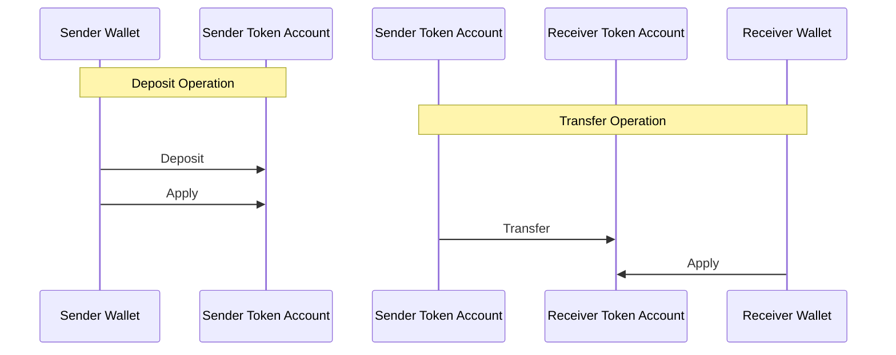
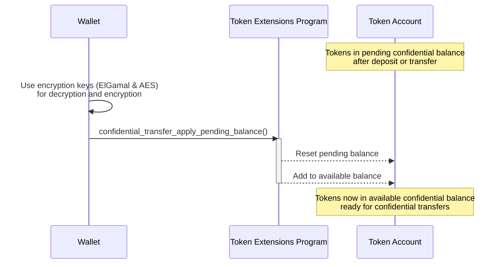

## 대기 중인 잔액을 사용 가능한 잔액에 적용하는 방법

토큰을 기밀로 전송하려면 먼저 공개 토큰 잔액을 기밀 잔액으로 변환해야 합니다. 이
변환은 두 단계로 이루어집니다:

1. **기밀 대기 잔액**: 처음에는 토큰이 공개 잔액에서 "대기" 기밀 잔액으로
   "입금"됩니다.
2. **기밀 사용 가능 잔액**: 그런 다음 대기 잔액이 사용 가능한 잔액에 "적용"되어
   토큰을 기밀 전송에 사용할 수 있게 됩니다.

이 섹션에서는 두 번째 단계인 대기 잔액을 사용 가능한 잔액에 적용하는 과정을
설명합니다.

토큰이 공개 잔액에서 "입금"되거나 한 token account에서 다른 token account로 기밀
전송될 때, 토큰은 처음에 기밀 대기 잔액에 추가됩니다. 토큰을 기밀 전송에
사용하려면 대기 잔액을 사용 가능한 잔액에 "적용"해야 합니다.



다음 다이어그램은 대기 잔액을 사용 가능한 잔액에 적용하는 단계를 보여줍니다:



### 필수 명령어

대기 잔액을 사용 가능한 잔액으로 변환하려면
[ConfidentialTransferInstruction::ApplyPendingBalance](https://github.com/solana-program/token-2022/blob/efd0c957fefbd79882d77df5fb2dac88c001249c/program/src/extension/confidential_transfer/processor.rs#L1152)
명령어를 호출하세요.

`spl_token_client` 크레이트는 `confidential_transfer_apply_pending_balance`
메서드를 제공하며, 이 메서드는 아래 예시에서 보여주듯이 `ApplyPendingBalance`
명령어가 포함된 트랜잭션을 빌드하고 전송합니다.

## 예제 코드

다음 예제는 기밀 대기 잔액을 기밀 사용 가능 잔액에 적용하는 방법을 보여줍니다.

기밀 전송은 ZK ElGamal Proof 프로그램에 의존하며, 이 프로그램은 메인넷과
데브넷에서 활성화되어 있습니다. 기본 `solana-test-validator`에서는 이를
활성화하지 않지만, [Surfpool](https://surfpool.run)과 같은 메인넷 포킹 로컬
validator는 지원합니다. 자금이 충전된 페이어로 해당 환경 중 하나(코드는 데브넷
사용)에서 예제를 실행하고, 플레이스홀더 민트 및 계정 주소를 본인 것으로
교체하세요.

### Rust

<CodeTabs>

```rust !! title="main.rs"
// !collapse(1:44) collapsed
// Imports: dependencies used by this example.
use anyhow::{Context, Result};
use solana_address::Address;
use solana_client::rpc_client::RpcClient;
use solana_commitment_config::CommitmentConfig;
use solana_instruction::Instruction;
use solana_keypair::Keypair;
use solana_pubkey::Pubkey;
use solana_signer::Signer;
use solana_system_interface::instruction as system_instruction;
use solana_transaction::Transaction;
use solana_zk_elgamal_proof_interface::{
    instruction::{ContextStateInfo, ProofInstruction},
    proof_data::PubkeyValidityProofContext,
    state::ProofContextState,
};
use solana_zk_sdk::{
    encryption::{
        auth_encryption::AeCiphertext,
        derivation::derive_confidential_keys,
        elgamal::ElGamalCiphertext,
    },
    zk_elgamal_proof_program::pubkey_validity::build_pubkey_validity_proof_data,
};
use solana_zk_sdk_pod::encryption::auth_encryption::PodAeCiphertext;
use spl_associated_token_account::{
    get_associated_token_address_with_program_id, instruction::create_associated_token_account,
};
use spl_token_2022::{
    extension::{
        confidential_transfer::{
            instruction::{
                apply_pending_balance, configure_account, deposit,
                initialize_mint as initialize_confidential_transfer_mint, PubkeyValidityProofData,
            },
            ConfidentialTransferAccount,
        },
        BaseStateWithExtensions, ExtensionType, StateWithExtensions,
    },
    instruction::{initialize_mint as initialize_mint_base, mint_to, reallocate},
    state::{Account as TokenAccount, Mint},
};
use spl_token_confidential_transfer_proof_extraction::instruction::ProofLocation;
use std::mem::size_of;

const ZK_PROOF_PROGRAM_ID: Pubkey =
    solana_pubkey::pubkey!("ZkE1Gama1Proof11111111111111111111111111111");

fn main() -> Result<()> {
    let rpc_client = RpcClient::new_with_commitment(
        String::from("https://api.devnet.solana.com"),
        CommitmentConfig::confirmed(),
    );

    let owner = load_keypair()?;
    let amount: u64 = 100;
    let decimals: u8 = 2;

    // Setup: create a confidential account with a pending balance.
    let (_mint, token_account) = setup_pending_balance_account(&rpc_client, &owner, amount, decimals)?;

    // Derive the owner's keys to decrypt the current balances.
    let (elgamal_keypair, aes_key) = derive_confidential_keys(&owner, &token_account.to_bytes())
        .map_err(|e| anyhow::anyhow!("derive confidential keys: {e}"))?;

    let account_data = rpc_client.get_account(&token_account)?;
    let account = StateWithExtensions::<TokenAccount>::unpack(&account_data.data)?;
    let ct_extension = account.get_extension::<ConfidentialTransferAccount>()?;

    // The pending balance is split into low (16 bits) and high parts, each small
    // enough to recover with ElGamal's bounded decrypt_u32.
    let pending_lo: ElGamalCiphertext = ct_extension
        .pending_balance_lo
        .try_into()
        .map_err(|e| anyhow::anyhow!("pending_balance_lo: {e:?}"))?;
    let pending_hi: ElGamalCiphertext = ct_extension
        .pending_balance_hi
        .try_into()
        .map_err(|e| anyhow::anyhow!("pending_balance_hi: {e:?}"))?;
    let pending_lo_amount = pending_lo
        .decrypt_u32(elgamal_keypair.secret())
        .context("decrypt pending_balance_lo")? as u64;
    let pending_hi_amount = pending_hi
        .decrypt_u32(elgamal_keypair.secret())
        .context("decrypt pending_balance_hi")? as u64;
    let pending_total = pending_lo_amount + (pending_hi_amount << 16);

    // Read the current available balance from the AES-encrypted decryptable
    // balance. ElGamal's decrypt_u32 only recovers values up to 2^32 raw units,
    // so it fails for realistic balances; the AES field has no such limit.
    let decryptable_balance: AeCiphertext = ct_extension
        .decryptable_available_balance
        .try_into()
        .map_err(|e| anyhow::anyhow!("decryptable_available_balance: {e:?}"))?;
    let current_available = decryptable_balance
        .decrypt(&aes_key)
        .context("decrypt available balance")?;

    let new_available = current_available + pending_total;

    // Re-encrypt the new available balance with the AES key for fast reads.
    let new_decryptable: PodAeCiphertext = aes_key.encrypt(new_available).into();

    // The expected counter guards against pending credits that arrive between
    // building and processing this instruction.
    let expected_counter: u64 = ct_extension.pending_balance_credit_counter.into();

    let apply_ix = apply_pending_balance(
        &spl_token_2022::id(),
        &token_account,
        expected_counter,
        &new_decryptable,
        &owner.pubkey(),
        &[&owner.pubkey()],
    )?;

    let blockhash = rpc_client.get_latest_blockhash()?;
    let transaction =
        Transaction::new_signed_with_payer(&[apply_ix], Some(&owner.pubkey()), &[&owner], blockhash);
    let signature = rpc_client.send_and_confirm_transaction(&transaction)?;
    println!("Applied pending balance. New available: {new_available}. Tx: {signature}");
    Ok(())
}

// !collapse(1:1000) collapsed
// Setup: helper functions to create and deposit into the account.
fn setup_pending_balance_account(
    rpc_client: &RpcClient,
    owner: &Keypair,
    amount: u64,
    decimals: u8,
) -> Result<(Pubkey, Pubkey)> {
    let mint = create_confidential_mint(rpc_client, owner, decimals)?;
    let token_account = configure_confidential_token_account(rpc_client, owner, owner, &mint)?;

    let mint_to_ix = mint_to(
        &spl_token_2022::id(),
        &mint,
        &token_account,
        &owner.pubkey(),
        &[&owner.pubkey()],
        amount,
    )?;
    let deposit_ix = deposit(
        &spl_token_2022::id(),
        &token_account,
        &mint,
        amount,
        decimals,
        &owner.pubkey(),
        &[&owner.pubkey()],
    )?;
    send_tx(rpc_client, &[mint_to_ix, deposit_ix], &[owner])?;

    Ok((mint, token_account))
}

fn create_confidential_mint(rpc_client: &RpcClient, payer: &Keypair, decimals: u8) -> Result<Pubkey> {
    let mint = Keypair::new();
    let space =
        ExtensionType::try_calculate_account_len::<Mint>(&[ExtensionType::ConfidentialTransferMint])?;
    let rent = rpc_client.get_minimum_balance_for_rent_exemption(space)?;

    let create_account_ix = system_instruction::create_account(
        &payer.pubkey(),
        &mint.pubkey(),
        rent,
        space as u64,
        &spl_token_2022::id(),
    );
    let init_confidential_ix = initialize_confidential_transfer_mint(
        &spl_token_2022::id(),
        &mint.pubkey(),
        Some(payer.pubkey()),
        true,
        None,
    )?;
    let init_mint_ix = initialize_mint_base(
        &spl_token_2022::id(),
        &mint.pubkey(),
        &payer.pubkey(),
        None,
        decimals,
    )?;

    send_tx(
        rpc_client,
        &[create_account_ix, init_confidential_ix, init_mint_ix],
        &[payer, &mint],
    )?;
    Ok(mint.pubkey())
}

fn configure_confidential_token_account(
    rpc_client: &RpcClient,
    payer: &Keypair,
    owner: &Keypair,
    mint: &Pubkey,
) -> Result<Pubkey> {
    let token_account = get_associated_token_address_with_program_id(
        &owner.pubkey(),
        mint,
        &spl_token_2022::id(),
    );
    let create_ata_ix = create_associated_token_account(
        &payer.pubkey(),
        &owner.pubkey(),
        mint,
        &spl_token_2022::id(),
    );
    let realloc_ix = reallocate(
        &spl_token_2022::id(),
        &token_account,
        &payer.pubkey(),
        &owner.pubkey(),
        &[&owner.pubkey()],
        &[ExtensionType::ConfidentialTransferAccount],
    )?;

    let (elgamal_keypair, aes_key) = derive_confidential_keys(owner, &token_account.to_bytes())
        .map_err(|e| anyhow::anyhow!("derive confidential keys: {e}"))?;
    let decryptable_balance: PodAeCiphertext = aes_key.encrypt(0).into();

    let proof_data = build_pubkey_validity_proof_data(&elgamal_keypair)
        .map_err(|e| anyhow::anyhow!("generate pubkey validity proof: {e}"))?;
    let proof_account = Keypair::new();
    let context_state_size = size_of::<ProofContextState<PubkeyValidityProofContext>>();
    let create_proof_account_ix = system_instruction::create_account(
        &payer.pubkey(),
        &proof_account.pubkey(),
        rpc_client.get_minimum_balance_for_rent_exemption(context_state_size)?,
        context_state_size as u64,
        &ZK_PROOF_PROGRAM_ID,
    );

    let proof_account_address: Address = proof_account.pubkey().to_bytes().into();
    let owner_address: Address = owner.pubkey().to_bytes().into();
    let verify_proof_ix = ProofInstruction::VerifyPubkeyValidity.encode_verify_proof(
        Some(ContextStateInfo {
            context_state_account: &proof_account_address,
            context_state_authority: &owner_address,
        }),
        &proof_data,
    );
    let proof_location: ProofLocation<PubkeyValidityProofData> =
        ProofLocation::ContextStateAccount(&proof_account.pubkey());
    let configure_account_ixs = configure_account(
        &spl_token_2022::id(),
        &token_account,
        mint,
        &decryptable_balance,
        65_536,
        &owner.pubkey(),
        &[&owner.pubkey()],
        proof_location,
    )?;

    let mut instructions = vec![
        create_ata_ix,
        realloc_ix,
        create_proof_account_ix,
        verify_proof_ix,
    ];
    instructions.extend(configure_account_ixs);

    if payer.pubkey() == owner.pubkey() {
        send_tx(rpc_client, &instructions, &[payer, &proof_account])?;
    } else {
        send_tx(rpc_client, &instructions, &[payer, owner, &proof_account])?;
    }

    Ok(token_account)
}

fn send_tx(client: &RpcClient, instructions: &[Instruction], signers: &[&Keypair]) -> Result<()> {
    let blockhash = client.get_latest_blockhash()?;
    let transaction =
        Transaction::new_signed_with_payer(instructions, Some(&signers[0].pubkey()), signers, blockhash);
    client.send_and_confirm_transaction(&transaction)?;
    Ok(())
}

fn load_keypair() -> Result<Keypair> {
    let keypair_path = dirs::home_dir()
        .context("could not find home directory")?
        .join(".config/solana/id.json");
    let bytes: Vec<u8> = serde_json::from_reader(std::fs::File::open(keypair_path)?)?;
    let mut secret = [0u8; 32];
    secret.copy_from_slice(&bytes[0..32]);
    Ok(Keypair::new_from_array(secret))
}
```

```toml !! title="Cargo.toml"
[package]
name = "confidential-transfer"
version = "0.1.0"
edition = "2021"

# spl-token-2022 11 requires solana-system-interface 3.2 (which needs
# solana-instruction >= 3.4). The stable solana-client 4.0.0 caps it lower, so
# pin the 4.0.0-rc.0 line and use the granular solana crates instead of the
# solana-sdk umbrella. This collapses back to solana-sdk once a stable
# solana-client that allows solana-instruction 3.4 ships.
[dependencies]
solana-client = "4.0.0-rc.0"
solana-pubkey = "4.2"
solana-keypair = "3.1"
solana-signer = "3.0"
solana-transaction = "3.1"
solana-instruction = "3.4"
solana-commitment-config = "3.1.1"
solana-system-interface = { version = "3.2.0", features = ["bincode"] }
solana-address = "2.6"
solana-zk-sdk = "7.0.1"
solana-zk-sdk-pod = "0.1.2"
solana-zk-elgamal-proof-interface = "0.1.2"
spl-token-2022 = { version = "11.0.0", features = ["zk-ops"] }
spl-associated-token-account = "8.0.0"
spl-token-confidential-transfer-proof-extraction = "0.6.1"

anyhow = "1.0"
dirs = "6.0.0"
serde_json = "1.0"
```

</CodeTabs>

### Typescript

<CodeTabs>

```ts !! title="index.ts"
// !collapse(1:25) collapsed
// Imports: dependencies used by this example.
import {
  deriveAeKeyForOwnerMint,
  deriveElGamalKeypairForOwnerMint,
  getApplyConfidentialPendingBalanceInstructionFromToken,
  getCreateConfidentialTransferAccountInstructionPlan
} from "@solana-program/token-2022/confidential";
import {
  TOKEN_2022_PROGRAM_ADDRESS,
  fetchToken,
  findAssociatedTokenPda,
  getConfidentialDepositInstruction,
  getCreateMintInstructionPlan,
  getMintToInstruction
} from "@solana-program/token-2022";
import { createClient, generateKeyPairSigner, some } from "@solana/kit";
import { solanaRpc } from "@solana/kit-plugin-rpc";
import { signerFromFile } from "@solana/kit-plugin-signer";
import {
  AeKey,
  ElGamalKeypair,
  ElGamalSecretKey
} from "@solana/zk-sdk/bundler";
import { homedir } from "node:os";
import { join } from "node:path";

const client = await createClient()
  .use(signerFromFile(join(homedir(), ".config/solana/id.json")))
  .use(
    solanaRpc({
      rpcUrl: "https://api.devnet.solana.com"
    })
  );

// The Solana CLI default keypair, used as fee payer, mint authority, and
// token account owner.
const owner = client.payer;
const amount = 100n;
const decimals = 2;

// Setup: create a confidential account with a pending balance.
const mint = await createConfidentialMint(client, owner, decimals);
const token = await createConfidentialTokenAccount(client, owner, mint);
await mintPublicTokens(client, owner, mint, token, amount);
await depositTokens(client, owner, mint, token, amount, decimals);

// Derive the owner's keys to decrypt the current balances.
const { elgamalSecretKey, aesKey } = await deriveConfidentialKeys(owner, mint);

// The helper decrypts the pending and available balances, re-encrypts the new
// available balance, and builds the ApplyPendingBalance instruction. No proof
// is required.
const tokenAccount = await fetchToken(client.rpc, token);
const applyInstruction = getApplyConfidentialPendingBalanceInstructionFromToken(
  {
    token,
    tokenAccount: tokenAccount.data,
    authority: owner,
    elgamalSecretKey,
    aesKey
  }
);

const result = await client.sendTransaction([applyInstruction]);
console.log(
  `Applied pending balance. New available: ${amount}. Tx: ${result.context.signature}`
);

// !collapse(1:1000) collapsed
// Setup: helper functions to create and fund the confidential token account.
async function createConfidentialMint(
  kitClient: typeof client,
  payer: typeof owner,
  decimals: number
) {
  const mint = await generateKeyPairSigner();
  const auditor = await deriveElGamalKeypairForOwnerMint({
    signer: payer,
    owner: payer.address,
    mint: mint.address
  });

  const plan = getCreateMintInstructionPlan({
    payer,
    newMint: mint,
    decimals,
    mintAuthority: payer,
    extensions: [
      {
        __kind: "ConfidentialTransferMint",
        authority: some(payer.address),
        autoApproveNewAccounts: true,
        auditorElgamalPubkey: some(auditor.elgamalPubkey)
      }
    ]
  });

  await kitClient.sendTransaction(plan);

  return mint.address;
}

async function createConfidentialTokenAccount(
  kitClient: typeof client,
  accountOwner: typeof owner,
  mint: Awaited<ReturnType<typeof createConfidentialMint>>
) {
  const [token] = await findAssociatedTokenPda({
    owner: accountOwner.address,
    tokenProgram: TOKEN_2022_PROGRAM_ADDRESS,
    mint
  });
  const { elgamalKeypair, aesKey } = await deriveConfidentialKeys(
    accountOwner,
    mint
  );

  const plan = await getCreateConfidentialTransferAccountInstructionPlan({
    rpc: kitClient.rpc,
    payer: accountOwner,
    owner: accountOwner,
    mint,
    elgamalKeypair,
    aesKey
  });

  await kitClient.sendTransaction(plan);

  return token;
}

async function mintPublicTokens(
  kitClient: typeof client,
  mintAuthority: typeof owner,
  mint: Awaited<ReturnType<typeof createConfidentialMint>>,
  token: Awaited<ReturnType<typeof createConfidentialTokenAccount>>,
  amount: bigint
) {
  await kitClient.sendTransaction([
    getMintToInstruction({
      mint,
      token,
      mintAuthority,
      amount
    })
  ]);
}

async function depositTokens(
  kitClient: typeof client,
  authority: typeof owner,
  mint: Awaited<ReturnType<typeof createConfidentialMint>>,
  token: Awaited<ReturnType<typeof createConfidentialTokenAccount>>,
  amount: bigint,
  decimals: number
) {
  await kitClient.sendTransaction([
    getConfidentialDepositInstruction({
      token,
      mint,
      authority,
      amount,
      decimals
    })
  ]);
}

async function deriveConfidentialKeys(
  accountOwner: typeof owner,
  mint: Awaited<ReturnType<typeof createConfidentialMint>>
) {
  const derivedElGamal = await deriveElGamalKeypairForOwnerMint({
    signer: accountOwner,
    owner: accountOwner.address,
    mint
  });
  const elgamalSecretKey = ElGamalSecretKey.fromBytes(derivedElGamal.secretKey);
  const elgamalKeypair = ElGamalKeypair.fromSecretKey(elgamalSecretKey);
  const aesKey = AeKey.fromBytes(
    await deriveAeKeyForOwnerMint({
      signer: accountOwner,
      owner: accountOwner.address,
      mint
    })
  );

  return { elgamalKeypair, elgamalSecretKey, aesKey };
}
```

```json !! title="package.json"
{
  "name": "confidential-apply",
  "version": "0.1.0",
  "type": "module",
  "dependencies": {
    "@solana-program/system": "^0.12.2",
    "@solana-program/token-2022": "^0.12.0",
    "@solana/kit": "^6.10.0",
    "@solana/kit-plugin-rpc": "^0.11.1",
    "@solana/kit-plugin-signer": "^0.10.0",
    "@solana/zk-sdk": "^0.4.2"
  },
  "devDependencies": {
    "@types/node": "^24.10.0",
    "typescript": "^5.8.3"
  }
}
```

</CodeTabs>
