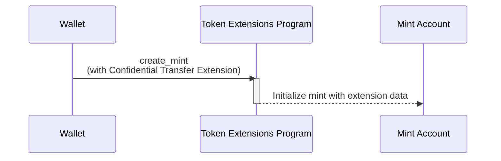

## Confidential Transfer 확장으로 mint를 생성하는 방법

Confidential Transfer 확장은 mint account에 추가 상태를 더해 프라이빗 토큰
전송을 가능하게 합니다. 이 섹션에서는 이 확장이 활성화된 토큰 mint를 생성하는
방법을 설명합니다.

다음 다이어그램은 Confidential Transfer 확장으로 mint를 생성하는 데 필요한
단계를 보여줍니다:



### Confidential Transfer Mint 상태

이 확장은 mint account에
[ConfidentialTransferMint](https://github.com/solana-program/token-2022/blob/efd0c957fefbd79882d77df5fb2dac88c001249c/program/src/extension/confidential_transfer/mod.rs#L48-L69)
상태를 추가합니다:

```rust title="Confidential Mint State"
#[repr(C)]
#[derive(Clone, Copy, Debug, Default, PartialEq, Pod, Zeroable)]
pub struct ConfidentialTransferMint {
    /// Authority to modify the `ConfidentialTransferMint` configuration and to
    /// approve new accounts (if `auto_approve_new_accounts` is true)
    ///
    /// The legacy Token Multisig account is not supported as the authority
    pub authority: OptionalNonZeroPubkey,

    /// Indicate if newly configured accounts must be approved by the
    /// `authority` before they may be used by the user.
    ///
    /// * If `true`, no approval is required and new accounts may be used
    ///   immediately
    /// * If `false`, the authority must approve newly configured accounts (see
    ///   `ConfidentialTransferInstruction::ConfigureAccount`)
    pub auto_approve_new_accounts: PodBool,

    /// Authority to decode any transfer amount in a confidential transfer.
    pub auditor_elgamal_pubkey: OptionalNonZeroElGamalPubkey,
}
```

*rs`ConfidentialTransferMint`*에는 세 가지 구성 필드가 있습니다:

- **authority**: mint의 기밀 전송 설정을 변경하고, 자동 승인이 비활성화된 경우
  새로운 기밀 계정을 승인할 권한을 가진 계정입니다.

- **auto_approve_new_accounts**: true로 설정하면 사용자가 기밀 전송이 기본적으로
  활성화된 token account를 생성할 수 있습니다. false로 설정하면 authority가 각
  새 token account를 기밀 전송에 사용하기 전에 승인해야 합니다.

- **auditor_elgamal_pubkey**: 기밀 트랜잭션에서 전송 금액을 복호화할 수 있는
  선택적 감사자로, 일반 대중으로부터 프라이버시를 유지하면서 규정 준수
  메커니즘을 제공합니다.

### 필수 명령어

Confidential Transfer가 활성화된 mint를 생성하려면 단일 트랜잭션에서 세 가지
명령어가 필요합니다:

1. **Mint Account 생성**: System Program의 _rs`CreateAccount`_ 명령어를 호출하여
   mint account를 생성합니다.

2. **Confidential Transfer 확장 초기화**: Token Extensions Program의
   [ConfidentialTransferInstruction::InitializeMint](https://github.com/solana-program/token-2022/blob/efd0c957fefbd79882d77df5fb2dac88c001249c/program/src/extension/confidential_transfer/processor.rs#L48)
   명령어를 호출하여 mint의 _rs`ConfidentialTransferMint`_ 상태를 구성합니다.

3. **Mint 초기화**: Token Extensions Program의 _rs`Instruction::InitializeMint`_
   명령어를 호출하여 표준 mint 상태를 초기화합니다.

이러한 명령어를 직접 작성할 수도 있지만, `spl_token_client` 크레이트는 아래
예제에서 보여주듯이 단일 함수 호출로 세 가지 명령어를 모두 포함한 트랜잭션을
빌드하고 전송하는 `create_mint` 메서드를 제공합니다.

## 예제 코드

다음 코드는 Confidential Transfer 확장을 사용하여 민트를 생성하는 방법을
보여줍니다.

Confidential Transfer는 메인넷과 데브넷에서 활성화된 ZK ElGamal Proof 프로그램에
의존합니다. 기본 `solana-test-validator`는 이를 활성화하지 않지만,
[Surfpool](https://surfpool.run)과 같은 메인넷 포킹 로컬 validator는
활성화합니다. 자금이 충전된 페이어를 사용하여 해당 환경 중 하나(코드는 데브넷을
사용)에서 예제를 실행하고, 플레이스홀더 민트 및 계정 주소를 본인의 것으로
교체하세요.

### Rust

<CodeTabs>

```rust !! title="main.rs"
// !collapse(1:18) collapsed
// Imports: dependencies used by this example.
use anyhow::{Context, Result};
use solana_client::rpc_client::RpcClient;
use solana_commitment_config::CommitmentConfig;
use solana_keypair::Keypair;
use solana_signer::Signer;
use solana_system_interface::instruction as system_instruction;
use solana_transaction::Transaction;
use solana_zk_sdk::encryption::elgamal::ElGamalKeypair;
use solana_zk_sdk_pod::encryption::elgamal::PodElGamalPubkey;
use spl_token_2022::{
    extension::{
        confidential_transfer::instruction::initialize_mint as initialize_confidential_transfer_mint,
        ExtensionType,
    },
    instruction::initialize_mint as initialize_mint_base,
    state::Mint,
};

fn main() -> Result<()> {
    let rpc_client = RpcClient::new_with_commitment(
        String::from("https://api.devnet.solana.com"),
        CommitmentConfig::confirmed(),
    );

    let payer = load_keypair()?;
    let mint = Keypair::new();
    let decimals: u8 = 2;

    // Allocate space for a mint that carries the ConfidentialTransferMint
    // extension, then fund it for rent exemption.
    let space =
        ExtensionType::try_calculate_account_len::<Mint>(&[ExtensionType::ConfidentialTransferMint])?;
    let rent = rpc_client.get_minimum_balance_for_rent_exemption(space)?;

    // The auditor ElGamal key lets the issuer decrypt transfer amounts for
    // compliance. Persist this key. Pass `None` to create a mint with no auditor.
    let auditor = ElGamalKeypair::new_rand();
    let auditor_pubkey: PodElGamalPubkey = (*auditor.pubkey()).into();

    let create_account_ix = system_instruction::create_account(
        &payer.pubkey(),
        &mint.pubkey(),
        rent,
        space as u64,
        &spl_token_2022::id(),
    );

    // The confidential-transfer extension must be initialized before the base
    // mint and cannot be added later.
    let init_confidential_ix = initialize_confidential_transfer_mint(
        &spl_token_2022::id(),
        &mint.pubkey(),
        Some(payer.pubkey()), // authority that can update confidential settings
        true,                 // auto-approve new accounts
        Some(auditor_pubkey),
    )?;

    let init_mint_ix = initialize_mint_base(
        &spl_token_2022::id(),
        &mint.pubkey(),
        &payer.pubkey(), // mint authority
        None,            // freeze authority
        decimals,
    )?;

    let blockhash = rpc_client.get_latest_blockhash()?;
    let transaction = Transaction::new_signed_with_payer(
        &[create_account_ix, init_confidential_ix, init_mint_ix],
        Some(&payer.pubkey()),
        &[&payer, &mint],
        blockhash,
    );
    let signature = rpc_client.send_and_confirm_transaction(&transaction)?;
    println!("Created confidential mint {}: {signature}", mint.pubkey());
    Ok(())
}

fn load_keypair() -> Result<Keypair> {
    let keypair_path = dirs::home_dir()
        .context("could not find home directory")?
        .join(".config/solana/id.json");
    let bytes: Vec<u8> = serde_json::from_reader(std::fs::File::open(keypair_path)?)?;
    let mut secret = [0u8; 32];
    secret.copy_from_slice(&bytes[0..32]);
    Ok(Keypair::new_from_array(secret))
}
```

```toml !! title="Cargo.toml"
[package]
name = "confidential-mint"
version = "0.1.0"
edition = "2021"

# spl-token-2022 11 requires solana-system-interface 3.2 (which needs
# solana-instruction >= 3.4). The stable solana-client 4.0.0 caps it lower, so
# pin the 4.0.0-rc.0 line and use the granular solana crates instead of the
# solana-sdk umbrella. This collapses back to solana-sdk once a stable
# solana-client that allows solana-instruction 3.4 ships.
[dependencies]
solana-client = "4.0.0-rc.0"
solana-pubkey = "4.2"
solana-keypair = "3.1"
solana-signer = "3.0"
solana-transaction = "3.1"
solana-commitment-config = "3.1.1"
solana-system-interface = { version = "3.2.0", features = ["bincode"] }
solana-zk-sdk = "7.0.1"
solana-zk-sdk-pod = "0.1.2"
spl-token-2022 = { version = "11.0.0", features = ["zk-ops"] }

anyhow = "1.0"
dirs = "6.0.0"
serde_json = "1.0"
```

</CodeTabs>

### Typescript

<CodeTabs>

```ts !! title="index.ts"
// !collapse(1:8) collapsed
// Imports: dependencies used by this example.
import { getCreateMintInstructionPlan } from "@solana-program/token-2022";
import { deriveElGamalKeypairForOwnerMint } from "@solana-program/token-2022/confidential";
import { createClient, generateKeyPairSigner, some } from "@solana/kit";
import { solanaRpc } from "@solana/kit-plugin-rpc";
import { signerFromFile } from "@solana/kit-plugin-signer";
import { homedir } from "node:os";
import { join } from "node:path";

const client = await createClient()
  .use(signerFromFile(join(homedir(), ".config/solana/id.json")))
  .use(
    solanaRpc({
      rpcUrl: "https://api.devnet.solana.com"
    })
  );
const payer = client.payer;

const mint = await generateKeyPairSigner();

// The auditor ElGamal key lets the issuer decrypt transfer amounts for
// compliance. Persist it; omit `auditorElgamalPubkey` to create a mint with no
// auditor.
const auditor = await deriveElGamalKeypairForOwnerMint({
  signer: payer,
  owner: payer.address,
  mint: mint.address
});

const plan = getCreateMintInstructionPlan({
  payer,
  newMint: mint,
  decimals: 2,
  mintAuthority: payer,
  extensions: [
    {
      __kind: "ConfidentialTransferMint",
      authority: some(payer.address),
      autoApproveNewAccounts: true,
      auditorElgamalPubkey: some(auditor.elgamalPubkey)
    }
  ]
});

const result = await client.sendTransaction(plan);

console.log(
  `Created confidential mint ${mint.address}: ${result.context.signature}`
);
```

```json !! title="package.json"
{
  "name": "confidential-mint",
  "version": "0.1.0",
  "type": "module",
  "dependencies": {
    "@solana-program/system": "^0.12.2",
    "@solana-program/token-2022": "^0.12.0",
    "@solana/kit": "^6.10.0",
    "@solana/kit-plugin-rpc": "^0.11.1",
    "@solana/kit-plugin-signer": "^0.10.0",
    "@solana/zk-sdk": "^0.4.2"
  },
  "devDependencies": {
    "@types/node": "^24.10.0",
    "typescript": "^5.8.3"
  }
}
```

</CodeTabs>
