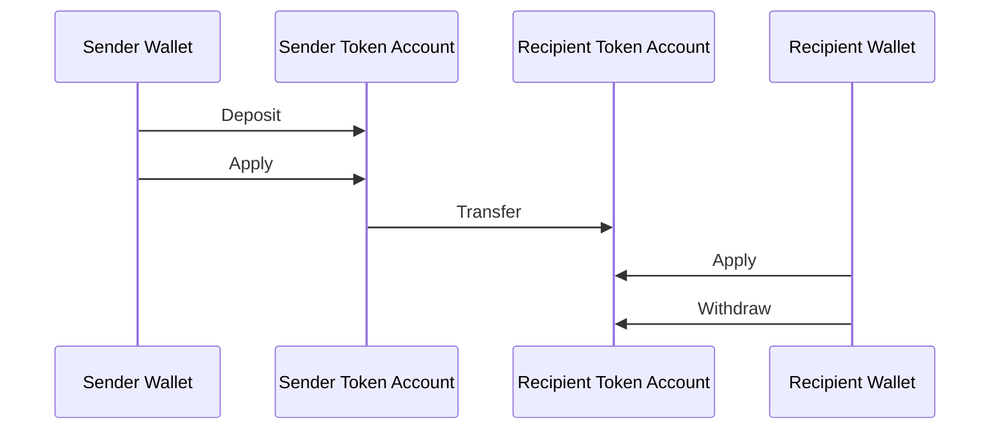
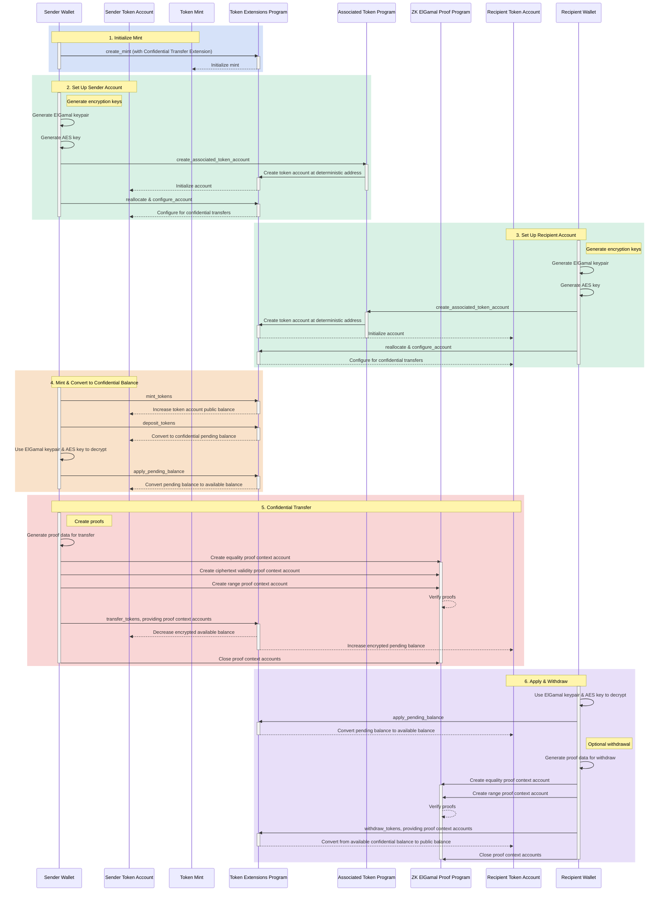

## 기밀 전송이란 무엇인가요?

기밀 전송을 사용하면 전송 금액을 공개하지 않고 token account 간에 토큰을 전송할
수 있습니다. 이는 프라이버시 보호 거래에 유용합니다. 전송 금액과 토큰 잔액만
비공개로 유지됩니다. token account 주소는 공개된 상태로 유지됩니다.

- [프로토콜 개요](https://www.solana-program.com/docs/confidential-balances/overview) -
  기반 암호화 프로토콜에 대한 세부 정보
- [빠른 시작 가이드](https://www.solana-program.com/docs/confidential-balances#setup) -
  설정 및 기본 CLI 명령어
- [기밀 잔액 쿡북](https://github.com/solana-developers/Confidential-Balances-Sample) -
  기밀 전송 확장 기능 사용 방법에 대한 코드 예제

### 어떻게 작동하나요?

기밀 전송 확장 기능은 Token Extensions Program에
[명령어](https://github.com/solana-program/token-2022/blob/efd0c957fefbd79882d77df5fb2dac88c001249c/program/src/extension/confidential_transfer/instruction.rs#L29)를
추가하여 전송 금액을 공개하지 않고 계정 간에 토큰을 전송할 수 있게 합니다.

기밀 토큰 전송의 기본 흐름은 다음과 같습니다:

1. 기밀 전송 확장 기능이 포함된 mint account를 생성합니다.
2. 발신자와 수신자를 위해 기밀 전송 확장 기능이 포함된 token account를
   생성합니다.
3. 발신자 계정에 토큰을 발행합니다.
4. 발신자의 공개 잔액을 **기밀 대기 잔액**으로 **입금**합니다.
5. 발신자의 대기 잔액을 **기밀 사용 가능 잔액**으로 **적용**합니다.
6. 발신자 token account에서 수신자 token account로 토큰을 기밀로 **전송**합니다.
7. 수신자의 대기 잔액을 **기밀 사용 가능 잔액**으로 **적용**합니다.
8. 수신자의 기밀 사용 가능 잔액을 **공개 잔액**으로 **출금**합니다.

기밀 전송 흐름의 각 단계에 대한 자세한 내용은 해당 페이지를 참조하세요:

<Cards>
  <Card
    title="Mint Account 생성"
    href="/docs/tokens/extensions/confidential-transfer/create-mint"
  >
    기밀 전송 확장 기능이 포함된 mint account를 생성하는 방법
  </Card>
  <Card
    title="Token Account 생성"
    href="/docs/tokens/extensions/confidential-transfer/create-token-account"
  >
    기밀 전송 확장 기능으로 token account를 구성하는 방법
  </Card>
  <Card
    title="토큰 입금"
    href="/docs/tokens/extensions/confidential-transfer/deposit-tokens"
  >
    기밀 대기 잔액에 토큰을 입금하는 방법
  </Card>
  <Card
    title="대기 잔액 적용"
    href="/docs/tokens/extensions/confidential-transfer/apply-pending-balance"
  >
    대기 잔액을 기밀 사용 가능 잔액에 적용하는 방법
  </Card>
  <Card
    title="토큰 출금"
    href="/docs/tokens/extensions/confidential-transfer/withdraw-tokens"
  >
    기밀 사용 가능 잔액에서 토큰을 출금하는 방법
  </Card>
  <Card
    title="토큰 전송"
    href="/docs/tokens/extensions/confidential-transfer/transfer-tokens"
  >
    token account 간에 토큰을 기밀로 전송하는 방법
  </Card>
  <Card
    title="통합 가이드"
    href="/docs/tokens/extensions/confidential-transfer/integration-guide"
  >
    지갑, 탐색기 및 거래소에서 기밀 전송 토큰을 지원하는 방법
  </Card>
  <Card
    title="발행자 가이드"
    href="/docs/tokens/extensions/confidential-transfer/issuer-guide"
  >
    기밀 전송 토큰 발행 및 운영 방법 (승인 정책, 감사자, 수수료, 발행 및 소각)
  </Card>
</Cards>

아래 다이어그램은 기밀 토큰 전송의 기본 흐름에 대한 상세한 순서를 보여줍니다:

## 기밀 전송 명령어

Confidential Transfer 확장의 전체 명령어 목록
[instructions](https://github.com/solana-program/token-2022/blob/efd0c957fefbd79882d77df5fb2dac88c001249c/program/src/extension/confidential_transfer/instruction.rs#L29)
은 다음과 같습니다:

| 명령어                              | 설명                                                                                                                                         |
| ----------------------------------- | -------------------------------------------------------------------------------------------------------------------------------------------- |
| _rs`InitializeMint`_                | 기밀 전송을 위한 mint account를 설정합니다. 이 명령어는 _rs`TokenInstruction::InitializeMint`_ 명령어와 동일한 트랜잭션에 포함되어야 합니다. |
| _rs`UpdateMint`_                    | mint의 기밀 전송 설정을 업데이트합니다.                                                                                                      |
| _rs`ConfigureAccount`_              | 기밀 전송을 위한 token account를 설정합니다.                                                                                                 |
| _rs`ApproveAccount`_                | mint가 새 token account에 대한 승인을 요구하는 경우 기밀 전송을 위한 token account를 승인합니다.                                             |
| _rs`EmptyAccount`_                  | token account를 닫을 수 있도록 대기 중 및 사용 가능한 기밀 잔액을 비웁니다.                                                                  |
| _rs`Deposit`_                       | 공개 토큰 잔액을 대기 중인 기밀 잔액으로 변환합니다.                                                                                         |
| _rs`Withdraw`_                      | 사용 가능한 기밀 잔액을 공개 잔액으로 다시 변환합니다.                                                                                       |
| _rs`Transfer`_                      | token account 간에 기밀로 토큰을 전송합니다.                                                                                                 |
| _rs`ApplyPendingBalance`_           | 입금 또는 전송 후 대기 중인 잔액을 사용 가능한 잔액으로 변환합니다.                                                                          |
| _rs`EnableConfidentialCredits`_     | token account가 기밀 토큰 전송을 받을 수 있도록 허용합니다.                                                                                  |
| _rs`DisableConfidentialCredits`_    | 공개 전송은 허용하면서 수신되는 기밀 전송을 차단합니다.                                                                                      |
| _rs`EnableNonConfidentialCredits`_  | token account가 공개 토큰 전송을 받을 수 있도록 허용합니다.                                                                                  |
| _rs`DisableNonConfidentialCredits`_ | 계정이 기밀 전송만 받을 수 있도록 일반 전송을 차단합니다.                                                                                    |
| _rs`TransferWithFee`_               | 수수료와 함께 token account 간에 기밀로 토큰을 전송합니다.                                                                                   |
| _rs`ConfigureAccountWithRegistry`_  | _rs`VerifyPubkeyValidity`_ 증명 대신 _rs`ElGamalRegistry`_ 계정을 사용하여 기밀 전송을 위한 token account를 구성하는 대체 방법입니다.        |
