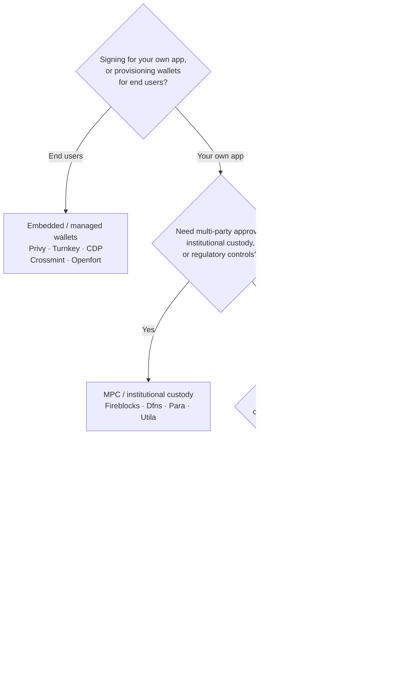

Keychain은 모든 백엔드에 걸쳐 하나의 `SolanaSigner` 인터페이스를 제공하므로,
선택은 아키텍처가 아닌 운영 측면의 결정입니다 — 나중에 구성을 통해 변경할 수
있습니다. 따라서 **제품이 아닌 요구 사항에서 출발하세요.** 대부분은 두 가지
질문으로 결정됩니다: _개인 키는 어디에 저장되며, 누가 해당 키로 서명을 승인할 수
있는가?_

단일 최적 백엔드는 존재하지 않습니다. 각 백엔드는 특정 제약 조건에 더 적합합니다
— 이미 사용 중인 클라우드, 키 인프라 직접 운영 여부, 그리고 요구되는 보관 및
승인 제어 수준이 그것입니다. 아래 흐름도는 해당 제약 조건을 백엔드에 매핑합니다.

<Callout type="info">
  이 가이드는 백엔드(서버 측) 서명을 다룹니다. 최종 사용자가 브라우저에서 자신의
  트랜잭션에 직접 서명하는 경우에는, Wallet Standard를 통한 지갑을 사용하세요 —
  [프로덕션에서의 서명](/docs/core/transactions/signing-in-production)을
  참조하세요.
</Callout>

## 의사결정 흐름

<Callout type="info">
  로컬 개발 및 테스트에는 이 중 어느 것도 필요하지 않습니다 — 프로토타이핑에는
  **Memory** 백엔드를 사용하고, 이후 구성을 통해 위의 프로덕션 백엔드 중 하나로
  전환하세요.
</Callout>

## 질문 따라가기

<Steps>

<Step>

### 자신의 애플리케이션을 위해 서명하는 건가요, 아니면 최종 사용자를 위해 서명하는 건가요?

**최종 사용자**가 소유하고 운영하는 지갑을 프로비저닝하는 경우(컨슈머 앱, 온보딩
흐름), **임베디드 / 관리형 지갑** 백엔드를 사용하세요 — Privy, Turnkey, CDP,
Crossmint, 또는 Openfort. 이러한 서비스들은 사용자별 지갑과 인증을 대신 관리해
줍니다.

**자체 애플리케이션**으로 서명하는 경우 — 수수료 납부자, 트레저리, 백엔드 자동화
— 아래로 계속 진행하세요.

</Step>

<Step>

### 다자 승인, 기관 수탁, 또는 규제 제어가 필요하신가요?

서명이 생성되기 전에 승인 정책, 지출 한도, 또는 컴플라이언스 워크플로를 통과해야
하거나 — 키를 보유하는 규제된 수탁자가 필요한 경우 — **MPC / 기관 수탁**
백엔드를 사용하세요: Fireblocks, Dfns, Para, 또는 Utila. 이 서비스들은 키를
분할하거나 수탁하고 정책에 따라 공동 서명합니다.

요청 시 서명하는 키만 필요한 경우 아래로 계속 진행하세요.

</Step>

<Step>

### 키를 직접 보유하시겠습니까, 아니면 공급자가 보유하도록 하시겠습니까?

클라우드 공급자가 하드웨어 기반 인프라에서 키를 보유하고 IAM 정책으로 서명
권한을 제어하려면 해당 클라우드의 KMS를 사용하세요:

- **AWS에서 실행 중** → AWS KMS
- **GCP에서 실행 중** → GCP KMS

키 인프라를 직접 운영하거나 — 멀티 클라우드 또는 온프레미스 환경인 경우 —
**HashiCorp Vault**를 사용하세요. 직접 운영하고 감사하며, 키는 Transit 엔진
내부에 유지되고 요청 시 서명합니다.

</Step>

</Steps>

## 수탁 모델

백엔드는 다섯 가지 수탁 모델로 구분됩니다. 위의 흐름에 따라 해당 모델 중 하나로
안내됩니다.

- **자체 수탁 (인프로세스)** — 애플리케이션이 원시 개인 키를 직접 보유합니다.
  개발 환경에서는 편리하지만 프로덕션에는 적합하지 않습니다. 백엔드: **Memory**.
- **자체 호스팅 키 관리** — 키 인프라를 직접 운영하며, 키는 내부에 유지되고 요청
  시 서명합니다. 백엔드: **HashiCorp Vault**.
- **클라우드 KMS / HSM** — 클라우드 공급자가 하드웨어 기반 인프라에 키를
  저장하며, 키는 서비스 밖으로 절대 나가지 않고 IAM 정책으로 서명 권한을
  제어합니다. 백엔드: **AWS KMS**, **GCP KMS**.
- **MPC 및 기관 수탁** — 키가 공급자 전반에 걸쳐 분할되거나 수탁되며, 정책(승인,
  한도)에 따라 공동 서명합니다. 백엔드: **Fireblocks**, **Dfns**, **Para**,
  **Utila**.
- **임베디드 및 관리형 지갑** — 공급자가 사용자를 온보딩하기 위해 지갑을 대신
  관리합니다. 백엔드: **Privy**, **Turnkey**, **CDP**, **Crossmint**,
  **Openfort**.

## 백엔드 비교

| 백엔드          | 보관 모델               | 최적 용도                             | 비고                                               |
| --------------- | ----------------------- | ------------------------------------- | -------------------------------------------------- |
| Memory          | 자체 보관 (프로세스 내) | 로컬 개발, 테스트, CI                 | 프로세스 내 원시 키 — 프로덕션 환경에서 사용 금지  |
| HashiCorp Vault | 자체 호스팅 키 관리     | 자체 키 인프라를 운영하는 팀          | Transit 엔진; 직접 운영 및 감사                    |
| AWS KMS         | 클라우드 KMS / HSM      | AWS에서 실행되는 백엔드               | 키가 KMS를 벗어나지 않음; IAM이 서명 제어          |
| GCP KMS         | 클라우드 KMS / HSM      | GCP에서 실행되는 백엔드               | 키가 KMS를 벗어나지 않음; IAM이 서명 제어          |
| Fireblocks      | MPC / 기관 수탁         | 트레저리, 거래소, 규제 수탁           | 정책 엔진 및 승인 워크플로우                       |
| Dfns            | MPC 지갑 인프라         | 정책 제어가 있는 프로그래밍 방식 지갑 | Ed25519 서명                                       |
| Para            | MPC 지갑                | MPC 기반 지갑을 원하는 앱             | API 키 + 지갑 ID                                   |
| Utila           | MPC 수탁 + 공동 서명자  | 기존 Utila 관리 Solana 지갑           | `signMessage` 미지원; 트랜잭션을 직접 브로드캐스트 |
| Privy           | 임베디드 지갑           | 사용자를 지갑에 온보딩하는 컨슈머 앱  | 앱 관리형 임베디드 지갑                            |
| Turnkey         | 비수탁 키 관리          | 프로그래밍 방식의 정책 기반 서명      | 비수탁 키 관리                                     |
| CDP             | 관리형 지갑 (Coinbase)  | Coinbase 개발자 플랫폼의 앱           | `signMessage`는 UTF-8 페이로드만 허용              |
| Crossmint       | 관리형 지갑             | 마켓플레이스 및 관리형 지갑 앱        | `smart` 및 `mpc` 지갑; `signMessage` 미지원        |
| Openfort        | 임베디드 백엔드 지갑    | 서버 사이드 지갑                      | TEE 저장 키                                        |

## 엔터프라이즈 시나리오

단일 애플리케이션은 종종 이러한 기능 중 두 가지 이상을 동시에 필요로 합니다.
인터페이스가 동일하기 때문에 호출 위치를 변경하지 않고도 역할별로 다른 백엔드를
실행할 수 있습니다.

- **재무 운영** — 운영용 "핫" 서명자와 "콜드" 재무 서명자를 분리합니다. 재무는
  MPC 커스터디 또는 클라우드 HSM으로 지원하고, 고액 서명 전에 승인 정책을
  요구합니다.
- **승인 워크플로** — MPC 및 커스터디 백엔드(예: Fireblocks)는 서명 생성 전에
  다자 승인을 강제합니다.
- **컴플라이언스 및 감사** — 클라우드 KMS(AWS/GCP) 및 Vault는 서명 감사 로그를
  기록하며, 기관 커스터디는 정책 집행 및 보고 기능을 추가합니다.
- **규제 환경** — 키 자료를 HSM, KMS 또는 기관 커스터디에 보관하여 원시 키가
  애플리케이션에 노출되지 않도록 합니다.

이러한 백엔드를 안전하게 운영하는 방법은
[프로덕션 모범 사례](/docs/tools/keychain/production-best-practices)를
참조하세요.

<Cards>
  <Card title="Rust 가이드" href="/docs/tools/keychain/getting-started/rust">
    Rust에서 각 백엔드를 구성합니다.
  </Card>
  <Card
    title="TypeScript 가이드"
    href="/docs/tools/keychain/getting-started/typescript"
  >
    TypeScript에서 각 백엔드를 구성합니다.
  </Card>
</Cards>
