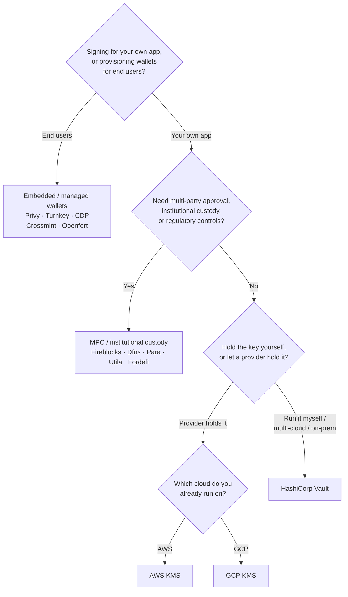

Keychain은 모든 백엔드에 걸쳐 하나의 `SolanaSigner` 기본 인터페이스를 제공하므로, 대부분의 백엔드에서는 이 선택이 아키텍처가 아닌 운영상의 문제입니다. 나중에 구성(configuration)을 통해 변경할 수 있습니다. 예외는 트랜잭션 형태입니다. Crossmint와 Fordefi 네이티브 자동 모드는 서버 측에서 서명과 브로드캐스트를 수행하고, Fordefi 네이티브 수동 모드는 서명하기 전에 트랜잭션을 재작성하므로, 이들 중 하나로 전환하거나 이들에서 다른 백엔드로 전환하면 서명자를 호출하는 방식이 달라집니다. 따라서 **특정 제품이 아닌 요구 사항에서 출발하세요.** 대부분은 두 가지 질문으로 결정됩니다. _개인 키는 어디에 보관되며, 누가 그 키로 서명을 승인할 수 있는가?_

Ledger를 제외한 모든 백엔드는 네 가지 언어(Rust, TypeScript, Python, Go) 모두에서 제공됩니다. Ledger는 Rust 전용이며, 선택적으로 활성화하는 `ledger` 기능 뒤에 있습니다.

모든 상황에 가장 적합한 단일 백엔드는 없습니다. 각 백엔드는 특정 조건에 더 잘 맞습니다. 이미 사용 중인 클라우드, 키 인프라를 직접 운영할지 여부, 그리고 반드시 갖춰야 하는 커스터디 및 승인 제어가 그 조건입니다. 아래 흐름은 이러한 조건을 백엔드와 연결해 줍니다.

<Callout type="info">
  이 가이드는 백엔드(서버 측) 서명을 다룹니다. 최종 사용자가 브라우저에서 직접 트랜잭션에 서명하는 경우에는 대신 Wallet Standard를 통한 지갑을 사용하세요. [프로덕션에서의 서명](/docs/core/transactions/signing-in-production)을 참고하세요.
</Callout>

## 의사결정 흐름

```mermaid title="Choosing a Keychain backend"
flowchart TD
    Start{Signing for your own app,<br/>or provisioning wallets<br/>for end users?}
    Start -->|End users| Managed[Embedded / managed wallets<br/>Privy · Turnkey · CDP<br/>Crossmint · Openfort]
    Start -->|Your own app| Q2{Need multi-party approval,<br/>institutional custody,<br/>or regulatory controls?}
    Q2 -->|Yes| MPC[MPC / institutional custody<br/>Fireblocks · Dfns · Para · Utila · Fordefi]
    Q2 -->|No| Q3{Hold the key yourself,<br/>or let a provider hold it?}
    Q3 -->|Provider holds it| Q4{Which cloud do you<br/>already run on?}
    Q4 -->|AWS| AWS[AWS KMS]
    Q4 -->|GCP| GCP[GCP KMS]
    Q3 -->|Run it myself /<br/>multi-cloud / on-prem| Vault[HashiCorp Vault]
```

<Callout type="info">
  로컬 개발과 테스트에는 이 중 어느 것도 필요하지 않습니다. 프로토타이핑에는 **Memory** 백엔드를 사용한 다음, 구성을 통해 위의 프로덕션 백엔드 중 하나로 전환하세요.
</Callout>

## 질문 따라가기

<Steps>

<Step>

### 자체 애플리케이션을 위해 서명하나요, 아니면 최종 사용자를 위해 서명하나요?

**최종 사용자**가 소유하고 사용하는 지갑을 프로비저닝하는 경우(소비자용 앱, 온보딩 플로우)에는 **임베디드 / 관리형 지갑** 백엔드인 Privy, Turnkey, CDP, Crossmint, Openfort 중 하나를 사용하세요. 이들은 사용자별 지갑과 인증을 대신 관리해 줍니다.

**자체 애플리케이션**으로서 서명하는 경우(수수료 지불자, 트레저리, 백엔드 자동화)에는 아래로 계속 진행하세요.

</Step>

<Step>

### 다자간 승인, 기관 커스터디 또는 규제 통제가 필요한가요?

서명이 생성되기 전에 승인 정책, 지출 한도 또는 컴플라이언스 워크플로를 통과해야 하거나, 키를 보관하는 규제 대상 커스터디언이 필요하다면 **MPC / 기관 커스터디** 백엔드인 Fireblocks, Dfns, Para, Utila, Fordefi 중 하나를 사용하세요. 이들은 키를 분할하거나 보관하고, 사용자의 정책에 따라 공동 서명합니다.

요청 시 서명하는 키만 있으면 된다면 아래로 계속 진행하세요.

</Step>

<Step>

### 키를 직접 보유하고 싶나요, 아니면 제공업체가 보유하게 하고 싶나요?

클라우드 제공업체가 하드웨어 기반 인프라에 키를 보관하고 IAM 정책으로 서명 권한을 제어하도록 하려면, 해당 클라우드의 KMS를 사용하세요.

- **AWS에서 실행 중** → AWS KMS
- **GCP에서 실행 중** → GCP KMS

키 인프라를 직접 운영하고 싶거나 멀티 클라우드 또는 온프레미스 환경이라면 **HashiCorp Vault**를 사용하세요. 직접 운영하고 감사하며, 키는 Transit 엔진 내부에 머물면서 요청 시 서명합니다.

</Step>

</Steps>

## 수탁 모델

백엔드는 여섯 가지 커스터디 모델로 분류됩니다. 위의 흐름을 따라가면 그중 하나에 도달하게 됩니다.

- **셀프 커스터디(인프로세스)**: 애플리케이션이 원시 개인 키를 직접 보유합니다. 개발에는 편리하지만 프로덕션에는 적합하지 않습니다. 백엔드: **Memory**.
- **셀프 커스터디(하드웨어 지갑)**: 키가 Ledger 장치를 벗어나지 않으며, 사람이 장치 화면에서 모든 서명을 직접 확인합니다. 대화형 운영자 서명에 적합하며, 무인 서비스에는 적합하지 않습니다. Rust 전용이며 선택적으로 활성화해야 하고, 감사 대상에 포함되지 않습니다. 백엔드: **Ledger**.
- **자체 호스팅 키 관리**: 키 인프라를 직접 운영하며, 키는 그 내부에 머물면서 요청 시 서명합니다. 백엔드: **HashiCorp Vault**.
- **클라우드 KMS / HSM**: 클라우드 제공업체가 하드웨어 기반 인프라에 키를 저장하며, 키는 서비스를 벗어나지 않고 IAM 정책으로 서명 권한을 제어합니다. 백엔드: **AWS KMS**, **GCP KMS**.
- **MPC 및 기관 커스터디**: 키가 제공업체에 분할되거나 보관되며, 제공업체가 사용자의 정책(승인, 한도)에 따라 공동 서명합니다. 백엔드: **Fireblocks**, **Dfns**, **Para**, **Utila**, **Fordefi**.
- **임베디드 및 관리형 지갑**: 제공업체가 사용자를 대신해 지갑을 관리하며, 주로 최종 사용자 온보딩에 활용됩니다. 백엔드: **Privy**, **Turnkey**, **CDP**, **Crossmint**, **Openfort**.

## 백엔드 비교

| 백엔드         | 보관 모델                  | 최적 용도                                     | 비고                                                                                                              |
| --------------- | ------------------------------ | -------------------------------------------- | ------------------------------------------------------------------------------------------------------------------ |
| Memory          | 자체 보관 (프로세스 내)      | 로컬 개발, 테스트, CI                 | 프로세스 내 원시 키 사용, 프로덕션에서는 사용하지 마세요                                                                       |
| Ledger          | 셀프 커스터디(하드웨어 지갑) | Rust 도구를 통한 대화형 운영자 서명 | Rust 전용, 선택적 `ledger` 기능, 감사 미실시, 모든 서명을 장치에서 확인                                 |
| HashiCorp Vault | 자체 호스팅 키 관리     | 자체 키 인프라를 운영하는 팀   | Transit 엔진; 직접 운영 및 감사                                                                           |
| AWS KMS         | 클라우드 KMS / HSM                | AWS에서 실행되는 백엔드                      | 키가 KMS를 벗어나지 않음; IAM이 서명 제어                                                                         |
| GCP KMS         | 클라우드 KMS / HSM                | GCP에서 실행되는 백엔드                      | 키가 KMS를 벗어나지 않음; IAM이 서명 제어                                                                         |
| Fireblocks      | MPC / 기관 수탁    | 트레저리, 거래소, 규제 수탁     | 정책 엔진 및 승인 워크플로우                                                                               |
| Dfns            | MPC 지갑 인프라      | 정책 제어가 있는 프로그래밍 방식 지갑    | Ed25519 서명                                                                                                    |
| Para            | MPC 지갑                    | MPC 기반 지갑을 원하는 앱            | API 키 + 지갑 ID                                                                                                |
| Utila           | MPC 수탁 + 공동 서명자        | 기존 Utila 관리 Solana 지갑        | `signMessage` 미지원; 트랜잭션을 직접 브로드캐스트                                                                    |
| Fordefi         | MPC / 기관 수탁    | 정책 제어 기능을 갖춘 기관 수탁   | 블랙박스: 사용자가 전송. 네이티브 자동: Fordefi가 재작성 후 전송. 네이티브 수동: Fordefi가 재작성하고, 사용자가 그 결과를 전송 |
| Privy           | 임베디드 지갑               | 사용자를 지갑에 온보딩하는 컨슈머 앱    | 앱 관리형 임베디드 지갑                                                                                       |
| Turnkey         | 비수탁 키 관리   | 프로그래밍 방식의 정책 기반 서명           | 비수탁 키 관리                                                                                       |
| CDP             | 관리형 지갑 (Coinbase)      | Coinbase 개발자 플랫폼의 앱      | `signMessage`는 UTF-8 페이로드만 허용                                                                          |
| Crossmint       | 관리형 지갑                | 마켓플레이스 및 관리형 지갑 앱         | 전송 전용: 서버 측에서 브로드캐스트하며, 가스 스폰서십을 위해 재작성할 수 있음. `signMessage` 미지원                   |
| Openfort        | 임베디드 백엔드 지갑       | 서버 사이드 지갑                          | TEE 저장 키                                                                                                    |

## 기능 형태

커스터디 외에도 각 백엔드에는 하나의 트랜잭션 형태가 있으며, 이 형태가 서명자를 호출하는 방식을 결정합니다.

- **서명**: 제공업체가 사용자가 만든 바이트에 서명하고, 사용자가 이를 브로드캐스트합니다. Ledger와 Fordefi 블랙박스 모드를 포함한 대부분의 백엔드가 해당합니다.
- **재작성 후 서명**: 제공업체가 트랜잭션을 재작성한 다음, 브로드캐스트하지 않고 서명합니다. 반환된 트랜잭션에서부터 이어서 진행하세요. Fordefi 네이티브 수동 모드가 해당합니다.
- **서명 및 브로드캐스트**: 제공업체가 서버 측에서 서명하고 브로드캐스트하므로, 실패했다고 해서 아무것도 반영되지 않았다는 뜻은 아닙니다. Crossmint와 Fordefi 네이티브 자동 모드가 해당합니다.

각 언어 README의 서명자 기능 표에 모든 백엔드의 형태가 나와 있으며, [보안 모델](https://github.com/solana-foundation/solana-keychain/blob/main/docs/SECURITY_MODEL.md)에서는 각 형태가 보장하는 내용을 설명합니다.

## 엔터프라이즈 시나리오

하나의 애플리케이션에서 이러한 백엔드가 동시에 여러 개 필요한 경우가 많습니다. 인터페이스가 공유되므로, 백엔드들이 동일한 기능 형태를 공유하는 한 호출 지점을 변경하지 않고도 역할별로 다른 백엔드를 실행할 수 있습니다.

- **재무 운영** — 운영용 "핫" 서명자와 "콜드" 재무 서명자를 분리합니다. 재무는
  MPC 커스터디 또는 클라우드 HSM으로 지원하고, 고액 서명 전에 승인 정책을
  요구합니다.
- **승인 워크플로** — MPC 및 커스터디 백엔드(예: Fireblocks)는 서명 생성 전에
  다자 승인을 강제합니다.
- **컴플라이언스 및 감사** — 클라우드 KMS(AWS/GCP) 및 Vault는 서명 감사 로그를
  기록하며, 기관 커스터디는 정책 집행 및 보고 기능을 추가합니다.
- **규제 환경** — 키 자료를 HSM, KMS 또는 기관 커스터디에 보관하여 원시 키가
  애플리케이션에 노출되지 않도록 합니다.

이러한 백엔드를 안전하게 운영하는 방법은
[프로덕션 모범 사례](/docs/tools/keychain/production-best-practices)를
참조하세요.

<Cards>
  <Card title="Rust 가이드" href="/docs/tools/keychain/getting-started/rust">
    Rust에서 각 백엔드를 구성합니다.
  </Card>
  <Card
    title="TypeScript 가이드"
    href="/docs/tools/keychain/getting-started/typescript"
  >
    TypeScript에서 각 백엔드를 구성합니다.
  </Card>
</Cards>
