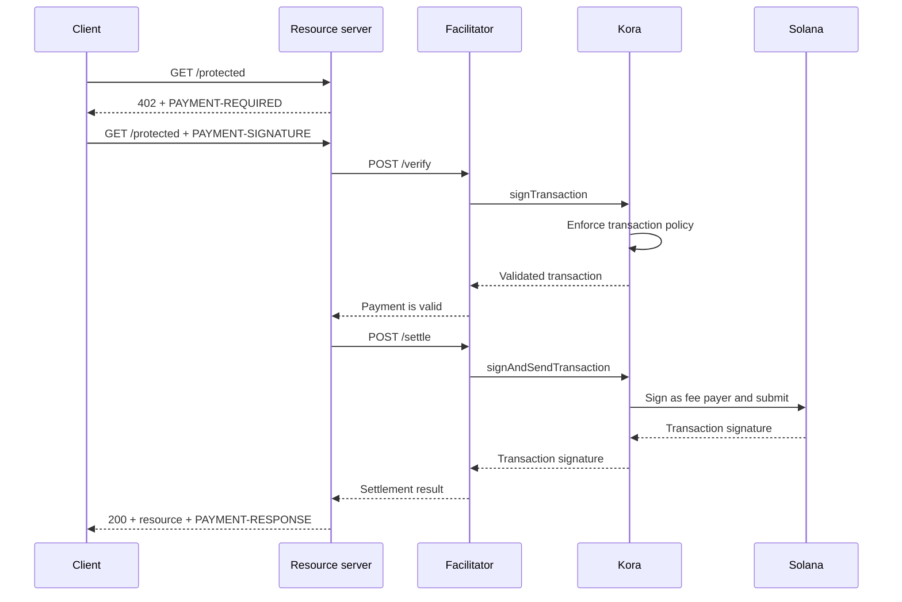

Kora는 [x402 V2 퍼실리테이터](/docs/tools/x402-facilitator) 뒤에서 Solana 서명, 트랜잭션 정책, 수수료 후원 레이어를 제공할 수 있습니다. 퍼실리테이터는 x402 HTTP API를 구현하고, Kora는 수락된 결제 트랜잭션을 검증, 서명 및 전송합니다.

이 가이드는 Solana Devnet에서 참조용 Kora 퍼실리테이터를 시작합니다. 이는 프로덕션 배포가 아닌 통합 테스트를 위한 개발 환경입니다.

## 아키텍처



네 가지 애플리케이션 역할은 분리되어 있습니다:

- **클라이언트**는 결제 요건을 선택하고 결제 승인에 서명합니다.
- **리소스 서버**는 라우트 가격을 책정하고 성공적인 검증 및 정산 이후에만 이를 이행합니다.
- **퍼실리테이터**는 x402의 `/supported`, `/verify`, `/settle` 엔드포인트를 노출합니다.
- **Kora**는 정책상 허용된 트랜잭션에만 서명하며 Solana 네트워크 수수료를 후원할 수 있습니다.

Kora는 x402 프로토콜을 대체하지 않습니다. 이 퍼실리테이터 구현에서 사용되는 서명 및 정책 경계입니다.

## 참조 퍼실리테이터 시작

Git과 [Docker with Compose](https://docs.docker.com/compose/)가 필요합니다. 최신 안정 버전의 Kora 릴리스를 클론하고 x402 데모 디렉터리로 이동하세요:

```bash
git clone --branch v2.0.5 --depth 1 https://github.com/solana-foundation/kora.git
cd kora/examples/x402/demo
cp .env.example .env
```

`.env`의 `KORA_PRIVATE_KEY`를 일회용 Devnet keypair로 설정하세요. 데모의 서명자 구성은 base58 시크릿, 바이트 배열 keypair, 또는 JSON keypair 파일 경로를 허용합니다. 트랜잭션 수수료를 후원할 수 있도록 해당 공개 주소에 Devnet SOL을 충전하세요.

<Callout type="caution" title="일회용 Devnet 서명자 사용">
  Docker 데모는 환경 변수에서 Kora 서명자를 로드합니다. 이 데모에 프로덕션 서명 키를 입력하거나 `.env` 파일을 커밋하지 마세요.
</Callout>

Kora와 퍼실리테이터를 시작합니다:

```bash
docker compose up --build
```

첫 번째 빌드는 몇 분 정도 걸릴 수 있습니다. 두 헬스 체크가 모두 통과되면 다른 터미널에서 퍼실리테이터의 공개 기능을 확인하세요:

```bash
curl http://127.0.0.1:3000/supported
```

응답에는 x402 버전 `2`, `exact` 스킴, Devnet CAIP-2 네트워크 식별자가 표시되어야 합니다:

```json
{
  "kinds": [
    {
      "x402Version": 2,
      "scheme": "exact",
      "network": "solana:EtWTRABZaYq6iMfeYKouRu166VU2xqa1",
      "extra": {
        "feePayer": "<KORA_SIGNER_ADDRESS>"
      }
    }
  ]
}
```

Kora는 기본적으로 `127.0.0.1:8080`에서, 퍼실리테이터는 `127.0.0.1:3000`에서 수신 대기합니다. `Ctrl+C`로 데모를 종료할 수 있습니다.

## 리소스 서버 연결

로컬 퍼실리테이터와 Kora 서명자의 공개 주소를 수신자로 사용하도록 x402 리소스 서버를 구성하세요:

```bash
FACILITATOR_URL=http://127.0.0.1:3000
SOLANA_PAY_TO=<KORA_SIGNER_ADDRESS>
```

그런 다음 [Solana의 x402](/docs/payments/agentic-payments/x402)를 참고하여 Express 라우트에 x402 V2 미들웨어를 추가하세요. 미결제 요청은 `PAYMENT-REQUIRED`를 받고, 재시도 요청에는 `PAYMENT-SIGNATURE`가 포함되며, 성공적인 응답에는 `PAYMENT-RESPONSE`가 포함됩니다.

`X-PAYMENT`, `X-PAYMENT-RESPONSE` 또는 `solana-devnet` 네트워크 이름을 사용하는 예시를 복사하지 마세요. 해당 필드는 x402 V1에 속합니다.

Kora 저장소에는 동일한 `examples/x402/demo` 디렉터리에 보호된 API와 결제 인식 클라이언트도 포함되어 있습니다. 전체 로컬 플로우를 테스트해야 할 때 해당 애플리케이션을 사용하세요.

## Kora 정책 구성

참조용 `kora/kora.toml`은 의도적으로 범위가 좁게 설정되어 있습니다. 유효성 검사 정책이 제어하는 항목:

- 서명자가 허용하는 Solana 프로그램;
- 사용 가능한 SPL 토큰 민트;
- 최대 후원 lamport 수 및 서명 횟수;
- 금지된 수수료 납부자 작업; 및
- 거부된 Token-2022 확장.

데모는 퍼실리테이터에 필요한 Kora RPC 메서드만 활성화합니다: `signTransaction`, `signAndSendTransaction`, `getBlockhash`, `getPayerSigner`, `getConfig`, `getVersion`.

정책을 수수료 납부자 키의 보안 경계로 취급하세요. 프로덕션 서비스의 경우:

1. x402 스킴이 생성하는 프로그램, 토큰 민트, 트랜잭션 형식만 허용 목록에 추가하세요.
2. Kora 서명자에서 가치를 이동시킬 수 있는 전송, 권한 변경, 계정 폐쇄 및 기타 명령을 거부하세요.
3. 퍼실리테이터 자격 증명이 침해되었을 때 손실을 제한하는 트랜잭션 및 사용 한도를 설정하세요.
4. 환경 변수에 저장된 개인 키 대신 관리형 서명자 백엔드를 사용하세요.

## 퍼실리테이터-Kora 연결 보안

데모는 Kora API 키 인증을 활성화합니다. 퍼실리테이터는 `KORA_API_KEY` 값을 전송하며, 이는 `kora.toml`의 `[kora.auth].api_key`와 일치해야 합니다.

프로덕션 환경에서는 추가로:

- Kora를 프라이빗 네트워크에 유지하고 신뢰할 수 있는 경계에서 TLS를 종료하세요;
- API 자격 증명을 시크릿 매니저에 저장하고 주기적으로 교체하세요;
- 변조 및 재전송 공격 방지를 위해 Kora의 HMAC 요청 인증을 고려하세요;
- 회계 모델에 필요한 경우 수수료 납부자 키와 결제 수신자 키를 분리하세요; 및
- 정책 거부, 정산 실패, 수수료 소비, 서명자 잔액에 대한 알림을 설정하세요.

## 결제 정산 강화

Kora가 Solana 트랜잭션을 검증하더라도 퍼실리테이터와 리소스 서버는 여전히 x402 프로토콜 정확성에 대한 책임을 집니다. 리소스를 제공하기 전에 다음을 적용하세요:

- 선택된 x402 버전, 스킴, 네트워크, 자산, 금액 및 수신자;
- 승인 유효 기간 및 정확한 Solana 명령 레이아웃;
- 원자적 재전송 방지 및 멱등적 정산;
- 제품에 필요한 커밋 수준에서의 확인; 및
- 구매, 정산 결과, 이행 간의 내구성 있는 매핑.

Kora가 서명을 위해 트랜잭션을 수락했다는 이유만으로 유료 콘텐츠를 반환하지 마세요. 퍼실리테이터가 성공적인 정산 결과를 반환한 후에만 이행하세요.

## 관련 리소스

- [Kora 저장소 및 x402 데모](https://github.com/solana-foundation/kora/tree/main/examples/x402/demo)
- [Kora 운영자 구성](/docs/tools/kora/operators/configuration)
- [Kora 서명자 백엔드](/docs/tools/kora/operators/signers)
- [Kora 보안 감사](/docs/tools/kora/security-audits)
- [x402 V2 사양](https://github.com/x402-foundation/x402/blob/main/specs/x402-specification-v2.md)
- [에이전틱 결제 개요](/docs/payments/agentic-payments)
