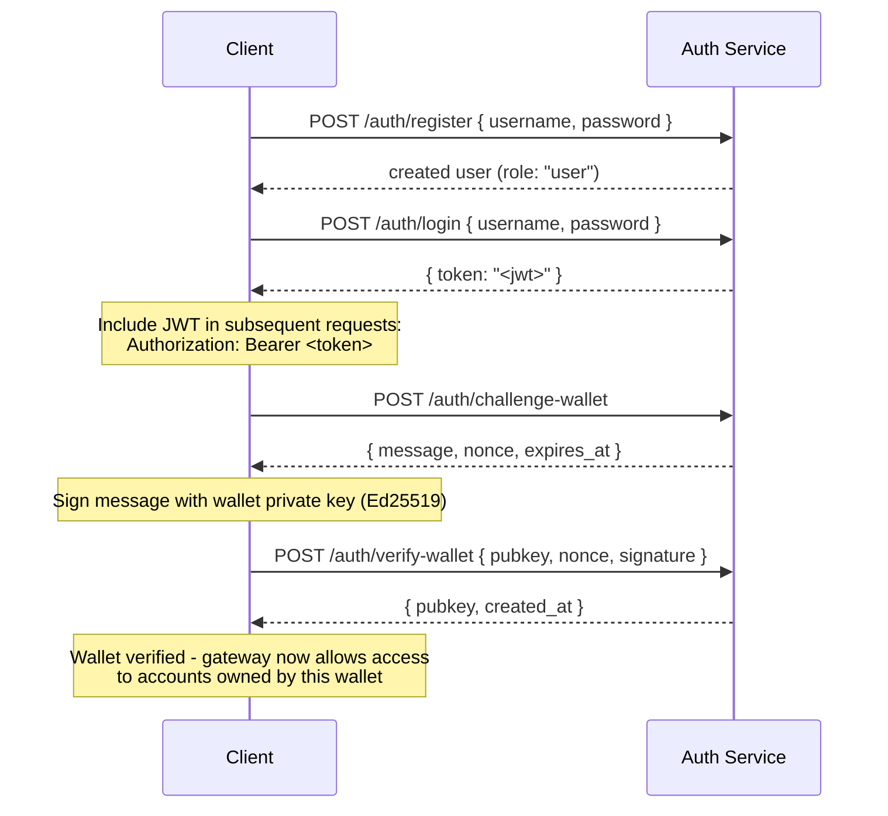

## 개요

Private Channels에는 선택적 Auth Service가 포함되어 있으며, JWT 인증 및 역할 기반 접근 제어(RBAC)로 게이트웨이 접근을 제한합니다. 인증이 비활성화된 경우 게이트웨이는 모든 연결을 허용합니다. 활성화된 경우 클라이언트는 모든 요청에 유효한 JWT를 제시해야 합니다.

이 페이지는 두 가지 대상을 다룹니다:

- **개발자** - 등록, 로그인, 지갑 인증 및 인증된 요청 수행
- **운영자** - auth service 활성화, `JWT_SECRET` 구성 및 `operator` 역할 프로비저닝

## 인증 활성화

인증은 게이트웨이와 Auth Service 모두에서 `JWT_SECRET`을 (비어 있지 않게) 설정함으로써 활성화됩니다. Auth Service에는 `AUTH_DATABASE_URL`도 필요합니다.

`JWT_SECRET`이 설정되지 않은 경우 게이트웨이는 개방 모드로 작동하며, 토큰이 필요하지 않습니다.

> **Docker Compose:** auth service는 Docker Compose 프로필이며 **기본적으로 시작되지 않습니다**. 포함하려면 `docker compose` 명령에 `--profile auth`를 전달하고, `JWT_SECRET` 및 `POSTGRES_PASSWORD`와 같은 시크릿이 실제로 적용되도록 `--env-file .env`도 함께 전달하세요 (Compose는 `--env-file` 플래그가 전달되면 자동 `.env` 로드를 비활성화합니다):
>
> ```bash
> docker compose -f docker-compose.devnet.yml --env-file versions.env --env-file .env.devnet --env-file .env --profile auth up -d
> ```

## Auth Service API

모든 엔드포인트는 `/auth` 하위에 있습니다. auth service는 `AUTH_PORT`(기본값 `8903`)에서 수신 대기합니다.

### `POST /auth/register`

새 계정을 생성합니다. 모든 사용자는 `user` 역할로 등록됩니다.

```json
{ "username": "alice", "password": "hunter2" }
```

- 사용자 이름: 5~32자, 영숫자 및 `_`, `-` 허용
- 비밀번호: 6~128자
- 생성된 사용자를 반환하며, 비밀번호는 반환되지 않습니다

### `POST /auth/login`

인증을 수행하고 24시간 유효한 서명된 JWT를 받습니다.

```json
{ "username": "alice", "password": "hunter2" }
```

`{ "token": "<jwt>" }`를 반환합니다. 잘못된 사용자 이름과 잘못된 비밀번호 모두 사용자 이름 열거를 방지하기 위해 `401`을 반환합니다.

### `POST /auth/challenge-wallet`

Solana 지갑 소유권을 증명하기 위한 서명 챌린지를 요청합니다. 유효한 JWT가 필요합니다.

메시지, 논스 및 만료 시간을 반환합니다. 챌린지는 10분 후 만료됩니다.

```json
{
  "message": "PrivateChannel wallet verification\nuser: <uuid>\nnonce: <uuid>\nexpires: <unix>",
  "nonce": "<uuid>",
  "expires_at": "<iso8601>"
}
```

### `POST /auth/verify-wallet`

서명된 챌린지를 제출하여 지갑을 인증된 것으로 등록합니다. 유효한 JWT가 필요합니다.

```json
{
  "pubkey": "<base58 pubkey>",
  "nonce": "<uuid from challenge>",
  "signature": "<base58 Ed25519 signature>"
}
```

서비스는 챌린지 메시지를 재구성하고 Ed25519 서명을 검증한 후 지갑을 저장합니다. 각 논스는 한 번만 사용할 수 있으며 재사용 시 거부됩니다.

`{ "pubkey": "<base58>", "created_at": "<iso8601>" }`를 반환합니다.

### `GET /auth/wallets`

인증된 사용자의 모든 인증된 지갑을 나열합니다. 유효한 JWT가 필요합니다.

### `DELETE /auth/wallets/{pubkey}`

인증된 사용자의 계정에서 인증된 지갑을 제거합니다. 유효한 JWT가 필요합니다.

### `GET /health`

활성 상태 확인. `200 ok`를 반환합니다. 인증이 필요하지 않습니다.

## JWT 구조

토큰은 HS256 알고리즘을 사용하며 발급 후 24시간이 지나면 만료됩니다.

| 클레임  | 값                           |
| ------ | ------------------------------- |
| `sub`  | 사용자 UUID                       |
| `role` | `"user"` 또는 `"operator"`        |
| `iss`  | `"private-channel-auth"`        |
| `aud`  | `"private-channel-gateway"`     |
| `exp`  | Unix 타임스탬프 (발급 후 24시간) |

> `iss`와 `aud`는 JWT 페이로드에 포함되어 있지만 애플리케이션 클레임 구조체로 역직렬화되지 않고 게이트웨이의 JWT 구성에 의해 검증됩니다. 애플리케이션 레이어 코드는 `sub`, `role`, `exp`에만 접근할 수 있습니다.

`Authorization` 헤더에 토큰을 전달합니다:

```
Authorization: Bearer <JWT_TOKEN>
```

## 역할

### user

등록 시 기본 역할입니다.

- 사용자 본인의 인증된 지갑에만 접근 가능
- 차단 대상: `getBlock`, `getTransaction`, `simulateTransaction`
- 가능: Escrow Program에서 `Deposit` 호출, `WithdrawFunds`를 통한 출금 개시

### operator

상위 역할입니다. 직접 프로비저닝해야 하며, `user`에서 `operator`로 자체 에스컬레이션하는 경로는 없습니다.

**역할 부여**, Admin CLI(`private-channel-auth-admin`)를 통해:

```bash
private-channel-auth-admin set-role --username alice --role operator
```

또는 직접 SQL로:

<Callout type="warning">
  이것은 권한이 있는 데이터베이스 작업입니다. Auth Service 데이터베이스에 대한 접근을 적절히 제한하고 역할 변경 사항을 감사하세요.
</Callout>

```sql
UPDATE private_channel_auth.users SET role = 'operator' WHERE username = 'alice';
```

**자체 인증 플로우 없이 지갑 등록 (Admin CLI, `private-channel-auth-admin`):**

```bash
private-channel-auth-admin attach-wallet --username alice --pubkey <base58-pubkey>
```

이 명령은 챌린지/인증 플로우를 우회하여 인증된 지갑을 `verified_wallets` 테이블에 직접 삽입합니다. `(user_id, pubkey)`에 대한 고유 제약 조건을 적용합니다. 이 명령 자체로는 `operator` 역할을 부여하지 않으며, 해당 역할을 부여하려면 `set-role` 또는 위의 SQL 업데이트를 사용하세요. 이 명령은 인터랙티브 챌린지/인증 플로우 없이 계정(예: 서비스 계정)에 지갑을 연결하기 위한 것입니다.

**권한:**

- 모든 지갑 소유권 확인 우회
- `getBlock`, `getTransaction`, `simulateTransaction`을 포함한 모든 게이트웨이 RPC 메서드에 대한 전체 접근
- 필수 대상: `ReleaseFunds`, `ResetSmtRoot`

## 전체 인증 플로우



## 인증된 요청 수행

```typescript
const response = await fetch("http://localhost:8899/", {
  method: "POST",
  headers: {
    "Content-Type": "application/json",
    Authorization: `Bearer ${jwtToken}`
  },
  body: JSON.stringify({
    jsonrpc: "2.0",
    id: 1,
    method: "getBalance",
    params: [walletAddress]
  })
});
const data = await response.json();
```

## 게이트웨이 엔드포인트

다음 엔드포인트는 인증이 필요하지 않습니다:

| 엔드포인트  | 메서드 | 설명                               | 성공                  | 실패                     |
| --------- | ------ | ----------------------------------------- | ------------------------ | --------------------------- |
| `/health` | GET    | 활성 상태 확인                            | `200 {"status":"ok"}`    | -                           |
| `/ready`  | GET    | 심층 준비 상태 확인; 쓰기 및 읽기 노드 탐색 | `200 {"status":"ready"}` | `503 {"status":"degraded"}` |

`JWT_SECRET` 및 게이트웨이 환경 변수 레퍼런스는 [구성 레퍼런스](/docs/tools/private-channels/operators/configuration)를 참조하세요.

## RPC 메서드 접근 매트릭스

다음 메서드는 게이트웨이에서 인식됩니다. `JWT_SECRET`이 설정된 경우 접근은 JWT 역할에 따라 결정됩니다:

| 메서드                        | 라우트      | JWT 없음 | `user`           | `operator` |
| ----------------------------- | ---------- | ------ | ---------------- | ---------- |
| `sendTransaction`             | 쓰기 노드 | ✓      | ✓                | ✓          |
| `getLatestBlockhash`          | 읽기 노드  | ✓      | ✓                | ✓          |
| `getSlot`                     | 읽기 노드  | ✓      | ✓                | ✓          |
| `getRecentBlockhash`          | 읽기 노드  | ✓      | ✓                | ✓          |
| `getSignatureStatuses`        | 읽기 노드  | ✓      | ✓                | ✓          |
| `getTransactionCount`         | 읽기 노드  | ✓      | ✓                | ✓          |
| `getFirstAvailableBlock`      | 읽기 노드  | ✓      | ✓                | ✓          |
| `getBlocks`                   | 읽기 노드  | ✓      | ✓                | ✓          |
| `getEpochInfo`                | 읽기 노드  | ✓      | ✓                | ✓          |
| `getEpochSchedule`            | 읽기 노드  | ✓      | ✓                | ✓          |
| `getRecentPerformanceSamples` | 읽기 노드  | ✓      | ✓                | ✓          |
| `getBlockTime`                | 읽기 노드  | ✓      | ✓                | ✓          |
| `getVoteAccounts`             | 읽기 노드  | ✓      | ✓                | ✓          |
| `getSupply`                   | 읽기 노드  | ✓      | ✓                | ✓          |
| `getSlotLeaders`              | 읽기 노드  | ✓      | ✓                | ✓          |
| `isBlockhashValid`            | 읽기 노드  | ✓      | ✓                | ✓          |
| `getAccountInfo`              | 읽기 노드  | 401    | 소유권 게이팅¹ | ✓          |
| `getTokenAccountBalance`      | 읽기 노드  | 401    | 소유권 게이팅¹ | ✓          |
| `getSignaturesForAddress`     | 읽기 노드  | 401    | 소유권 게이팅¹ | ✓          |
| `getBlock`                    | 읽기 노드  | 401    | 403              | ✓          |
| `getTransaction`              | 읽기 노드  | 401    | 403              | ✓          |
| `simulateTransaction`         | 읽기 노드  | 401    | 403              | ✓          |

¹ **소유권 게이팅**: SPL token account(`owner` 필드가 `TokenkegQ...` 또는 `TokenzQ...`이고 데이터가 최소 165바이트인 경우)의 경우, 게이트웨이는 `owner` 또는 `delegate` 필드가 인증된 사용자의 인증된 지갑 중 하나와 일치하는지 확인합니다. 다른 계정 유형(System Program 지갑 또는 알 수 없는 PDA)의 경우, 해당 계정에는 검사할 owner/delegate 필드가 없으므로 조회된 pubkey 자체가 사용자의 인증된 지갑 중 하나인지 확인합니다. 두 확인 중 하나라도 실패하면 403을 반환합니다.
