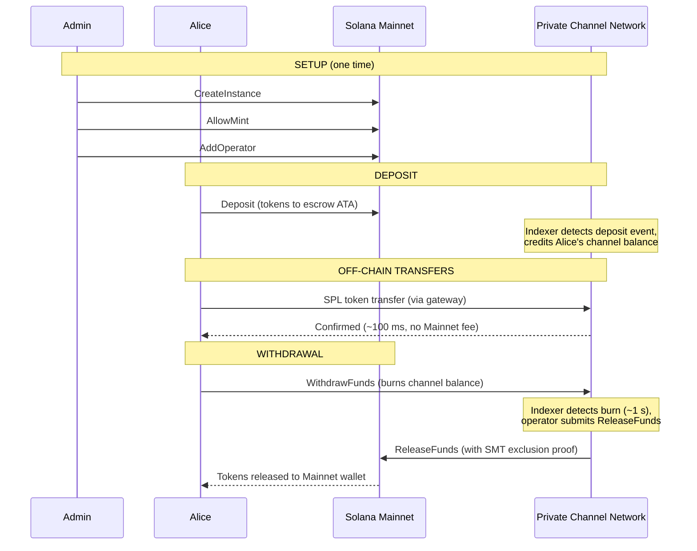
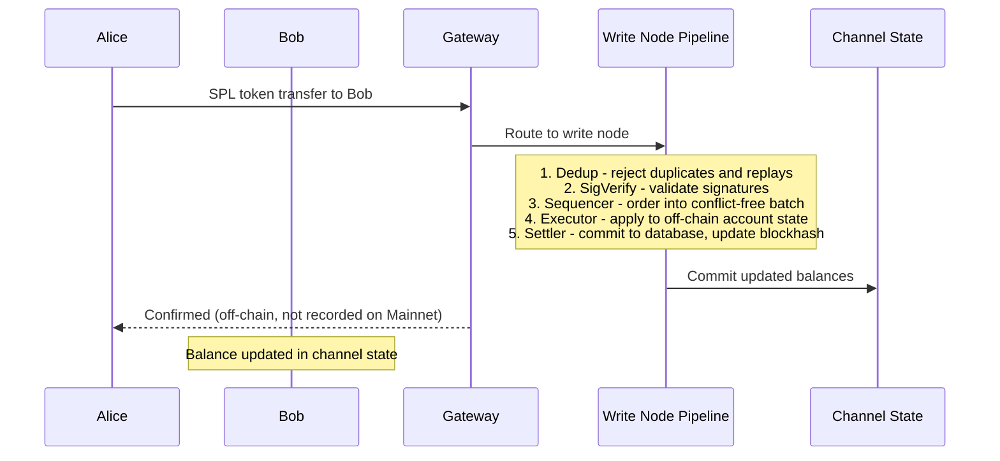
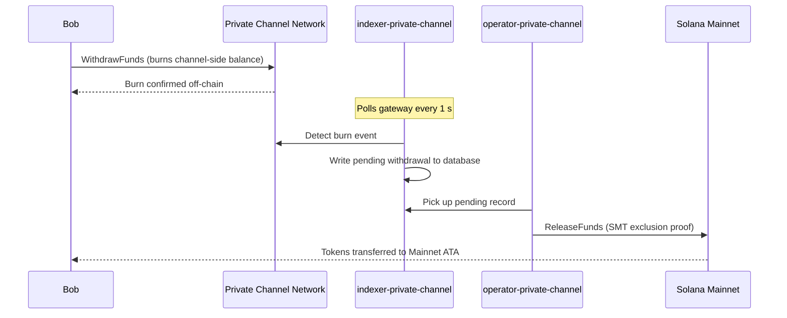

## 프라이빗 채널이란?

프라이빗 채널은 Solana에 고정된 오프체인 결제 네트워크입니다. 사용자는 온체인 에스크로 프로그램에 SPL 토큰을 예치한 후, 게이트웨이를 통해 빠른 속도와 건당 수수료 없이 오프체인으로 거래합니다. Solana 메인넷으로의 정산은 Sparse Merkle Tree 증명을 통해 이루어지며, 자금은 언제든지 환급 가능하고 이중 지불은 불가능합니다.

Solana의 기본 결제 흐름과 달리, 채널 내 전송은 사용자가 출금하기 전까지 온체인에 기록되지 않습니다. 채널 네트워크는 Solana의 블록 시간과 독립적으로 트랜잭션을 처리하는 자체 트랜잭션 파이프라인(dedup -> sig verify -> sequencer -> executor -> settler)을 운영합니다.

## 참여자

### 인스턴스 관리자

관리자는 `CreateInstance`를 통해 `Instance` PDA를 배포하고, 허용되는 SPL 토큰 민트를 제어합니다(`AllowMint` / `BlockMint`). 관리자는 `AddOperator` / `RemoveOperator`를 통해 오퍼레이터를 프로비저닝하거나 해제하며, `SetNewAdmin`을 통해 관리자 권한을 이전할 수 있습니다. 인스턴스당 관리자는 한 명입니다. 관리자 권한 이전은 단일 단계에서 비가역적으로 이루어지며, 현재 관리자는 새 관리자의 협조 없이 역할을 되찾을 수 없습니다.

### 오퍼레이터

오퍼레이터는 관리자가 프로비저닝합니다. 오퍼레이터는 `Operator` PDA를 보유하며, `ReleaseFunds`(메인넷으로의 출금 정산)와 `ResetSmtRoot`(Sparse Merkle Tree 교체)를 호출할 수 있는 유일한 계정입니다. 오퍼레이터는 게이트웨이의 모든 소유권 검사를 우회하며, `getBlock`, `getTransaction`, `simulateTransaction`을 포함한 모든 JSON-RPC 메서드에 접근할 수 있습니다. JWT 역할: `"operator"`. 오퍼레이터는 데이터베이스에 직접 프로비저닝되어야 하며, 자체 권한 상승은 불가능합니다. 배포 및 구성에 대한 자세한 내용은 [오퍼레이터 가이드](/docs/tools/private-channels/operators)를 참조하세요.

### 사용자

사용자는 Auth Service를 통해 직접 등록합니다. JWT 역할: `"user"`. 사용자는 에스크로 프로그램에서 직접 `Deposit`을 호출하고, 출금 프로그램의 채널 측 `WithdrawFunds` 명령어를 통해 출금을 시작할 수 있습니다. 게이트웨이 접근은 본인의 인증된 지갑으로만 제한되며, `getBlock`, `getTransaction`, `simulateTransaction`은 호출할 수 없습니다.

## 채널 생명주기

1. **인스턴스 생성** - 관리자가 `CreateInstance`를 호출하여 `Instance` PDA를 생성하고 허용 민트를 구성합니다.
2. **예치** - 사용자가 `Deposit` 명령어를 통해 에스크로에 SPL 토큰을 예치합니다. 토큰은 인스턴스의 associated token account으로 이동합니다.
3. **오프체인 전송** - 사용자가 게이트웨이를 통해 전송을 수행합니다. 전송은 메인넷에 영향을 주지 않고 채널 네트워크에서 순서대로 실행됩니다.
4. **출금 시작** - 사용자가 출금 프로그램(채널 측)에서 `WithdrawFunds`를 호출하여 잔액을 소각하고 출금을 신호합니다.
5. **메인넷 정산** - 오퍼레이터가 유효한 SMT 배제 증명을 제공하고 에스크로 프로그램(메인넷)에서 `ReleaseFunds`를 호출하여 사용자의 지갑으로 토큰을 해제합니다.
6. **트리 교체** - SMT가 최대 용량(65,536 리프)에 근접하면, 오퍼레이터가 `ResetSmtRoot`를 호출하여 트리를 교체하고 새 epoch을 시작합니다.

### 전송

### 출금

## 프라이빗 채널을 사용해야 할 때

다음과 같은 요구사항이 있는 경우 프라이빗 채널을 사용하세요:

- **오프체인 처리량** - 전송량이 Solana TPS를 초과하거나 1초 미만의 확인이 필요한 경우
- **프라이버시** - 거래 상대방의 신원과 전송 금액이 온체인에 노출되어서는 안 되는 경우
- **건당 수수료 없음** - 빈번한 전송으로 인해 건당 SOL 비용이 부담스러운 경우

다음과 같은 경우에는 네이티브 SPL 전송을 사용하세요:

- **온체인 조합성**이 필요한 경우 (DeFi, 스왑, 대출 등 다른 프로그램이 전송을 관찰하거나 이를 기반으로 동작해야 하는 경우)
- **단일 전송 정산**으로 충분하고 프라이버시가 중요하지 않은 경우
- **게이트웨이 인프라**를 사용할 수 없거나 운영상 실현 불가능한 경우
