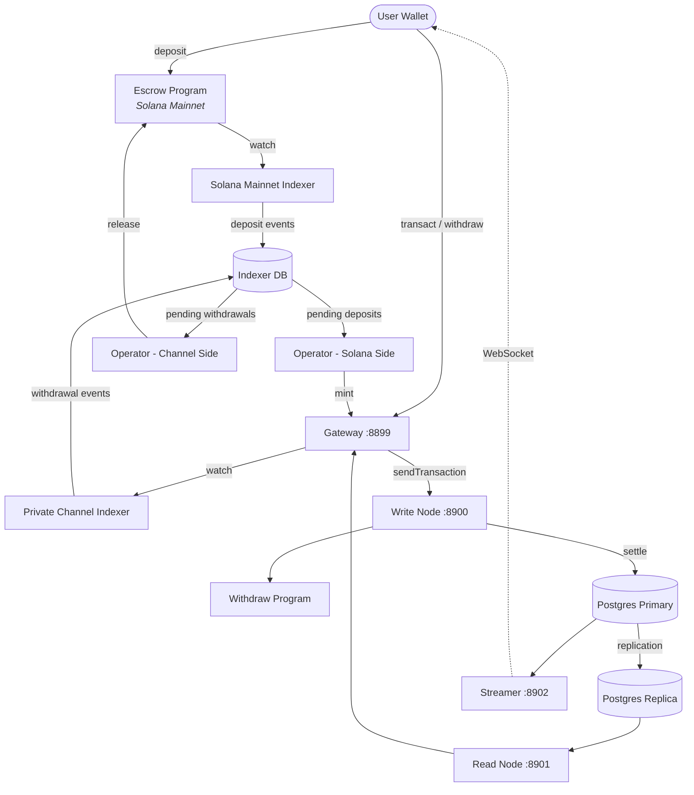

<Callout type="warning">
  Private Channels는 보안 감사를 받지 않았으며, 철저한 보안 검토 없이 실제 자금이 포함된 프로덕션 환경에서의 사용은 권장되지 않습니다.
</Callout>

<Callout type="info">
  **인스턴스를 배포하시나요?** [운영자 가이드](/docs/tools/private-channels/operators)로 이동하세요. **기존 인스턴스와 통합하시나요?** [빠른 시작](/docs/tools/private-channels/quickstart/installation)으로 이동하세요. 이 페이지는 두 대상 모두를 위한 아키텍처 참조 문서입니다.
</Callout>

## 아키텍처

Private Channels는 네 가지 구성 요소로 이루어져 있습니다: 온체인 Solana 프로그램 두 개(Escrow 및 Withdraw)와 오프체인 서비스 두 개(Gateway 및 Auth Service)입니다. 이들은 함께 상태 채널 프로토콜을 구성하며, 자금은 Mainnet에 보관되지만 전송은 오프체인에서 정산됩니다.

### Escrow 프로그램

Escrow 프로그램은 입금된 SPL 토큰을 보관하는 온체인 Solana 프로그램입니다. 이 프로그램은 시스템의 신뢰 앵커입니다: 운영자가 유효한 Sparse Merkle Tree 배제 증명을 제공하여 자금을 해제할 때까지 모든 자금은 최종적으로 에스크로에 보관됩니다.

- 프로그램 ID: `9tgHa1DcnaSSUtmMsst8ovKTe1Gfxzezn27KnH9xXYeU`
- 이 ID는 `declare_id!()`를 통해 프로그램 바이너리에 컴파일됩니다. 오프체인 서비스는 환경 변수가 아닌 생성된 클라이언트 크레이트로부터 컴파일 시점에 동일한 ID를 읽습니다.
- `Instance`, `AllowedMint`, `Operator` PDA를 관리합니다
- 명령어: `CreateInstance`, `AllowMint`, `BlockMint`, `AddOperator`,
  `RemoveOperator`, `SetNewAdmin`, `Deposit`, `ReleaseFunds`, `ResetSmtRoot`

### Withdraw 프로그램

Withdraw 프로그램은 Solana Mainnet이 아닌 프라이빗 채널 네트워크에서 실행됩니다. 사용자는 `WithdrawFunds`를 호출하여 채널 측 토큰 잔액을 소각합니다. 이 소각은 자금을 자동으로 해제하지 않으며, 운영자에게 출금이 대기 중임을 알립니다. 그런 다음 운영자는 정산을 완료하기 위해 유효한 SMT 증명과 함께 Escrow 프로그램의 `ReleaseFunds`를 호출합니다.

- 프로그램 ID: `J231K9UEpS4y4KAPwGc4gsMNCjKFRMYcQBcjVW7vBhVi`
- 이 ID는 프로그램 바이너리에 컴파일됩니다. 오프체인 서비스는 환경 변수가 아닌 생성된 클라이언트 크레이트로부터 컴파일 시점에 동일한 ID를 읽습니다.

### Gateway

Gateway는 Solana JSON-RPC 호환 프록시로, 클라이언트 요청을 채널 네트워크의 쓰기 노드(트랜잭션 제출용)와 읽기 노드(쿼리용)로 라우팅합니다. 환경 변수 `GATEWAY_PORT`, `GATEWAY_WRITE_URL`, `GATEWAY_READ_URL`을 통해 구성됩니다.

헬스 엔드포인트(인증 불필요):

- `GET /health` - 활성 확인; `200 {"status":"ok"}` 반환
- `GET /ready` - 심층 준비 상태 확인, 쓰기 + 읽기 노드를 프로브합니다; `200 {"status":"ready"}` 또는 `503 {"status":"degraded"}` 반환

#### RPC 메서드 라우팅 및 접근

게이트웨이는 `sendTransaction`을 쓰기 노드로 라우팅하고, 나머지 모든 메서드는 읽기 노드로 라우팅합니다. 64KB를 초과하는 요청은 HTTP 413으로 거부됩니다. 인증이 활성화된 경우, 메서드 접근은 JWT 역할에 의해 제어됩니다. 전체 메서드 매트릭스는 **[인증 및 역할](/docs/tools/private-channels/concepts/auth)**을 참조하세요.

### Auth Service

Auth Service는 게이트웨이 접근 제어를 위해 HS256 JWT(24시간 만료)를 발급하는 선택적 구성 요소입니다. `JWT_SECRET` 환경 변수가 설정된 경우 활성화됩니다. 설정되지 않으면 게이트웨이는 모든 연결을 허용합니다.

JWT 클레임: `sub` (사용자 UUID), `role` (`"user"` 또는 `"operator"`), `iss`
(`"private-channel-auth"`), `aud` (`"private-channel-gateway"`), `exp` (Unix 타임스탬프). `iss`와 `aud`는 게이트웨이의 JWT 구성에 의해 검증되며, 애플리케이션 클레임 구조체로 역직렬화되지 않습니다: 애플리케이션 레이어 코드에서는 `sub`, `role`, `exp`만 사용할 수 있습니다.

역할:

- `user` - 본인 소유의 검증된 지갑으로만 접근 제한; `getBlock`, `getTransaction`, `simulateTransaction` 호출 불가
- `operator` - 모든 소유권 확인 우회; 전체 RPC 메서드 접근 가능; 데이터베이스에서 프로비저닝 필요(셀프 서비스 권한 상승 불가)

### Streamer

Streamer는 WebSocket 서버로, 연결된 클라이언트에 채널 상태 업데이트를 실시간으로 푸시하여 RPC 폴링의 필요성을 없애줍니다. PostgreSQL에서 상태 변경을 폴링합니다. 이 가이드가 배포하는 devnet 스택이 아닌 기본 Docker Compose 스택의 일부입니다; [구성 참조](/docs/tools/private-channels/operators/configuration#service-port-reference)를 참조하세요.

- 포트: `8902`, `STREAMER_PORT`를 통해 구성 가능
- 연결: `ws://localhost:8902`
- 헬스 엔드포인트: `GET /health` - 내부 폴링 루프가 30초 이상 중단되면 `503` 반환

<Callout type="warning">
  WebSocket 이벤트 스키마는 아직 공개적으로 문서화되지 않았습니다. 공식 문서가 제공될 때까지 구현 세부 사항은 [`core/src/bin/streamer.rs`](https://github.com/solana-foundation/solana-private-channels/blob/main/core/src/bin/streamer.rs)를 참조하세요.
</Callout>



## 트랜잭션 파이프라인

```text
Transaction -> [1:Dedup] -> [2:SigVerify] -> [3:Sequencer] -> [4:Executor] -> [5:Settler] -> Database
```

Gateway에 제출된 트랜잭션은 상태가 커밋되기 전에 5단계 파이프라인을 거칩니다:

1. **Dedup** - 파이프라인에 진입하기 전에 중복 트랜잭션을 필터링합니다
2. **SigVerify** - 서명자의 공개 키에 대해 트랜잭션 서명을 검증합니다
3. **Sequencer** - 유효한 트랜잭션을 결정론적으로 정렬하여 표준 이력을 수립합니다
4. **Executor** - 채널의 계정 레이어(BOB Cache + AccountsDB)에 대해 트랜잭션을 실행하고, 오프체인에서 잔액을 업데이트합니다
5. **Settler** - 누적된 트랜잭션 결과를 PostgreSQL에 커밋하고 Redis 캐시를 업데이트합니다; 다음 블록 사이클을 위한 새로운 블록해시를 생성합니다. Mainnet 정산(`ReleaseFunds` 호출)은 `operator-private-channel` 서비스에 의해 별도로 처리됩니다

## 주요 기능

### 프라이버시

채널 참여자 간의 전송은 Solana Mainnet에 기록되지 않습니다. 입금(채널 진입)과 최종 출금(채널 이탈)만 온체인에 나타납니다. 상대방 신원과 전송 금액은 채널 운영 중에 외부 관찰자에게 공개되지 않습니다.

### 성능

오프체인 파이프라인은 Solana의 블록 시간을 크리티컬 패스에서 제거합니다. 전송은 Solana 블록이 확정될 때가 아닌 시퀀서가 처리할 때 확인됩니다. 이를 통해 앱 레이어 전송에서 Solana의 네이티브 TPS를 초과하는 처리량과 1초 미만의 완결성을 실현합니다.

### 정산

모든 출금은 온체인 Sparse Merkle Tree 증명으로 보호됩니다. SMT 루트는 Escrow 프로그램의 `Instance.withdrawal_transactions_root`에 저장됩니다. `ReleaseFunds`가 호출되면 프로그램은 먼저 현재 온체인 루트에 대해 확인되지 않은 논스의 배제 증명을 검증하고, 그런 다음 호출자가 제공한 새 루트에 대해 해당 논스의 포함 증명을 별도로 검증합니다. 두 검사를 모두 통과한 후에만 새 루트를 저장하므로, 운영자 키가 손상되더라도 이중 지출이 불가능합니다.

## 보안 모델

**관리자 키** - 인스턴스 생성(`CreateInstance`) 및 운영자 프로비저닝(`AddOperator` / `RemoveOperator`)을 제어합니다. 관리자 키가 손상되면 임의의 운영자 프로비저닝이 가능해집니다. `SetNewAdmin`은 단일 단계에서 관리자 권한을 비가역적으로 이전합니다; 그에 따라 관리자 키를 보호하세요.

**운영자 키** - `ReleaseFunds`와 `ResetSmtRoot`를 호출할 수 있습니다. 현재 온체인 루트에 대한 유효한 SMT 배제 증명 없이는 자금을 해제할 수 없습니다. 온체인 `verify_smt_exclusion_proof` 검사는 무단 출금에 대한 최후 방어선입니다: 운영자 키가 단독으로 손상되는 것만으로는 에스크로를 고갈시키기에 충분하지 않습니다.

**SMT 루트** - `Instance.withdrawal_transactions_root`에 온체인으로 저장됩니다. 각 `ReleaseFunds` 호출과 함께 원자적으로 업데이트됩니다. 각 증명이 확인되지 않은 논스를 참조해야 하므로, 운영자 키가 손상되더라도 동일한 채널 잔액의 이중 지출은 불가능합니다.

**트리 순환** - `Instance.current_tree_index`는 트리 epoch를 추적합니다. `ResetSmtRoot`가 호출되면 트리 인덱스를 증가시키고 이전 트리 epoch의 모든 논스를 무효화하여 새로운 정산 사이클을 위한 깨끗한 슬레이트를 제공합니다.

## 운영 키 보안

<Callout type="warning">
  오프체인 서비스는 위의 보안 모델에서 설명한 온체인 관리자/운영자 권한과 무관한 자체 서명자 체계를 사용합니다. `ADMIN_PRIVATE_KEY`는 모든 운영자 서비스에 필수이며 트랜잭션 수수료를 지불합니다; 별도의 선택적 `OPERATOR_PRIVATE_KEY`는 `ReleaseFunds` 및 `ResetSmtRoot`에 대한 온체인 운영자 서명을 제공하며, 설정되지 않은 경우 `ADMIN_PRIVATE_KEY` 값으로 대체됩니다. 프로토콜 수준의 인스턴스 관리자 키(`CreateInstance` / `AddOperator` / `SetNewAdmin`에 사용되는 키)는 어느 변수에도 넣거나 런타임에 노출하지 마세요; 해당 키는 콜드 오프라인 상태로 보관하세요.
</Callout>

`ReleaseFunds`와 `ResetSmtRoot`는 두 개의 온체인 서명이 필요합니다: 수수료 지불자(`ADMIN_PRIVATE_KEY`에서)와 운영자 PDA의 권한자(`OPERATOR_PRIVATE_KEY`에서, 또는 미설정 시 `ADMIN_PRIVATE_KEY`). 이 배포 가이드의 devnet 연습에서는 생성된 운영자 keypair를 `ADMIN_PRIVATE_KEY`에 넣고 `OPERATOR_PRIVATE_KEY`는 미설정으로 두어, 동일한 keypair가 두 서명자 역할을 모두 담당합니다. `ADMIN_PRIVATE_KEY`에 들어가는 키는 핫 월렛 개인 키와 동일한 수준으로 관리하세요:

- gitignore된 `.env` 파일에만 저장하고, `.env.devnet` 또는 커밋된 설정 파일에는 절대 저장하지 마세요
- 프로덕션 배포의 경우, 평문 환경 변수 대신 시크릿 매니저(AWS Secrets Manager, HashiCorp Vault)를 고려하세요
- 프로토콜 수준의 인스턴스 관리자 keypair(`AddOperator` / `SetNewAdmin` 호출에 사용)는 콜드 상태로 보관해야 합니다; 인스턴스 설정 및 운영자 프로비저닝 중에만 필요하며, 런타임에는 필요하지 않습니다

`SetNewAdmin`은 **단일 트랜잭션에서 비가역적으로** 관리자 권한을 이전합니다: 현재 관리자는 새 관리자의 협조 없이는 복구 경로가 없습니다. 대상 주소를 확인하지 않고 호출하지 마세요.

## 다음 단계

<Cards>
  <Card
    title="빠른 시작"
    href="/docs/tools/private-channels/quickstart/installation"
  >
    환경을 설정하고 TypeScript 클라이언트를 생성하세요.
  </Card>
  <Card title="채널" href="/docs/tools/private-channels/concepts/channels">
    참여자와 채널 수명 주기를 이해하세요.
  </Card>
  <Card
    title="Sparse Merkle Tree"
    href="/docs/tools/private-channels/concepts/smt"
  >
    출금 증명이 온체인에서 어떻게 검증되는지 이해하세요.
  </Card>
  <Card
    title="명령어"
    href="/docs/tools/private-channels/instructions/deposit"
  >
    모든 프로그램에 대한 전체 명령어 참조입니다.
  </Card>
</Cards>
