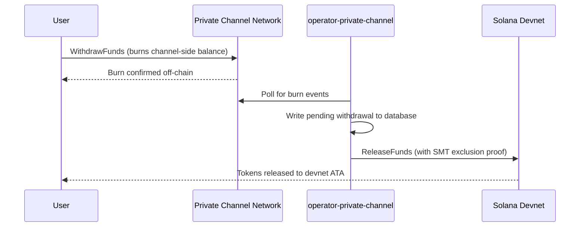

## 개요

Private Channels에서 출금하는 과정은 두 단계로 이루어집니다. 먼저, 사용자는 Withdraw Program의 `WithdrawFunds`를 호출하여 채널 측 토큰 잔액을 소각합니다. 그다음, 운영자가 Escrow Program(이 가이드에서는 devnet)의 `ReleaseFunds`를 유효한 Sparse Merkle Tree 배제 증명과 함께 호출하여 자금을 해제합니다. SMT 증명은 각 출금 논스가 한 번만 사용될 수 있도록 보장하여 이중 지출을 방지합니다.



## 1단계: 채널에서 출금 시작

Withdraw Program의 `WithdrawFunds`를 호출하여 채널 측 잔액을 소각합니다.
`tokenAccount` PDA를 자동으로 도출하는 `Async` 변형을 사용하세요. 이 방식은
프로덕션 환경에서 권장되는 형태입니다:

```typescript
import { getWithdrawFundsInstructionAsync } from "../private-channel-withdraw-program/clients/typescript/src/generated";
import {
  createSolanaRpc,
  address,
  pipe,
  createTransactionMessage,
  setTransactionMessageFeePayerSigner,
  setTransactionMessageLifetimeUsingBlockhash,
  appendTransactionMessageInstruction,
  signAndSendTransactionMessageWithSigners,
  assertIsTransactionMessageWithSingleSendingSigner,
  getBase58Decoder
} from "@solana/kit";

// Point to the gateway, not a public Solana RPC
const privateChannelRpc = createSolanaRpc("http://localhost:8899");

const withdrawIx = await getWithdrawFundsInstructionAsync({
  user: userSigner,
  mint: address(mintAddress),
  amount: 1_000_000n, // 1 USDC (6 decimals)
  destination: null // null = release to signer's devnet wallet
});

const { value: latestBlockhash } = await privateChannelRpc
  .getLatestBlockhash({ commitment: "confirmed" })
  .send();

// Sent to the Private Channels gateway (not Solana RPC directly), which
// expects the legacy transaction format - do not switch this to version 0.
const transactionMessage = pipe(
  createTransactionMessage({ version: "legacy" }),
  (m) => setTransactionMessageFeePayerSigner(userSigner, m),
  (m) => setTransactionMessageLifetimeUsingBlockhash(latestBlockhash, m),
  (m) => appendTransactionMessageInstruction(withdrawIx, m)
);

assertIsTransactionMessageWithSingleSendingSigner(transactionMessage);

const signatureBytes =
  await signAndSendTransactionMessageWithSigners(transactionMessage);
const signature = getBase58Decoder().decode(signatureBytes);
console.log("Withdrawal initiated:", signature);
```

- Withdraw Program ID: `J231K9UEpS4y4KAPwGc4gsMNCjKFRMYcQBcjVW7vBhVi`
- 이 트랜잭션은 공개 Solana RPC가 아닌 게이트웨이(`http://localhost:8899`)에
  제출하세요
- `destination`이 제공된 경우, 해제된 자금은 서명자의 지갑 대신 해당 지갑으로
  전송됩니다

## 예상 동작

`WithdrawFunds` 호출 후 추가 작업은 필요하지 않습니다. 운영자 서비스가
자동으로 정산을 처리합니다:

1. `indexer-private-channel`은 소각 이벤트를 감지하기 위해 매 1초마다 채널을
   폴링하며, 해당 이벤트가 감지되면 대기 중인 출금 레코드를 기록합니다
2. `operator-private-channel`은 매 1초마다 데이터베이스에서 대기 중인 레코드를
   폴링하고, 필요한 SMT 배제 증명과 함께 Solana devnet의 Escrow Program에
   `ReleaseFunds`를 제출합니다. 재시도 전에 400ms 간격으로 최대 5회 devnet
   확인을 폴링합니다

정상적인 조건에서는 일반적으로 몇 초 내에 devnet 지갑에 자금이 나타납니다.

## 운영자 정산 방식 (참고)

채널 측 소각 후, 프로비저닝된 운영자는 유효한 SMT 배제 증명과 함께 Escrow
Program의 `ReleaseFunds`를 호출해야 합니다. 운영자는 출금 논스가 이전에
사용된 적이 없음을 증명하지 않고는 자금을 해제할 수 없습니다. 이 단계는
`operator-private-channel`이 자동으로 처리하므로 직접 호출할 필요가 없습니다.

운영자가 제공하는 항목:

- `amount`: 소각된 금액과 일치해야 함
- `user`: devnet의 수신자 지갑
- `new_withdrawal_root`: 이 출금 이후 업데이트된 SMT 루트
- `transaction_nonce`: 이 리프에 대한 고유 논스
- `sibling_proofs`: 512바이트 (트리 증명을 위한 16개의 32바이트 형제 해시)

## 검증

운영자 호출이 확인된 후, devnet 토큰 잔액을 확인하세요:

```bash
spl-token balance <MINT_ADDRESS> --owner <YOUR_WALLET>
```

또는 RPC를 통해:

```typescript
import { createSolanaRpc, address } from "@solana/kit";
import { findAssociatedTokenPda } from "@solana-program/token";

const TOKEN_PROGRAM_ADDRESS = address(
  "TokenkegQfeZyiNwAJbNbGKPFXCWuBvf9Ss623VQ5DA"
);

// Query devnet directly; ReleaseFunds settles here, not through the gateway
const rpc = createSolanaRpc("https://api.devnet.solana.com");

const [yourDevnetAta] = await findAssociatedTokenPda({
  mint: address(mintAddress),
  owner: address(userSigner.address),
  tokenProgram: TOKEN_PROGRAM_ADDRESS
});

const balance = await rpc.getTokenAccountBalance(yourDevnetAta).send();
console.log(balance.value.uiAmountString);
```

## 퀵스타트를 완료했습니다

devnet에서 Private Channels의 전체 사이클을 실행했습니다: SPL 토큰을 에스크로에
예치하고, 게이트웨이를 통해 오프체인 전송을 보내고, devnet 지갑으로 자금을
다시 출금했습니다.

<Cards>
  <Card
    title="채널 수명 주기"
    href="/docs/tools/private-channels/concepts/channels"
  >
    참여자와 예치부터 출금까지의 전체 흐름을 심층적으로 이해합니다.
  </Card>
  <Card
    title="인증 및 역할"
    href="/docs/tools/private-channels/concepts/auth"
  >
    통합에 JWT 인증을 추가합니다.
  </Card>
  <Card
    title="자금 해제 레퍼런스"
    href="/docs/tools/private-channels/instructions/release-funds"
  >
    운영자 툴링을 위한 ReleaseFunds 명령어 전체 레퍼런스입니다.
  </Card>
  <Card
    title="Sparse Merkle Tree"
    href="/docs/tools/private-channels/concepts/smt"
  >
    출금 증명이 이중 지출을 방지하는 방식을 이해합니다.
  </Card>
</Cards>
