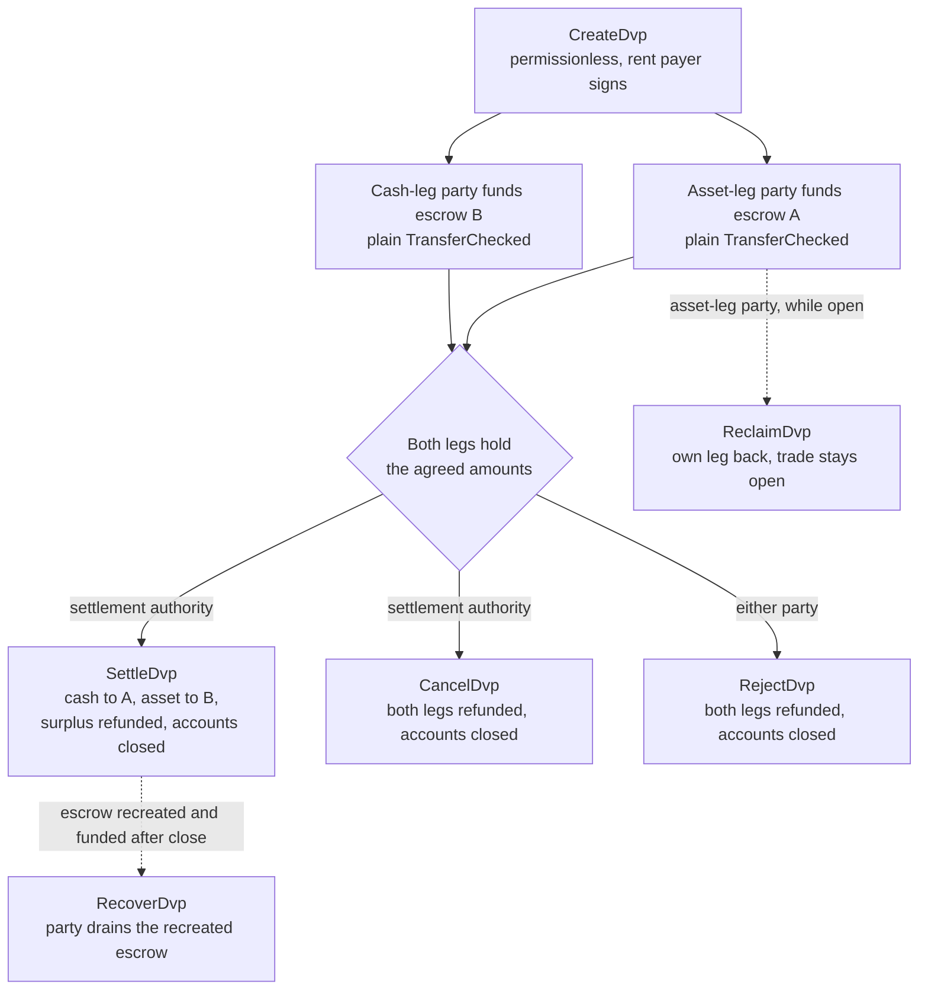
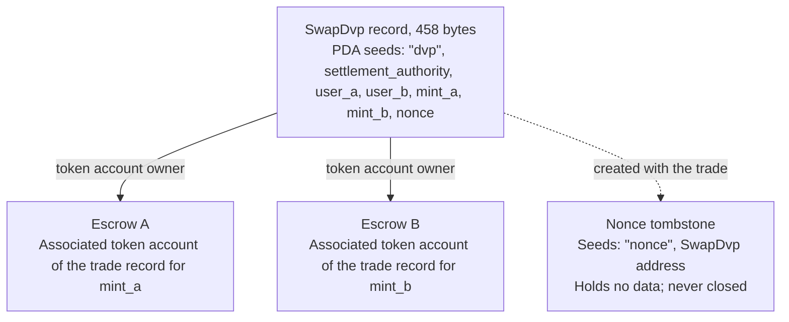

Het DvP-programma is het standaardprogramma voor delivery versus payment (levering
tegen betaling) op Solana, onderhouden door de Solana Foundation en geaudit door
Cantina. Twee partijen komen een trade overeen, elk stuurt zijn leg met een
gewone tokenoverdracht naar een escrow-account, en een settlement authority
wikkelt beide legs af in één transactie, zodat ofwel beide legs worden verplaatst,
ofwel geen van beide. De settlement authority is een derde adres dat in de trade
wordt genoemd, zoals de handelsplaats of de agent die de trade heeft geregeld.
Geen van beide partijen schrijft of deployt een programma, en een wallet of
custodian die een standaard tokenoverdracht (`TransferChecked`) kan versturen,
kan een leg funden zonder DvP-specifieke integratie. Tot aan de afwikkeling kan
elke partij zijn eigen leg terugnemen of de trade ongedaan maken.

<Callout type="warn" title="Lees het record voordat je erop handelt">

Het aanmaken van een trade-record is permissionless, dus een record is geen
bewijs van overeenstemming. Elke partij leest de opgeslagen voorwaarden voordat
zij funden, en de settlement authority voordat zij afwikkelt (zie
[verificatie](#verification-before-funding-and-settlement)).

</Callout>

## Hoe het werkt

Elke trade krijgt een record dat eigendom is van het programma en twee
escrow-accounts, één per leg. De partij van de asset-leg (`user_a`) en de partij
van de cash-leg (`user_b`) funden elk een leg door tokens over te maken naar het
escrow-account van die leg. De settlement authority is de enige ondertekenaar die
kan afwikkelen. Bij de afwikkeling wordt het overeengekomen bedrag van elke leg
naar de andere kant overgemaakt, wordt eventueel overschot teruggestuurd naar de
partij die eigenaar is van de leg, en worden het record en beide escrows
afgesloten. De atomiciteit komt voort uit Solana-[transacties](/docs/core/transactions): beide
overdrachten zitten in één transactie, dus ofwel gaan beide door, ofwel geen van
beide.

Elke terugbetaling, terugvordering en teruggave van overschot gaat naar de eigen
associated token account van de partij: de account van `user_a` voor `mint_a`, die van
`user_b` voor `mint_b`. Een custodian- of treasurysysteem kan een leg funden vanuit
een eigen account, maar alles wat wordt teruggestuurd komt terecht in de account
van de partij, niet terug bij de custodian. Elke trade laat bovendien een
permanente markeringsaccount achter (zie [State](#state)).

## Handleidingen

De stappagina's leiden één trade van creatie tot afwikkeling, met TypeScript en
Rust voor elke instructie.

<Cards>
  <Card title="Een trade aanmaken" href="/docs/defi/dvp-program/create-a-trade">
    Installeer de clients en leg de voorwaarden van de trade vast met CreateDvp
  </Card>
  <Card title="De legs funden" href="/docs/defi/dvp-program/fund-the-legs">
    Controleer de opgeslagen voorwaarden en fund vervolgens elke leg met een gewone overdracht
  </Card>
  <Card title="De trade afwikkelen" href="/docs/defi/dvp-program/settle-the-trade">
    Wikkel beide legs in één transactie af als settlement authority
  </Card>
  <Card title="Een trade ongedaan maken" href="/docs/defi/dvp-program/unwind-a-trade">
    Neem een leg terug, annuleer of weiger de trade en herstel late stortingen
  </Card>
</Cards>

Een [devnet-demo](https://solana.com/delivery-vs-payment/demo) doorloopt een trade van
begin tot eind: de demo maakt de trade aan, fund beide escrows met standaard
tokenoverdrachten en wikkelt beide legs af in één transactie.

## Kiezen tussen het programma en delegatie

[Delivery vs Payment (DvP) via delegatie](/docs/tokenization/dvp) wikkelt dezelfde
uitwisseling af zonder programma: elke partij delegeert haar positie aan een
settlement agent, die beide legs in één transactie verplaatst.

- **Het programma** vereist geen delegatie, dus de limiet van één delegate per
  token account is niet van toepassing en de settlement authority kan de opbrengst
  niet omleiden. Elke trade is afhankelijk van een upgradebaar programma en de
  upgrade authority daarvan.
- **Het delegatiepatroon** heeft geen programma-afhankelijkheid en werkt met mints
  die Scaled UI Amount gebruiken. Het programma weigert die mints, waardoor elke
  mint die is aangemaakt op basis van Mosaics `tokenized-security`-template wordt
  uitgesloten (zie [beperkingen voor mint-configuratie](#mint-configuration-constraints)).

## Rollen

Het programma is symmetrisch. In de interface zijn de twee partijen `user_a`, die
`mint_a` levert, en `user_b`, die `mint_b` levert. De README en de gegenereerde
clients noemen `mint_a` de asset-leg en `mint_b` de cash-leg, en deze pagina's
volgen die conventie, maar niets in het programma vereist dat de cash-leg een
contant instrument is. Twee assets, of twee stablecoins, worden op dezelfde
manier afgewikkeld.

| Rol                 | Wie                               | Ondertekent                                              | Opmerkingen                                                                                                                                                                                                     |
| -------------------- | --------------------------------- | -------------------------------------------------- | --------------------------------------------------------------------------------------------------------------------------------------------------------------------------------------------------------- |
| Partij van de asset-leg      | `user_a`, levert `mint_a`       | Zijn eigen fundingoverdracht; Reclaim, Reject, Recover | Een keypair-wallet, of een op PDA gebaseerde smart wallet zoals een multisig-vault. Een SPL Token-multisig-account of een program account kan geen partij zijn: Create mislukt met `PartyNotSignerCapable`                   |
| Partij van de cash-leg       | `user_b`, levert `mint_b`       | Zijn eigen fundingoverdracht; Reclaim, Reject, Recover | Dezelfde vereiste                                                                                                                                                                                          |
| Settlement authority | Een derde adres dat bij het aanmaken wordt genoemd | Settle, Cancel                                     | De enige ondertekenaar die kan afwikkelen. Deze kan de opbrengst, die bij het aanmaken is vastgelegd, niet omleiden. Ontvangt de rent van de gesloten accounts wanneer deze afwikkelt of annuleert                                         |
| Rent-betaler           | Wie `CreateDvp` ondertekent         | Create                                             | Financiert de rent (de SOL-storting die een account open houdt) voor het record, de nonce-tombstone en beide escrows. Niet vastgelegd als rent-ontvanger: de rent van gesloten accounts gaat naar wie de trade sluit |

## Program-ID

```text
dvp34bdbcEm4f4FCUjGV4mDAkDshaQR4LkK8fdcsyZq
```

| Cluster      | Programma                                       | Upgrade authority                              | Laatst gedeployde slot |
| ------------ | --------------------------------------------- | ---------------------------------------------- | ------------------ |
| mainnet-beta | `dvp34bdbcEm4f4FCUjGV4mDAkDshaQR4LkK8fdcsyZq` | `DXtFpbPjcn2hxPnw79x1Pfoj35vXh5AsWBkS37YnXMVv` | 452.058.374        |
| devnet       | `dvp34bdbcEm4f4FCUjGV4mDAkDshaQR4LkK8fdcsyZq` | `5EX1zFeJWj4rGYZv432WnYw8CbaSUeTdxPx4r573UgYU` | 479.376.863        |

Het programma is op beide clusters upgradebaar. De bovenstaande waarden zijn wat
`solana program show` op 2 oktober 2026 rapporteerde; voer hetzelfde commando uit
voor actuele waarden. De devnet-build is ouder dan de commit waartegen de
stappagina's zijn geschreven (zie [Installatie](/docs/defi/dvp-program/create-a-trade#install)),
met dezelfde set instructies en fouten.

## Levenscyclus



Een trade is open vanaf `CreateDvp` totdat Settle, Cancel of Reject de trade
sluit. Funding heeft geen eigen instructie: een leg is gefund wanneer het
escrow-account minstens het overeengekomen bedrag bevat. Reclaim geldt per leg en
laat de trade open, zodat een probleem met één leg de andere partij niet dwingt
de hele trade te annuleren.

## State

Elke trade heeft één `SwapDvp`-account van 458 bytes, dat eigendom is van het
programma. Het adres wordt afgeleid van de settlement authority, de twee
partijen, de twee mints en een nonce (de seeds
`["dvp", settlement_authority, user_a, user_b, mint_a, mint_b, nonce]`). De
bedragen en tijden worden opgeslagen in het account en hebben geen invloed op het
adres, daarom moeten ze worden uitgelezen en niet worden afgeleid. Een klein
markeringsaccount, de nonce-tombstone op `["nonce", swap_dvp]`, wordt samen met
de trade aangemaakt en nooit gesloten, zodat elke combinatie van partijen,
mints, authority en nonce voor slechts één trade kan worden gebruikt.



| Veld                                  | Type          | Betekenis                                                                                                 |
| -------------------------------------- | ------------- | ------------------------------------------------------------------------------------------------------- |
| `bump`                                 | `u8`          | PDA-bump                                                                                                |
| `user_a`, `user_b`                     | `Pubkey`      | De twee partijen                                                                                         |
| `mint_a`, `mint_b`                     | `Pubkey`      | De mints van de asset-leg en de cash-leg                                                                        |
| `settlement_authority`                 | `Pubkey`      | De enige ondertekenaar die kan afwikkelen of annuleren                                                               |
| `token_program_a`, `token_program_b`   | `Pubkey`      | Het token program dat eigenaar is van elke mint; een trade kan SPL Token- en Token-2022-legs combineren                    |
| `amount_a`, `amount_b`                 | `u64`         | Het overeengekomen bedrag van elke leg, in de kleinste eenheid van de mint (basiseenheden)                                 |
| `expiry_timestamp`                     | `i64`         | Na dit netwerktijdstip (de onchain-klok) wordt Settle geweigerd. Reclaim, Cancel en Reject werken nog steeds |
| `nonce`                                | `u64`         | Onderscheidt trades die de overige seeds delen. Eenmalig te gebruiken                                             |
| `ref_string`                           | `[u8; 64]`    | Een ondoorzichtige clientreferentie, aangevuld met nullen; het programma leest deze nooit                                     |
| `user_a_settlement_destination`        | `Pubkey`      | Ontvangt de cash-leg bij Settle; standaard `user_a`                                                   |
| `user_b_settlement_destination`        | `Pubkey`      | Ontvangt de asset-leg bij Settle; standaard `user_b`                                                  |
| `mint_a_authority`, `mint_b_authority` | `Pubkey`      | De mint authorities zoals vastgelegd bij het aanmaken; Settle mislukt als een van beide is gewijzigd                           |
| `earliest_settlement_timestamp`        | `Option<i64>` | Indien ingesteld wordt Settle vóór dit netwerktijdstip geweigerd                                                     |

De veldenlijst is overgenomen uit de IDL van het programma bij de commit die
wordt genoemd onder [Een trade aanmaken](/docs/defi/dvp-program/create-a-trade#install).

## Instructies

| Instructie  | Ondertekenaar               | Effect                                                                                                                                                              |
| ------------ | -------------------- | ------------------------------------------------------------------------------------------------------------------------------------------------------------------- |
| `CreateDvp`  | Elke betaler            | Maakt het `SwapDvp`-record, de nonce-tombstone en beide escrow-accounts aan. Verplaatst geen tokens                                                                        |
| `ReclaimDvp` | `user_a` of `user_b` | Geeft de eigen leg van de ondertekenaar terug uit escrow. De trade blijft open en de leg kan opnieuw worden gefund                                                                      |
| `SettleDvp`  | Settlement authority | Maakt `amount_a` over naar de bestemming van `user_b` en `amount_b` naar de bestemming van `user_a`, stuurt eventueel overschot terug naar de partij van de leg en sluit het record en beide escrows |
| `CancelDvp`  | Settlement authority | Betaalt terug wat escrow A bevat aan `user_a` en wat escrow B bevat aan `user_b`, en sluit het record en beide escrows                                                            |
| `RejectDvp`  | `user_a` of `user_b` | Zelfde effect als Cancel, maar ondertekend door een partij                                                                                                                            |
| `RecoverDvp` | `user_a` of `user_b` | Nadat de trade is gesloten: leegt een opnieuw aangemaakte escrow naar het eigen token account van de ondertekenaar en sluit deze. Dekt een storting die na Settle, Cancel of Reject is aangekomen  |

Elke terugbetaling gaat naar de eigen associated token account van de partij voor de
mint van die leg, ongeacht wie de escrow heeft gefund.

De accounts en argumenten van elke instructie staan op de pagina van die stap.

## Fouten

| Code | Fout                            | Wanneer                                                                                                   |
| ---- | -------------------------------- | ------------------------------------------------------------------------------------------------------ |
| 0    | `SignerNotParty`                 | Reclaim, Reject of Recover ondertekend door een adres dat niet `user_a` of `user_b` is                      |
| 1    | `DvpExpired`                     | Settle na `expiry_timestamp`                                                                        |
| 2    | `SettlementAuthorityMismatch`    | Settle of Cancel ondertekend door een ander adres dan de settlement authority                              |
| 3    | `SettlementTooEarly`             | Settle vóór `earliest_settlement_timestamp`                                                          |
| 4    | `LegNotFunded`                   | Settle terwijl een escrow minder bevat dan het overeengekomen bedrag                                               |
| 5    | `ExpiryNotInFuture`              | Create met een vervaltijdstip op of vóór het huidige netwerktijdstip                                            |
| 6    | `EarliestAfterExpiry`            | Create met een vroegste afwikkelingstijd na het vervaltijdstip                                               |
| 7    | `SelfDvp`                        | Create met `user_a` gelijk aan `user_b`                                                                 |
| 8    | `SameMint`                       | Create met `mint_a` gelijk aan `mint_b`                                                                 |
| 9    | `ZeroAmount`                     | Create met een bedrag van nul op een van beide legs                                                                |
| 10   | `BlockedMintExtension`           | Create of Settle met een mint die TransferFee, InterestBearing, ScaledUiAmount of NonTransferable bevat |
| 11   | `SettlementAuthorityIsParty`     | Create waarbij de settlement authority gelijk is aan een partij                                                  |
| 12   | `SettlementAuthorityExecutable`  | Create met een uitvoerbare settlement authority                                                         |
| 13   | `NonceAlreadyUsed`               | Create waarbij een `(seeds, nonce)` wordt hergebruikt die al een tombstone heeft                                         |
| 14   | `ExpiryTooFarInFuture`           | Create met een vervaltijdstip dat meer dan een jaar vooruit ligt                                                         |
| 15   | `RefStringTooLong`               | Create met een referentie die langer is dan 64 bytes                                                           |
| 16   | `DvpStillOpen`                   | Recover terwijl de trade nog open is; gebruik Reclaim                                                     |
| 17   | `DvpNeverCreated`                | Recover met seeds zonder tombstone                                                              |
| 18   | `EscrowPreloadedWithLamports`    | Create wanneer een niet-native escrow meer lamports bevat dan het rent-exempt minimum                           |
| 19   | `SettlementDestinationIsSwapDvp` | Create met een afwikkelingsbestemming die gelijk is aan het trade-record                                         |
| 20   | `SwapDvpPreloadedWithLamports`   | Create wanneer het recordadres meer lamports bevat dan de rent reserve                                   |
| 21   | `RecipientAtaMismatch`           | Een token account van een ontvanger of voor terugbetaling hoort niet langer bij de verwachte wallet en mint                  |
| 22   | `PartyNotSignerCapable`          | Create met een partij die geen systeemeigen, niet-uitvoerbaar account is                                 |
| 23   | `MintAuthorityChanged`           | Settle wanneer de mint authority van een leg afwijkt van de waarde die bij het aanmaken is vastgelegd                         |

## Events en indexering

Het programma zendt geen onchain events uit. Een indexer of reconciliatiesysteem leest
de accountstatus van `SwapDvp` en de tokensaldi van de twee escrows, en gebruikt
`ref_string` om een trade te koppelen aan de bijbehorende offchain-order. Omdat het record
bij de afwikkeling wordt gesloten, slaat een systeem dat de voorwaarden achteraf nodig heeft
ze op wanneer het ze uitleest, of reconstrueert het ze uit de transactie waarmee de
trade is aangemaakt.

## Ondersteunde tokens

Een trade kan een SPL Token-leg combineren met een Token-2022-leg; elke leg heeft een
eigen token program. Wrapped SOL-legs worden ondersteund.

| Token-2022-extensie op de mint van een leg                                                     | Gedrag van het programma                                                  |
| ---------------------------------------------------------------------------------------- | ----------------------------------------------------------------- |
| TransferFee, InterestBearing, ScaledUiAmount, NonTransferable                            | Geweigerd bij Create en Settle met `BlockedMintExtension`         |
| PermanentDelegate, Pausable, DefaultAccountState, een freeze authority, MintCloseAuthority | Geaccepteerd; elke authority kan handelen op de tokens in escrow           |
| ConfidentialTransfer                                                                     | Geaccepteerd; bedragen op die leg zijn openbaar                          |
| TransferHook                                                                             | Ondersteund, tot 32 extra accounts per leg                        |
| MemoTransfer op een bestemmings- of terugbetalingsaccount                                          | Geaccepteerd; het programma zendt de vereiste memo uit vóór de transfer |

Een transfer fee zou ertoe leiden dat de ontvangende partij minder krijgt dan het overeengekomen bedrag.
Interest Bearing en Scaled UI Amount wijzigen de ruwe bedragen niet, maar hun rente
of multiplier kan veranderen tussen het aanmaken en het afwikkelen van een trade, waardoor
de weergave van de overeengekomen bedragen verandert. NonTransferable zou beide legs vastzetten.

De geaccepteerde authorities kunnen de tokens in escrow verplaatsen, bevriezen of stilleggen
gedurende de looptijd van de trade (zie hieronder). De escrow kan niet worden geconfigureerd om
confidential transfers te ontvangen, dus de bedragen in escrow en na afwikkeling op een confidential
leg zijn openbaar.

Voor een mint met een hook achterhaalt de client de extra accounts van de hook en voegt
ze toe aan Settle, Cancel, Reject, Reclaim en Recover. De limiet van 32 per leg
geldt inclusief het hook-programma en het bijbehorende validatieaccount. Als de hook authority
de accountlijst van de hook uitbreidt tot voorbij die limiet, mislukt elke transfer op die leg,
inclusief Reclaim, Cancel, Reject en Recover, totdat de authority dit
terugdraait. De limiet voor het aantal accounts per transactie kan eerder worden bereikt dan de limiet per leg wanneer
beide legs hooks hebben.

Wanneer een bestemmings- of terugbetalingsaccount memo's vereist, roept het programma het Memo-
programma aan vóór de transfer. Daarom heeft elke instructie die tokens
uit escrow verplaatst een `memo_program`-account nodig.

### Beperkingen voor de mintconfiguratie

**Scaled UI Amount.** De `tokenized-security`-template in
[Mosaic](https://github.com/solana-foundation/mosaic), de issuance-toolkit van de Solana Foundation, voegt altijd Scaled UI Amount toe, dus het programma accepteert geen
mint die met die template is gemaakt als leg. Een mint die voor dit programma bedoeld is, kan
zonder de extensie worden aangemaakt (zie
[Token Extensions](/docs/tokens/extensions));
[DvP via delegatie](/docs/tokenization/dvp) wordt afgewikkeld via gedelegeerde
authority en past deze controle niet toe.

**Standaard bevroren mints.** De escrow van elke trade is een associated token account
dat eigendom is van een program-derived address dat nieuw is voor die trade. Bij een mint met
Default Account State ingesteld op frozen wordt de escrow bevroren aangemaakt, en een
funding-transfer ernaartoe mislukt totdat deze is ontdooid. Onder
[Token ACL](/docs/tokenization/token-acl) betekent dat dat de issuer of zijn transfer
agent de escrow van de trade toelaat vóór de funding: ofwel door het adres van het
trade-record (de eigenaar van de escrow) toe te voegen aan de allowlist, zodat iedereen de
escrow kan ontdooien wanneer de Token ACL-config van de mint permissionless thaw inschakelt, ofwel door
de freeze authority de escrow direct te laten ontdooien. Een bevroren escrow blokkeert ook
Settle, Reclaim, Cancel, Reject en Recover op die leg, dus de freeze
authority, en bij een mint met een hook de hook authority, is gedurende de looptijd van de
trade een vertrouwde partij. Het pad met een bevroren escrow wordt hier beschreven en wordt niet uitgevoerd
in de devnet-snippets.

## Beperkingen

- Geen matching, prijsvorming of orderboek. De partijen komen de voorwaarden buiten
  het grootboek overeen en een van hen legt ze vast.
- Geen netting, en alleen bilateraal: één record is één trade tussen twee partijen.
- Geen gedeeltelijke uitvoering. Settle verplaatst exact het overeengekomen bedrag van elke leg en
  stuurt een eventueel surplus terug naar de partij van de leg.
- Geen off-ledger leg. Beide legs zijn token accounts op Solana; een cash-leg via
  bestaande kanalen wordt apart afgewikkeld en gereconcilieerd.
- Geen geschiktheidscontrole, allowlist of KYC. De eigen controles van de mint dwingen de
  geschiktheid van houders af.
- Geen automatische afwikkeling. De settlement authority moet ondertekenen.
- Geen events en geen protocolkosten naast transactiekosten en rent.

Het programma neemt het principal risk tussen de twee partijen weg: geen van beide legs wordt
verplaatst tenzij beide dat worden. Het neemt het kredietrisico van de issuer of het aflossingsrisico op beide
tokens niet weg, evenmin als de mogelijkheid voor de freeze-, pause- of permanent delegate-authority van een mint om
te handelen op tokens in escrow (zie [ondersteunde tokens](#supported-tokens)), of de
afhankelijkheid van de beschikbaarheid van de settlement authority om te ondertekenen.

## Verificatie vóór funding en afwikkeling

`CreateDvp` is permissionless: alleen de payer ondertekent, de partijen en de
settlement authority niet. Iedereen kan dus een record aanmaken met willekeurige
partijen en voorwaarden. Lees vóór de funding, en opnieuw vóór de afwikkeling, het
`SwapDvp`-account uit en controleer of:

1. Het account eigendom is van het DvP-programma en exact 458 bytes groot is. Een account
   dat geen eigendom is van het programma kan worden gevuld met bytes die eruitzien als
   een echt record.
2. `user_a`, `user_b`, `mint_a`, `mint_b` en `settlement_authority` overeenkomen met de
   overeengekomen trade.
3. `amount_a`, `amount_b`, `expiry_timestamp` en
   `earliest_settlement_timestamp` overeenkomen met de overeengekomen voorwaarden.
4. Beide afwikkelingsbestemmingen de overeengekomen adressen zijn. Een vervalst record kan
   de opbrengsten omleiden.

[Fund the legs](/docs/defi/dvp-program/fund-the-legs#verify-the-terms) somt de
gecontroleerde readers van de gegenereerde clients op en toont de controle in code.

Beschouw een trade als afgewikkeld wanneer de Settle-transactie
[`finalized`](/docs/rpc#configuring-state-commitment) bereikt. Dat is een
commitment level van het netwerk; of het ook de definitieve afwikkeling in juridische zin markeert,
hangt af van de afspraken tussen de partijen en de toepasselijke regelgeving.

## Versiebeheer

Het `SwapDvp`-account heeft geen versieveld. De layout ligt vast op 458 bytes
(`SwapDvp::LEN`), en de gecontroleerde readers weigeren een account met een andere lengte.
De IDL heeft een eigen versie, `0.1.0` per 2 oktober 2026.

Het programma is upgradeable op beide clusters (zie [Program ID](#program-id)). Een
trade-record bestaat alleen totdat het is afgewikkeld, geannuleerd of afgewezen, dus controleer
in de repository hoe een upgrade omgaat met openstaande trades, en genereer clients opnieuw
vanuit de IDL van de gedeployede build.

## Repository en audit

Broncode, IDL, gegenereerde clients en tests staan in
[`solana-foundation/dvp`](https://github.com/solana-foundation/dvp) onder de
MIT-licentie. Het programma is een `no_std` Pinocchio-programma; de clients worden
gegenereerd uit de IDL met Codama. Kwetsbaarheden meld je via de
security advisory-link van de repository, volgens `SECURITY.md`.

Het programma is geaudit door
[Cantina](https://cantina.xyz/portfolio/fe870bb4-d96d-4902-8aec-9dfcfa2d6a79).

## Gerelateerd

- [Delivery vs Payment (DvP) via delegatie](/docs/tokenization/dvp): het
  delegatiepatroon zonder programma
- [Token ACL](/docs/tokenization/token-acl): hoe een afgeschermde mint samenwerkt met de
  escrow-accounts
