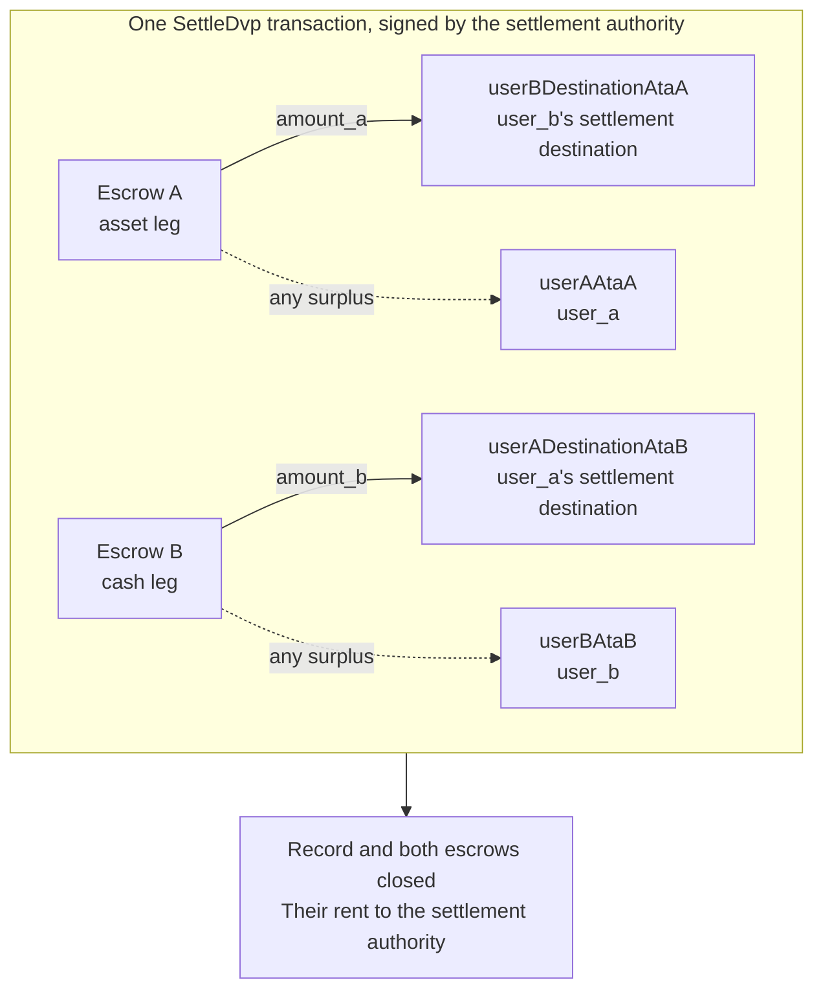

`SettleDvp` wordt ondertekend door de settlement authority die in het traderecord staat vermeld. In
eén transactie verplaatst de instructie `amount_a` van de assetleg naar de bestemming van de partij van de cashleg en `amount_b` van de cashleg naar de bestemming van de partij van de assetleg,
geeft ze eventueel overschot in een van beide escrows terug aan de partij van die leg en sluit ze het record
en beide escrows. Als een van die overdrachten niet kan worden voltooid, mislukt de instructie
en wordt er niets verplaatst.

Deze pagina sluit aan op [een trade aanmaken](/docs/defi/dvp-program/create-a-trade)
en [de legs financieren](/docs/defi/dvp-program/fund-the-legs); de client, signers,
`trade` en de token accounts van de partijen worden overgenomen.

## Opnieuw valideren vóór het ondertekenen

De settlement authority ondertekent de transactie die beide legs verplaatst, dus ze
voert dezelfde controle uit als elke partij voordat ze ondertekent: eigenaar, grootte, partijen,
mints, bedragen, vervaldatum en beide bestemmingen (zie
[de legs financieren](/docs/defi/dvp-program/fund-the-legs#verify-the-terms)). Het
programma zelf controleert bij de afwikkeling opnieuw of elke mint nog steeds bij het token
program hoort dat bij het aanmaken is vastgelegd, geen geblokkeerde extensie bevat en dezelfde
mint authority heeft als toen de trade werd aangemaakt. Een mint die opnieuw is aangemaakt met een geblokkeerde
extensie, een ander token program of een andere mint authority kan dus niet
worden afgewikkeld.

## De ontvangende accounts aanmaken

Settle schrijft naar vier token accounts die het programma niet zelf aanmaakt:

| Account                | Ontvangt                     | Eigenaar                           |
| ---------------------- | ---------------------------- | ------------------------------- |
| `userADestinationAtaB` | De cashleg (`amount_b`)    | `user_a_settlement_destination` |
| `userBDestinationAtaA` | De assetleg (`amount_a`)   | `user_b_settlement_destination` |
| `userAAtaA`            | Eventueel overschot op de assetleg | `user_a`                        |
| `userBAtaB`            | Eventueel overschot op de cashleg  | `user_b`                        |

De overschotaccounts worden alleen gebruikt wanneer een escrow meer bevat dan het afgesproken
bedrag, maar iedereen met tokens van de mint kan een overschot veroorzaken door een paar basis-
eenheden naar de escrow te sturen. Als het terugbetalingsaccount niet bestaat, mislukt de hele
Settle, dus maak alle vier idempotent aan in dezelfde transactie.

<Tabs items={["TypeScript", "Rust"]}>
  <Tab value="TypeScript">
    ```ts
    import {
      findAssociatedTokenPda,
      getCreateAssociatedTokenIdempotentInstruction,
    } from "@solana-program/token-2022";

    const destinationA = t.userASettlementDestination; // defaults to userA
    const destinationB = t.userBSettlementDestination; // defaults to userB

    const [userADestinationAtaB] = await findAssociatedTokenPda({
      mint: mintB,
      owner: destinationA,
      tokenProgram: tokenProgramB,
    });
    const [userBDestinationAtaA] = await findAssociatedTokenPda({
      mint: mintA,
      owner: destinationB,
      tokenProgram: tokenProgramA,
    });
    // userAAtaA and userBAtaB are from fund the legs.

    const createRecipientAccounts = [
      { ata: userADestinationAtaB, owner: destinationA, mint: mintB, tokenProgram: tokenProgramB },
      { ata: userBDestinationAtaA, owner: destinationB, mint: mintA, tokenProgram: tokenProgramA },
      { ata: userAAtaA, owner: userA, mint: mintA, tokenProgram: tokenProgramA },
      { ata: userBAtaB, owner: userB, mint: mintB, tokenProgram: tokenProgramB },
    ].map(({ ata, owner, mint, tokenProgram }) =>
      getCreateAssociatedTokenIdempotentInstruction({
        payer: authoritySigner,
        ata,
        owner,
        mint,
        tokenProgram,
      }),
    );
    ```

  </Tab>

  <Tab value="Rust">
    ```rust
    use spl_associated_token_account_client::address::get_associated_token_address_with_program_id;
    use spl_associated_token_account_client::instruction::create_associated_token_account_idempotent;

    let authority: Pubkey = pubkey!("SETTLEMENT_AUTHORITY_ADDRESS_HERE");
    let destination_a = trade.user_a_settlement_destination; // defaults to user_a
    let destination_b = trade.user_b_settlement_destination; // defaults to user_b

    let user_a_destination_ata_b =
        get_associated_token_address_with_program_id(&destination_a, &mint_b, &token_program_b);
    let user_b_destination_ata_a =
        get_associated_token_address_with_program_id(&destination_b, &mint_a, &token_program_a);
    let user_a_ata_a = get_associated_token_address_with_program_id(&user_a, &mint_a, &token_program_a);
    let user_b_ata_b = get_associated_token_address_with_program_id(&user_b, &mint_b, &token_program_b);

    let create_recipient_accounts = [
        create_associated_token_account_idempotent(&authority, &destination_a, &mint_b, &token_program_b),
        create_associated_token_account_idempotent(&authority, &destination_b, &mint_a, &token_program_a),
        create_associated_token_account_idempotent(&authority, &user_a, &mint_a, &token_program_a),
        create_associated_token_account_idempotent(&authority, &user_b, &mint_b, &token_program_b),
    ];
    ```

  </Tab>
</Tabs>

## Settle

`legAExtrasCount` geeft aan het programma door hoeveel van de accounts die na de
vaste lijst worden toegevoegd bij de transfer hook van de assetleg horen; de rest is voor die van de
cashleg. Geef voor mints zonder transfer hooks nul door en voeg niets toe. Het memo
program account is vereist voor de instructie en wordt alleen gebruikt voor bestemmingen
die een memo vereisen.

<Tabs items={["TypeScript", "Rust"]}>
  <Tab value="TypeScript">
    ```ts
    import { MEMO_PROGRAM_ADDRESS } from "@solana-program/memo";
    import { getSettleDvpInstruction } from "./dvp";

    const settleInstruction = getSettleDvpInstruction({
      settlementAuthority: authoritySigner,
      swapDvp,
      mintA,
      mintB,
      dvpAtaA: escrowA,
      dvpAtaB: escrowB,
      userADestinationAtaB,
      userBDestinationAtaA,
      userAAtaA,
      userBAtaB,
      tokenProgramA,
      tokenProgramB,
      memoProgram: MEMO_PROGRAM_ADDRESS,
      legAExtrasCount: 0,
    });

    const { context: settleContext } = await client.sendTransaction([
      ...createRecipientAccounts,
      settleInstruction,
    ]);
    const settleSignature = settleContext.signature;
    console.log("Submitted:", settleSignature);

    // sendTransaction returns at the client's commitment (confirmed by default).
    // Wait for finalized before recording the trade as settled.
    let finalized = false;
    for (let attempt = 0; attempt < 30 && !finalized; attempt++) {
      const {
        value: [status],
      } = await client.rpc.getSignatureStatuses([settleSignature]).send();
      if (status?.err) {
        throw new Error("Settle transaction failed");
      }
      finalized = status?.confirmationStatus === "finalized";
      if (!finalized) {
        await new Promise((resolve) => setTimeout(resolve, 2_000));
      }
    }
    if (!finalized) {
      // A closed record means it settled; an open one is safe to settle again.
      throw new Error("Settle not finalized after 60s; read the trade record");
    }
    console.log("Settled:", settleSignature);
    ```

  </Tab>

  <Tab value="Rust">
    ```rust
    use dvp_swap_program_client::instructions::SettleDvpBuilder;

    const MEMO_PROGRAM_ID: Pubkey = pubkey!("MemoSq4gqABAXKb96qnH8TysNcWxMyWCqXgDLGmfcHr");

    let settle_ix = SettleDvpBuilder::new()
        .settlement_authority(authority)
        .swap_dvp(swap_dvp)
        .mint_a(mint_a)
        .mint_b(mint_b)
        .dvp_ata_a(escrow_a)
        .dvp_ata_b(escrow_b)
        .user_a_destination_ata_b(user_a_destination_ata_b)
        .user_b_destination_ata_a(user_b_destination_ata_a)
        .user_a_ata_a(user_a_ata_a)
        .user_b_ata_b(user_b_ata_b)
        .token_program_a(token_program_a)
        .token_program_b(token_program_b)
        .memo_program(MEMO_PROGRAM_ID)
        .leg_a_extras_count(0)
        .instruction();
    ```

  </Tab>
</Tabs>



### Transfer hooks

De gegenereerde IDL vermeldt alleen de vaste accounts, dus de gegenereerde builders
kennen de hook-accounts niet. Bepaal de extra account metas van elke hook-mint op dezelfde
manier als bij een directe overdracht van dat token en voeg ze vervolgens toe aan de
instructie: eerst de accounts van de assetleg, daarna die van de cashleg, waarbij
`legAExtrasCount` is ingesteld op het aantal in de eerste groep. Spreid in TypeScript
de bepaalde metas over de `accounts`-array van de instructie; gebruik in Rust
`add_remaining_accounts` op de builder. De limiet is 32 accounts per leg,
inclusief het hook-programma en het validatieaccount; de accountlimiet van de transactie
kan eerder worden bereikt wanneer beide legs hooks hebben. Het programma verwijdert de signer-vlag
van elk doorgegeven account, zodat een hook via dit pad geen handtekening van de
settlement authority kan verkrijgen.

## Het resultaat vastleggen

Beschouw de trade als afgewikkeld wanneer de Settle-transactie `finalized` bereikt. Het
record en beide escrows bestaan na de afwikkeling niet meer, dus een systeem dat
de voorwaarden later nodig heeft, slaat ze op vanuit de controle vóór de afwikkeling of vanuit de aanmakende
transactie. De rent van de gesloten accounts is naar de settlement
authority gegaan.

## Settle-fouten

`LegNotFunded` betekent dat een escrow minder bevat dan het afgesproken bedrag; `DvpExpired`
en `SettlementTooEarly` betekenen dat het tijdvenster is gemist; `MintAuthorityChanged`
en `BlockedMintExtension` betekenen dat een mint na het aanmaken is gewijzigd;
`RecipientAtaMismatch` betekent dat een bestemmings- of terugbetalings-token account ontbreekt of
niet meer van de verwachte eigenaar en mint is, meestal omdat de
bovenstaande stap voor het aanmaken van accounts is overgeslagen. In elk geval is er niets verplaatst en kunnen de
partijen de trade ongedaan maken, afhankelijk van de authorities van de mint (zie
[een trade ongedaan maken](/docs/defi/dvp-program/unwind-a-trade)).

## Volgende stappen

- [Een trade ongedaan maken](/docs/defi/dvp-program/unwind-a-trade): gefinancierde
  legs terughalen wanneer een trade niet wordt afgewikkeld
