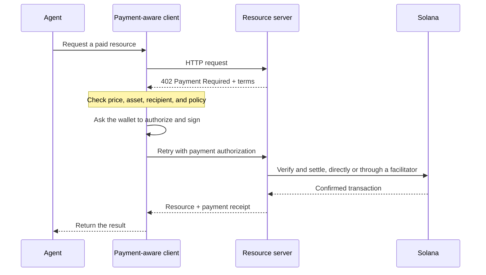

Agentic-betalingen stellen software in staat om een prijs te ontdekken, een betaling te autoriseren en
een resource te ontvangen binnen dezelfde HTTP-workflow. Een agent kan betalen voor een dataquery, modelinferentie
of toolaanroep zonder eerst een factureringsaccount aan te maken of een
API-sleutel te kopiëren.

<Cards>
  <Card title="MPP" href="/docs/payments/agentic-payments/mpp">
    Gebruik HTTP-authenticatie voor eenmalige betalingen en betalingssessies op basis van verbruik.
  </Card>
  <Card title="x402" href="/docs/payments/agentic-payments/x402">
    Voeg x402 V2-betalingsvereisten, handtekeningen en afwikkeling toe aan een HTTP-
    resource.
  </Card>
</Cards>

## De gemeenschappelijke betalingsflow

MPP en x402 gebruiken verschillende headers en datamodellen, maar hun basale HTTP-flow is
vergelijkbaar:

## MPP en x402

Beide protocollen kunnen stablecoinbetalingen afwikkelen op Solana. Kies op basis van het
betalingsmodel en de interoperabiliteit die je service nodig heeft, en niet alleen op basis van de gedeelde `402`-
statuscode.

|                         | MPP                                                               | x402                                                                     |
| ----------------------- | ----------------------------------------------------------------- | ------------------------------------------------------------------------ |
| Challenge               | `WWW-Authenticate: Payment`                                       | `PAYMENT-REQUIRED`                                                       |
| Clientautorisatie    | `Authorization: Payment`                                          | `PAYMENT-SIGNATURE`                                                      |
| Ontvangstbewijs                 | `Payment-Receipt`                                                 | `PAYMENT-RESPONSE`                                                       |
| Solana-betalingsmodellen   | Eenmalige `charge`-intents en `session`-intents met limiet en verbruiksmeting           | Schema's zoals `exact` en `upto`; ondersteuning verschilt per netwerk en client |
| Afwikkelingsarchitectuur | Servervalidatie, of een optionele relay of gateway                | Resourceserver met lokale verificatie of een facilitator                 |
| Goed startpunt     | API's die HTTP-authenticatiesemantiek of herhaalde verbruiksmeting nodig hebben | Resources met betaling per verzoek en bestaande x402-clients                      |

MPP staat voor **Machine Payments Protocol**. Verwar het niet met het **Model
Context Protocol (MCP)**. MCP stelt tools en resources beschikbaar aan agents; MPP of x402
kan betaling vereisen wanneer een agent een van die tools aanroept.

<Callout type="info">
  Een service kan meer dan één protocol aanbieden. De client kiest een betalingsoptie
  die hij ondersteunt en gebruikt vervolgens de bijbehorende challenge-, autorisatie- en
  ontvangstbewijsheaders voor de hele uitwisseling.
</Callout>
