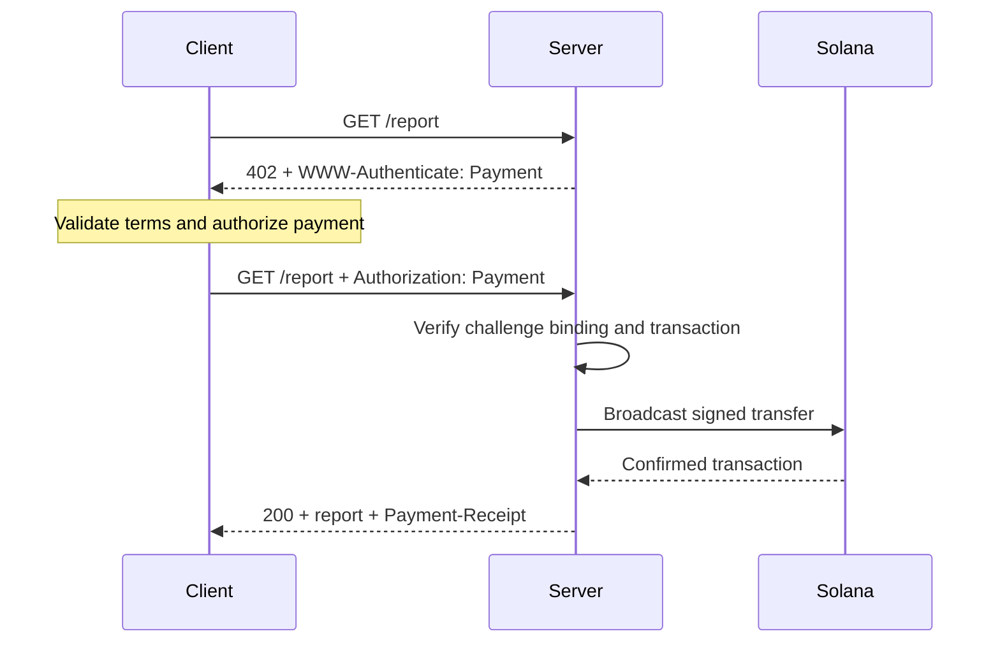
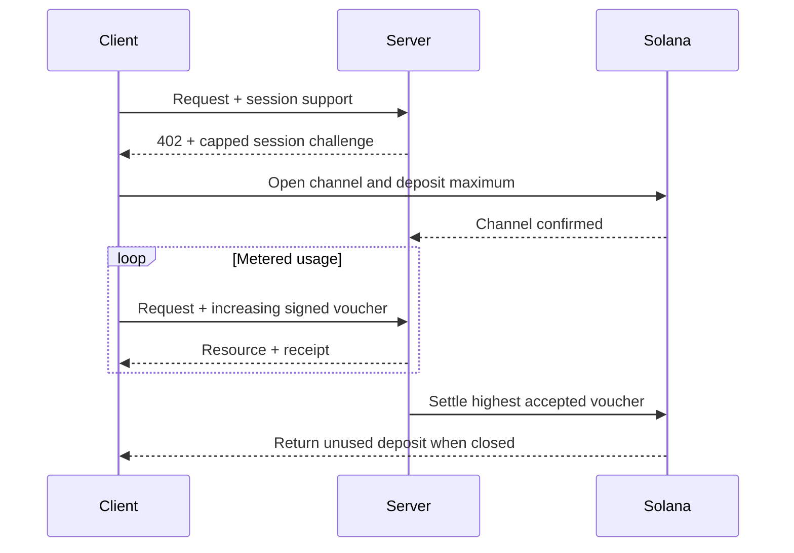

Het [Machine Payments Protocol (MPP)](https://mpp.dev/) past de semantiek van HTTP-authenticatie toe op betalingen. Een server stuurt een challenge terug voor een onbetaald verzoek, een client stuurt een betaalcredential mee, en de server geeft een ontvangstbewijs terug nadat hij de betaling heeft geaccepteerd.

MPP scheidt drie aspecten:

- Een **intent** beschrijft de commerciële interactie, zoals een eenmalige
  `charge` of een gemeten `session`.
- Een **betaalmethode** beschrijft hoe waarde wordt overgedragen. De Solana-methode ondersteunt
  native SOL en SPL-tokens voor charges.
- Een HTTP-**transport** draagt challenges, credentials, ontvangstbewijzen en fouten.

MPP wordt gepubliceerd als een reeks Internet-Drafts. Beschouw de
[actuele specificaties](https://paymentauth.org/) als de bron van waarheid en
verwacht dat details veranderen zolang de drafts nog in ontwikkeling zijn.

## HTTP-uitwisseling

MPP gebruikt standaard HTTP-authenticatievelden in plaats van protocolspecifieke
betaalheaders:

| Bericht                 | HTTP-representatie                                         |
| ----------------------- | ----------------------------------------------------------- |
| Betaalchallenge       | `402 Payment Required` met `WWW-Authenticate: Payment ...` |
| Betaalcredential      | Opnieuw verzonden verzoek met `Authorization: Payment ...`           |
| Geslaagd ontvangstbewijs      | Resource-respons met `Payment-Receipt: ...`               |
| Ongeldige betaalgegevens | Problem Details-body met `application/problem+json`       |



Een challenge bevat een door de server gegenereerde ID, realm, methode, intent, gecodeerd
betaalverzoek en een vervaldatum. De credential echoot de challenge en voegt het
methodespecifieke betaalbewijs toe. De server moet beide onderdelen verifiëren; een geldige
overdracht die bij een andere challenge hoort, mag de resource niet ontgrendelen.

## Eenmalige Solana-charges

De Solana-intent `charge` ondersteunt twee credentialtypen:

- **Pull-modus** gebruikt een ondertekende transactie. De client ondertekent de overdracht en
  stuurt de transactie naar de server. De server verifieert, voegt optioneel een
  fee-payer-handtekening toe, verzendt de transactie, bevestigt deze en geeft de transactiehandtekening
  terug in zijn ontvangstbewijs.
- **Push-modus** gebruikt een transactiehandtekening. De client verzendt eerst de transactie en
  stuurt vervolgens de bevestigde handtekening naar de server. De server haalt de transactie op en verifieert
  deze voordat de resource wordt teruggegeven.

Pull-modus maakt door de server gesponsorde transactiekosten en retry-logica aan de serverkant mogelijk.
Push-modus is nuttig wanneer een wallet vereist dat de client zijn eigen
transactie indient, maar kan geen gebruikmaken van sponsoring van de kosten door de server.

Zie voor de normatieve velden en verificatieregels de
[Solana charge-specificatie](https://paymentauth.org/draft-solana-charge-00.html).

## Een MPP-charge toevoegen aan een Express-API

De Solana Pay Kit biedt een actuele TypeScript-integratie voor MPP en x402.
Installeer deze samen met Express:

```bash
pnpm add @solana/pay-kit @solana/kit@^6.9.0 express
pnpm add --save-dev @types/express tsx
```

Dit kleinste voorbeeld gebruikt de gehoste Surfpool-sandbox en de publieke
demo-ontvanger van het pakket. Het is alleen bedoeld voor lokale ontwikkeling:

```ts filename=server.ts
import express from "express";
import { createPayKit, usd } from "@solana/pay-kit";

const pay = await createPayKit({
  accept: ["mpp"],
  rpcUrl: "https://402.surfnet.dev:8899"
});

const app = express();

app.get("/report", pay.express(usd("0.01")), (_req, res) => {
  res.json({ report: "Paid report" });
});

app.listen(4567, () => {
  console.log("Paid API listening on http://127.0.0.1:4567");
});
```

Voer het uit en vergelijk een onbetaald verzoek met een verzoek dat betalingen ondersteunt:

```bash
pnpm tsx server.ts
curl -i http://127.0.0.1:4567/report
pay --sandbox curl http://127.0.0.1:4567/report
```

De route handler wordt pas uitgevoerd nadat de middleware de betaling heeft geaccepteerd.

<Callout type="warn" title="Vervang in productie elke sandbox-standaardwaarde">
  Configureer een expliciet netwerk, een merchant-ontvanger, een dedicated RPC, een stabiel
  geheim voor challenge-binding, een productiesigner en een duurzame replay-opslag. Stuur nooit
  echte betalingen naar een demo-signer van een pakket.
</Callout>

## Gemeten sessies

Gebruik een Solana MPP-`session` wanneer een client veel kleine, samenhangende betalingen doet.
Een sessie opent een onchain betaalkanaal met een maximale storting en gebruikt vervolgens
cumulatieve ondertekende vouchers naarmate het gebruik toeneemt. De server kan vouchers
offchain verifiëren en later het hoogste geaccepteerde bedrag afwikkelen.

Dit is handig voor token-gemeten inferentie, byte-gemeten downloads, live data
en herhaalde tool calls. Het is niet hetzelfde als het versturen van een afzonderlijke onchain
betaling voor elke gebeurtenis.



Noem een sessie een **sessiebetaling**, **betaalkanaal** of **gelimiteerde herhaalde
autorisatie**. Noem het alleen een gestreamde betaling wanneer de dienst en het betaalcontract
daadwerkelijk een stroom aan gebruik meten.

## Productieverificatie

Voor elke Solana-charge moet de server minimaal verifiëren dat:

- De challenge authentiek is, niet is verlopen, aan dit verzoek is gebonden en bedoeld is voor
  deze realm.
- De transactie het verwachte netwerk, de verwachte asset of mint, ontvanger, het verwachte bedrag
  en het verwachte token program gebruikt.
- Eventuele fee-payer- of associated-token-account-instructies uitdrukkelijk
  zijn toegestaan en de server-signer niet kunnen leegtrekken.
- De transactie is geslaagd op het vereiste commitment-niveau.
- De transactiehandtekening nog niet eerder is gebruikt.
- De replay-controle en de consume-bewerking atomair zijn over alle serverinstanties heen.

Sla voor sessies ook de kanaalstatus, het geaccepteerde cumulatieve bedrag en de
settlement-watermark op in een gedeelde opslag. Documenteer hoe clients ongebruikte
middelen terugkrijgen als de server niet beschikbaar raakt.

## Gerelateerde bronnen

- [MPP-specificaties](https://paymentauth.org/)
- [MPP-protocoldocumentatie](https://mpp.dev/protocol)
- [Solana Pay Kit](https://github.com/solana-foundation/pay-kit)
- [Overzicht van agentic payments](/docs/payments/agentic-payments)
- [Productieklaarheid](/docs/tools/production-readiness)
