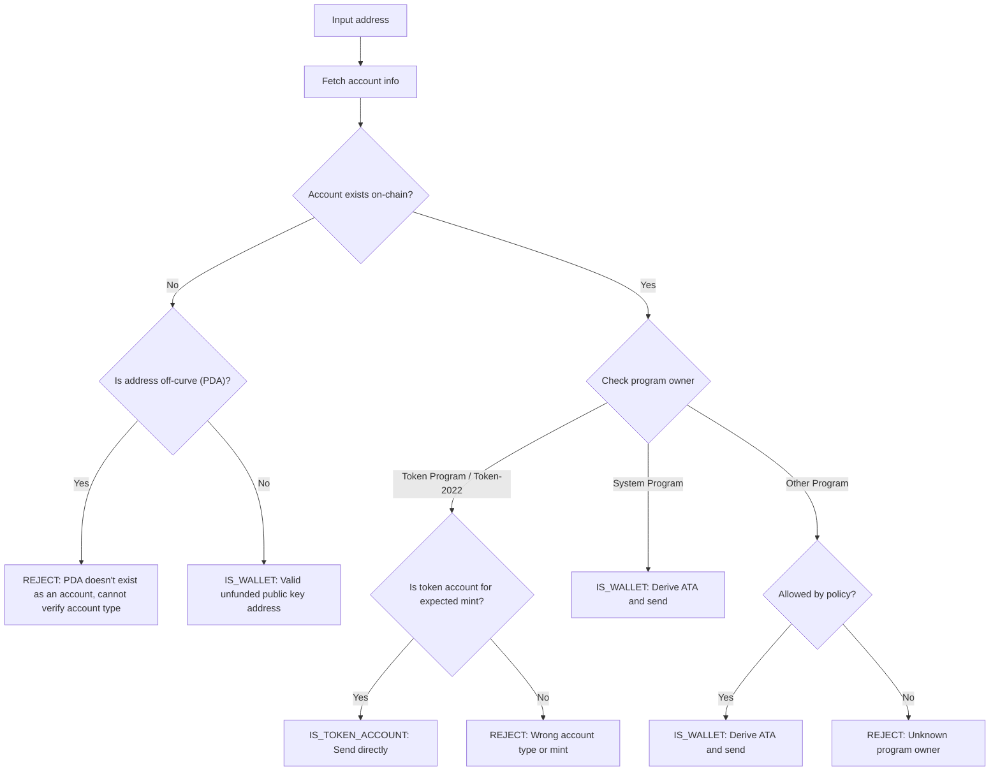

Het versturen van tokens naar het verkeerde adres kan resulteren in permanent
verlies van fondsen. Adresverificatie zorgt ervoor dat je alleen tokens
verstuurt naar adressen die ze correct kunnen ontvangen en benaderen.

<Callout>
  Zie [Hoe betalingen werken op Solana](/docs/payments/how-payments-work) voor
  kernconcepten van betalingen.
</Callout>

## Solana-adressen begrijpen

Solana-accounts hebben twee soorten adressen: on-curve en off-curve.

### On-curve adressen

Standaardadressen zijn de publieke sleutels van Ed25519-sleutelparen. Deze
adressen:

- Hebben een bijbehorende private key die transacties kan ondertekenen
- Worden gebruikt als wallet-adressen

### Off-curve adressen (PDA's)

[Program Derived Addresses](/docs/core/pda) worden deterministisch afgeleid van
een program-ID en seeds. Deze adressen:

- Hebben **geen** bijbehorende private key
- Kunnen alleen ondertekend worden door het programma waarvan het adres is
  afgeleid

## Accounttypes bij betalingen

Gebruik het adres om een [account](/docs/core/accounts) op te halen van het
netwerk, controleer de program owner en het accounttype om te bepalen hoe het
adres moet worden behandeld.

<Callout>
  Weten of een adres on-curve of off-curve is, vertelt je niet wat voor type
  account het is, welk programma het bezit, of dat er een account bestaat op dat
  adres. Je moet het account ophalen van het netwerk om deze details te bepalen.
</Callout>

### System Program-accounts (wallets)

Accounts die eigendom zijn van het System Program zijn standaard wallets. Om
SPL-tokens naar een wallet te versturen, leid je het
[Associated Token Account (ATA)](/docs/tokens/basics/create-token-account#whats-an-associated-token-account)
af en gebruik je dat.

Nadat je het ATA-adres hebt afgeleid, controleer je of het token account
on-chain bestaat. Als het ATA niet bestaat, kun je een instructie toevoegen om
het token account van de ontvanger aan te maken in dezelfde transactie als de
overdracht. Dit vereist echter het betalen van rent voor het nieuwe token
account. Omdat de ontvanger eigenaar is van het ATA, kan de SOL die voor de rent
is betaald niet worden teruggevorderd door de verzender.

<Callout type="warn">
  Zonder beveiligingsmaatregelen kan het subsidiëren van ATA-creatie worden
  misbruikt. Een kwaadwillende gebruiker zou een overdracht kunnen aanvragen,
  zijn ATA op jouw kosten laten aanmaken, de ATA sluiten om de rent SOL terug te
  vorderen, en dit herhalen.
</Callout>

### Token accounts

[Token accounts](/docs/tokens/basics/create-token-account) zijn eigendom van het
Token Program of Token-2022 Program en bevatten tokensaldi. Als het adres dat je
ontvangt eigendom is van een token program, moet je verifiëren dat het account
een token account is (geen mint account) en overeenkomt met het verwachte token
mint account voordat je verzendt.

<Callout type="info">
  De Token Programs valideren automatisch dat beide token accounts in een
  overdracht tokens van dezelfde mint bevatten. Als de validatie mislukt, wordt
  de transactie afgewezen en gaan er geen fondsen verloren.
</Callout>

### Mint accounts

[Mint accounts](/docs/tokens/basics/create-mint) houden de tokenaanbod en
metadata van een specifieke token bij. Mint accounts zijn ook eigendom van Token
Programs maar zijn **niet** geldige ontvangers voor tokenoverdrachten. Een
poging om tokens naar een mint-adres te verzenden resulteert in een mislukte
transactie, maar er gaan geen fondsen verloren.

### Andere accounts

Accounts die eigendom zijn van andere programma's vereisen een
beleidsbeslissing. Sommige accounts (bijv. multisig wallets) kunnen geldige
token account-eigenaren zijn, terwijl andere moeten worden afgewezen.

## Verificatieproces

Het volgende diagram toont een referentiebeslissingsboom voor het valideren van
een adres:



<Steps>
<Step>

### Account ophalen

Gebruik het adres om de accountgegevens van het netwerk op te halen.

</Step>
<Step>

### Account bestaat niet

Als er geen account bestaat op dit adres, controleer dan of het adres on-curve
of off-curve is:

- **Off-curve (PDA)**: Wijs het adres conservatief af om te voorkomen dat je
  naar een ATA stuurt die mogelijk ontoegankelijk is. Zonder een bestaand
  account kun je alleen op basis van het adres niet bepalen welk programma deze
  PDA heeft afgeleid of dat het adres voor een ATA is. Het afleiden van een ATA
  voor dit adres om tokens te verzenden kan ertoe leiden dat fondsen vastzitten
  in een ontoegankelijk token account.

- **On-curve**: Dit is een geldig wallet-adres (publieke sleutel) dat nog niet
  is gefinancierd. Leid de ATA af, controleer of deze bestaat en stuur er tokens
  naartoe. Je moet een beleidsbeslissing nemen of je de creatie van de ATA wilt
  financieren als deze niet bestaat.

</Step>
<Step>

### Account bestaat

Als een account bestaat, controleer dan welk programma het bezit:

- **System Program**: Dit is een standaard wallet. Leid de ATA af, controleer of
  deze bestaat en stuur er tokens naartoe. Je moet een beleidsbeslissing nemen
  of je de creatie van de ATA wilt financieren als deze niet bestaat.

- **Token Program / Token-2022**: Verifieer dat het account een token account is
  (geen mint account) en dat het de token (mint) bevat die je wilt verzenden.
  Als het geldig is, stuur dan tokens rechtstreeks naar dit adres. Als het een
  mint account is of een token account voor een andere mint, wijs het adres dan
  af.

- **Other Program**: Dit vereist een beleidsbeslissing. Sommige programma's
  zoals multisig wallets kunnen acceptabele eigenaren van token accounts zijn.
  Als je beleid dit toestaat, leid dan de ATA af en verstuur. Anders wijs je het
  adres af.

</Step>
</Steps>

## Demo

Het volgende voorbeeld toont alleen de adresvalidatielogica. Dit is
referentiecode ter illustratie.

<Callout>
  De demo laat niet zien hoe je een ATA afleidt of een transactie bouwt om
  tokens te verzenden. Raadpleeg de documentatie over [token
  account](/docs/tokens/basics/create-token-account#how-to-create-an-associated-token-account)
  en [token transfer](/docs/tokens/basics/transfer-tokens) voor voorbeeldcode.
</Callout>

De onderstaande demo gebruikt drie mogelijke uitkomsten:

| Resultaat          | Betekenis            | Actie                                            |
| ------------------ | -------------------- | ------------------------------------------------ |
| `IS_WALLET`        | Geldig wallet-adres  | Leid af en verzend naar associated token account |
| `IS_TOKEN_ACCOUNT` | Geldig token account | Verzend tokens rechtstreeks naar dit adres       |
| `REJECT`           | Ongeldig adres       | Niet verzenden                                   |

<CodeTabs flags="r">

```ts !! title="Demo"
// !collapse(1:35) collapsed

import {
  type Address,
  type Rpc,
  type GetAccountInfoApi,
  createSolanaRpc,
  fetchJsonParsedAccount,
  isOffCurveAddress,
  generateKeyPairSigner,
  getProgramDerivedAddress
} from "@solana/kit";

// =============================================================================
// Constants
// =============================================================================

const defaultRpc = createSolanaRpc("https://api.mainnet-beta.solana.com");

const SYSTEM_PROGRAM = "11111111111111111111111111111111" as Address;
const TOKEN_PROGRAM = "TokenkegQfeZyiNwAJbNbGKPFXCWuBvf9Ss623VQ5DA" as Address;
const TOKEN_2022_PROGRAM =
  "TokenzQdBNbLqP5VEhdkAS6EPFLC1PHnBqCXEpPxuEb" as Address;

// =============================================================================
// Validation Function
// =============================================================================

/**
 * Possible validation results for an input address.
 */
export type ValidationResult =
  | { type: "IS_TOKEN_ACCOUNT" }
  | { type: "IS_WALLET" }
  | { type: "REJECT"; reason: string };

/**
 * Validates an input address and classifies it as a wallet, token account, or invalid.
 *
 * @param inputAddress - The address to validate
 * @param rpc - Optional RPC client (defaults to mainnet)
 * @returns Classification result:
 *   - IS_WALLET: Valid wallet address
 *   - IS_TOKEN_ACCOUNT: Valid token account
 *   - REJECT: Invalid address for transfers
 */
export async function validateAddress(
  inputAddress: Address,
  rpc: Rpc<GetAccountInfoApi> = defaultRpc
): Promise<ValidationResult> {
  const account = await fetchJsonParsedAccount(rpc, inputAddress);
  // Log the account data for demo
  console.log("\nAccount:", account);

  // Account doesn't exist on-chain
  if (!account.exists) {
    // Off-curve = PDA that doesn't exist as an account
    // Reject conservatively to avoid sending to an address that may be inaccessible.
    if (isOffCurveAddress(inputAddress)) {
      return { type: "REJECT", reason: "PDA doesn't exist as an account" };
    }
    // On-curve = valid keypair address, treat as unfunded wallet
    return { type: "IS_WALLET" };
  }

  // Account exists, check program owner
  const owner = account.programAddress;

  // System Program = wallet
  if (owner === SYSTEM_PROGRAM) {
    return { type: "IS_WALLET" };
  }

  // Token Program or Token-2022, check if token account
  if (owner === TOKEN_PROGRAM || owner === TOKEN_2022_PROGRAM) {
    const accountType = (
      account.data as { parsedAccountMeta?: { type?: string } }
    ).parsedAccountMeta?.type;

    if (accountType === "account") {
      return { type: "IS_TOKEN_ACCOUNT" };
    }
    // Reject if not a token account (mint account)
    return {
      type: "REJECT",
      reason: "Not a token account"
    };
  }

  // Unknown program owner
  return { type: "REJECT", reason: "Unknown program owner" };
}

// =============================================================================
// Examples
// =============================================================================
// !collapse(1:1000) collapsed

// Wallets
const EXISTING_WALLET =
  "H8sMJSCQxfKiFTCfDR3DUMLPwcRbM61LGFJ8N4dK3WjS" as Address;
const NEW_WALLET = (await generateKeyPairSigner()).address;

// Token accounts
const USDC_TOKEN_ACCOUNT =
  "3emsAVdmGKERbHjmGfQ6oZ1e35dkf5iYcS6U4CPKFVaa" as Address;
const PYUSD_TOKEN_ACCOUNT =
  "47od2TPRvqJipfPVWZdyenLEngPw8hC36nDxiLyvGsEP" as Address;

// Token mints (should be rejected)
const USDC_MINT = "EPjFWdd5AufqSSqeM2qN1xzybapC8G4wEGGkZwyTDt1v" as Address;
const PYUSD_MINT = "2b1kV6DkPAnxd5ixfnxCpjxmKwqjjaYmCZfHsFu24GXo" as Address;

// PDA that doesn't exist (should be rejected)
const [NON_EXISTENT_PDA] = await getProgramDerivedAddress({
  programAddress: (await generateKeyPairSigner()).address,
  seeds: ["seed"]
});

// Program account (should be rejected)
const PROGRAM_ACCOUNT =
  "p1exdMJcjVao65QdewkaZRUnU6VPSXhus9n2GzWfh98" as Address;

async function runExample(label: string, address: Address) {
  console.log(`\n${"─".repeat(60)}`);
  console.log(`Example: ${label}`);
  console.log(`Input: ${address}`);
  console.log(`${"─".repeat(60)}`);

  const result = await validateAddress(address);
  console.log("\nResult:", result);
}

console.log("\n" + "═".repeat(60));
console.log("  IS_WALLET Examples");
console.log("═".repeat(60));

await runExample("Existing funded wallet", EXISTING_WALLET);
await runExample("New wallet (unfunded)", NEW_WALLET);

console.log("\n" + "═".repeat(60));
console.log("  IS_TOKEN_ACCOUNT Examples");
console.log("═".repeat(60));

await runExample("USDC token account (Token Program)", USDC_TOKEN_ACCOUNT);
await runExample("PYUSD token account (Token-2022)", PYUSD_TOKEN_ACCOUNT);

console.log("\n" + "═".repeat(60));
console.log("  REJECT Examples");
console.log("═".repeat(60));

await runExample("USDC mint address", USDC_MINT);
await runExample("PYUSD mint address", PYUSD_MINT);
await runExample("Non-existent PDA", NON_EXISTENT_PDA);
await runExample("Program account", PROGRAM_ACCOUNT);

console.log("\n" + "═".repeat(60));
console.log("  Done!");
console.log("═".repeat(60) + "\n");
```

</CodeTabs>
