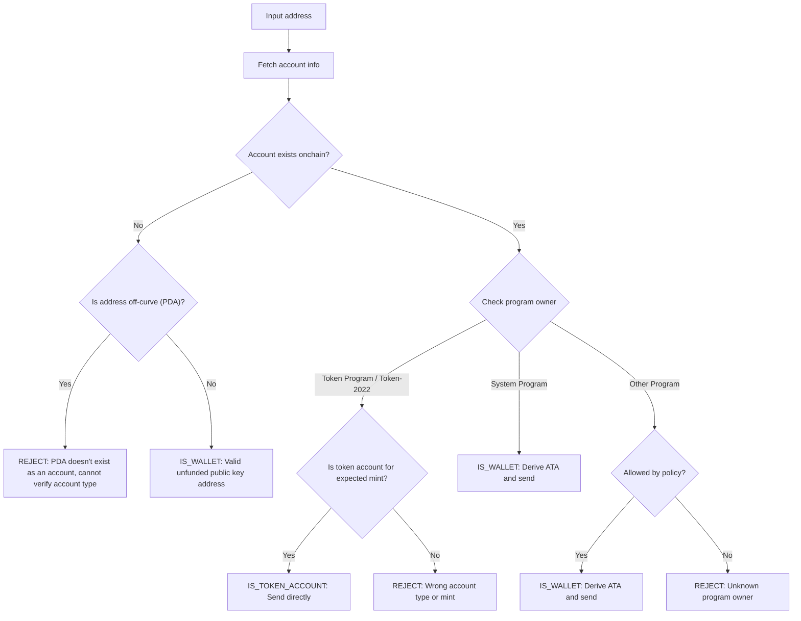

Fondsen naar het verkeerde adres sturen kan leiden tot permanent verlies.
Adresverificatie zorgt ervoor dat je alleen naar adressen stuurt die de fondsen
correct kunnen ontvangen en openen.

Validatie hangt af van wat je verstuurt:

- **SPL-tokens** zijn deels zelfbeschermend. Het Token Program weigert een
  overdracht waarvan de accounts niet overeenkomen met de verwachte mint,
  waardoor een verkeerd gerichte tokenoverdracht mislukt zonder fondsen te
  verliezen. Het grootste deel van deze pagina behandelt het versturen van
  SPL-tokens.
- **Natieve SOL** heeft geen dergelijke beveiliging. Een System
  Program-overdracht slaagt naar elk account, dus een onjuiste ontvanger
  vergrendelt de SOL permanent. Zie
  [Natieve SOL versturen](#sending-native-sol).

<Callout>
  Zie [Hoe betalingen werken op Solana](/docs/payments/how-payments-work) voor
  de belangrijkste betalingsconcepten.
</Callout>

## Solana-adressen begrijpen

Solana-accounts hebben twee soorten adressen: on-curve en off-curve.

### On-Curve-adressen

Standaardadressen zijn de publieke sleutels van Ed25519 keypairs. Deze adressen:

- Hebben een bijbehorende privésleutel die transacties kan ondertekenen
- Worden gebruikt als walletadressen

### Off-Curve-adressen (PDA's)

[Program Derived Addresses](/docs/core/pda) worden deterministisch afgeleid van
een programma-ID en seeds. Deze adressen:

- Hebben **geen** bijbehorende privésleutel
- Kunnen alleen worden ondertekend door het programma waarvan het adres is
  afgeleid

## Accounttypen bij betalingen

Gebruik het adres om een [account](/docs/core/accounts) op te halen uit het
netwerk, controleer de programma-eigenaar en het accounttype om te bepalen hoe
het adres verwerkt moet worden.

<Callout>
  Of een adres on-curve of off-curve is, vertelt je niet wat voor type account
  het is, welk programma het beheert, of er een account bestaat op dat adres. Je
  moet het account ophalen uit het netwerk om deze details te bepalen.
</Callout>

### System Program Accounts (Wallets)

Accounts die eigendom zijn van het System Program zijn standaard wallets. Om
SPL-tokens naar een wallet te sturen, gebruik je het bijbehorende
[Associated Token Account (ATA)](/docs/tokens/basics/create-token-account#what-is-an-associated-token-account).

Nadat je het ATA-adres hebt afgeleid, controleer je of het token account onchain
bestaat. Als het ATA niet bestaat, kun je een instructie toevoegen om het token
account van de ontvanger aan te maken in dezelfde transactie als de overdracht.
Dit vereist echter het betalen van rent voor het nieuwe token account. Omdat de
ontvanger eigenaar is van de ATA, kan de SOL die voor de rent is betaald niet
worden teruggevorderd door de afzender.

<Callout type="warn">
  Zonder beveiligingsmaatregelen kan het subsidiëren van ATA-aanmaak worden
  misbruikt. Een kwaadwillende gebruiker kan een overdracht aanvragen, hun ATA
  op jouw kosten laten aanmaken, het ATA sluiten om de rent SOL terug te
  vorderen, en dit herhalen.
</Callout>

### Token Accounts

[Token accounts](/docs/tokens/basics/create-token-account) zijn eigendom van het
Token Program of Token-2022 Program en bevatten token-saldi. Als het adres dat
je ontvangt eigendom is van een token program, moet je controleren of het
account een token account is (geen mint account) en of het overeenkomt met het
verwachte token mint account voordat je verstuurt.

<Callout type="info">
  De Token Programs valideren automatisch dat beide token accounts in een
  overdracht tokens van dezelfde mint bevatten. Als de validatie mislukt, wordt
  de transactie afgewezen en gaan er geen fondsen verloren.
</Callout>

### Mint Accounts

[Mint accounts](/docs/tokens/basics/create-mint) houden de tokenvoorraad en
metadata van een specifiek token bij. Mint accounts zijn ook eigendom van Token
Programs, maar zijn **geen** geldige ontvangers voor token-overdrachten.
Proberen tokens te sturen naar een mint-adres resulteert in een mislukte
transactie, maar er gaan geen fondsen verloren.

### Andere Accounts

Accounts die eigendom zijn van andere programma's vereisen een
beleidsbeslissing. Sommige accounts (bijv. multisig-wallets) kunnen geldige
token account-eigenaren zijn, terwijl andere moeten worden afgewezen.

## Native SOL versturen

De bovenstaande classificatie bepaalt waar SPL-tokens naartoe kunnen. Native SOL
is strikter: de enige veilige ontvanger is een **System Program-wallet** (of een
niet-gefinancierd on-curve-adres dat er een wordt).

Een System Program-overdracht voegt lamports toe aan elk account, inclusief
mints, token accounts, programma's en PDA's. Lamports kunnen alleen worden
verplaatst door het eigendomsprogramma van het account, dus het versturen van
SOL naar een onjuiste ontvanger kan ertoe leiden dat fondsen permanent verloren
gaan.

Anders dan bij een SPL-tokenoverdracht mislukt de transactie **niet** wanneer de
ontvanger een onverwacht adres is.

Bij het versturen van native SOL is alleen een `IS_WALLET`-resultaat acceptabel.
`IS_TOKEN_ACCOUNT` is **niet** acceptabel: een token account bevat SPL-tokens,
en SOL dat daarheen wordt gestuurd valt buiten de controle van de verzender.

<Callout type="warn">
  Dit is een veelvoorkomende manier waarop SOL verloren gaat: een gebruiker
  plakt het mint-adres van een token (of een programma-adres) in een SOL-opname.
  De overdracht slaagt en de SOL is onherstelbaar. Classificeer altijd de
  ontvanger voordat u een SOL-overdracht ondertekent.
</Callout>

## Verificatiestroom

Het volgende diagram toont een referentiebeslisboom voor het valideren van een
adres:


```mermaid title="Address Verification Flow"
flowchart TD
    A["Input address"]
    B["Fetch account info"]

    A --> B
    B --> C{"Account exists onchain?"}

    %% --- Non-existent account path ---
    C -- "No" --> D{"Is address off-curve (PDA)?"}
    D -- "Yes" --> R1["REJECT: PDA doesn't exist as an account, cannot verify account type"]
    D -- "No" --> W1["IS_WALLET: Valid unfunded public key address"]

    %% --- Existing account path ---
    C -- "Yes" --> F{"Check program owner"}

    F -- "Token Program / Token-2022" --> G{"Is token account for expected mint?"}
    G -- "Yes" --> T1["IS_TOKEN_ACCOUNT: Send directly"]
    G -- "No" --> R2["REJECT: Wrong account type or mint"]

    F -- "System Program" --> W2["IS_WALLET: Derive ATA and send"]

    F -- "Other Program" --> K{"Allowed by policy?"}
    K -- "Yes" --> W3["IS_WALLET: Derive ATA and send"]
    K -- "No" --> R3["REJECT: Unknown program owner"]
```

<Steps>
<Step>

### Account ophalen

Gebruik het adres om de accountgegevens op te halen uit het netwerk.

</Step>
<Step>

### Account bestaat niet

Als er geen account bestaat op dit adres, controleer dan of het adres on-curve
of off-curve is:

- **Off-curve (PDA)**: Wijs het adres conservatief af om te voorkomen dat er
  naar een ATA wordt gestuurd die mogelijk ontoegankelijk is. Zonder een
  bestaand account kunt u op basis van het adres alleen niet bepalen door welk
  programma deze PDA is afgeleid of of het adres voor een ATA is. Het afleiden
  van een ATA voor dit adres om tokens te versturen kan ertoe leiden dat fondsen
  worden vergrendeld in een ontoegankelijk token account.

- **On-curve**: Dit is een geldig wallet-adres (publieke sleutel) dat nog niet
  gefinancierd is. Leid het ATA af, controleer of het bestaat, en stuur tokens
  naar dit adres. U moet een beleidsbeslissing nemen over het financieren van de
  aanmaak van het ATA als het niet bestaat.

</Step>
<Step>

### Account bestaat

Als een account bestaat, controleer dan welk programma eigenaar is:

- **System Program**: Dit is een standaard wallet. Leid het ATA af, controleer
  of het bestaat, en stuur tokens naar dit adres. U moet een beleidsbeslissing
  nemen over het financieren van de aanmaak van het ATA als het niet bestaat.

- **Token Program / Token-2022**: Verifieer dat het account een token account is
  (niet een mint account) en dat het de token (mint) bevat die u wilt versturen.
  Als geldig, stuur tokens rechtstreeks naar dit adres. Als het een mint account
  is of een token account voor een andere mint, wijs het adres dan af.

- **Ander programma**: Dit vereist een beleidsbeslissing. Sommige programma's
  zoals multisig-wallets kunnen aanvaardbare eigenaren van token accounts zijn.
  Als uw beleid het toestaat, leid het ATA af en verstuur. Wijs anders het adres
  af.

</Step>
</Steps>

## Demo

Het volgende voorbeeld toont alleen de logica voor adresvalidatie. Dit is
referentiecode ter illustratie.

<Callout>
  De demo laat niet zien hoe u een ATA afleidt of een transactie bouwt om tokens
  te versturen. Raadpleeg de documentatie over [token
  account](/docs/tokens/basics/create-token-account#how-to-create-an-associated-token-account)
  en [token transfer](/docs/tokens/basics/transfer-tokens) voor voorbeeldcode.
</Callout>

De onderstaande demo gebruikt drie mogelijke uitkomsten:

| Resultaat          | Betekenis            | Actie                                          |
| ------------------ | -------------------- | ---------------------------------------------- |
| `IS_WALLET`        | Geldig wallet-adres  | Leid af en stuur naar associated token account |
| `IS_TOKEN_ACCOUNT` | Geldig token account | Stuur tokens rechtstreeks naar dit adres       |
| `REJECT`           | Ongeldig adres       | Niet versturen                                 |

Vervolgens worden de resultaten per asset gekoppeld aan acceptabiliteit met
`canReceiveNativeSol` (alleen wallets) en `canReceiveSplToken` (wallets of token
accounts). Een token account geeft `IS_TOKEN_ACCOUNT` terug, zodat het
SPL-tokens kan ontvangen maar **niet** native SOL — het onderscheid dat voorkomt
dat SOL wordt vergrendeld.

<CodeTabs flags="r">

```ts !! title="Demo"
// !collapse(1:35) collapsed

import {
  type Address,
  type Rpc,
  type GetAccountInfoApi,
  createSolanaRpc,
  fetchJsonParsedAccount,
  isOffCurveAddress,
  generateKeyPairSigner,
  getProgramDerivedAddress
} from "@solana/kit";

// =============================================================================
// Constants
// =============================================================================

const defaultRpc = createSolanaRpc("https://api.mainnet-beta.solana.com");

const SYSTEM_PROGRAM = "11111111111111111111111111111111" as Address;
const TOKEN_PROGRAM = "TokenkegQfeZyiNwAJbNbGKPFXCWuBvf9Ss623VQ5DA" as Address;
const TOKEN_2022_PROGRAM =
  "TokenzQdBNbLqP5VEhdkAS6EPFLC1PHnBqCXEpPxuEb" as Address;

// =============================================================================
// Validation Function
// =============================================================================

/**
 * Possible validation results for an input address.
 */
export type ValidationResult =
  | { type: "IS_TOKEN_ACCOUNT" }
  | { type: "IS_WALLET" }
  | { type: "REJECT"; reason: string };

/**
 * Validates an input address and classifies it as a wallet, token account, or invalid.
 *
 * @param inputAddress - The address to validate
 * @param rpc - Optional RPC client (defaults to mainnet)
 * @returns Classification result:
 *   - IS_WALLET: Valid wallet address
 *   - IS_TOKEN_ACCOUNT: Valid token account
 *   - REJECT: Invalid address for transfers
 */
export async function validateAddress(
  inputAddress: Address,
  rpc: Rpc<GetAccountInfoApi> = defaultRpc
): Promise<ValidationResult> {
  const account = await fetchJsonParsedAccount(rpc, inputAddress);
  // Log the account data for demo
  console.log("\nAccount:", account);

  // Account doesn't exist onchain
  if (!account.exists) {
    // Off-curve = PDA that doesn't exist as an account
    // Reject conservatively to avoid sending to an address that may be inaccessible.
    if (isOffCurveAddress(inputAddress)) {
      return { type: "REJECT", reason: "PDA doesn't exist as an account" };
    }
    // On-curve = valid keypair address, treat as unfunded wallet
    return { type: "IS_WALLET" };
  }

  // Account exists, check program owner
  const owner = account.programAddress;

  // System Program = wallet
  if (owner === SYSTEM_PROGRAM) {
    return { type: "IS_WALLET" };
  }

  // Token Program or Token-2022, check if token account
  if (owner === TOKEN_PROGRAM || owner === TOKEN_2022_PROGRAM) {
    const accountType = (
      account.data as { parsedAccountMeta?: { type?: string } }
    ).parsedAccountMeta?.type;

    if (accountType === "account") {
      return { type: "IS_TOKEN_ACCOUNT" };
    }
    // Reject if not a token account (mint account)
    return {
      type: "REJECT",
      reason: "Not a token account"
    };
  }

  // Unknown program owner
  return { type: "REJECT", reason: "Unknown program owner" };
}

/**
 * Native SOL is only safe to send to a wallet. Any other account locks it.
 */
function canReceiveNativeSol(result: ValidationResult): boolean {
  return result.type === "IS_WALLET";
}

/**
 * SPL tokens can go to a wallet (via its ATA) or directly to a token account.
 */
function canReceiveSplToken(result: ValidationResult): boolean {
  return result.type === "IS_WALLET" || result.type === "IS_TOKEN_ACCOUNT";
}

// =============================================================================
// Examples
// =============================================================================
// !collapse(1:1000) collapsed

// Wallets
const EXISTING_WALLET =
  "H8sMJSCQxfKiFTCfDR3DUMLPwcRbM61LGFJ8N4dK3WjS" as Address;
const NEW_WALLET = (await generateKeyPairSigner()).address;

// Token accounts
const USDC_TOKEN_ACCOUNT =
  "3emsAVdmGKERbHjmGfQ6oZ1e35dkf5iYcS6U4CPKFVaa" as Address;
const PYUSD_TOKEN_ACCOUNT =
  "47od2TPRvqJipfPVWZdyenLEngPw8hC36nDxiLyvGsEP" as Address;

// Token mints (should be rejected)
const USDC_MINT = "EPjFWdd5AufqSSqeM2qN1xzybapC8G4wEGGkZwyTDt1v" as Address;
const PYUSD_MINT = "2b1kV6DkPAnxd5ixfnxCpjxmKwqjjaYmCZfHsFu24GXo" as Address;

// PDA that doesn't exist (should be rejected)
const [NON_EXISTENT_PDA] = await getProgramDerivedAddress({
  programAddress: (await generateKeyPairSigner()).address,
  seeds: ["seed"]
});

// Program account (should be rejected)
const PROGRAM_ACCOUNT =
  "p1exdMJcjVao65QdewkaZRUnU6VPSXhus9n2GzWfh98" as Address;

async function runExample(label: string, address: Address) {
  console.log(`\n${"─".repeat(60)}`);
  console.log(`Example: ${label}`);
  console.log(`Input: ${address}`);
  console.log(`${"─".repeat(60)}`);

  const result = await validateAddress(address);
  console.log("\nResult:", result);
  console.log(
    `Can receive SOL?   ${canReceiveNativeSol(result) ? "YES" : "NO"}`
  );
  console.log(
    `Can receive token? ${canReceiveSplToken(result) ? "YES" : "NO"}`
  );
}

console.log("\n" + "═".repeat(60));
console.log("  IS_WALLET Examples");
console.log("═".repeat(60));

await runExample("Existing funded wallet", EXISTING_WALLET);
await runExample("New wallet (unfunded)", NEW_WALLET);

console.log("\n" + "═".repeat(60));
console.log("  IS_TOKEN_ACCOUNT Examples");
console.log("═".repeat(60));

await runExample("USDC token account (Token Program)", USDC_TOKEN_ACCOUNT);
await runExample("PYUSD token account (Token-2022)", PYUSD_TOKEN_ACCOUNT);

console.log("\n" + "═".repeat(60));
console.log("  REJECT Examples");
console.log("═".repeat(60));

await runExample("USDC mint address", USDC_MINT);
await runExample("PYUSD mint address", PYUSD_MINT);
await runExample("Non-existent PDA", NON_EXISTENT_PDA);
await runExample("Program account", PROGRAM_ACCOUNT);

console.log("\n" + "═".repeat(60));
console.log("  Done!");
console.log("═".repeat(60) + "\n");
```

</CodeTabs>
